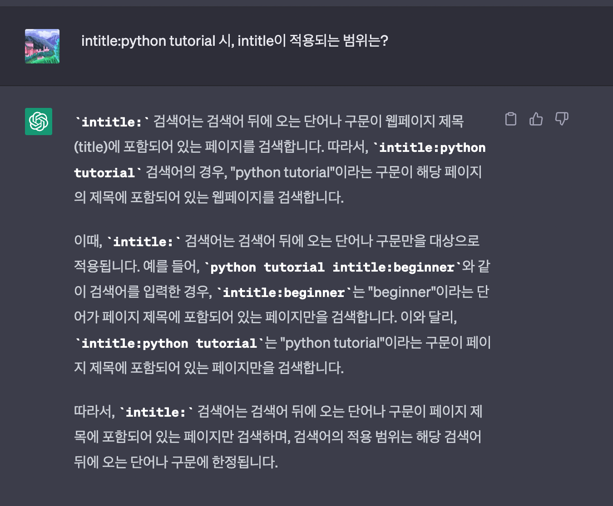
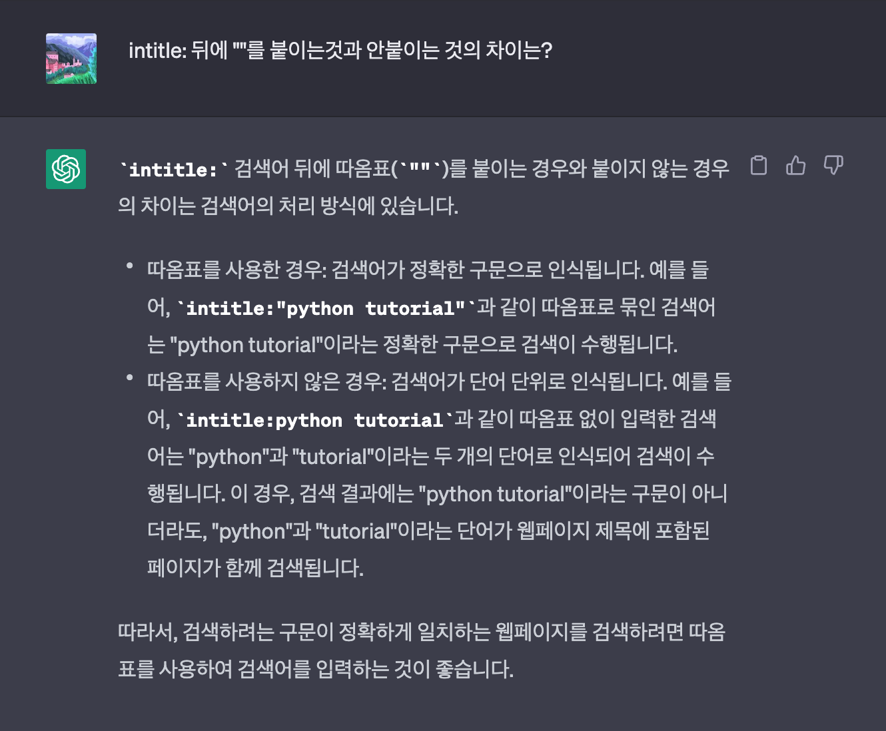
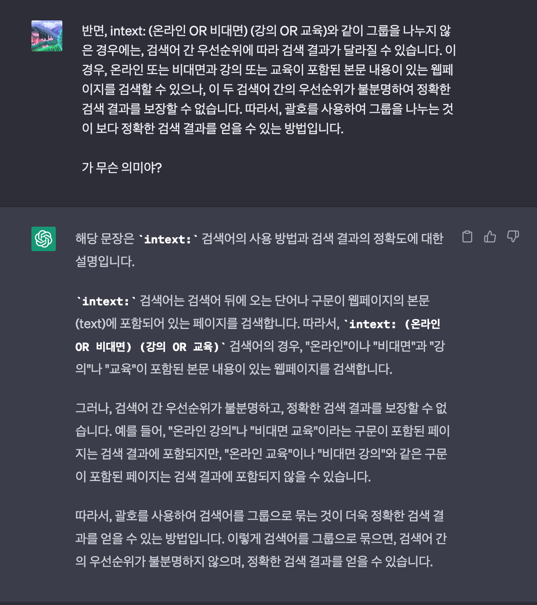
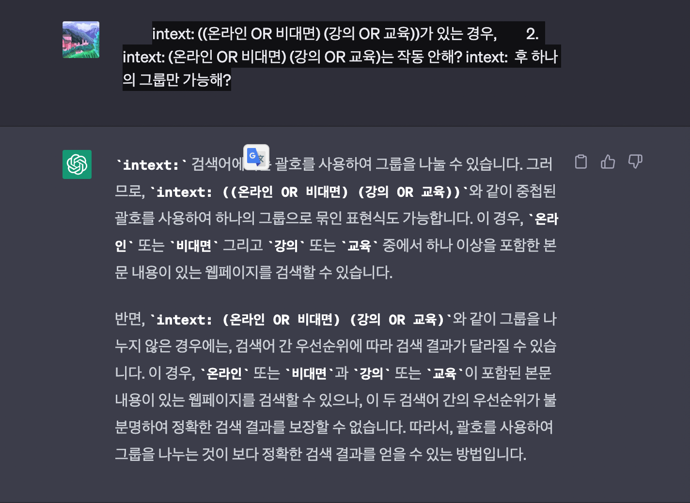
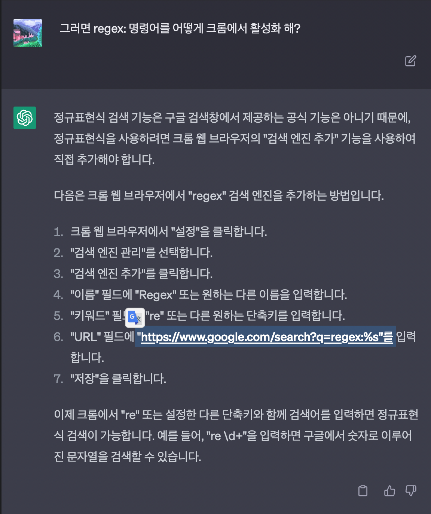

# 구글 검색 명령어

## 1. 기본 명령어 검색

    1. ““
        1. 반드시 포함
    2. OR (또는 | 또는 /)
        1. 두 가지의 검색어 중 하나의 검색어를 포함
    3. ( )
        1. 그룹화
        2. 예시
            1. apple (pie OR crumble)
                1. apple과 pie 또는 crumble 중 하나가 포함된 결과를 반환
            2. (apple OR banana) AND (pie OR crumble)
                1. apple 또는 banana 중 하나와 pie 또는 crumble 중 하나가 함께 포함된 결과를 반환
    4. -
        1. 특정 단어를 제외
    5. -. *
        1. 와일드 카드

    6. #
        1. 와일드 카드
        2. 어떤 문자로든 대체 가능
    7. #..#
        1. ..앞뒤로 지정된 숫자(혹은 날짜) 범위 안
        2. 예시
            1. 히트곡 #..#년대
                1. 검색 결과로 1990년대, 2000년대 등의 히트곡을 포함한 검색 결과가 나타남.
    8. $
        1. 가격을 검색
        2. 달러와 유로만 됨.
    9. in
        1. 단위 변환
        2. 단 한글로는 작동 보장 안됨
        3. 예시
            1. 1USD in KRW
            2. 1000 in USD

## 2. 고급 검색 명령어

    1. regex:
        1. 정규표현식
    2. define:
        1. 구글에 내장된 사전의 기능
    3. site:
        1. 해당 웹사이트에서 색인 된 사이트만
    4. cache:
        1. 구글에서 가장 최근에 색인 된 해당 웹페이지의 캐시 버전의 사이트만
        2. 예시
            1. cache:www.naver.com
    5. intitle:
        1. 페이지 제목(타이틀 태그)에 특정 단어 또는 구문이 포함된 사이트만
    6. allintitle:
    7. inurl:
        1. 페이지 URL에 특정 단어 또는 구문이 포함된 사이트만
        2. 예시
            1. inure:twinword
    8. allinurl:
    9. intext:
        1. 본문에 단어 또는 구문이 포함된 사이트만
    10. allintext:
    11. filetype:   (또는 ext:)
        1. 특정 파일 확장자로 제한
    12. related:
        1. 비슷한 웹사이트
    13. AROUND(X)
        1. 두 검색어의 간격이 X개인 단어 또는 구 이하인 결과를 표시
        2. 예시
            1. Kim AROUND(1) Gyutae
    14. map:
        1. 지역 관련 검색어의 지도 결과를 유도
    15. Source
        1. 구글뉴스에서 특정 소스로 부터의 뉴스 결과만

## 3. 활용

    1. 러닝화 intitle: (나이키 OR 뉴발란스)
        1. 러닝화 검색 시, 나이키 혹은 뉴발란스 정보만 검색
    2. 러닝화 -나이키 -뉴발란스
        1. 특정 브랜드를 제외
    3. 비슷한 의미의 검색어 동시 검색
        1. ((키워드 OR 유의어) (키워드 OR 유의어))
        2. intext: ((온라인 OR 비대면) (강의 OR 교육))
        3. intitle: ((온라인 OR 비대면) (강의 OR 교육))
        4. inurl: ((온라인 OR 비대면) (강의 OR 교육))
    4. 전문성 높은 자료 검색
        1. “검색어” filetype: pdf
    5. 서브도메인 색인 페이지 수 확인
        1. site:*.btwakorea.com
    6. 신규페이지 색인여부 확인
        1. site: www.example.com/dsadsadsafsdasfsafd/slug1
    7. 보안 프로토콜(https) 페이지 색인 확인
        1. site: seo.tbwakorea.com -inurl:https
    8. 중복콘텐츠 점검
        1. site:www.example.com intitle:”메인 키워드” intext: “서브 키워드1 OR 서브 키워드2”
        2. 키워드 카니발리제이션
            1. 검색어 엔진 최적화 (SEO) 전략 중 하나이다.
            2. 특정 키워드의 여러 가지 변형을 사용하여 검색 엔진에서 웹 페이지의 노출 가능성을 높이는 기술.
            3. 검색 예시로, “”SEO 최적화” 대신 “최적화 SEO”, SEO 효과적인 방법”, “검색 엔진 최적화 방법” 등 다양한 검색어를 사용할 수 있다.
            4. 즉, 다양한 검색어를 고려하여, 검색 엔진에서 웹페이지가 검색 결과 상위에 노출될 수 있도록 키워드를 다양하게 사용하는 것.
            5. 이를 위해서는, 먼저 사용자들이 어떤 검색어를 가장 많이 사용하는지 파악해야 한다.
            6. 그리고 해당 검색어의 변형이나 유사어들을 사용하여 웹페이지의 내용을 작성한다.
            7. 이렇게 작성된 웹페이지는 검색 엔진에서 노출 가능성이 높아지며, 검색 결과 상위에 노출될 가능성이 높다.
            8. 하지만, 키워드 카니발리제이션을 너무 과도하게 사용하면 검색 엔진에서 스팸으로 간주될 가능성이 크므로 적절히 사용해야 한다.
            9. site:www.twinword.co.kr intitle:”메타디스크립션” intext:”관련성 OR 연관성”
    9. 표절콘텐츠 점검
        1. “특정 구문” -site:www.mywebsite.com
    10. 내부링크 기회 찾기
        1. site:www.example.com -www.example.com/blog/topic1 intext:”topic 1”
        2. 내부링크 기회란, 특정 웹사이트 내부의 링크 구조를 분석하여, 검색 엔진 최적화를 위한 내부 링크 전략을 수립하거나, 내부링크의 최적화 기회를 찾는 것이다.
        3. 내부링크는 웹사이트 내에서 페이지 간의 연결을 제공하며, 이를 통해 검색 엔진이 페이지의 중요도와 관련성을 평가한다.
        4. 따라서 내부링크 구조를 최적화하고, 내부링크의 최적화 기회를 찾는 것은 검색 엔진 최적화를 위해 중요한 작업 중 하나이다.

## 4. 참고

    1. <https://www.openads.co.kr/content/contentDetail?contsId=9540>

## 5. 의문

- 
- 
- 
- 
- 
