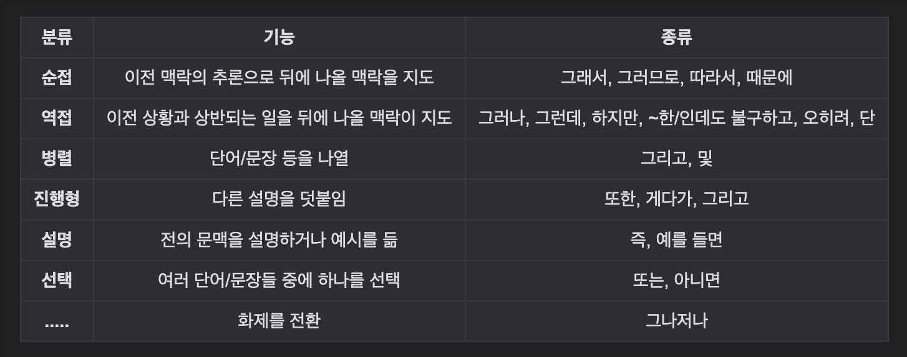
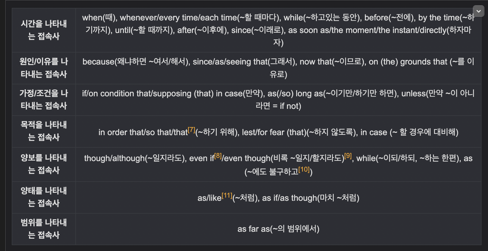

# 접속사 (Conjunction)

- 단어, 문장, 구 , 절 등을 연결시켜 주는 구실
- 앞뒤 문맥의 관계를 나타내는 말로 자립어, 즉 격변화(주격 등)나 활용을 하지 않는 불변어이다.
- 한국어 문법
  - 그리고, 그런데, 그러나, 그래도, 그래서, 또는, 및, 게다가, 따라서, 때문에, 아니면, 왜냐하면, 단, 오히려, 비록, ~한/인데도
  - 그래서, 그런데. 그러나, 또한은 통사론적으로 부사의 일종
- 

# 등위 접속사

- 동일한 성질 간 연결
- 동일한 범주에 없는 단어들끼리도 연결 할 수 있음.
  - 예: 형용사와 명사, 형용사와 부사구
- 등위 접속사로 연결된 복수의 대등한 절로 이루어진 문장을 중문(compound sentence)라고 한다.
  - (절 1) (접속사) (절2)
  - (개는 정원을 뛰어다니고), (그리고) (고양이는 쇼파 위에 앉아있다)
- 종류
  - For (~해서)
  - And (그리고)
  - Nor (~도 아닌)
  - But (그러나)
  - Or (또는)
  - Yet (그러나)
  - So (그래서)
  - Expect (~를 제외하고)
- 중복되는 부분은 생략할 수 있음
  - Tome plays the piano, and Becky plays the piano.
    - Plays the piano가 겹치므로,
    - Tome and Becky plays the piano.
- I want you to clean your room, and I want you to go to bed early.
  - I want you 까지 겹치므로,
  - I want you to clean your room, and to go to bed early.
  - to는 겹치므로 생략한다면,
  - I want you to clean your room and go to bed early.

# 상관 접속사

- 등위 접속사가 포함된 일종의 관용 표현.
- 종류
  - Both a and b (a와 b모두)
  - Not only a but (also) b (a 뿐 아니라 b도)
  - B as well as a (a뿐 아니라 b도)
  - Either a or b (a 또는 b 둘중에 하나인)
  - Neither a nor b (a와 b 둘다 아닌)
  - Not a but b (a가 아니라 b)
- Both a and b는 주어로 쓰일 때 복수로 취급하지만, 나머지는 수를 다 b에 맞춘다.
- Neither a nor b 대신, 부정문으로 둘다 아니라고 표현하려면 not both a and b가 아닌 not either a or b가 더 자연스럽다.
  - 이유는 both a and b는 긍정적인 의미가 담겨있다.
  - Both money and time are what I need, actually.
  - Neither jack’s friends not sam loves sally.

# 종속 접속사

- 앞 문장의 뒷문장을 종속 관계로 연결시키는 접속사
- 주절은 그 자체로 문장이 성립할 수 있으며,
- 종속적인 주절의 추가적인 정보를 제공하며 독립적인 문장이 될 수 없다.
- 종류
  - 부사절을 이끔
  - 명사절을 이끔

- 

- 참고
  - <https://namu.wiki/w/%EC%A0%91%EC%86%8D%EC%82%AC>
