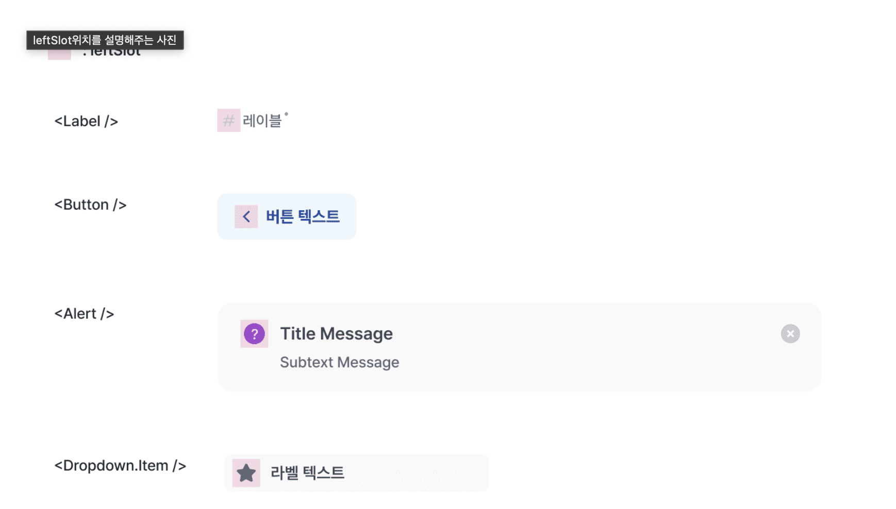
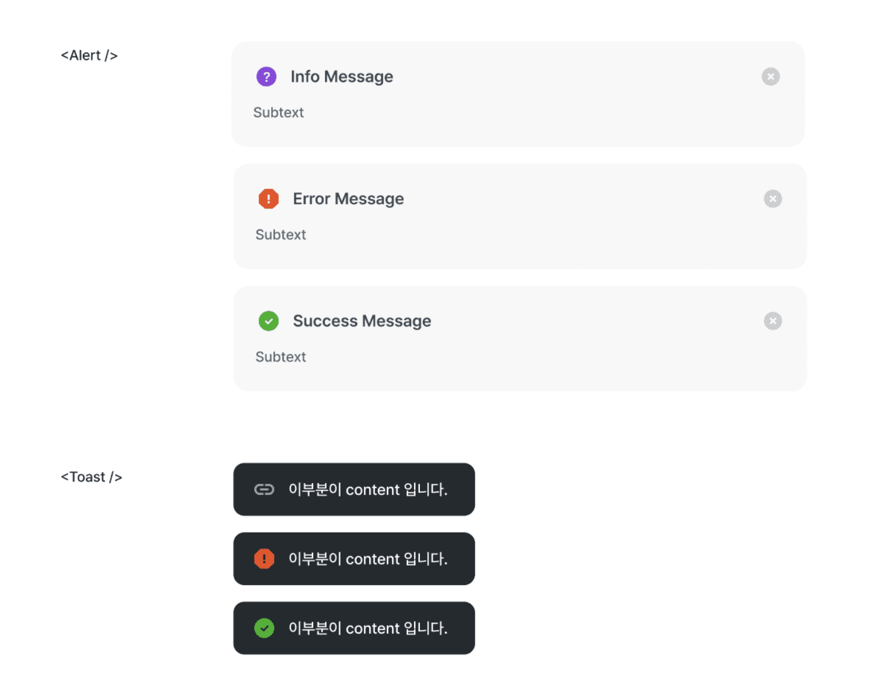
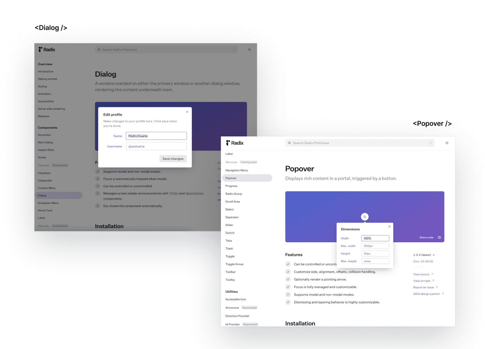
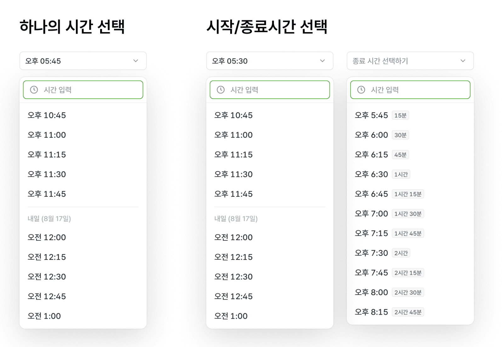
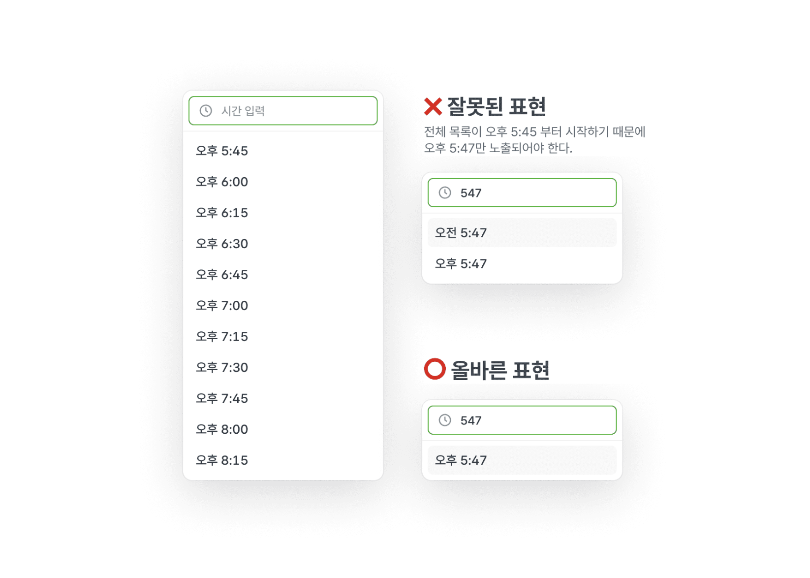
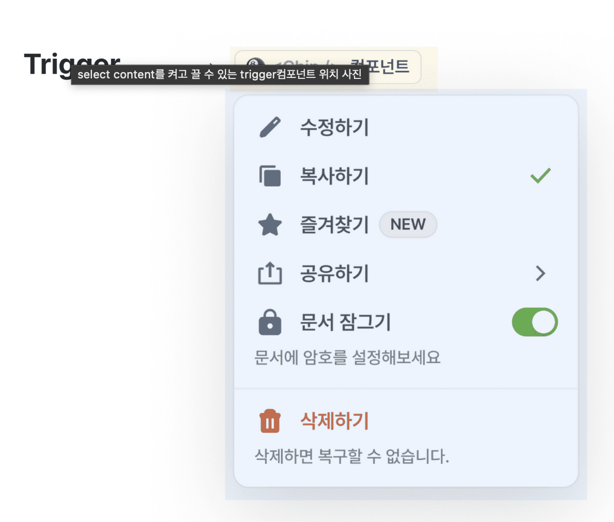
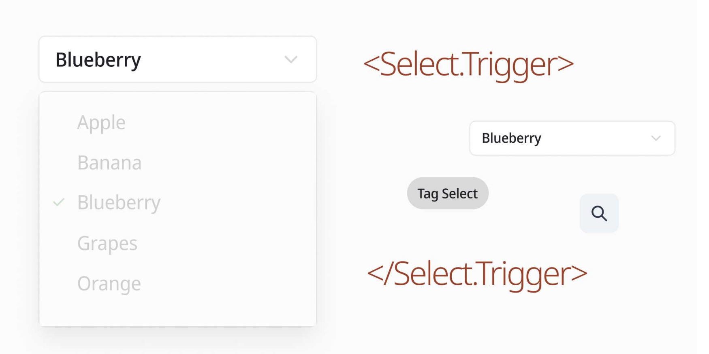
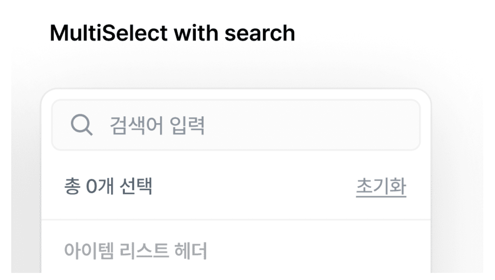
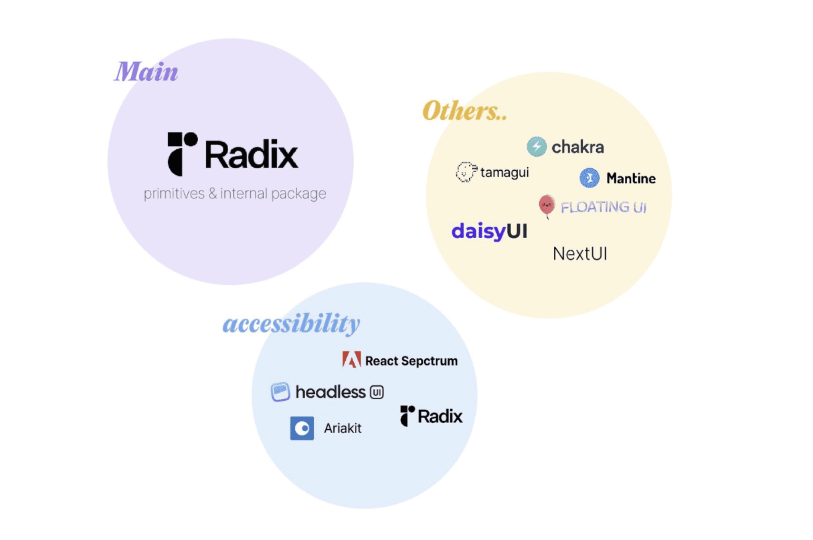

디자이너의 디자인 시스템, 엔지니어의 디자인 시스템

협업 시 어떻게?

문맥에 따라 가치가 변한다.

사전에 최대한 요구사항 분석이 필요, 설계 시 유리

요구사항 변경과, 요구사항 추가의 차이

제약을 통해 일관성(통일성)을 만드는가?

일관성은 DX와 고객의 사용성에 매우 중요하다.

# 디자인 시스템

## 목적과 의도

## 역할

## 중요한 원칙

- 유연성과 제약성의 상충 관계에서, 각각의 비중 정하기

## 설계 시 고려사항

0. 환경을 고려한다.

   - 플랫폼, 사용자 환경, 개발 환경 등

1. 자원과 비용을 고려한다.
2. 목적과 의도를 파악한다.
3. 최대한 많은 요구사항을 수집한다.

    - 사용자 리서치
    - 환경적 제약 파악 (문화, 직업적 등등... 추후 작성)

4. 요구사항이 자주 변경되는 여부를 파악한다. (또는 이를 기본 전제로 한다.)
5. 시스템 레벨에서 보장해야 부분과 아닌 부분을 분리
    - 러닝 커브 최소화하기 위한 방안
    - 목적과 의도에 알맞게 컴포넌트 별 역할과 책임의 분배, 그리고 협력을 설계한다.
6. 실제 사용자를 통한 피드백 주기 설정하기

## 요소

### 1. 유연함

- 유연성과 확장성은 성질이 같거나 비슷하다.
- 또는 확장성은 유연성의 부수효과이다.

- 제약보다 우선순위가 높은 경우
  - 변화하는 제품은 Iterator를 거치며 고객의 요구사항을 반영하거나,
  - 기존의 결정을 번복하고,
  - 다른 결정을 내리기도 한다.
  - 변화하는 제품의 재료가 되는 디자인 시스템은 변화의 폭이 좁을 수 있으나,
  - 사전에 파악하기 불확실한 요구사항에 최대한 유연하게 대응해야 한다.
  - 항상 발전하는 디자인 시스템이라고 가정하고,
  - 현재 결정은 언제나 변할 수 있다는 전제를 인지하면서,
  - 시스템에서 보장해야 하는 부분과 아닌 부분을 분리해야 한다.

- 형태를 가지면서 유연함을 추구하는 경우
  - 높은 일관성을 위한 제약은 적다.
  - 단 특정 상황에서는, 높은 일관성에 대한 유연함의 책임을 일부 소비자에게 위임하는 경우가 발생
    - 의문
      - 예시는?
- 유연함과 제약은 상충 관계가 성립한다.
  - 두 조건을 모두 달성하는 이상적인 방법은,
  - 즉 사전에 모든 디자인 케이스와 기능적인 요구사항을 예측하여 변화가 필요한 부분과,
  - 통제 되어야 하는 부분을 전부 정의하는 것이다.
  - 이는 현재 결정은 항상 변할 수 있다는 전제를 위반한다.
  - 실현 가능성이 매우 낮고,
  - 특정 경우에만 성립될 수 있다.
  - 두 조건을 모두 만족한다면,
  - 디자인 시스템을 관리하는 팀이 모든 제품 개선의 Blocker(방해하는 사람)로도 작용할 수 있다.
    - 의문
      - 예시는?

### 2. 확장성

- 유연성과 확장성은 비례한다.
  - 의문
    - 유연성과 확장성의 차이는?
      - 답: 유연성은 확장성을 성립하기 위한 전제이다.

### 3. 제약성

- 제약성과 통일성은 상충관계가 성립한다.
- 제약성은 유연성과 상충관계가 성립한다.

- 통일성을 지키기 위해 강한 제약성을 두지 않는다.

- 제약이 약한 경우
  - 단점
    - 파편화
    - 인터페이스 소비자에게 커스텀 범위에 대한 혼란 제공

- 제약이 강한 경우
  - 장점
    - 파편화 여지가 적음 (통일성을 쉽게 달성)
  - 단점
    - 자유도와, 유연성이

- 제약 예시)
  - 기능을 사용할 때, 반드시 정해진 스타일로만 사용해야 한다.
    - 이는 시스템 수준에서부터 제약이 많음을 의미

### 4. 통일성

- 요소

1. 인터페이스 사용성

- 제약성과 통일성은 반비례한다.

- 통일성이 강할 수록
  - 변경에 대응하기 어려운 시스템을 만들고,
  - 많은 경우, 변경에 큰 비용을 필요로 한다.
  - 만약 디자인 시스템에서 변경에 대응하는 방식이 항상, Breaking Change라면, 디자인 시스템의 선호도는 낮아진다.

### 5. 자유도

- 유연성과 차이는?

### 6. 인터페이스

#### 만약 단일 컴포넌트에서, 모든 Prop를 관리하는 위계를 가지는 경우

- 컴포넌트의 형태가 다양(위치, 크기 등)하고 여러 형태로 구분되고 기능이 다양할 수록(협력 범위가 클수록), 컴포넌트의 props에 대한 목적과 의도 파악이 쉽지 않다.
  - 지극히 생산자 중심적이다.
  - 이는 컴포넌트 분리를 통해서, prop이 실제로 사용되는 컴포넌트와 바인딩하면 해결되는 문제이다.

### 7. 디자인 시스템의 낯섬 예산 (러닝 커브 또는 진입 장벽 또는 DX)

#### 정의

- 새로운 프로그래밍 언어가 출시 시, 새 기능의 수가 너무 적으면 사람들이 굳이 관심을 가지지 않고,
- 반대로 새로운 기능의 수가 너무 많으면 진입장벽에 의한 높은 러닝 커브를 유발한다.
- 즉, 새로운 선택이 비용을 지불함을 설명함.

#### 디자인 시스템 또한

- 여러 기능을 구성하고 사용자가 쉽게, 많이 사용할 수 있도록 지원해야 한다는 점에서 동일하다.
- 컴포넌트 또는 기능이 추가될 때, 모든 결정이 기본 기조에 위배되지 않으면서,
- 동시에 사용자가 학습할 요소를 적게 유지하는 노력이 수반되어야 한다.
- 만약 디자인 시스템의 자유도를 높이려면, 추상적인 인터페이스를 정의하고, 비슷한 기능은 컴포넌트 각각에 어올리는 개별적인 인터페이스가 아닌, 통일성을 갖춘 인터페이스를 추가한다.

#### 예시1, Slot

- 
- Slot이란, 고정된 영역에 표현될 수 있는 prop을 의미함.
- 배치 위치에 따라 leftSlot 또는 rightSlot이라는 이름으로 네이밍이 가능하다.
- 컴포넌트에 따라, Slot 위치에 특정 컴포넌트만 사용될 수도 있고, 다양한 컴포넌트가 사용될 수 있는데, 위치에 대한 인터페이스 통일성을 유지하는 것과 제약을 감소시킨다는 측면에서 slot으로 일반화하자.

#### 예시2, 상태(error, success, warning)을 표현하는 방법

- 

- 대다수 컴포넌트는, error, success 등의 상태에 따른 약속된 형태가 필요하다. (이 요구사항 또한 일반화가 가능하다.)
- 제약을 최소화 하면서, 사용자에게 사용성 높은 인터페이스로 전달해야 한다.

#### 코드 예제)

- ```
    // Alert
    <Alert leftSlot={<InfoIcon />} />
    <Alert.Error />
    <Alert.Success />

    // Toast
    const toast = useToast();

    toast.show(
    <div>이 부분이 content입니다.</div>,
    { leftSlot: <ClipIcon /> },
    );

    toast.error(<div>이 부분이 content입니다.</div>);
    toast.success(<div>이 부분이 content입니다.</div>);
  ```

- `Alert`과 `Toast`의 인터페이스는 유사한 구성을 가지고 있다.
- 다양한 형태를 표현할 수 있는 `<Alert />`과 `toast.show`라는 기본 타입이 존재하며,
- 상태에 따른 약속된 형태는, Property를 참조하여 사용할 수 있다.

#### 예제 3. PortalContainer

- 

- 분리된 위계로 표현되는, Dialog, Popover등의 floating 컴포넌트는,
- 기준 element를 document.body가 아닌, 다른 대상으로 변경하는 기능을 `PortalContainer`로 제공할 수도 있다.
- 코드 예제)

  - ```
        <Dialog>
            <Dialog.PortalContainer asChild>
                <div>여기서 보여질거에요.</div>
            </Dialog.PortalContainer>
            <Dialog.Content />
        </Dialog>
    ```

- 추천하는 구현 방식은, 개별 컴포넌트 단위에서는 JSX보다 조금 더 사용성 높은 인터페이스가 존재하지만, 기능에 대한 학습 피로도를 낮추기 위해서 하나의 방식으로 통일해서 사용처에 제공하는 것도 좋은 선택이다.

#### 사용하지 않음에 대한 지원

- 
- 어떤 컴포넌트에서 닫기 동작을 수행하는 `>>` 버튼(CloseIconButton)이 기본 기능으로 정의된 경우를 가정하자.
  - 코드 예제)

    - ```
            // 위 예시 컴포넌트 이름을 'SidePeek'이라고 정해봤다.
            <SidePeek
            // '>>' 아이콘 버튼(CloseIconButton)은 선언하지 않음
            toolBar={
                <Toolbar>
                <ExpandIconButton />
                <ModeToggleIconButton />
                </Toolbar>
            }
            >
            {...}
            </SidePeek>    
        ```

- 버튼이 필요한 곳에서는 별다른 타이핑 없이, 사용이 가능하다.
  
- 만약 `>>`버튼을 사용하지 않아야 하는 요구사항이 생긴다면, 어떻게 표현할 수 있을까?
  - 이 경우, SidePeek 컴포넌트에서 기본 기능으로 정의했기 때문에, 제외할 수 있는 추가 수단 또한 제공할 역할과 책임이 있다.
  - 코드 예제)

    - ```
        // 위 예시 컴포넌트 이름을 'SidePeek'이라고 정해봤다.
        <SidePeek
            // '>>' 아이콘 버튼(CloseIconButton)을 제외하기 위한 prop
            notUseCloseButton={true}
            toolBar={
                <Toolbar>
                <ExpandIconButton />
                <ModeToggleIconButton />
                </Toolbar>
            }
            >
            {...}
        </SidePeek>
      ```

  - `사용하지 않음`을 `notUseCloseButton` prop으로 추가했다.
  - 하지만 인터페이스만 봤을 때, 이 prop은 어떤 형태의 버튼을 사용하지 않겠다고 선언한 것인지 예측하기에는 이름이 매우 모호하다.
  - 소비자에게 `notUseCloseButton` 값으로 가능한 모든 결과에 대해 학습을 요구하게 된다.
- 결론으로, 컴포넌트를 사용하지 않는다고 선언하는 가장 자연스러운 방법은, boolean prop 제공이 아닌, 실제로 사용하지 않는 것이다.
  - 즉, CloseIconButton을 기본 기능으로 정의하지 않는 것이다.
  - 반복되는 용례에 대한 선언은 다소 피로하게 느껴질 수도 있지만, 제외할 수 없는 기본 기능에 대한 대응 비용이 많이 소비되고, 예측이 어려운 방식으로 표현되므로, 항상 포함하는 기능은 보수적으로 판단할 필요가 있다.
  - 예제)

    - ```
        // 안 좋은 예시, CloseIconButton을 사용하는 경우
        function MySidePeekWithCloseIconButton() {
            return (
                <SidePeek
                toolBar={
                    <Toolbar>
                    <CloseIconButton />
                    <ExpandIconButton />
                    <ModeToggleIconButton />
                    </Toolbar>
                }
                >
                {...}
                </SidePeek>
            )
        }

        // 좋은 예시, CloseIconButton을 사용하지 않는 경우
        function MySidePeekWithoutCloseIconButton() {
            return (
                <SidePeek
                    toolBar={
                    <Toolbar>
                        {/*<CloseIconButton />*/}
                        <ExpandIconButton />
                        <ModeToggleIconButton />
                    </Toolbar>
                    }
                >
                    {...}
                </SidePeek>
            )
        }
      ```

#### 다른 좋은 예시, React

- (FEConf 2021, 왜 나는 React를 사랑하는가) <https://www.youtube.com/watch?v=dJAEWhR83Ug>

#### 참고

- (The language strangeness budget) <https://steveklabnik.com/writing/the-language-strangeness-budget>

### 8. 추상화

- 변경에 유연하려면, 컴포넌트의 스펙이 범용적인 용례를 지원할 수 있어야 하므로 높은 수준의 추상화가 필요하다.

#### 예시, TimePicker

- 
- 실제로 TimePicker는, 하나의 시간을 선택할 수도 있고, 시작/종료 시간을 함께 선택할 수도 있다.
- 이 스펙에 대한 인터페이스는 다양한 방법으로 구성할 수 있다.
  - 방법 1. SingleTimePicker와 RangeTimePicker로, 별도로 분리해서 구현한다.
  - 방법 2. FromTimePicker, ToTimePicker로 별도로 분리해서, 하나의 시간을 선택할 경우에는 FromTimePicker만 사용하게 한다.
  - 방법 3. TimePicker만 만들고, 시작/종료 시간 선택은 소비자가 controlled로 사용하게 한다.
- 위 3가지 방법은 모두 아쉬운 점이 크다.
  - 방법 1은, RangeTimePicker로 만들 경우 합성형 인터페이스를 지향하기 어렵다.
  - 방법 2, 방법3은 DX측면에서 안 좋다.  
- 결론은 Single/Range에 대한 개념을 확장해서, `TimePicker`와 `DependentTimePicker`를 각각 만든다.
  - `DependentTimePicker`는, ant.desing의 Form.Item에서 Render props로 getFieldValue를 사용해서 form값에 접근하는 방식에서 아이디어를 얻었다.
    - 예제, ant.desing Form)

    - ```
        // antd Form
        <Form>
        <Form.Item name='foo-field' />
        <Form.Item>
            {({ getFieldValue }) => {
            const fooValue = getFieldValue('foo-field');

            return <input />
            }}
        </Form.Item>
        </Form>
      ```

      - Form 컴포넌트 하위의 Form.Item 간에 값을 공유할 수 있다.
      - 만약 TimePicker이 Select 컴포넌트 간에 값을 공유할 수 있는 수단이 있다면,
      - 제공 기능인 단일 선택, 시작-종료 시간 선택 기능을 포함한 N가지 시간 선택도 가능하다.
  - 예제, MyRangeTimePicker)

    - ```
        function MyRangeTimePicker() {
            return (
                <TimePicker>
                {/* 시작 시간 선택 */}
                <TimePicker.Select id='from' />
                <TimePicker.DependentSelect>
                    {({ getValue }) => {
                    // 시작 시간을 기준으로
                    const startValue = getValue('from');
                    // 원하는 만큼 interval생성해서 사용
                    const endInterval = getTimeInterval({
                        start: addHours(startValue, 1),
                        end: addHours(startValue, 24),
                        step: 45,
                        });

                    return (
                        <>
                        <TimePicker.Trigger />
                        <TimePicker.Content />
                        </>
                    )
                    }}
                </TimePicker.DependentSelect>
                </TimePicker>
            )
        }
      ```

    - DependentSelect의 `getValue`에서 Select에 전달하는 id를 통해서, 다른 Select값에 접근할 수 있다.

### 9. 틀린 선택 막아주기

- 무조건 제약보다 유연함을 추구한다고, 소비자의 실수에 책임을 지지 않는다는 의미는 아니다.
- 표현의 제약은 줄이되, 틀린 표현을 하지 않도록 막아줄 책임은 있다.

#### 예시, TimePicker에서 새로운 옵션 생성하기

- 

- TimePicker 기능 중에는 옵션 중 없는 없는 시간이 입력된 경우되더라도 유효한 값이라면, 새로운 옵션을 생성해서 보여주는 기능이 존재한다.
- 만약 사용자가 "547"을 입력한 경우, 최소 시간, 최대 시간에 따라 출력 할 옵션이 다를 수 있다.
- 예시로, 시작 시간이 "오후 5:45"부터인 경우, "오전 5:47"은 틀린 선택지이다.
- 시간 입력 처리와 새로운 옵션 생성은 TimePicker가 담당해야 할 기본 기능이므로, 이 기능을 정확하게 사용할 수 있는 장치가 필요하다.
- 예제, 소비자가 원하는 옵션을 생성해서 사용함)

  - ```
        // 사용처에서 원하는 옵션을 생성해서 사용함
        function MyTimePicker() {
        const timeInterval = getTimeInterval({
            start: new Date(),
            end: addHours(new Date(), 24),
            step: 30,
        });

        return (
            <TimePicker>
            <TimePicker.Select>
                {timeInterval.map(time => {
                return (
                    <TimePicker.Option key={time} value={time} />
                )
                })}
            </TimePicker.Select>
            </TimePicker>
        );
        }    
      ```

        - TimePicker 또한 Select와 마찬가지로, 어떤 Option을 렌더링 할지는 소비자가 결정하므로 최소, 최대 시간에 대한 정보를 바로 파악하기는 어렵다.
        - 하지만 최소, 최대 시간을 prop을 받는 것은 좋은 선택지가 아니다.
        - 사용자 관점에서 이미 어떤 옵션들을 렌더링할 지 결정하고 있고,
        - 위 코드에서는 `timeInterval`의 첫 번째 값이 최소 시간 값이다.
        - 최소, 최대 시간 prop을 넘겨야 한다면 같은 표현을 두번 하는 것이며, 이 경우 최소 시간에 대한 정보를 SingleSource of Truth가 보장되지 않는다.
        - 사용자가 직접적으로 전달하지 않더라도, 이미 표현되고 있는 정보가 있으니, TimePicker 내부에서 알아내면 된다.

#### 에시, TimePicker 내부에서 최소, 최대 시간 처리하기

- ```
    // linear
    function TimePickerOption(props) {
    return (
        <Collection.ItemSlot value={props.value}>
        <Select.Option value={props.value} />
        </Collection.ItemSlot>
    )
    }

    function TimePickerNewOptionContent(props) {
    const getItems = useCollection();
    return (...)
    }
  ```

- ```
    // linear
    function TimePickerNewOptionContent(props) {
    const getItems = useCollection();
    const [min, setMin] = useState<Timestamp | undefined>(undefined);
    const [max, setMax] = useState<Timestamp | undefined>(undefined);

    useEffect(() => {
        const items = getItems();
        const values = items.map(({ value }) => value);
        const [minTimeValue, maxTimeValue] = [
        Math.min(...values),
        Math.max(...values),
        ];

        setMax(maxTimeValue);
        setMin(minTimeValue);
    }, [getItems]);

    const options = useMemo(() => {
        while (isBefore(baseDate, max)) {
        const value = setHoursMinsFromDate(baseDate, {
            hours: parsedValue.hours,
            mins: parsedValue.mins,
        });
        // ...
        newOptions
            .filter(
            newOption => isAfter(newOption, min) && isBefore(newOption, max)
            )
            .forEach(newOption => baseOptions.push(newOption));

        baseDate = addDays(baseDate, 1);
        }

        return baseOptions;
    }, [formattedSearchValue, max, min]);

    return children({
        hours: parseSearchValue(formattedSearchValue.value).hours,
        mins: parseSearchValue(formattedSearchValue.value).mins,
        options,
    });
    }
  ```

  - collection을 통해 TimePicker에서 렌더링한 전체 시간 목록을 알 수 있고, 새로운 옵션을 보여줄 때 최소/최대 시간 범위 내의 시간만 렌더링할 수 있도록 처리해줄 수 있다.

- ```
    function MyTimePickerWithNewOption() {
    return (
        <TimePicker>
        <TimePicker.Select>
            <TimePicker.Content affix={<TimePicker.SearchInput />}>
            <TimePicker.Options />
            {/* 검색 결과가 없을 때만 보이는 컴포넌트*/}
            <TimePicker.SearchEmpty>
                <TimePicker.NewOptionsContent>
                {({ options }) => {
                    return options.map(() => <Select.Option />)
                }}
                </TimePicker.NewOptionsContent>
            </TimePicker.SearchEmpty>
            </TimePicker.Content>
        </TimePicker.Select>
        </TimePicker>
    )
    }
  ```

- 입력값에 따라 렌더링 해야 하는 옵션은 NewOptionsContent에서 계산되어, render props로 제공되기 때문에, 소비자는 내부 구현디테일을 고려할 필요 없이 컴포넌트를 사용하는 것이 올바른 선택옵션을 가진 TimePicker를 사용할 수 있다.
- 참고
  - (Collect Context) <https://speakerdeck.com/soyoung210/dijain-siseutem-hyeongtaereul-neomeoseo?slide=93>

### 10. 접근성

- 디자인 시스템은 일관된 사용성을 보장해야 한다는 점에서, 접근성 지원은 가능한 소비자가 아닌 디자인 시스템의 역할과 책임이 되어야 한다.

#### 예시, TextField

- ```
    // ❌ 가능한 직접 속성을 정의하지 않고
    <TextField
    describeId='my-id'
    helperText={<TextField.HelperText id='my-id' />}
    />

    // ⭕️ 내부에서 판단하도록 구성
    <TextField helperText={<TextField.HelperText />} />
  ```

  - TextField의 역할은, 스크린 리더기에 전달하기 위해 description, label의 id를 input 컴포넌트의 `aria-describedby`, `aria-labelledby`로 지원해야 한다.

- ```
    // linear
    function TextField() {
    const [describedBy, setDescribeBy] = useState();

    return (
        <TextFieldProvider
        describedBy={describedBy}
        onDescribeByChange={setDescribeBy}
        >
        {children}
        </TextFieldProvider>
    )
    }

    // linear
    function HelperText(props) {
    const helperTextId = useId(props.id);

    useLayoutEffect(() => {
        onDescribeByChange(helperTextId);
    }, [helperTextId, setDescribedBy]);

    return (...)
    }

    // linear
    function Input() {
    const { describedBy } = useTextFieldContext();

    return (
        <input
        aria-describedby={describedBy}
        />
    )
    }
  ```  

  - 소비자가 매번 id를 생성하고 전달하지 않아도, 적절한 id를 input에 전달할 수 있도록,
  - id를 내부에 생성하고, context를 통해서 전달한다.

## UI 컴포넌트

- 역할
  - 형태
  - 역할

## Headless

- 디자인 시스템의 형태의 제약을 없애서, 형태의 유연성을 극대화
- 형태와 기능을 분리한다.
- 분리 된 기능 간 조합과,
- 분리 된 형태 간 조합과,
- 조합의 합과 형태의 합에 의해서 다양한 역할이 가능하다.

#### 예시1, Trigger

- 
- 역할은, Dropdown이나 Select 같이 일정 영역이 화면을 덮으면서 나타나는 요소를 키거나 끌 수 있다.
- 
- 코드 예시, 어떤 형태의 컴포넌트의 클릭을 통해서 Select의 옵션 목록을 여닫는 역할)

  - ```
        <Select>
        <Select.Trigger>
            <Button />
            {/* or <Tag role='button' /> */}
            {/* or <IconButton icon={<SearchIcon />} /> */}
            {/* or <FieldBox /> */}
        </Select.Trigger>
        <Select.Content />
        </Select> 
    ```

- 구현 Tip
  - radix-ui, ariakit 등의 library 활용

#### 예시 2, MultiSelect with search 상단

- 

- "총 0개 선택" (Count) 영역과 "초기화" (Clear) 영역이다.
  - `Count` 영역
    - 선택된 아이템의 개수를 의미하는 0 이외의 영역은 Count가 가지는 표현의 영역이다.
    - 아이템의 개수 데이터는 변하지 않지만, 이를 어떻게 표현할지는 달라질 수 있다.
    - 예시로, 현재는 "총 0개 선택"으로 표현되었지만, 다른 표현으로 "선택값 없음", "-" 등으로 표현할 수도 있을 것이다.
  - `Clear` 영역
    - Count 영역과 마찬가지로, 다른 표현으로 변경이 가능하다면, 표현 방식과 기능이 분리될 필요가 있는 영역이다.
  - 코드 예시)

    - ```
        <MultiSelect>
        <MultiSelect.Content>
            <MultiSelect.Count>
            {({count}) => `총 ${count}개 선택`}
            </MultiSelect.Count>
            <MultiSelect.Clear asChild>
            <Button>초기화</Button>
            </MultiSelect.Clear>
        </MultiSelect.Content>
        </MultiSelect> 
      ```  

- Count 컴포넌트는 render props로 선택된 개수 데이터만 제공하고,
- Clear 컴포넌트는 Trigger 처럼 기능만 제공한다.
- 유연함을 위한 장치이지만, 빈번하게 사용되는 용례에 대한 피로도가 존재할 수 있기 때문에 다음과 같이 완성된 prest도 제공할 필요가 있다.
  - 코드 예시, preset)  

    - ```
        <MultiSelect>
            <MultiSelect.Content>
                {/* "{count}개 선택"으로 렌더링 */}
                <MultiSelect.CountText />
                {/* "초기화"로 렌더링 */}
                <MultiSelect.ClearButton />
            </MultiSelect.Content>
        </MultiSelect>
      ```

#### 참고

- (react-table v7, overview) <https://react-table-v7.tanstack.com/docs/overview>
- (Headless userinterface components) <https://www.merrickchristensen.com/articles/headless-user-interface-components/>

### 디자인 시스템 참고

- 
- 인터페이스와 구현 디테일을 참고하기 위해서 많은 라이브러리를 살펴 볼 것!
- 디자인 시스템의 방향성, 구성에 대해 생각 할 것!

### 메모

구현체?

개발자의 관점과 디자이너의 관점의 차이

요구사항
변하지 않음
초기
중간 변경
없어지는 경우
(우선순위가 존재)

디자인 시스템을 어떻게 정의할 것인가?

- 각 디자인 시스템 별 어떻게?

디자인 시스템 모음

- <https://eunjin3786.tistory.com/425>

# 사용 빈도, 패턴화 가능, 형태 변화의 다양성

컴포넌트를 동일한 통일성 유지 Or 컴포넌트 별 특성에 알맞게 작업하기

매뉴얼 중요, 문서화 중요, 디자인 시안 중요, 목표 프로덕트 중요
다양한 프로덕트에 호환?, 용도에 따라 구분
사용자 연령
도메인 특성

디자이너와 개발자의 니즈를 모두 만족 시킬 수 있다?

자원 또한 중요

적정 제공 자유도

컴포넌트 간 역할과 책임의 분리, 협력

디자인 시스템이 필요없는 경우는?

디자인 시스템의 정형화된 공식은?

개발자가 디자인 시스템을 작성하기 위한, 디자이너와 협업하기 위한 최소한 디자인 지식은?

### 참고

- <https://so-so.dev/react/design-system-decision-record/>

- (인프런, 디자인 시스템 구축기 a.k.a. 4개의 디자인 시스템 관리하기) <https://story.inflab.com/%ec%9d%b8%ed%94%84%eb%9f%b0-%eb%94%94%ec%9e%90%ec%9d%b8-%ec%8b%9c%ec%8a%a4%ed%85%9c-%ea%b5%ac%ec%b6%95%ea%b8%b0/>

### 메모

# 2. [FEConf 2022 디자인 시스템, 형태를 넘어서](https://www.youtube.com/watch?v=21eiJc90ggo)

## 높은 유연성과 낮은 제약성의 주 목적은 무엇일까?
- 정답은 변화하는 제품에 대한 높은 생산성이라고 생각합니다.
- 근거
   -  변화하는 제품은 Iterator을 거치며 고객의 요구사항을 반영하거나,
   - 기존의 결정을 번복하거나,
   - 다른 결정을 내리기도 한다.
   - 이런 상황이 발생하는 근본적인 이유는, 모든 요구사항을 사전에 파악하기 불가능하기 때문입니다.
  
## 파운데이션 기반 디자인 시스템의 요소
1. 높은 유연성
2. 높은 확장성 (유연성의 부수효과)
3. 낮은 제약성
   - 주요 단점은, 파편화와 인터페이스 사용처에서 커스텀 범위에 대한 혼란 제공
 4. 낮은 통일성 (제약성의 부수효과)
 5. 높은 자유도 (유연성의 부수효과)
 6. 목적과 의도가 명확한 인터페이스 
    
     - React 예시로, 만약 복합적인 형태와 기능을 제공하는 단일 컴포넌트에서 모든 props의 위계를 관리하는 경우
        - 복합적인 형태는 여러 컴포넌트의 합성을 의미함. 즉 단일 컴포넌트 props로 컴포넌트의 위치, 배치 등을 관리 해야만 한다.
        - 복잡한적인 형태에 대한 기능 또한, 단일 컴포넌트 props로 관리 시, props에 대한 목적과 의도 파악이 쉽지 않으면서 props를 통일성 있게 정의 내리기 어려움.
        - 이러한 개발 방식은 지극히 생산자 중심적이다.
        - 이를 위한 해결책으로, 컴포넌트 분리를 통해서 props가 실제 사용되는 컴포넌트와 바인딩하면 해결할 수 있는 문제이다. 
        - 결론으로, 인터페이스는 Atomic한 요소를 만족해야만 한다. 
7. 디자인 시스템 낯섬 예산 최소화
     - 주요 연관 요소는, 러닝 커브 (또는 진입 장벽), DX
8. 높은 추상화
     - 변경에 '유연하다'는 의미는, 컴포넌트의 스펙이 범용적인 용례를 지원할 수 있어야 한다.
9. 틀린 선택 막아주기
    - 반드시 제약보다 유연함을 추구한다고, 소비자의 실수에 책임을 지지 않는다는 의미는 아니다. 
    - 시스템 레벨에서 표현의 제약은 줄이되, 틀린 표현은 하지 않도록 막아줄 책임은 있다.
10. 접근성
    - 디자인 시스템은 일관된 사용성을 보장해야 한다는 점에서, 접근성 지원은 가능한 소비자가 아닌 디자인 시스템의 역할과 책임이 되어야만 한다.

## 결론
- 위 요소를 만족시키기 위해서는 많은 비용이 필요로 합니다.
- 상황에 맞지 않는 경우에 파운데이션 방식이 도입된다면, 오버 엔지니어링으로 취급될 것으로 추측됩니다.
- 파운데이션 방식의 소비자 측면에서 단점은 인터페이스 외부에서 컴포넌트 결합을 위한 비용이 소비된다는 점 같습니다.
- 이를 위한 해결책으로 Antd Pro 컴포넌트 처럼, 파운데이션 컴포넌트를 결합해서 제약 높은 구체성을 띄는 디자인 시스템을 만들어 해결 합니다.
- 이는 컴포넌트 디자인 시스템이 됨을 의미하기도 합니다.
- 만약 특정 맥락에서는, 파운데이션 컴포넌트를 먼저 구성 후, 컴포넌트 디자인 시스템을 구성한다면 최적의 디자인 시스템 개발 방법론이라고 판단됩니다.
- 결과적으로 파운데이션 디자인 시스템은 결합을 통해서, 컴포넌트 디자인 시스템으로 재정립이 가능하다고 보입니다.
- 이 경우 굳이 두 개념을 구분할 필요가 없다고 판단할 수 있지만, 한정된 자원 속에서 생산성 관점에서 Trade-off상 선택은 필연적인 요소입니다.
- 적정 비용 소비 측면에서 파운데이션 디자인 시스템과 컴포넌트 디자인 시스템을 나누는 게 옳다고 확신합니다
 
## 링크
- (김규태 TIL Repo, 2.feconf_2022__디자인시스템,형태를_넘어서) https://github.com/gyutae100/TIL/blob/master/fe-design-system/2.feconf_2022__%EB%94%94%EC%9E%90%EC%9D%B8%EC%8B%9C%EC%8A%A4%ED%85%9C%2C%ED%98%95%ED%83%9C%EB%A5%BC_%EB%84%98%EC%96%B4%EC%84%9C.md

 ## 메모 2
 Headless의 효과 또한, 높은 형태의 자유도에 있다고 보입니다.
즉, Headless는 형태에 대한 제약이 아에 없다고 판단됩니다.
Headless의 경우 형태가 아에 없으면, 소비자측에서 형태 구현의 역할과 책임을 맡게 됩니다.
Headless 또한 Trade-off 상, 한정된 자원 속에서 생산성 관점에서 결정할 선택의 문제로 보입니다.