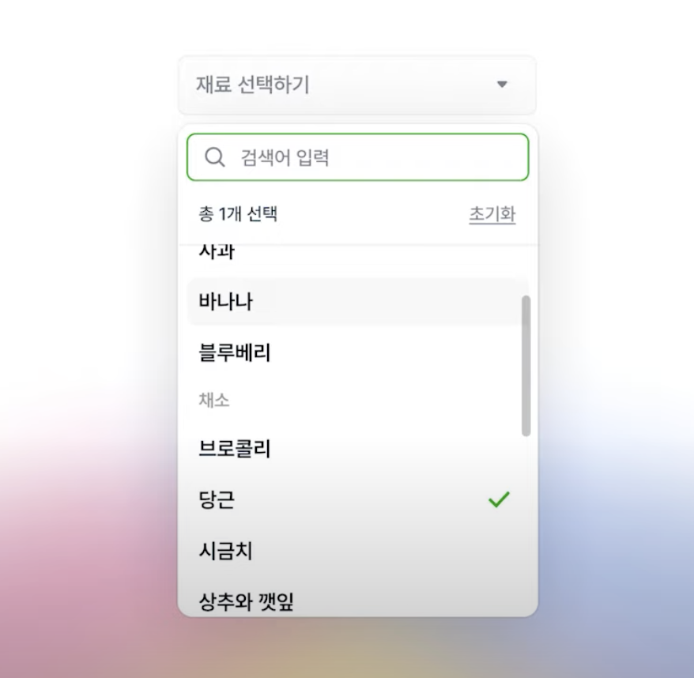
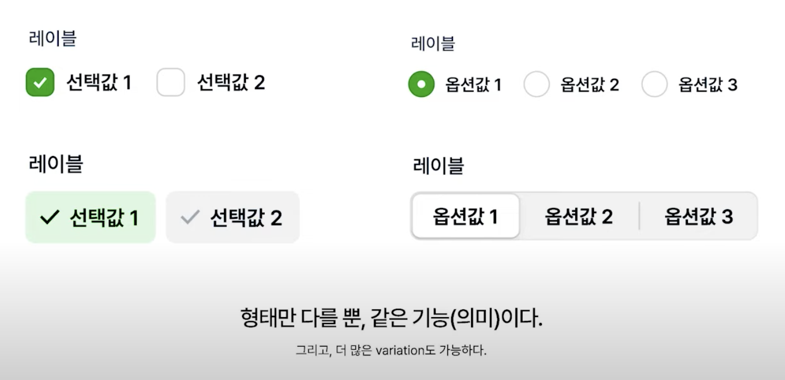
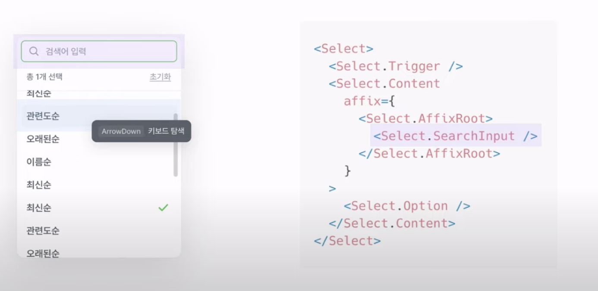

# FECONF 2022 [B1] 디자인 시스템, 형태를 넘어서

## 예시, 복잡적인 기능을 제공하는 셀렉트 박스

- 이러한 기본 컴포넌트가 존재한다고 할 때,
  - 
- 요구사항에 따라, 다양한 형태의 컴포넌트로 표현이 가능하다.
  - 

## 컴포넌트 추상화

1. 필수적으로, 형태로 존재,
2. 추가적으로, 스타일
3. 스타일에 변형을 줄때는, 커스텀
4. 커스텀 과정 중, 제약과 마주친다.

- 예시1, 기본적인 Select Box)
  - 
- 예시2, 요구사항에 따라 다양한 형태로 커스터마이징 된다면)
  - 

## 요구사항에 따른 코드상 대응

### 예시1, 요구사항이 존재하는 경우에, 하나의 컴포넌트에서 제공하는 기능을 추가하는 방식)

- 
- 단점 (요구사항이 자주 변경되거나, 다양성을 확보해야 하는 경우)
  - 
      1. props을 추가하는 방식은, 요구사항 변경에 의한, 변경의 전파가 디자인 시스템 컴포넌트까지 전파되어야만 한다.
      2. 시간이 지날수록 컴포넌트의 책임이 무거워진다. 즉 기능 추가에 의한 복잡성 또한 증가를 의미한다.

### 예시2, 요구사항을 특정 기준으로 분리 후, 결합하는 형태

- 
  - 단점 (요구사항이 자주 변경되거나, 다양성을 확보해야 하는 경우)
    - 
      1. 구현체의 파편화로 인한 복잡성 증가.

### 위 두 방식은, 프로덕트 개발의 병목을 발생시킬 수 있는 요인이 될 수 있다

- 이는 디자인 시스템의 주목적인 생산성을 위해서 비효율을 줄이는 것인데, 병목을 발생시킨다는 부분이 아이러니 하다.
  - 이러한 원인은 디자인 시스템에게 기대하는 것과 책임이 불분명할 때 발생한다.

## 디자인 시스템에 무엇을 기대하나요?

- 개발자와 디자이너의에 따라 어느 정도 다를까>
- 개발자와 디자이너 관점의 차이는 무엇이 존재하는가?

## 발표자의 디자인 시스템 정의

- 
- 예시, Select Box)
  - 
  - 구성 요소 분리
  - 키 포인트는, 분리된 역할과 책임을 명확히 해야 함.

### 1. 형태 (기본 스타일)

- Color, Layout, Weight (...)

### 2. 기능

- 컴포넌트가 수행해야 하는 동작
- 예시)
  1. N개 아이템 선택
  2. 선택된 아이템 표현
  3. Option List를 여닫기 (마우스/키보드)
  4. 키보드 탐색
  5. 옵션 검색

### 3. 접근성

- 높은 접근성, 높은 직관적인 사용성
- 또는 스크린 리더기가 해석이 가능하다.
- 예시)
    1. popup 요소에 대한 힌트
    2. 키보드 탐색 힌트

### 4. 커스텀

- 다양한 요구사항에 대응하기 위해, 형태와 기능을 쉽게 추가 또는 변경이 가능해야 함.

### 접근 방법에 따라서 (Component By Component)

1. 예시1 경우 처럼, 기본 형태를 우선적으로 정의한다면, 형태가 아에 존재하지 않는 것보다 커스텀 단계에서 일부 제약이 존재할 가능성이 크다.
   - 

2. 만약 형태를 정의하지 않는다면, 형태에서는 자유로운 장점이 있으나, 매번 기본 형태인 스타일을 정의해야 한다. 이는 다소 비효율적일 수 있다.
   - 
   - Headless 컴포넌트
     - 동작을 정의한 Hook을 제공함.
   - 하나의 컴포넌트에 대한 좋은 접근 예시로, react-table
   - 디자인 시스템의 예시는, react-aria

- 두 방식을 각각의 컴포넌트마다 적재적소하게 사용하면 좋을 것으로 추측된다. 형태의 변경이 최소화된 컴포넌트와, 다양항 형태 또는 사용 빈도에 따라 판단하면 좋을 것으로 보임.

## Linear 디자인 시스템 소개 (Flex 회사의 3번째 디자인 시스템)

### 이전 디자인 시스템의 러닝에 의해 탄생함

- 
- 

### 원칙

1. 기능은 형태와 독립적이다.
2. 기본동작을 보장한다.
3. 최소한의 제약만 가진다.

### 1. 기능은 형태와 독립적이다

- 사전에 기능의 일반화를 통한 범주 분류가 필요함.

#### 예시1, Radio Box와 Combo Box)

- 
- 일반화 시, 옵션을 어떻게 선택할 것인가에 관한 것이다.
- 형태는 선택방식을 표현 뿐이다.
- 결론으로, 기능과 형태가 독립적이라는 의미는, 기능을 사용하는 경우에, 특정 형태에 제약이 존재하면 안된다.

#### 예시2, Trigger)

- 일반화 시, Drop Down, Select, Modal, Dialog 처럼, 클릭 이벤트가 발생 시, 선택 영역이 활성화 되어야 함. 외부 영역 클릭 시 선택 영역이 비활성화 됨.
- 
- Chip, Button, Field Box는 비활성화 시 형태를 가지면 안된다.

### 2. 기본동작을 보장한다

- 반복작업을 최소화 하고, 일관된 동작을 보장한다.
- 컴포넌트 정의 시, 데이터와 타입의 범위를 가능한 넓게 한다.
- 반대로, 기본 동작이 아닌 것은 정의하지 않는다.
  - 즉, 상황에 따라 변경 또는 제거가 필요한 경우를 만들지 말자.
- 기능이 아닌 것에 대한 대처로,
  1. dataType은 최소화한다. )
      - 
      - Suffix는 단지, Style만 제공한다.
  1. 완성형 Set 제공보다는, 조합을 통한 유연성을 제공한다.
     - 
     - 사용처 입장 고려

- 시스템 레벨에서 기본 기능으로 정의 시, 어떤 상황에서 변경 또는 제거하는 기능일 수 있으므로, 기본동작으로 포함 시, 신중해야 한다.

#### 많은 기능을 제공 시

- 사용처에서, 사용하고 있지 않는 경우 Optional 수단을 제공하지 않으면, 제약이 된다.

#### 적은 기능을 제공 시

- 사용처에서, 비슷한 기능을 매번 정의해야 하는 비효율이 발생함. 그 결과가 똑같지 않은 경우 파편화가 발생함.

#### 예시, Scroll 영역

- 
  - 모달 컴포넌트는, 타이틀이 보이는 경우 모달의 Content에 존재하다가, Scroll로 타이틀이 가려지는 경우에, 타이틀이 모달의 Header에 존재하게 됨.

### 3. 접근성

- 일관성을 시스템 레벨에서 기본 동작을 보장해야만 한다.
  - 즉 사용처는, 오직인터페이스를 통해서 추가 기능 정의를 하지 않는다.

#### 예시1, Aria 바인딩

- 

#### 예시2, 키보드 접근

- 
- 
  - 사용처에서는, 인터페이스에서 role과 aria를 통해서 해결 한다.

### 최소한의 제약만 가진다

- 추상화된 인터페이스 제공

#### 자유로운 커스텀

- 
- 
  - 다양한 디자인 경우를, 기본 제공 기능 내에서 디자인 되었지만.
  - 맥락에 따라, 다르게 디자인이 가능하다.
  - 다양한 디자인 구현은, 사용처의 결정이 필요하다.

#### 예시1, 모달 컴포넌트)

- 
- 
- Figma에 명시를 통해서, 사용처에게 자유도 제공.

#### 예시2, List 컴포넌트)

- 
- 모든 경우를, List, List.Item에서 정의할 수 없다.
- 자유로운 커스텀을 영역이 있음을 인지하고, Figma 컴포넌트, 코드 레벨 모두에서, 커스텀을 전제로 높은 추상화로서 제공한다.

## 실제 사용 예시

### 예시 1, 기능과 형태는 독립적이다

#### 1. Checkbox / Radio

- 

- 기본형태를 가지는 경우, `<Checkbox />`, `<RadioGroup />`로 제공

  - 

- 형태가 없는 경우, `<CheckboxPrimitive />`, `<RadioGroupPrimitive />`로 제공

  - 
  - Primitive 컴포넌트의 Children을 통해서, 원하는 형태로 표현한다.
- 원하는 형태로 표현하면서, 동시에 기능은 유지한다.

### 2. Trigger Component

- 
  - Trigger 컴포넌트 위치의 기준은, 노란색 영역의 아래이다.

- 
  - Compound COmponent는, 필요한 기능을 수행하기 위해 요소 간 상호 협력을 한다.
  - 외부에 드러나지 않는 내부 상태 공유는, Context API를 사용한다.
    - 
    - 
    - 
    - 
    - 

### 3. Scroll 영역

- 
- 
- 
- 

### 예시2, 기본 동작은 보장한다

### 1. 접근성 예시

- 

- 
  - SelectOption 컴포넌트는 자료구조 컴포넌트이다.
    - useCollection Hook을 통해서 props에 접근한다.

- 

- 
  - useListNavigation Hook은 keyboard 이벤트에 관여
  - 접근성을 위한 속성인 aria-activedescendant는, 실제 포커스와 일치하지 않지만 현재 탐색 중인 요소를 알려준다.

- 

## Linear 디자인 시스템에 의해서 발생한 문제점

### 조합에 대한 비효율 문제 발생

- 
  - 조합 피로도 증가
  - 유연해서 모든 상황에 대응 가능하지만, 반대극부로 매번 상황을 정의해야하는 불편함이 생긴다.
  - 이 문제는 시스템 레벨에서 해결되어야 한다.

### 조합에 대한 비효율를 어떻게 해결할 수 있을까?

- 
  - 일관되지 않은 DX
    - 인터페이스로 목적 파악하기가 어려움.
    - 목적 파악이 어려우므로, 어떤 문제를 해결할 수 있는지 모호해짐.
  - 요구사항을 단순히 구현하는 방식으로 발전하면, 처음 소개한 유연성을 잃을 수 있다.

### Linear extension 제작함

- 
  - 조합의 피로도 감소

- 비슷한 예시로, AntD Pro

### 예시

- 

#### TextField

- Linear는 Value는 관심사가 아님.
- Linear extension은 구체적인 금액을 정의함.

#### CheckBox

- Linear는 기본 아바타만 가능.
- Linear extension은 Check가 가능함.

## Recap

### 디자인 시스템, 어떻게 정의할 것인가

#### 형태가 강하게 결합된 디자인 시스템의 문제점

- 다양한 상황을 대응할 수 없음 -> 디자인 시스템이 병목이 됨.
- 디자인 시스템을 *형태/기능/접근성/커스텀* 네 가지 구성 정의

#### flex design system linear -> Primitive Component

- 컴포넌트의 기능은 형태와 독립적이어야 한다.
- 기본 동작을 보장한다.
- 최소한의 제약만 정의한다.

#### Primitive Component의 문제점
  
- 조합에 대한 비효율  

### What

- 

### How (참고 및 활용)

- 

## 참고

- <https://www.youtube.com/watch?v=21eiJc90ggo>

- <https://so-so.dev/react/design-system-decision-record/>

- <https://www.youtube.com/watch?v=BcVAq3YFiuc>

- <https://kentcdodds.com/blog/compound-components-with-react-hooks>
