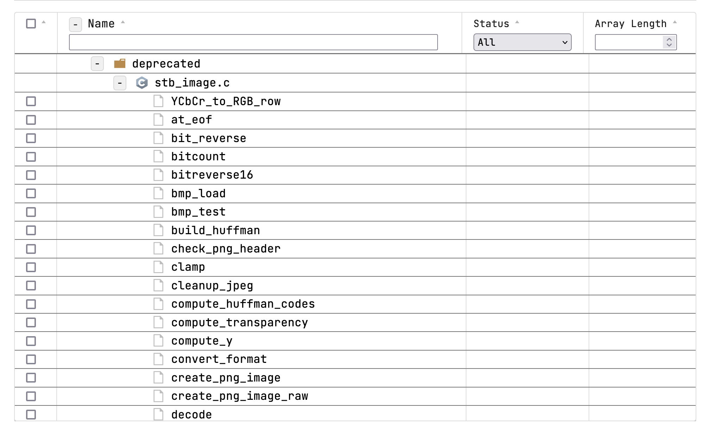

# 1. react-table-optimization

## 환경

- M1 Mac mini 기본 사양
- firefox developer edition
- React & Redux & Redux Observable

## Table 요구사항

1.  커뮤니티 활성화
2.  Document 지원
3.  다양한 기능 지원
    1. sorting 지원
       1. Header 별
       2. 기존 sorting 된 결과를 바탕으로 새로운 sorting 가능
    2. 다양한 header column filter 지원
       1. 지향점은 기획적인 변경에 유연해야 함. 즉 Table 라이브러리에 종속되지 않은 컴포넌트로 filter 기능 구현 가능
       2. 최소
          - input box filter
          - select box filter
       3. 예정 (미정)
          - Modal, Tab, Menu List, Checkbox 등
    3. Table row의 자유로운 커스터마이징
       - 예시로 Checkbox, InProgress Bar 등을 삽입 가능
4.  다양한 기능에 대한 컴포넌트 외부의 로직(비즈니스 로직 포함) 최소화
5.  Tree 지원
6.  css 커스터마이징 제약이 최소화 또는 없음
7.  대규모 데이터에 대한 렌더링 속도 최적화
    1. 초기 렌더링 시
    2. sorting 시
    3. filter 시
    4. 검증
       - 트리 구조 예시
         1. 1depth 노드
         - 10만 개
         2. 2depth 노드
         - 1depth 당 1만 개
         3. 3depth 노드
         - 2depth 당 1천 개
       - 측정
         - 초기 렌더링 시간
         - sorting 렌더링 시간
8.  Infinite scroll 지원
9.  Virtualize 지원
    - 전체 Row 중 Viewport에 보여지는 부분 또는 보여지는 부분에서 특정 offset 까지만 사전에 Rendering 지원
10. Table 컴포넌트 외부의 비즈니스 로직 최소화
11. Table 컴포넌트 외부에서 Table data source를 Table이 지원하는 Table data에 알맞게 구조 변경 또는 Parsing 최소화

## Table Library 선정

- react-table

## 1차 구현 결과

1.  - 
    - 요약
      1. 5000개의 Table Row를 가짐
      2. Tree 구조는 최대 3 depth
      3. 트리 depth 별 노드 갯수 비율
      - 1 depth 노드 갯수 : 2 depth 노드 갯수 : 3 depth 노드 갯수 = 1: 10: 최소 100 ~ 최대 3000 (평균 미정)
      - 트리 1 depth 노드 갯수는 20개
    - 문제점
      1. 대규모 랜더링에 대한 Re Rendering 최적화가 고려 안함
      - 추측
        - 초기 렌더링 이후 1개의 row를 Re Rendering 시 모든 Row가 Re Rendering 됨.
      - 추측의 근거
        1. 1개의 row에 대한 Table data source를 변경 시 최소 5초의 Re Rendering 시간 소요
        2. sorting 최소 시 5초의 Re Rendering 시간 소요
        3. checkbox 1개를 enable 또는 disable 시 5초의 Re Rendering 소요
        4. checkbox를 모두를 동시에 enable 또는 disable 시 5초의 Re Rendering 시간 소요
        5. filter 후 filter 조건 제거 시 5초의 Re Rendering 시간 소요
      2. Table 외부의 비즈니스 로직에서 Table data source에 알맞게 data 구조 또는 property name 또는 property value를 수정하고 있음
      3. Table의 부모 컴포넌트가 리렌더링 시 Table의 모든 Row가 Re Rendering 됨.
      4. \*\*실시간 변경 여부를 Re Rendering 하지 못함
      - 구체적인 상황
        - data fetch를 redux Observable를 통해서 관리한다.
        - redux Observable를 통해 epic action으로 data fetch를 하고 결과를 action을 통해서 store에 반영 중
        - Table에 fetch 할 data가 1초 마다 변경 된다.
        - data는 특정 소수의 Row만 Re Rendring 한다.
      - 문제점
        1.  data는 특정 소수의 Row의 Rendering 결과만 변경한다고 할 경우, Re Rendering 속도가 느려서 data를 fetch 후 Re Rendring 완료 시간이 사용성에 문제가 느껴질 정도로 느림.
            - 초기 렌더링 후 3초 후 Re Rendring이 완료 되고, 시간에 비례하게 Re Rendring 완료 시간이 증가하고, 3분 이후부터 Re Rendering이 멈춤.
            - 브라우저 freezing 현상 발생
      - 문제 원인 추측
        - redux action을 통해서 data fetch를 관리하는 부분에서 여러 data fetch가 쌓여도

##

## 문제

1.  Out Of Memory 발생
2.  5000개 이상의 Tree 형식의 Table의 초기 렌더링이 3~5초 소요
3.  5000개 이상의 Tree 형식의 Table 특정 Row를 Rendering 시 모든 Row가 동시에 Rendering 됨
4.

## Out Of Memory

-
- 일반 사용자가 발생 시 해결하는 방법
  - https://loveuceci.tistory.com/2237

## 참고

## 의문

- 개발자 Chrome은 일반 사용자 Chrome과 무슨 차이?

- firefox 개발자 에디션 vs 개발자 Chrome
