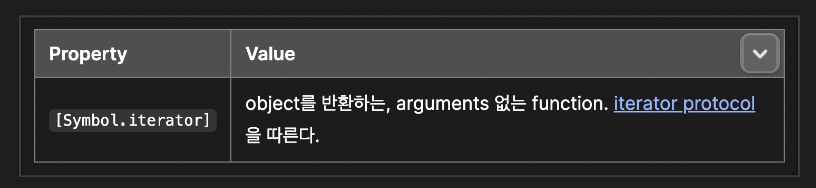
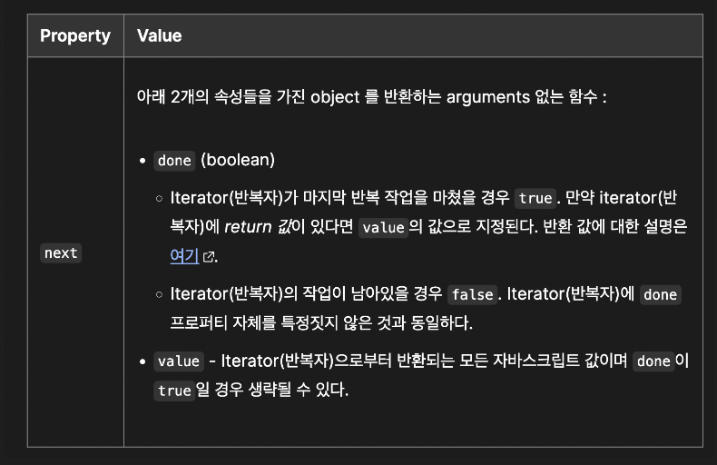

# 자바스크립트 자주 하는 실수

- es6
  - 업계 표준
  - 먼저 공부하자
  - 설탕 문법 많다
- es5
  - 내부 구조 공부 시 좋다
  - es6의 원형을 알 수 있다

### 자바스크립트의 현재와 미래

1. ES6는 없다(?)
    - ECMAScript 6th edition부터는 연도 표기
    - 2015년부터 해마다 새 명세가 갱신
    - 보통 'ES6'라고 하면 'ES6와 그 이후'를 의미

2. ESM으로의 전환

- Common.JS, AMD가 ESM으로 전환될 것
- `<script>` 태그도 ESM을 지원함
- 예) CommonJS (과거 NodeJS)

    ```
        var $ = require('jquery')
        exports.myExample = function() {}
    ```

- 예) ESM

    ```
        import $ from 'jquery'
        export function myExample {}
    ```

- 예) 웹 브라우저 모듈

    ```
        <script type="module">
            import {feature} from 'module-name'
            feature()
        </script>
    ```

- 자바스크립트 미래 (정확한 예측 불가)
  - JS 10년 주기설에 의하면 올해가 3번째 주기 시작
  - 브라우저, Node 발전에 따라 트랜스파일러의 필요성 하락
  - JS가 아닌 JS:TS, WebASM, Rust 등
  - 새로운 번들러 등장 : Webpack의 독주는 언제까지?

### 일반적인 UI 브라우저 병목현상 (js 속도가 크게 중요하지 않을 것으로 추측)

- (게임 3D 제외)
- backend
- browser 자체에서
- file 크기
- cache 정책

### 브라우저에 새 언어가 네이티브로 지원 시 JS는 긴장이 필요한 시기일 것이다. (대체 가능성)

### 어휘적 환경 lexical environment

- 정의
  - 변수나 함수 등의 식별자를 정의할 떄 사용되는 명세
  - 중첩된 어휘적 환경에 기반해 동작
  - Environment Record와 outer 속성을 포함
- 관련 문법
  - 함수 선언 function declaration
  - 블럭문 block statement
  - Try~Catch문의 Catch 절
- 종류
  - 전역 환경 global environment
  - 모듈 환경 module environment
    - 개개 파일(import, require)에 대한
  - 함수 환경 function enviroment

### 실행 컨텍스트 Excution Context

- 정의
  - 자바스크립트 코드가 실행되는 환경
  - 모든 JS 코드는 실행 컨텍스트 내부에서 실행된다.
- 종류
  - 전역 실행 컨텍스트 global excution context
  - 함수 실행 컨텍스트 functional excution context
  - eval 함수 실행 컨텍스트 eval function excution context
    - 필요성 없다. 쓰지말자.

### 어휘적 범위 Lexical Scope

- 같은 범위 혹은 그 보다 안쪽의 코드에서 바깥 영역에는 접근할 수 있지만 그 역은 성립하지 않는다.
- 범위의 구분
  - 함수 선언
  - 블럭문 (if, for, while), Try-Catch의 catch 절
- 예

    ```
        function hello() {
            {
            const greeting = '안녕하세요';
            }
            console.log(gretting)
        }
        hello();
    ```

### 클로저 Closure

- 처음 만들어 질 때의 어휘적 범위를 그대로 유지한 함수
- 어휘적 범위 바깥에서 해당 범위에 접근할 수 있다.

    ```
        function hello() {
            const greeting = '안녕하세요';

            return function() {
                console.log(greeting)
            }
        }

        const say = hello();
        say(); // greeting 출력
    ```

### 엄격한 모드 stric mode

- 진입 방법
  - use strict : 전역 영역, 함수 내에 표기
  - ES2015 모듈 사용 (자동 적용)
- 일반 모드와 차이
  - 조용한 에러(에러 출력안하면서 무시) 대신 명시적으로 에러 발생
  - JS 엔진 최적화를 어렵게하는 실수 방지
  - 향수 ES2015에 포함될 예약어/문법 대비
- 엄격한 모드 외의 엄격함
  - JS의 이상한 동작은 독특한 형변환도 원인
  - 일치 연산자 === 사용 습관화
  - 명시적 형변환 활용

### 비동기 자바스크립트 Asyncronous JavaScript

- 비동기 처리는 필연
  - 기능 대부분을 외부 API에 의존하고 있기 때문
  - 외부 API를 호출하고 결과를 콜백으로 전달받음
    - addEventListener, ...
- 자바스크립트의 동작 원리
  - 자바스크립트는 싱글 스레드 언어
  - 이벤트 루프와 스택을 통해 스케줄링
  - UI 업데이트, 사용자 이벤트를 모두 같은 스레드로 처리
    - callstack이 오랫동안 안 비면 UI가 버벅이는 현상 발생, 함수 하나하나를 잚게 쪼갠다.
- 콜백 지옥은 해결된 문제
  - 더 우아한 비동기 처리 방법 : Promise, async, await
  - 함수 분리 등의 코딩 패턴 적용
  
### 이벤트 루프 Event loop

- 자바스크립트의 동시성 concurrentcy 처리 모델의 기본 원리
- 구조
  - memory heap
    - 여러 객체 값 저장
    - 메모리 직접 관리, 액세스가 상대적으로 느림
    - 메모리는 자동 관리
  - call stack
    - 함수 하나당 Frame (1개당 실행 콘텍스트)
  - Queue (이벤트 큐)
    - Message가 있는지 event loop에서 확인
    - Message 처리를 통해 동기식 처리
    - 단 콜스텍이 비어있을 때만 작동

### ES6 제너레이터를 사용한 비동기 프로그래밍

- 일종의 코루틴이다.
  > 코루틴 설명 (<https://en.wikipedia.org/wiki/Coroutine>)
  - 제너레이터가 코루틴과 다른점은 멈출 때 돌아갈 위치를 지정할 수 없다.
  - 세미 코루틴이다.
    - 제너레이터는 단지 호출자에게 제어권을 반환하게 된다.
    - 이터레이터 next() 함수가 호출 될 때 마다, 이터레이터 내 호출되는 위치로 제어권을 넘겨주고, 그 결과를 반환받는다. (즉 제너레이터와 호출자를 통해서 상호간 제어권 뿐만 아니라, 데이터까지 주고 받을 수 있다.)
    - 제너레이터 함수 내부에서는 콜백 또는 프로미스를 사용하지 않으면서도, 비동기적으로 데이터를 주고받으며 실행되고 있다. (비동기를 보다 동기적으로 처리할 수 있는 인상을 줌.)

```
 function* myGen() {
  const x = yield 1; // x = 10
  const y = yield x + 1 // y = 20
   const z = yield y + 2 // z = 30
  Return x + y + z;
 }

 const myItr = myGen();
 console.log(myItr.next()); // {value: 1, done: false}
 console.log(myItr.next(10)); // {value: 11, done: false }
 console.log(myItr.next(20)); // {value: 22, done: false }
 console.log(myItr.next(30)); // {value: 60, done: true }
```

- 콜백헬 문제점
  > 콜백헬 발생은 연속적 전달식(CPS)에 의해서 이다. (CPS : <https://en.wikipedia.org/wiki/Continuation-passing_style>)
  - 가독성  외에, 중요한 문제는 콜백함수를 다른 함수로 전달하는 순간, 그 콜백함수에 대한 제어권을 잃는다.
    - 즉, 내가 제공한 콜백이 언제 실행되는지, 몇 번 실행되는지 등에 대해 추적이 불가능한다. (추적이 불가능함에 의한 콜백에 대한 신뢰도가 적다는 의미 또한 내포한다.)
    - Callback 횟수가 많아질 수록, 프로그램이 예측이 더 어렵고, 에러가 발생하기 쉽고, 디버깅 또한 어렵다.
  - 의문
    - 콜백은 재귀가 되는가?
    - 콜백 후 콜백 외부에서 콜백 실행 완료 여부를 확인할 수 있는가?
      - 이를 제너레이터 문법으로 제어권을 호출한 지점으로 리턴하는 방식으로 실현 가능함.
      - 제너레이터 외 다른 방법은 없는가?
- 프로미스 문제점 (정리가 덜됨.)
  - 체이닝에 의한 순차적으로 의존성을 가지면서 실행하지 않는 경우에는, 치명적인 단점이다.
    - Promise 체이닝에 대한 낮은 이해도는 불필요한 중첩 프로미스 체이닝과 이로 인한 문제점이 생긴다. (자세한 내용은 MDN 프로미스 문제점 참고)

```
 // Tip: Arrow 함수를 쓰면 보다 가독성이 향상됨.
 function orderCoffee(phoneNumber) {
    return getId(phoneNumber)
      .then(id => getEmail(id))
      .then(email => getName(email))
      .then(name => order(name, "coffee"));
  }
```

- 예시 (나쁜), 제너레이터 적용 (정리가 덜 됨)
  - iterator.next()가 비동기 함수 내부에서 호출되므로, 이터레이터를 범용적으로 사용할 수 없다.
    - 제너레이터가 본인의 제어권을 상실했다.

```
  function* orderCoffee(phoneNumber) {
    const id = yield getId(phoneNumber);
    const email = yield getEmail(id);
    const name = yield getName(email);
    const result = yield order(name, "coffee");
    return result;
  }

  const iterator = orderCoffee("010-1234-1234");
   iterator.next();

   function getId(phoneNumber) {
     // …
     iterator.next(result);
   }

   function getEmail(id) {
     // …
     iterator.next(result);
   }

   function getName(email) {
     // …
     iterator.next(result);
   }
  
   function order(name, menu) {
     // …
     iterator.next(result);
   }

```

- 예시, 제너레이터와 프라미스의 만남
  - 결과적으로 각각의 함수에서 제너레이터를 의존하지 않으면서도, 외부에서 제너레이터 제어가 가능하다.
  - 제너레이터를 활용해서 비동기 코드를 동기식 코드인 것처럼 작성할 수 있게 되었다.

```

  function getId(phoneNumber) {
   return 프로미스
  }

  function getEmail(id) {
   return 프로미스
  }

  function getEmail(id) {
   return 프로미스
  }

  function getName(email) {
    return 프로미스
  }

  function order(name, menu) {
    return 프로미스
  }

  function* orderCoffee(phoneNumber) {
    // 장점으로 id, email, name, result 모두 함수 내에 캡슐화되어서 관리가 됨.
    const id = yield getId(phoneNumber);
    const email = yield getEmail(id);
    const name = yield getName(email);
    const result = yield order(name, "coffee");
    return result;
  }

  const iterator = orderCoffee(“010-1234-5678”);
  let ret;

  (function runNext(val) {
    // var은 프로미스가 전달됨.
    // 최초 실행 시, val은 undefined?
    ret = iterator.next(val);

    if(!ret.done) {
     ret.value.then(runNext);  
    } else {
     console.log(“result : ” , ret.value):
    }
})();
```

- co 라이브러리
  - 제너레이터를 쉽게 사용할 수 있는 편리한 두 함수를 제공한다.
  - 참고
    - <https://github.com/tj/co>
- 과거 koa
  - koa-router는 특정 URL을 핸들링 할 때, 제너레이터가 사용 가능하다.
    - koa가 제너레이터를 기반으로 미들웨어에 대한 제어를 하므로, 개발자는 yield만으로 비동기를 동기처럼 처리가 가능하다.

```
  router.post("/login", function*() {
    const { email, password } = this.request.body;
    const user = yield userDB.get(email);
    const valid = yield crypter.compare(password, user.password);
    //  …
  });

```

- 비동기의 동기처럼 순차적으로 처리의 끝판왕은 async/await

- 참고
  - <https://ui.toast.com/weekly-pick/ko_20160408>

### 프로미스 사용하기

- 프로미스란?
  - 비동기 작업의 최종 완료 또는 실패를 나타내는 객체

- **Promise는 함수에 콜백을 전달하는 대신에, 콜백을 첨부하는 방식의 객체**이다.
  - 콜백헬이 발생하는 이유는 함수에 콜백을 전달하기 때문이다.
- 예제, 콜백

```
 function successCallback(result) {
  console.log(‘audio file ready at URL: “ + result); 
 }

 function failureCallback(error) {
  console.log(‘error generating audio file:’ + error); 
 }

 createdAudioFileAsync(audioSettings, successCallback, failureCallback);
```

- 예제, 프로미스

```
 createAudioFileAsync(audioSettings).then(successCallback, failureCallback);
```

- 예제, 프로미스 간략화

```
 const promise = createAudioFileAsync(audioSettings);
 promise.then(successCallback, failureCallback);
```

- 이를 비동기 함수 호출이라고 한다.
- Guarantees (보장)
  - 콜백은 자바스크립트 Event Loop가 현재 실행 중인 콜 스택을 완료하기 이전에는 절대 호출되지 않는다.
  - 비동기 작업이 성공하거나 실패한 뒤에 `then()`을 이용하여 추가된 콜백의 경우에도 같다.  (콜백처럼 동작됨으로서, 호환성을 보장)
  - `then()`을 여러번 사용하여 여러개의 콜백을 추가할 수 있다. 그리고 각각의 콜백은 주어진 순서대로 하나 하나씩 순차적으로 실행된다.
- Promise의 가장 뛰어난 장점 중에 하나는 chaining이다
  - 2개 이상의 비동기 작업에 대해서, 순차적으로 각각의 작업이 이전 단계 비동기 작업이 성공하고 나서, 그 결과값을 이용하여 다음 비동기 작업을 해야 하는 경우를 의미함. 이를 promise chaning으로 해결하기도 한다.
  - `then()`함수는 새로운 promise를 반환한다.
    - 처음 생성한 promise와는 다른, 새로운 promise이다.
  - 예시

```
 // 방법 1
 const promise = doSomething();
 const promise2 = promise.then(successCallback, failureCallback);

 // 방법 2
 const promise2 = domSomething().then(successCallback, failureCallback);
```

- promise2는 doSomething() 뿐 아니라, successCallback 또는 failureCallback의 완료를 의미한다.
- successCallback 또는 failureCallback 또한 Promise를 반환하는 비동기 함수일 수도 있다.
- 이 경우, promise2에 추가된 콜백은 successCallback 또는 failureCallback에 의해 반환된 promise 뒤에 대기한다.
  - 만약 반환값이 없으면, 콜백 함수가 이전의 Promise의 결과를 받지 못한다.

- 장점으로 Error propagation
  - 콜백 지옥 시, 개별 콜백에 대해서 failureCallback을 등록해야 한다.
  - 하지만 promise chainig에서는 단 한 번만 발생한다. (단순화)
  - 즉, promise chain은 예외가 발생하면 멈추고, chain의 아래에서 catch를 찾는다.
    - 이는동기 코드가 어떻게 동작하는지 모델링 함.
    - 예시, promise chain

```
 doSomething()
  .then(result => doSomethingElse(result))
  .then(newResult => doThirdThing(newResult))
  .then(finalResult => console.log(‘Got the final result: ${finalResult}`))
  .catch(failureCallback);
```

- 예시, promise가 try catct로 표현하여서, 동기 코드 모델링임을 파악

```
 try {
  const result = syncDoSomething();
  const newResult = syncDoSomethingElse(result);
  const finalResult = syncDoThirdThing(newResult);  

 } catch(error) {
  FailureCallback(error);
 }
```

- 예시, async/await 구문을 통한, 비동기 코드의 대칭성 파악 (순차적이면서, 이전 결과를 통해 다음 결과를 계산하는 경우)

```
 async function foo(){
  try {
    const result = await doSomething();
    const newResult = await doSomethingElse(result);
    const finalResult = await doThirdThing(newResult);
    console.log(‘God the final result: ${finalResult}`); 
  } catch(error) {
    failureCallback(error);
  }
 }
```

- Promise는 모든 오류를 잡아내어, 예외 및 프로그램이 오류가 발생해도 콜백 지옥의 근본적인 결함(catch처리 시 인간적인 실수 등을 포함)을 해결한다.
  - 이는 비동기 작업의 기능 구성에 필수적이다.

- Promise rejection events
  - 전역적으로 reject를 캐치함.
    - 모든에러는 바생한 지점(source)에 상관없이 동일한 핸들러로 전달됨.
  - 목적
    - 1. 프로미스에 대한 에러 처리를 대체(fallback)
    - 2. 프로미스 관리시 발생하는 이슈들을 디버깅 시 도움
  - 유용한 사례, Node.js로 코드 작성 시, 특정 모듈이 reject 된 프로미스를 처리하지 않는 경우가 있을 수 있다.
    - 이 경우, 노드 실행 시 콘솔에 로그가 남는다.
    - 이를 수집에서 분석하고 직접 처리할 수도 있다.
    - 아니면 콘솔 출력을 어지럽히는 것을 막을 수도 있다.
- callback에 promise 적용하기
  - setTimeout의 문제점
    - 콜백 함수가 실패하거나 프로그램 오류를 캐치할 수 없다. (편법이 있을 것 같음)
  - Promise로 setTimeout을 감싸기

```
 const wait = ms => new Promise(resolve => setTimeout(resolve, ms));
 
 // 프로미스가 Pending 상태에서, then 부터 이행함을 알 수 있음.
 wait(10000).then(()=> saySomething(“10 seconds”)).catch(failureCallback);

```

- Composition
  - `Promise.resolve()`와 `Promise.reject()`는 각각 이미 resolve되거나 reject 된 promise를 여러분이 직접 생성하기 위한 단축 명령어이다.
  - `Promise.all()`과 `Promise.race()`는 비동기 작업을 병렬로 실행하기 위한 두 가지 구성 도구이다.
  - 예제, 병렬로 작업을 시작하고 다음과 같이 모두 완료될 때 까지 기다리기

```
 Promise.all([func1(), func2(), func3()]
  .then(([result1, result2, result3]) => {
   /* use result1, result2 and result3 /*
  });
```

- 예제, 고급진 JavaScript를 사용하여 순차적으로 구성하기

```
 [func1, func2, func3].reduce((p,f => p.then(f), Promise.resolve())
  .then(result3 => {
   /* use result3 */
  });
```

- 예제, 기본적으로 비동기 함수 배열은 Promise 체인으로 줄인다. (문법을 통한 가독성 향상)

```
 Promise.resolve().then(func1).then(func2).then(func3);
```

- 예제, 재사용 가능한 합성 함수 (일반적인 함수형 프로그래밍)

```
 const applyAsync = (acc, val) => acc.then(val);

 // 여러 함수를 인자로 받아들이고, composition 파이프라인을 통해서 전달되는 초기 값을 허용하는 새 함수를 반환한다)
 cosnt composeAsync (…funcs) => funcs.reduce(applyAsync, Promise.resolve(x));

 const transformData = composeAsync(func1, func2, func3);
 const result3 = transformdata(data); 
```

- 예제, (추천) async/await를 사용하여 순차적 구성을 보다 간단하게 수행 (반드시 함수형 프로그래밍 작성법이 가독성이 좋고 선언적이지 않음을 알 수 있음)

```
 let result;
 for (const f of [func1, func2, func3]) {
  Result = await f(result);
 }

 /* use last result (i.e result3) */
```

- Timing
  - 당황스러움(코드에 문제가 생겼을 때)을 피하기 위해 then에 전달된 함수는 already-resolved promise에 있는 경우에도 동기적으로 호출되지 않는다.
  - 즉시 실행되는 대신에, 전달된 함수는 **마이크로 태스크 대기열**에 저장된다.
    - 자바스크립트 이벤트 루프의 현재 실행이 끝나고, 대기열도 빈 경우에 제어권이 이벤트 루프로 반환되기 직전에 실행된다.
- 예시 1

```
 Promise.resolve().then(()=> console.log(2));
 console.log(1); // 1, 2
```

- 예시 2

```
 const wait = ms => new Promise(resolve => setTimeout(resolve, ms));

 wait(0).then(() => console.log(4));
 Promise.resolve().then(()=> console.log(2)).then(()=>  Console.log(3));
 console.log(1); // 1, 2, 3, 4
```

- Nesting
  - 간단한 promise 체인은 평평하게 유지하는 것이 가장 좋다.
  - 중첩된 체인은 부주의한 구성의 결과일 수 있다.
    - 참고
      - <https://developer.mozilla.org/ko/docs/Web/JavaScript/Guide/Using_promises#common_mistakes>
  - 중첩은 catch 문 범위를 제한하는 제어 구조이다.
    - 특히 중첩된 catch는 중첩된 범위 외부(같은 계층의?)의 체인에 있는 오류가 아닌 범위 및 그 이하의 오류만 잡는다. (선형적인 체인 단위로 에러가 캐치된다.)
    - 그러므로 올바르게 사용하면 오류 복구 시 더 정확한 결과를 얻을 수 있다.

```
 doSomethingCritical()
 .then(result => doSomethingOptional(result)
    .then(optionalResult => doSomethingExtraNice(optionalResult))
    .catch(e=> {})) // Ignore if optional stuff fails; proceed. 
 .then(()=> moreCriticalStuff()) // doSomethingExtraNice가 실행을 완료 되기 전까지 pending  
 .catch(e => console.log(“Critical failure: ” + e.message));
```

- inner neutralizing catch 문은 doSomethingOptional() 및 doSomethingExtraNice() 에서 발생한 오류를 catch한 후에 코드가 moreCriticalStuff()로 다시 시작된다.

- 중요한 점은 dosomethingCritical()이실패하면 해당 오류는 최종 (외부) catch에서만 포착된다는 것이다. 이로 인해 inner netralizing catch에서 발생한 error throw는 사라지게 된다.

- Common mistakes
  - 예제

```
 // Bad example ! Spot 3 mistakes !

 doSomething().then(function(result) {
  doSomethingElse(result) // Forgoet to return promise fro minner chain + unnecessary
  .then(newResult => doThirdThing(newResult)):
 }).then(() => domFourthThing());
 // Forgot to terminate chain with a catch!

```

- 실수 1. 제대로 체인을 연결하지 않음.

  - 주로 새로운 promise를 만들었지만, 그것을 반환하는 것을 잊었을 때 일어난다.
    - return이 없으면, 결과적으로 체인이 끊어지거나, 오히려 두 개의 독립적인 체인이 경쟁하게 된다. (만약 return이 promise이면 (동기 또는 비동기) 로직을 순차적으로 이어갈 수 있으므로)
  - 즉, doFourthThing()은 doSomethingElse() 또는 doThirdThing()이 완료될 때 까지 기다리지 않고, 의도와 다르게 병렬로 실행된다.
  - 또한 별도의 체인은 별도의 오류 처리 기능을 가지고 있으므로, 잡기 어려운 오류가 발생한다.

- 실수 2. 불필요하게 중첩되어 실수 1을 가능하게 만든다.
  - 중첩은 내부 오류 처리기의 범위를 제한하며, 의도하지 않은 에러가 캐치되지 않는 오류가 발생할 수 있다.
  - 중첩에 의해서, 내부 오류 처리기의 범위를 제한하며, 의도하지 않은 에러가 캐치되지 않는 오류를 발생시킬 수 있다.
  - 이 변형은 promise contructor anti-pattern 이다.
    - 이미 약속을 사용하는 코드를 감싸기 위해 promise 생성자의 중복 사용과 중첩을 결합한다.
    - 참고
      - <https://stackoverflow.com/questions/23803743/what-is-the-explicit-promise-construction-antipattern-and-how-do-i-avoid-it>
      - (Promise anti patterns) <https://github.com/petkaantonov/bluebird/wiki/Promise-anti-patterns#the-deferred-anti-pattern>
        - Promise are about make asynchrouse code retain mostr of the lost properties of synchrous code such as flat indentation and one exception channel.
        - 굳이 Promise 내부에서 defer 처리하지 않아도 됨. (자동으로 then 전까지, 실행이 연기됨)
          - 직접 defer 시, error와 rejection이 swallowed 되고 not propagate 된다. (To final consumer)
          - 이는 그저 defer를 하지 않고, return으로 해결 됨.
        - setTimeout으로 resolve 시키기 위해서는,  Promise.pending()을 통해 연기 시킬 수 있다.
          - 의문
            - 굳이 왜 프로미스 펜딩을 시킬까? (정말 펜딩임을 명시하기 위해서?)
- 실수 3. catch로 체인을 종료하는 것을 잊음
  - 종료되지 않은 promise 체인은 대부분의 브라우저에서 예상하지 못한 promise rejection을 초래한다.
  - 항상 promise 체인을 반환하거나 종결해야 한다.
  - async/await 시 대부분의 문제를 해결할 수 있음.
- promise와 작업이 충돌할 때 ()
  - 예측할 수 없는 순서로 실행되는 promise 및 작업(예: 이벤트 또는 콜백)이 있는 상황에 직면하면 마이크로 태스크를 사용하여 상태를 확인하거나 promise가 조건부로 생성될 때 promise의 균형을 맞추는 것이 좋다.
  - 의문
    - 마이크로 태스크를 어떻게 이용해서 상태를 확인?
    - promise가 조건부로 생성될 때 promise의 균형?

- 참고
  - <https://developer.mozilla.org/ko/docs/Web/JavaScript/Guide/Using_promises>

### 반복기(iterator) 와 생성기(generator)

#### 반복자 (Iterator)

- 시퀀스를 정의하고, 종료 시의 반환값을 잠재적으로 정의하는 객체이다.
- 반복자는 두 개의 속성( value, done )을 반환하는 next() 메소드를 사용하여, 객체의 Iterator protocol을 구현한다.
- 만약 시퀀스의 마지막 값이 이미 산출된 경우, done 값은 true이다.
- 반복자를 생성하면 next() 메소드로 명시적으로 반복 호출할 수 있다.
  - 반복자를 반복시키는 것은 일반적으로 단 1번씩만 가능하므로, 반복자를 소모시키는 것이다.
    - 의문
      - 동일한 반복자 반복 1회 이상 할 수 있는가? 있다면 방법은?
- 가장 일반적인 반복자는 배열 반복자이다.
- 모든 반복자가 배열로 표현 될 수 없다.
  - 배열은 완전히 할당되어야 하지만, 반복자는 필요한 만큼만 소모되므로 무제한 시퀀스로 표현할 수 있다. (0부터 무한대 사이의 정수 범위로)
- 반복자 내부에 명시적으로 상태를 유지할 필요가 있다.
- 예제, 배열이 아닌 이터레이터 만들기 (특정 정수 범위만큼 반복자 생성하기)

```

 // 이터레이터 정의
 function makeRangeIterator (start = 0, end = Infinity, step = 1) {
    var nextIndex = start;
    var n = 0;

  var rangeIterator = {
    next: function () {
      var result;
      
      if(nextIndex < end) {
        result = {value: nextIndex, done: false }
      } else if (nextIndex == end) {
        result = { value: n, done: true }
      } else {
        result = { done: true } 
      }

      nextIndex += step;
      n++;
      
      return result;
    }
  }  
  return rangeIterator;
 }

 // 정의한 이터레이터 사용
 var it = makeRangeIterator(1, 4);

 var result = it.next();
 while(!result.done) {
  console.log(result.value); // 1, 2, 3
 }
 
 console.log(“iterated over sequence of size:”, result.value):
```

#### Generator functions

- 반복자는 내부에 명시적으로 상태를 유지할 필요가 있다.
  - 생성자 함수는 이에 대한 강력한 대안을 제공한다.
- 실행이 연속적이지 않은 하나의 함수를 작성함으로서 개발자가 iterative alogrithm을 정의할 수 있게 한다.
- 생성자 함수는 function* 문법을 사용하여 작성된다.
  - 최초 호출 시, 함수 내부의 어떠한 코드도 동작하지 않고, 대신 생성자라고 불리는 반복자 타입을 반환한다.
  - 생성자의 next 메서드를 호출함으로써, 어떤 값이 소비되면, 생성자 함수는 yield 키워드를 만날 때 까지 실행된다.
    > yield 의미는 "생산하기" 이다
- 생성자 함수는 원하는 만큼 호출될 수 있다.
  - 매번 새로운 생성자 함수를 반환한다.
  - 단 각 생성자는 단 한번만 순회될 수 있을 것이다 (?)

```
 function* makeRangeIterator (start = 0, end = Infinity, step = 1 )  {
    let n = 0;
    for(let i = start; i < end ; i += step) {
      n++;
      yield 1;
    }

    return n;
 }
```

- 반복자보다 생성자를 사용한 코드가 보다 가독성이 높다.

#### iterables

- Array 또는 Map은 iterable이 기본 내장형이다.
- 객체는Symbol.iterator 키를 갖는 경우(@@iterator 메서드 구현, 반복이 가능하다.
  - 의문
    - Array를 초기값 1, 2, 3으로 선언 시, 숫자 1, 2, 3은 @@iterator 로 사용하기 위해서 어떻게 관리되는가?
      - 참고로, 재정의한 @@iterator는, 초기 선언값과 다르게 관리된다.
- 하나의 Iterable은 단 한 번, 혹은 여러번 반복가능하다.
  - 단 한 번 반복 가능한 iterable(e.g. Generator)은 관습적으로 자신의 @@iterator메서드로부터 this를 반환한다. (Generator 강조!)
  - 반면, 여러 번 반복 가능한 iterable은 @@iterator 메소드가 호출되는매 회 새로운 iterable을 반드시 반환해야 한다.
- 사용자 정의 iterable
  - 의문
    - 사용자 정의가 아닌 iterable은 어떻게 구현되어 있을까?
  - 예제, 자신의 반복가능 객체를 만들기

```
 var myIterable = {
    *[symbol.iterator]() {
    yield 1;
    yield 2;
    yield 3;
  }

  for (let value of myIterable) {
    console.log(value);
  }

  // 1
  // 2
  // 3

  // 또는
  […myIterable]; // [1, 2, 3]
 }
```

- 내장 iterable
  - String, Array, TypedArray, Map 및 Set은 모두 내장 가능 반복 객체이다.
    - 프로토타입 객체가 모두 Symbol.iterator 메소드가 있기 때문이다.

```
 for (let value of [‘a’, ‘b’, ‘c’]) {
    console.log(value)
 }
 // “a”
 // “b”
 // “c”

 [..’abc’] // [“a”, “b”, “c”]

 function* gen() {
    yield* [‘a’, ‘b’, ‘c’] 
 }

 gen().next() // {value: “a”, done: false }

 [a, b, c] = new set([‘a’, ‘b’, ‘c’])
 A // “a”
```

#### Generator 심화

- 생성자 함수는 요청에 따라 그 산출된 (yielded, yield 식으로 산출된) 값을 계산하고, 계산 비용이 높은 수열 또는 위에 설명한 대로 무한 수열이라도 효율적으로 나타낸다.
- next() 메서드는 또한 생성기의 내부 상태를 수정하는 데 쓰일 수 있는 값을 받는다.
  - next()에 전달되는 값은 생성기가 중단된 마지막 yield 식의 결과로 처리된다.
- 예제, sequence(수열)을 재시작하기 위한 피보나치 수열

```
 function* fibonacci() {
    var fn1 = 0;
    var fn2 = 1;

    while( true ) {
      var current = fn1;
      fn1 = fn2;
      Fn2 = current + fn1;
      var reset = yield current;

      if (reset) {
        fn1 = 0;
        fn2 = 1;
      }
    }
 }

console.log(sequence.next().value);     // 0
console.log(sequence.next().value);     // 1
console.log(sequence.next().value);     // 1
console.log(sequence.next().value);     // 2
console.log(sequence.next().value);     // 3
console.log(sequence.next().value);     // 5
console.log(sequence.next().value);     // 8
console.log(sequence.next(true).value); // 0
console.log(sequence.next().value);     // 1
console.log(sequence.next().value);     // 1
console.log(sequence.next().value);     // 2
```

- 제너레이터의 throw() 메서드를 호출하고, throw 해야 하는 예외 값을 전달하여 생성자가 예외를 throw 하도록 할 수 있다.
  - 제너레이터 throw ( <https://developer.mozilla.org/ko/docs/Web/JavaScript/Reference/Global_Objects/Generator/throw> )
    - 예외는 생성기의 현재 일시 중단된 컨텍스트에서 throw된다.
    - 마치 현재 일시 중단된 yield 대신 `throwvalue 문`인 것처럼.
    - 예외가 생성기 내에서 포착되지 않으면 throw() 호출을 통해 전파되고, 이후의 next() 호출은 done 속성이 true가 된다.
- 제너레이터에는 주어진 값을 반환하고 제너레이터 자체를 완료하는 return(value) 메서드가 있다.
  - 제너레이터 return ( <https://developer.mozilla.org/ko/docs/Web/JavaScript/Reference/Global_Objects/Generator/return> )  
    - 현재 중단된 위치에서 제너레이터 본체에 리턴 문이 삽입된 것 처럼 작동한다.
      - 일반적인 흐름에서는 return(value) 호출 시, {done:true, value: value}가 반환된다.
      - 만약 yeild 외부가 try ...finally 블록이 적용된 경우, 제어 흐름은 함수를 종료 하지 않고 finally 블록이 실행되도록 한다.
        - 이 경우 반환되는 값이 다를 수 있으므로, finally 블록 내에 더 많은 yield 식이 있다면 done도 false 일 수 있다.

#### iterator와 iterable의 차이점

- iterable
  - 랜덤 Access 가능
  - 내장 기능이 많음. (Heavyweight)
    - 즉 메모리 사용량이 상대적으로 많음.
- iterator
  - .next() 메소드를 통해서, 바로 앞/뒤 값만 접근 가능
  - iterable 보다 기능이 상대적으로 적음 (lightweight)
    - 즉 메모리 사용량이 상대적으로 적음.

#### 참고

- 반복 프로토콜
- for …of
- function* 및 Generator
- yield 및 yield*
- 참고
  - <https://developer.mozilla.org/ko/docs/Web/JavaScript/Guide/Iterators_and_generators>

### Iteration protocols

- 이 protocols (표현법)은 일정 규칙만 충족한다면 어떠한 객체에 의해서도 구현될 수 있다.
  - 종류는 iterable.protocol과 iterator.protocl이 있다.
    - 의문
      - 무슨 차이?
- The iterable protocol
  - JS 객체들이 for..of 구조에서 어떠한 value들이 loop되는 것과 같은, iteration 동작을 정의하거나 사용자 정의를 허용한다.
  - Array 또는 Map은 default iteration 동작으로 built-in iterables이다.
  - Iterable 하기 위해서는, 객체 내 @@iterator 메소드를 구현해야 한다.
    - 이는 객체가 Symbol.iterator key의 속성을 가져야 함을 의미함.
 - 
  - 어떠한 객체가 반복(iterate)되어야 한다면, 이 객체는 @@iterator 메소드가 인수없이 호출되고, 반환된 iterator는 반복을 통해서 획득할 값들을 얻을 때 사용한다.

- The iterator protocol
  - value (finite 또는 infinite) 들의 sequence를 만드는 표준 방법을 정의한다.
  - 객체가 next() 메소드를 가지고 있고, 아래의 규칙에 따라 구현되었다면 그 객체는 iterator이다.

- 
- 몇몇 iterator들은 iterable(반복 가능)이다:

```
 var someArray = [1, 5, 7];
 var someArrayEntries = someArray.entries();

 someArrayEntries.toString(); // “[object Array Iterator]”
 someArrayEntries === someArrayEntries[Symbol.iterator](); // true
```

- Iteration protocols 사용 예시
  - 예시, String은 Built-in iterable 객체의 한 예시이다.

```
 var someString = “hi“;
 typeof someString[Symbol.iterator]; / “function”
```

- 예제, String의 기본 iterator는 string의 문자를 하나씩 반환한다.

```
 var iterator = someString[Symbol.iterator]();
 iterator + “”; // “[object string Iterator]”

 iterator.next(); // { value: “h”, done: false}
 iterator.next(); // { value: “i”, done: false}
 iterator.next(); // { value: undefined, done: true }
```

- 예제, spread operator와 같은 특정 내장 구조(built-in constructs)들은 실제로는 동일한 iteration protocol을 사용한다.

```
 […someString]. //[“h”, “i”]
```

- 예제, 사용자만의 @@iterator를 특정함으로써 원하는 반복 행위(iteration behavior)를 설정할 수 있다.

```
 var someString = new String(“hi”); // need to construct a String object explicitly to avoid auto-boxing

 someString[Symbol.iterator] = function() {
  Return {
   // this is the iterator object, returning a single element, the string “bye”
   next : function() {
    If(this._first) {
     this._first = false;
     return { value: “bye”, done :false }
    } else {
     Return { done: true };
    }
   },
   _first: true
  }
 }

 // 재설정된 @@iterator가 어떻게 내장 구조(built-in constructs)의 반복 행위에 영향을 주는지 확인
 […someString]; // [“bye”]
 SomeString + “”; // “hi”
```

- 참고
  - <https://developer.mozilla.org/ko/docs/Web/JavaScript/Reference/Iteration_protocols>
