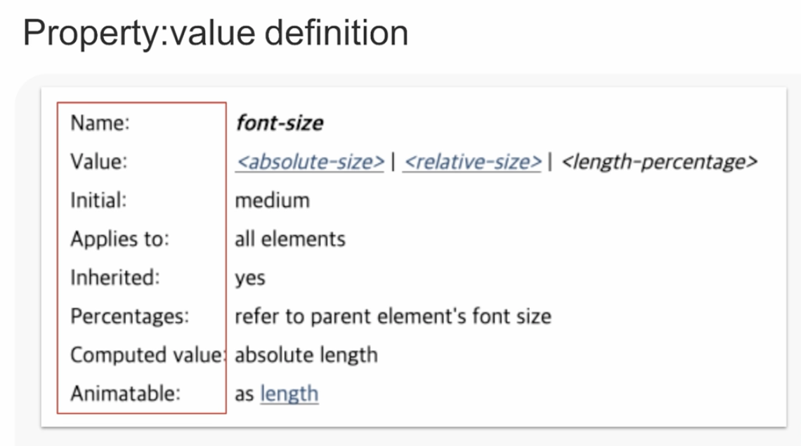
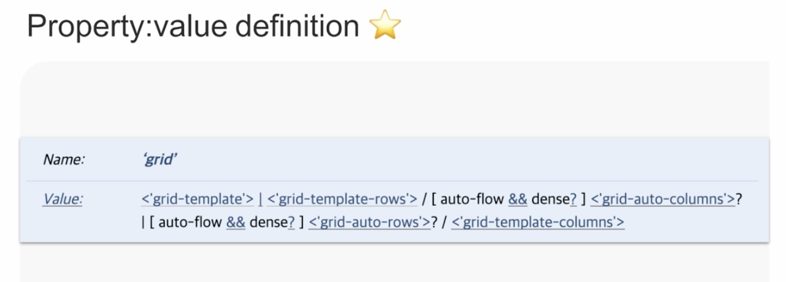
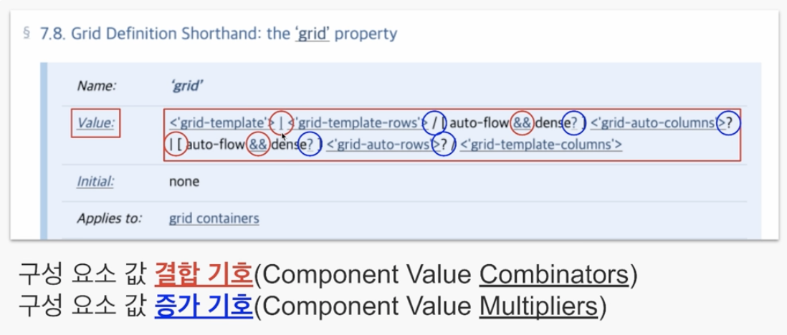
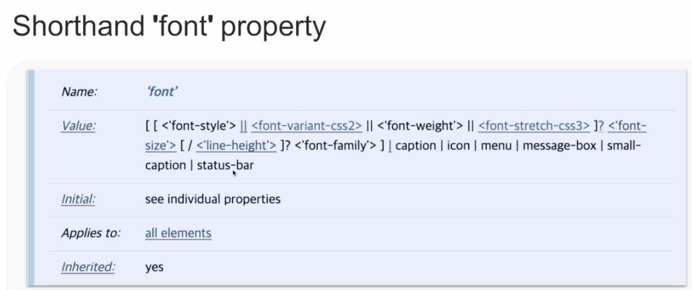
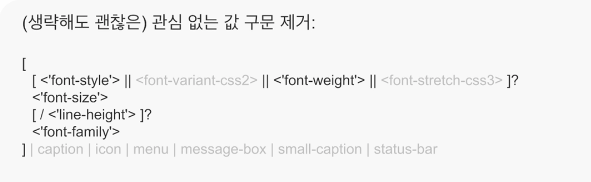
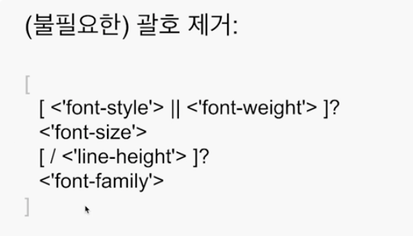
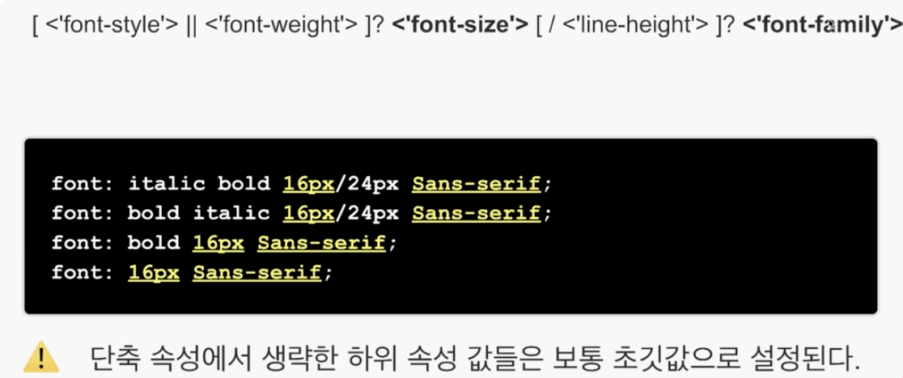

# CSS가 어려운 이유.md

## CSS가 어렵다면
 - 시행 착오에 의존하고 요행을 바라기 때문
 - 문제를 해결했지만 원인을 모름

## CSS 오해
 - 배우기 쉽다?
 - 심플하다?
    ```
        p {
            color: red;
        }
    ```
     - p
       - selector
     - color
       -  property
     - red 
       -  property value
     - color : red
       - declaration
   - CSS는 선택자와 속성과 값으로 구성되어 있다?
   - 구글 검색 키워드에 css float hack 검색 시 검색결과 약 4,560,000개 (0.45초)
 
## CSS 명세 참고
 - 바둑 복기와 같음

## Value definition syntax (값 정의 구문)
   - CSS 속성의 유효한 값과 순서
   - 
   - 
   - Value
     - |(파이프라인 구분자): Only 의미
     - 규칙
       - 이것들을 모두 다 작성해야 하는 건지
       - 또는 이 중에서 어떤 건 작성해야 하고
       - 어떤 건 작성하면 안되는지
       - 순서를 유지하면서 작성을 해야 하는지
       - 순서가 바뀌어도 상관 없는지
       - 한 번만 등장할 수 있는건지
       - 여러 번 반복해서 적어도 되는지
   - Values Types
     - 유효한 값 형식 (keywords)
       - 예약된 단어이다.
            ```
                Ex) initial, inherit, unset, block, inline, inline-block, auto, disc, collapse, separate
            ```
       - 따음표 없이 사용
       - 대소문자 구별 안됨
     - <*> 기본 자료형
       - `<string>`: 문자열, 따음표('', "")로 구성
       - `<url>` : url() 함수
       - `<integer>` : 정수
       - `<number>` : 실수
       - `<percentage>` : 백분율(%)
       - `<length>` : 길이
       - `<position>`: 위치(left, center, right, top, bottom, px, %...)
       - `<color>` : 색상
       - `<image>` : 이미지(`<url>`|`<gradient>`)
       - `<angle>` : 각도(deg, ...)
       - `<time>` : 시간(s, ms)
       - `<custom-ident>` : 작성자 정의 임의 식별자. 대소문자 구별
       - `<ratio>` : 비율(너비/높이)
       - `<freqency>` : 빈도(Hz, kHz)
       - `<resolution>` : 해상력(dpi, dpcm, dppx)
     - `<*>` vs `<'*'>`
       - 따음표가 없으면 기본 자료형
       - 따음표가 있으면 그 이름의 속성 값을 참조
       - 예
         - `<absolute-size>`
            - 기본형 `[ xx-smal | x-smal | small | medium | large | x-large | xx-large ]` 
         - `<'grid-template'>`
           - grid-template 속성의 value 형식을 참조. 보통 단축 속성 값 정의 구문에 등장

## Combinators / Multipliers (조합자와 증가기호)

 - 구성 요소 값 결합 기호(Component value Combinators) - 빨간색 글자
   - 종류 
     1. 공백 (and) : 둘 이상의 값이 필수. 순서 유지 필수. 
     2. && (and) : 둘 이상의 값이 필수. 순서 변경 가능.
     3. || (or) : 두 값 중 하나 이상 필수. 순서 변경 가능.
     4. | (only) : 두 값 중 하나만
     5. [] (group) : 그룹
   - 우선순위는 공백이 가장 높고, group이 가장 낮음
   - 예제
     - a b | c d 
       - 결과 : [a b] | [c d]
     - a b | c || d && e f
       - [a b] | c || d && [e f]
       - [a b] | c || [d && [e f]]
       - [a b] | [c || [d && [e f]]]
       - 참고
         - 우선 순위에 따라 '공백 -> && -> || -> |' 순서로 그룹핑하면서 해석하면 된다. 
 - 구성 요소 값 증가 기호(Component value Multipliers) - 파란색 글자
   - 종류
    1. `*` : 횟수 제한 없음. 0~무한대 가능
    2. `+` : 1회 이상
    3. `?` : 0회 또는 1회
    4. `{A}` : 정확히 A회
    5. `{A,B}` : 최소 A회, 최대 B회
    6. `{A,}` : 최소 A회 필요, 최댓값 무제한
    7. `#` : 1회 이상. 값을 콤마(,)로 분리. 횟수 제한 가능.
        - 예시 : `<length>#{1,4}` // length 값을 최소 1회에서 4회까지 선언 가능
    8. `[]!` : 그룹에서 적어도 1회 이상
   - 주의
    - 반복 제한 횟수보다 많은 값을 선언하면 무시됨
 - font 예제
  - 
      1. (생략해도 괜찮은) 관심 없는 값 구문 제거
          
      2. (불필요한) 괄호 제거
          
      3. 
        - (주의) 단축 속성에서 생략한 하위 속성 값들은 보통 초깃값으로 설정된다. 
