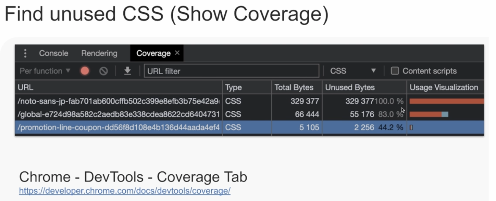

# CSS의 절대 권력, 초기화
 - CSS 리셋이 필수?
 - CSS 리셋 활용법

## reset.css
 - Eric A. Mayer가 작성
 - 1kB
 - 마지막 업데이트 2011년 

## normalize.css 
 - 1.3kB
 - 마지막 업데이트 2018년

## overidden / unused CSS
 - reset.css

   - 현재 시점에서 굳이 선언하지 않아도 되는 스타일이 대부분
   - 사용하지 않는 CSS, 그냥 덮어쓰기 되는 CSS가 대부분

  - html
    - 자주 쓰는 css는 개발자들이 덮어씀 
  - hr, pre
    - 자주 쓰는 태그가 아님에도 css 적용함

 - base.css에서 작성한 코드가 덮어쓰기 되는 경우가 굉장히 많다.

## Universal selector * reset (Do not)

 - 처음에는 편해보이나, 스타일 오버라이드 및 불필요한 모든 스타일을 모두 적용해야 한다.

## Find unused CSS (Show Coverage)

 - Chrome - DevTools
 - Mac : Cmd + Shift + P + coverage
 - Win : Ctrl + Shift + P + coverage

 - Usage Visualization
 - Category CSS로 설정
 - 혹은 해당 페이지에서 사용하지 않는 CSS 
 - 또는 CSS 코드 위치 파악 가능
 - 주의
   - @font-face 규칙은 사용 중임에도 unused CSS 로 출력 중

## CSS reset reinvent (필수)

   - 보통 브라우저
     - 공백 없이 길게 나열된 1byte 문자열들이 레이아웃을 깨는 그런 문제가 있다.
     - (웹 브라우저 버그가 아님) 공백없이 111을 길게 작성 시, 문자열을 하나의 단어로 인식하므로 중간에 자르거나 줄바꿈을 하지 않는다.
   - 개선
     - overflow-wrap: break-word    
        - overflow 시(box 끝에서) 단어를 중간에 잘라서 wrap 함
        - 단점
          - 한국어(중국어, 일본어 등)도 강제로 줄바꿈함
          - 예시
            - 대한 (다음줄) 민국 
              - 굉장히 어색함
         - 특정 언어의 중간을 짜르지 않게 하려면
           - :lang(ko) { word-break: keep-all }  
             - CJK 문화권 언어는 단어가  중간에서 줄바꿈을 막아줌

 - 리셋 스타일을 선언해서 사용하고 있는 이미지 태그
 - 이미지는 항상 웹페이지보다 클 수도 있다.
 - 웹 페이지의 너비가 1000픽셀 안되더라도 이미지는 2000픽셀 넘는 경우가 많다.
 - 적절하게 최대 너비 제안하지 않으면 항상 레이아웃을 깬다
 - 해결법
   - max-width : 100% 
   - height: auto
   - 삽입된 영역 폭 이상으로 이미지가 늘어나지 않음

 - class에 의한 리셋
 - CSS 리셋에서 기본 HTML 요소의 스타일을 개발자가 임의로 상당히 많이 재정의하는 것을 조심하자
 - 가급적이면 class라는 요소를 가진 요소만 리셋 시키자
 - 사용자가 위지윅 에디터를 통해 작성한 스타일이나 에디터는 최대한 유지시키자
 - 예시
   -  위지윅 에디터에 글을 작성시, 다른 곳에서 가져온 글을 복사해서 그대로 붙여넣기 시 기존 복사해서 가져다 놓은 그 스타일이 이 웹 사이트의 스타일과 충돌하지 않아야 한다. 
      -  복사붙여넣기 스타일이 달라지면 html에 reset 스타일을 선언해서이다.
 - 단점
   - list-style 및 border를 초기화한다. 하지만 모든 요소가 list-style 및 border를 가지지는 않는다. (과도하다.)
 - 개선  
    
    - where라는 가상 클래스 선택자를 사용한다.
    - where 가상 클래스 선택자
    - 괄호 안에 선택자를 넣어서 사용 가능 
    - 선택자 정수, 선택자 특이성을 증가시키지 않는 특징
    - 필요한 범위에 스타일 적용  
    - 예
        - where (ol , ul)
        - ol, ul 중 class 속성에 들어간 것을 찾는 선택자
    - is 가상 클래스 선택자
    - is는 선택자 특이성을 증가시킨다
    - where , is 가상 클래스 선택자 단점
    -  삼성 인터넷 브라우저에서 미지원

## 참고 
 - https://fastcampus.app/courses/204706/clips/315266?organizationProductId=2978 The RED : 견고한 UI 설계를 위한 마크업 가이드 by 전찬명 