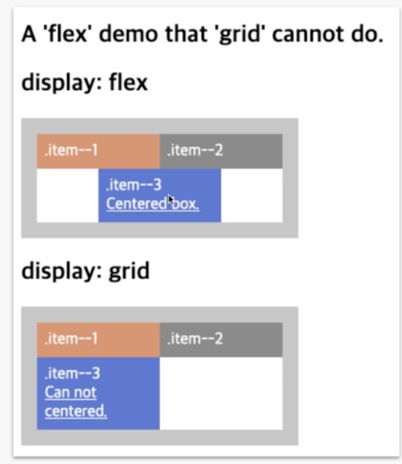
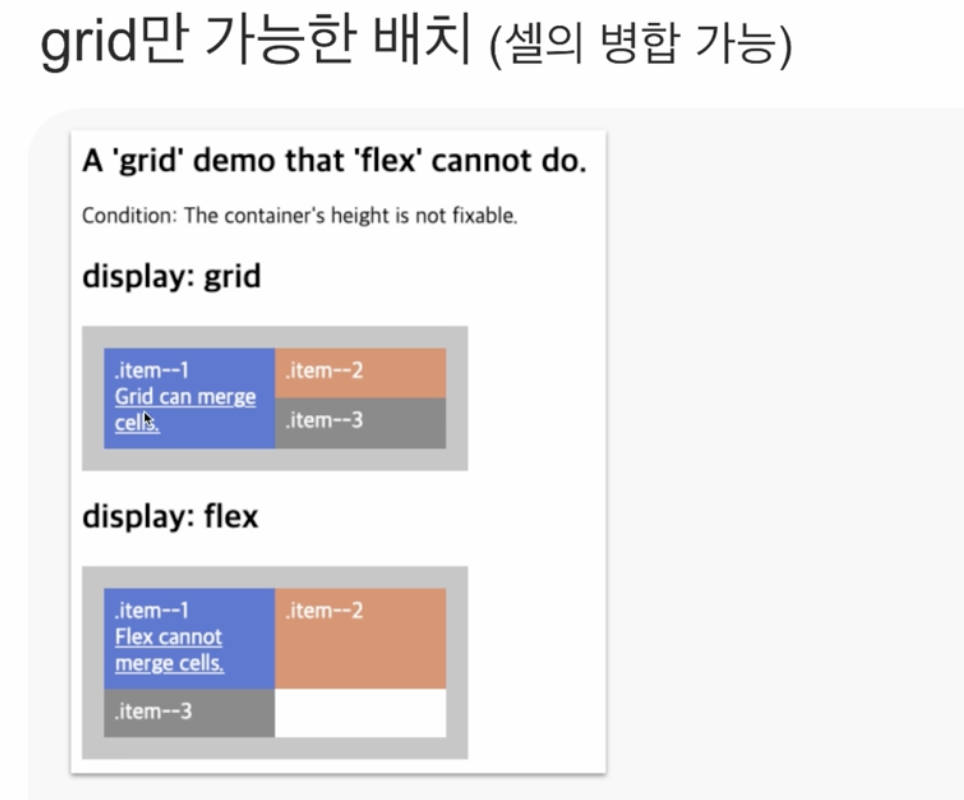

# 레이아웃, 배치의 비밀

## DISPLAY
 - default
    1. inline
    2. block
    3. inline-block
    4. none 
 - Lv3
   - flow-root
   - flex
   - gird
   - contents

## CHANGED DISPLAY
    ```
        position : absolute | fixed
        float : left | right

        display: block // changed display
    ```
     - display 속성이 변경된다는 것은 가로로 배치되던 요소가 수직으로 배치가 바뀐다는 의미
     - CSS Lint 사용 시 해당 코드에 대한 오류를 보고

## display : inline
 - 흐름 방향 : 수평
 - 너비 : X
 - 높이 : X
 - 수평 마진 : O
 - 수직 마진 : O
 - 수평 패딩 : O
 - 수직 패딩 : O (X)
   - 패딩 적용은 가능하나, 패딩이 다른 요소를 밀어내지는 못한다
   - 다른 요소와 겹쳐진다

## display : block
 - 흐름 방향 : 수직
 - 너비 : O
 - 높이 : O
 - 수평 마진 : O
 - 수직 마진 : O (중첩)
   - 마진 병합
 - 수평 패딩 : O
 - 수직 패딩 : O

## display : inline-block
 - 흐름 방향 : 수평
 - 너비 : O
 - 높이 : O
 - 수평 마진 : O
 - 수직 마진 : O (중첩X)
 - 수평 패딩 : O
 - 수직 패딩 : O

## display : none
 - 어떤 장치도 표시하거나 접근할 수 없음
    1. 화면
    2. 인쇄
    3. 보조공학기기
    4. 마우스
    5. 키보드
    6. ...

## display: none vs `[hidden]`
    ```
        .hidden {display: none}
        
        // ==

        <p class="desc" hidden>
    ```

## display Module Lv3
  - 종류
    1. flow-root
    2. flex
    3. grid
    4. contents

## display : flow-root
 - 블록 컨테이너가 된다.
 - 포함하는 콘텐츠는 새 블록 형식 문맥(block formatting context)이 된다.
 - float, margin 속성을 다르게 처리
 - 
 - 블록이 된다.
 - 포함한 float 요소는 컨테이너 끝에서 clear 된다.
 - 부모-자식 요소의 수직 마진을 병합하지 않는다.

## dislay : flex
 - flex 컨테이너 박스를 생성한다.
 - flex 형식 문맥을 설정한다.
 - 포함 아이템을 1차원 기반으로 배치


## display : grid
 - grid 컨테이너 박스를 생성한다.
 - grid 형식 문맥을 설정한다.
 - 포함 아이템을 2차원 기반으로 배치


## position : static
   - 사용 할 수 없는 요소
     - left, right, top, bottom, z-index
   - 배치 기준 없음.
   - 흐름에 따라 배치
   - 주변 형제 노드들과 겹치지 않는 흐름을 만들면서 차곡차곡 배치가 되는 그런 특징

## position : relative
 - 사용 할 수 있는 요소
   - left, right, top, bottom, z-index, inset
 - 박스의 현재 위치가 배치의 기준
 - 배치를 변경 할 때 다른 박스의 흐름을 깨지 않음
 - 자식 또는 자손 요소의 absoilte 배치 기준이 됨

## position :absolute
 - left, right, top, bottom, z-index, inset
 - 일반적인 흐름에서 완전히 이탈
 - 부모, 형제의 크기나 위치에 전혀 영향을 미치지 않음
 - 조상 박스가 relative, absolute, fixed, transform 일 때, 조상 기준으로 배치

## position : fixed
 - left, right, top, bottom, z-index, inset
 - 뷰포트가 배치 기준
 - 조상 요소에 transform 속성이 있으면 transform 속성이 있는 요소가 배치 기준

## position :sticky
 - left, right, top, bottom, z-index, inset
 - 스크롤 포트가 배치 기준
 - 부모 요소가 스크롤 포트에 보이는 동안 스크롤 포트 기준으로 고정
 - 부모 요소가 스크롤 밖으로 이탈하면 고정을 멈춤