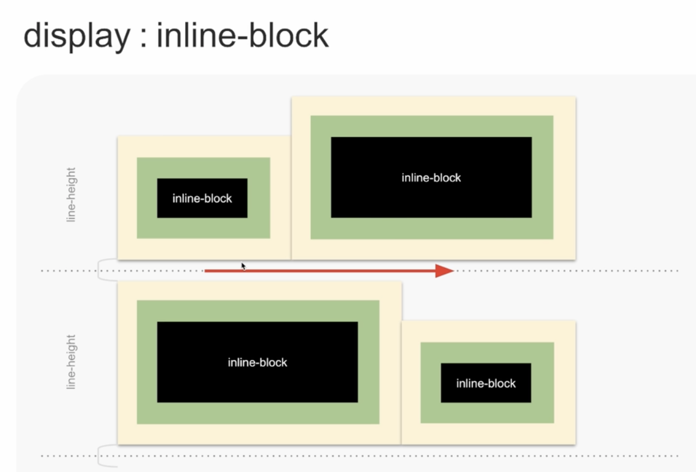

# 레이아웃, 배치의 비밀

## DISPLAY
 - default
    1. inline
    2. block
    3. inline-block
    4. none 
 - Lv3
   - flow-root
   - flex
   - gird
   - contents

## CHANGED DISPLAY
    ```
        position : absolute | fixed
        display: block // changed display
    ```
    ```
        float : left | right
        display: block // changed display
    ```
     - display 속성이 변경된다는 것은 가로로 배치되던 요소가 수직으로 배치가 바뀐다는 의미
     - position: absolute | fixed 또는 float : left | right 시 굳이 display: block 코드를 추가 할 필요가 없다.
     - (강추) CSS Lint 사용 시 해당 코드에 대한 오류를 보고

## display : inline
 - 흐름 방향 : 수평
 - 너비 : X
   - 왜 X?
     - 형제 요소와 최대 밀접한 수평 배치를 위해서?
     - 예시) span
 - 높이 : X
   - 왜 X?
     - y좌표 상 아래에 배치된 요소와 최대 밀접하기 위해서?
     - 예시) span
 - 수평 마진 : O
 - 수직 마진 : X
   - 왜 X?
     - y좌표 상 아래에 배치된 요소와 최대 밀접하기 위해서?
     - 예시) span 
 - 수평 패딩 : O
 - 수직 패딩 : O (X)
   - 패딩 적용은 가능하나, 패딩이 다른 요소를 밀어내지는 못한다
   - 다른 요소와 겹쳐진다
     - 의문
       - y좌표 상 아래에 배치된 요소와 최대 밀접하기 위해서?
       - 예시) span 


## display : block
 - 흐름 방향 : 수직
 - 너비 : O
 - 높이 : O
 - 수평 마진 : O
 - 수직 마진 : O (중첩)
   - 마진 병합
 - 수평 패딩 : O
 - 수직 패딩 : O

## display : inline-block
 - 흐름 방향 : 수평
 - 너비 : O
 - 높이 : O
 - 수평 마진 : O
 - 수직 마진 : O (중첩X)
 - 수평 패딩 : O
 - 수직 패딩 : O

  - line-height 속성에 영향 받음

## display : none
 - 어떤 장치도 표시하거나 접근할 수 없음
    1. 화면
    2. 인쇄
    3. 보조공학기기
    4. 마우스
    5. 키보드
    6. ...

## display: none vs `[hidden]`
  ```
        .hidden {display: none}
        
        // ==

        <p class="desc" hidden>
  ```
  - hidden 속성 추천
    - 단점
      - 보조공학기기, 검색 엔진에서 감지 못함

## display Module Lv3
  - 종류
    1. flow-root
    2. flex
    3. grid
    4. contents

## display : flow-root
 - 블록 컨테이너가 된다.
   - 의문
     - 블록 컨테이너?
 - 포함하는 콘텐츠는 새 블록 형식 문맥(block formatting context)이 된다.
   - 의문
     - 새 블록 형식 문맥?
        - 답) https://www.zerocho.com/category/CSS/post/60c08014ab70630004587a03 
 - float, margin 속성을 다르게 처리
 - 블록이 된다.
 - 포함한 float 요소는 컨테이너 끝에서 clear 된다.
 - 부모-자식 요소의 수직 마진을 병합하지 않는다.

 - float is clear section
   - block
     - gray : container
       - 흐름에서 벗어난 container item 높이를 반영하지 않고 높이가 축소(?) 됨
     - float : container item
       - 흐름에서 벗어남
   - flow-root
     - gray : container
       - float 된 영역의 높이를 감지해서 container 높이에 반영 (float을 해제한다)
     - float : container item
       - 흐름에서 벗어남
 - vertical margin not collaped
   - black
     - 부모 자식 간의 수직 마진을 중첩
   - flow-root
     -  부모 자식 간의 수직 마진을 중첩하지 않는 특징
## dislay : flex
 - flex 컨테이너 박스를 생성한다.
 - flex 형식 문맥을 설정한다.
 - 포함 아이템을 1차원 기반으로 배치

 - flex는 격자에 구애받지 않음
## display : grid
 - grid 컨테이너 박스를 생성한다.
 - grid 형식 문맥을 설정한다.
 - 포함 아이템을 2차원 기반으로 배치

 - grid는 셀의 병합 가능

## CSS 배치 코드 간결함 비교

 - 의문
   - 코드량 말고 코드 실행 속도에는 영향이 없을까?
## position : static
   - 배치 요소가 없음
   - 사용 할 수 없는 배치 요소 
     - left, right, top, bottom, z-index
   - 주변 형제 노드들과 겹치지 않는 흐름을 만들면서 차곡차곡 배치가 되는 그런 특징 (흐름에 따라 배치)

## position : relative
 - 배치 요소가 있음
   - left, right, top, bottom, z-index, inset
 - 박스의 현재 위치가 배치의 기준
 - 배치를 변경 할 때 다른 박스의 흐름을 깨지 않음
 - 자식 또는 자손 요소의 absoilte 배치 기준이 됨
  - 배치를 변경할 때 다른 박스의 흐름을 깨지 않는다
   - A박스와 B박스 시 B박스 포지션이 relative && bottom: 100px 시 bottom으로 100px 위로 이동 시, 이 박스는 박스를 밀어내면서 움직이는 게 아니라, 다른 박스에 영향을 주지 않고 스스로만 움직인다

## inset
 - top, right, bottom, left을 한번에
 - 4개의 값을 length percentarge 값으로 작성 가능
 - 1개 작성 = 4곳 같은 값
 - 활용
   -  absoulte && inset 0 && margin : out
      -   화면 한가운데 배치
## position :absolute
 - left, right, top, bottom, z-index, inset
 - 일반적인 흐름에서 완전히 이탈
 - 부모, 형제의 크기나 위치에 전혀 영향을 미치지 않음
 - 조상 박스가 relative, absolute, fixed, transform 일 때, 조상 기준으로 배치

## position : fixed
 - left, right, top, bottom, z-index, inset
 - 뷰포트가 배치 기준
 - 조상 요소에 transform 속성이 있으면 transform 속성이 있는 요소가 배치 기준

## position : sticky
 - left, right, top, bottom, z-index, inset
 - 스크롤 포트가 배치 기준
 - 부모 요소가 스크롤 포트에 보이는 동안 스크롤 포트 기준으로 고정
 - 부모 요소가 스크롤 밖으로 이탈하면 고정을 멈춤
 - 필요 조건
  1. 스크롤 포트라고 불리는 스크롤 바가 있는 박스가 하나 필요
  2. 그 안에 자신이 스크롤 포트 안에 자기 자신이 필요
  3. 스크롤 포트 감싸는 부모 요소가 하나 더 필요

## z-index

 - z-index는 부모 z-index 보다 높을 수 없다

## 참고 
 - https://fastcampus.app/courses/204706/clips/315274?organizationProductId=2978