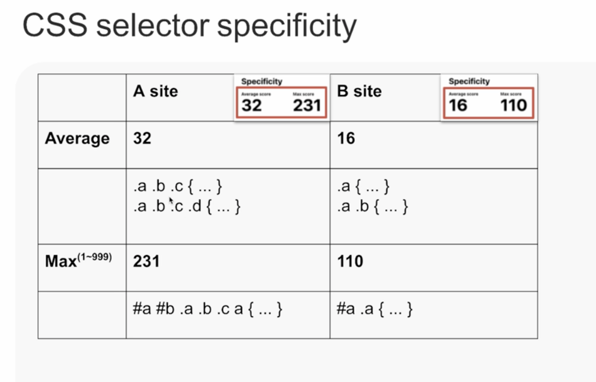
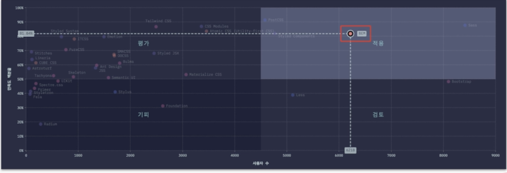
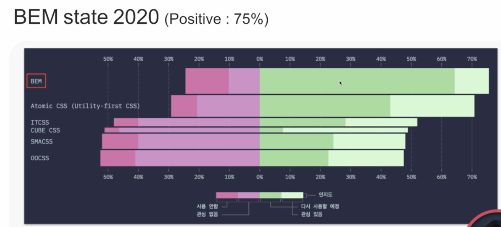
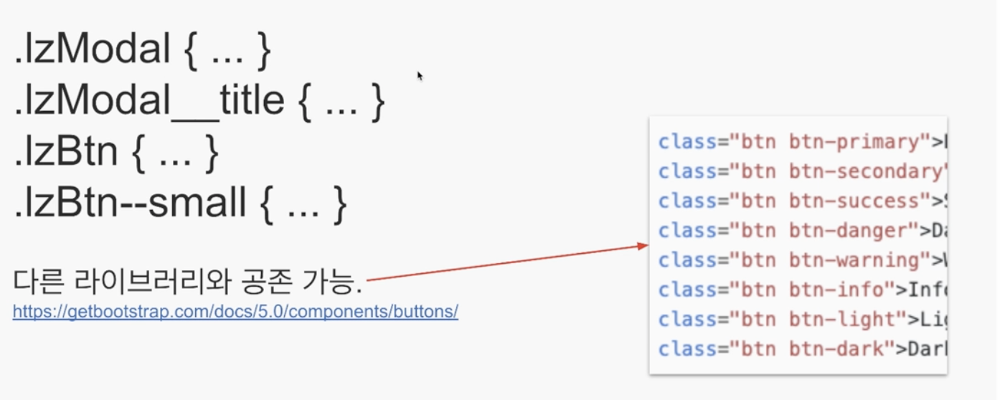
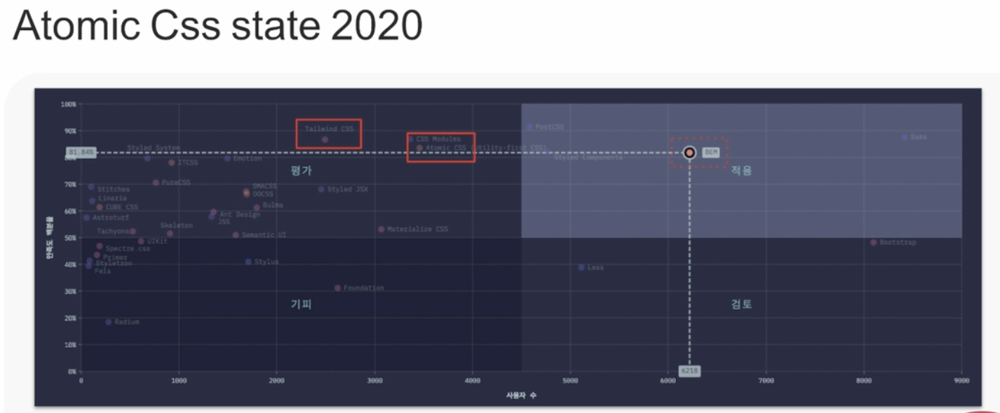

# 웹은_덩어리와_구성요소와_변형의_반복(집합)으로_이루어져_있다
 - css 네이밍 이슈
   -  선택자의 이름을 정하고, 선택자의 중첩 규칙을 정해서 사용하고, 관리하는 부분
 - BEM 사용 시 대규모 CSS 사용 가능  

## Naming things
 - `컴퓨터 과학에는 두 가지 난제가 있다. 캐시를 무효로 만드는 것과 작명 by Phil Karlton`

## 작명 규칙을 잘못 관리한 사례
 1. 의미를 파악할 수 없는 작명
  ```
    .bx { ... }
    .cnt { ... }
    .mt { ... } 
  ```
2. 전역 공간을 선점한 흔한 이름
  ```
    .content { ... }
    .button { ... }
    .top { ... }
  ```
   - 해당 class명을 다음에 다시 쓸 수 없다.
3. 선택 규칙을 잘못 관리한 사례
  ```
    reset.css
    a { text-decoration: none; }

    local.css
    .module a { text-decoration : underline; }
    #special.module a {text-decoration:none};
    #another#special.module a { text-decoration: underline }
  ```
   - a tag reset 진행 
     - 기본적으로 밑줄 존재
   - local.css 에서는
     - text-decoration을 none과 underline을 자주 바꿈 (reset css를 한 상태에서마저도..)
     - 선택자의 깊이가 점점 깊어짐.
     - 선택자의 특이성이 점점 높아짐.
     - 이 코드를 덮어쓰려면 더 길고 구체적인 선택자가 필요 === CSS 관리는 어둠속으로 빠진다.

## CSS selector specificity (선택자 우선순위 규칙)
 - `id` : 100, 특이상 높음
 - `class`, `[attr]`, `:class` : 10, 특이성 중간
 - `type`, `::element` : 0, 특이상 가장 낮음
 - 특이성 높음 === 우선순위 높음
 - 우선순위를 높여 놓으면, CSS 선택자의 우선순위를 높여 놓으면 그 선태자를 덢어쓰기 하기 위해서는 더 강한, 더 높은 선택자를 쓰게 되고, 그 경우 선택자는 점점 길어지게 된다.
 - 선택자를 간결하게 유지하는 기법을 사야해야 함
 - 즉, 선택자 우선순위 규칙을 알아야 한다.
 - 020 이하로 유지하는 것이 CSS 선택자를 관리하고 CSS 코드를 관리하는 데 좋다.
 - 예시
    ```
        a : 0, 0, 1 => 001
        .a : 0, 1, 0 => 010
        #a : 1, 0, 0 => 100
        #a a : 1, 0, 1 => 101
        #a.a.a : 1, 1, 1 => 111
        #a#b[href]::before : 2, 1, 1 => 211
    ```
 - 참고
   - cssstats.com 
   -  

## BEM state 2020 (satisfaction: 81.84%)
  
 - 현존 웹 사이트에서 많이 사용하고
 - 많은 개발자가 높은 만족도를 가짐
 - SASS, Bootstrap 다음으로 많이 사용


## BEM 
 - 명명 규칙
   - B (block)
     - 재사용 가능한 독립적인 블록
   - E (element)
     - 블록을 구성하는 종속적인 하위 요소
     - 엘리먼트는 무조건 블록에 종속
   - M (modifier)
     - 블록 또는 요소의 변형(모양,상태,동작)
 - 특징
    1. 의미론적 클래스 선택자 작명 규칙 (약어 사용 지양)
    2. 다른 형식의 선택자 사용을 제한 (__,-- 외)
    3. 전역에서 유일한 이름 권장
    4. 낮은 선택자 특이성 유지
        - BEM state 2020 섹션 참고
    5. HTML/CSS 연결이 느슨. 병렬 개발 가능
        - style은 css에서 처리
        - 의미만 html에서 다룬다.
        - html, css 병렬 개발 가능 (퍼블리셔에 유리)
        - 리액트 개발의 경우 styled component등은 프론트엔드 개발자가 js를 통해 개발하므로 퍼블리셔와 협업시 불리, 새로 개발자가 온 경우 css 파일을 통해 css 파악보다 js 코드를 봐야 스타일 파악 가능
 - 명명 규칙2
  1. 두 개의 언더바(__)는 하위 요소를 의미
  2. 두 개의 하이픈(--)은 상태 변형을 의미
  3. 하나의 이름에 요소, 변형은 각 한 번만 허용

 - 명명 규칙 예시
   ```
    .block { ... }
    .block__element { ... }
    .block__element--modifier { ... }
    .block--modifier { ... }
   ```
    - 구분자(__, --)로 분리한 1~3개의 설명자 형식 외 다른 형식을 허용하지 않음.
 - 선택 사항 : 키워드 연결 방법
    1. PascalCase
    2. **camelCase**
    3. kebab-case
    4. sanke_case
 - 응용 예제
  - 이름 공간을 위한 접두어 사용 추천, camelCase 사용 예시
    ```
        .lzModal { ... }
        .lzModal__title { ... }
        .lzBtn { ... }
        .lzBtn--smal { ... }
    ```
     - Modal로 작명 시 부트스트랩의 Modal과 겹쳐진다.
     - lz등을 붙인다.
  - 다른 라이브러리와 공존 가능
     
  
  - BEM Example (good)
    - '블록'이 요소 또는 변형을 반드시 요구하는 것은 아니다.
        ```
            //단순 블록
            <button class="btn">
        ```
    - '변형'은 블록 또는 요소의 스타일을 확장한다.
        ```
            //변형 추가
            <button class="btn btn--submit>
            <em class="info__label info__label--warning">
        ```
  - BEM Example (bad)
    - '변형' 클래스 단독 사용 불가. 항상 블록 또는 요소와 함께 사용
        ```
            // 잘못 사용 중
            <button class="btn--submit">

            // 제대로 사용 중
            <button class="btn btn--submit">
            <em class="info__label info_label--warning">
        ```
    - '선택자 특이성'이 높아지는 중첩 구조, 타입 선택자는 안티 패턴
        ```
            // 잘못 사용 중
            .photo {} /* 특이성 10 */
            .photo img {} /* 특이성 11 */
            .photo figcaption {} /* 특이성 11 */
        ```
          - 타입 선택자는 가급적 피하자
          - photo라는 블록 안에 img 또는 figcaption을 자식요소로 사용 시 다음에는 photo의 자식 요소로 또 다른 형태의 img나 figcaption은 더이상 사용하지 못한다.
            - 만약 사용한다면 덮어쓰기만 가능
            - 결론 : class 이름의 BEM 사용 추천
            - 개선
                ```
                    .photo {} /* 특이성 10 */
                    .photo__img {} /* 특이성 10 */
                    .photo__caption {} /* 특이성 10 */
                ```
    - 블록/요소 이름 생략 금지. 요소/변형 이름 중복 금지.
        ```
            // 잘못 사용 중
            .__elem { ... } /* 블록명 생략하는 잘못 */
            .--modi { ... } /* 요소명 생략하는 잘못 */
            .block__elem1__elem2 { ... } /* 블록 이름으로 엘리먼트 이름을 두번이나 작성하는 잘못 */
            .block--modi1--modi2 /* 두번 연달아 modi 작성 불가 */ 
        ```

## Atomic / Utility First CSS
 ```
    <button class="w-1/2 flex items-center justify-center rounded-mod bg-black text-white">Buy now</Button>
 ```
  - 해당 예제는 Tailwind css 네이밍 사용 
  - HTML을 작성하는 사람이 반드시 CSS 개발도 같이 해야만 한다
  - 특징
    1. 라이브러리 타입으로 빠른 스타일 구축 가능
    2. 다른 방법론과 함께 사용 가능 (부트스트랩, BEM 등)
    3. 스타일 관점의 작명. 의미론을 사용하지 않음
        - 클래스 명을 봐서는 의미 추측 불가능
    4. HTML 코드에 스타일이 강하게 연결됨
    5. HTML/CSS 병렬 개발 불가능. 소규모 팀 또는 단일 엔지니어 개발에 적합
  - 참고
    
 
## 참고 
 - https://fastcampus.app/courses/204706/clips/315266?organizationProductId=2978 The RED : 견고한 UI 설계를 위한 마크업 가이드 by 전찬명 