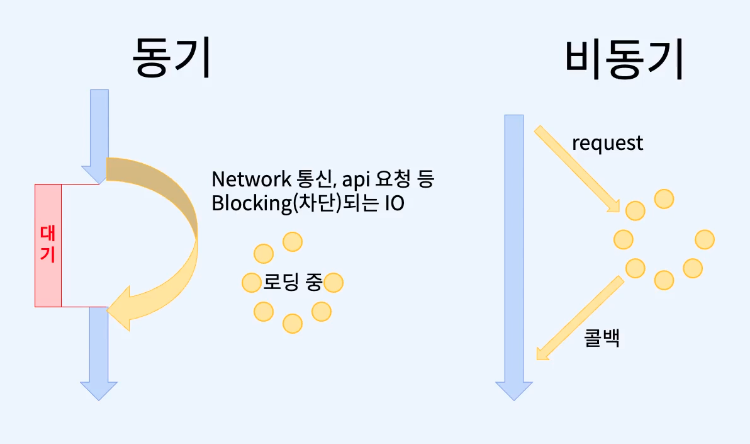

# 비동기
 - 
 - 이전까지 동기식으로 동작해왔다.
 - 함수를 호출하면 리턴값을 기다리고, 계산을 끝날 때까지 기다린다.
 - CPU로 계산하는 함수가 아닌 외부 요청(네트워크 요청 포함)은 어떻게 해야할까?
   - 이 경우 CPU가 마냥 기다려야 할까?
   - 비동기를 통해 해결해야 한다.
 - 비동기는 요청을하고 나면 이벤트가 독자적으로 실행 될 수 있게 해준다.
 - 이를 통해 메인 프로그램은 계속 실행이 된다.
 - 비동기의 단점은 디버깅이 상대적으로 어렵다.
 - 

## 이전 복습
 - 맥락과 부수효과의 추상화
   - 값이 몇 개인지 모른다
     - `Array<A>에 대해서map :: (a=> b) => F<A> => F<B>`
   - 실패해서 값을 얻을 수 없다.
     - `Option<A> 또는 flatMap:: (A => F<B>) => F<A> => F<B>`
   - 실패해서 값 대신 에러가 있을 수 있다.
     - `는 Try<E,R> 또는 flatMap:: (A => F<B>) => F<A> => F<B>`

## 콜백 지옥?
 - 