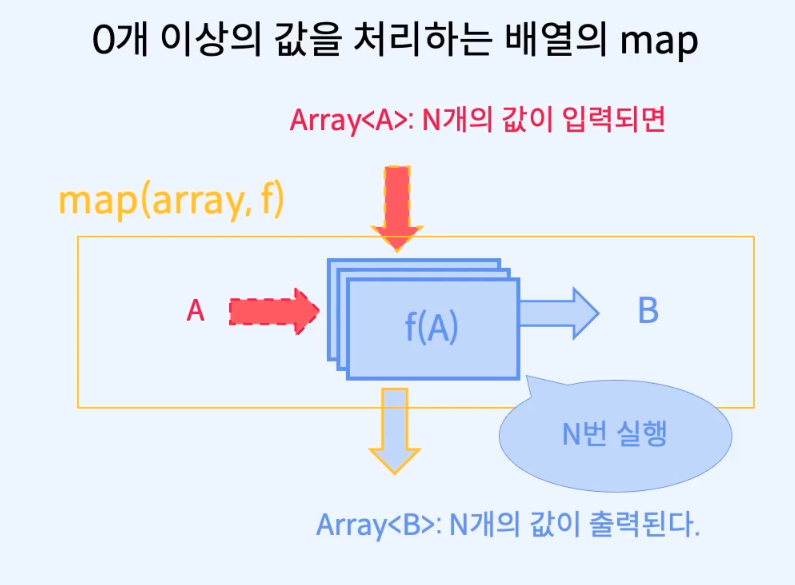
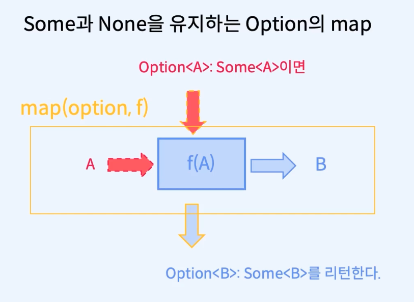
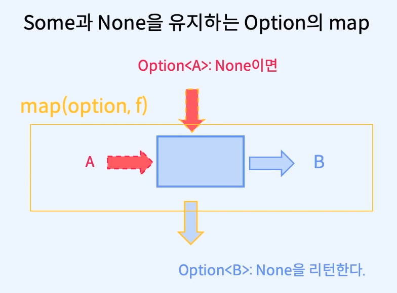
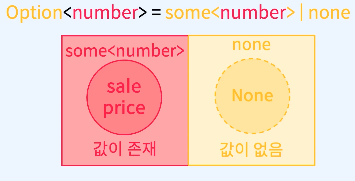
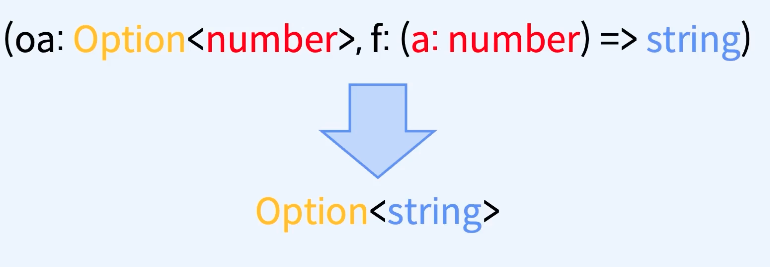
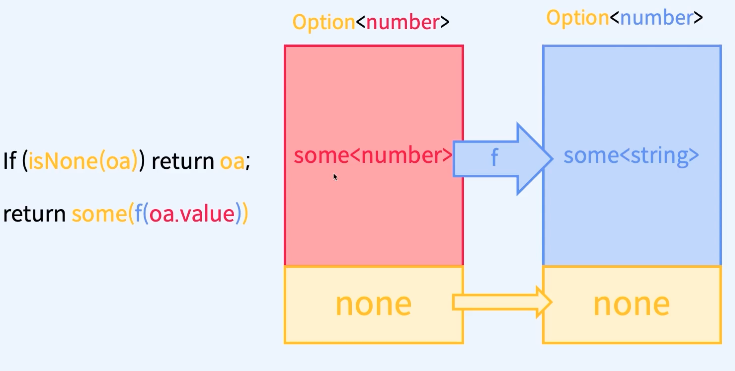
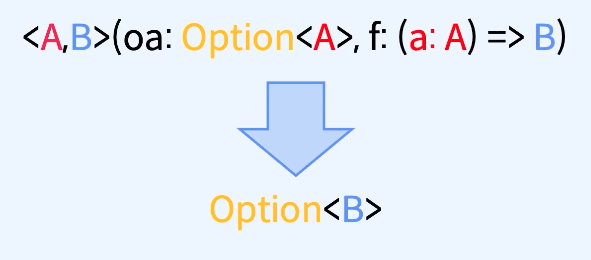
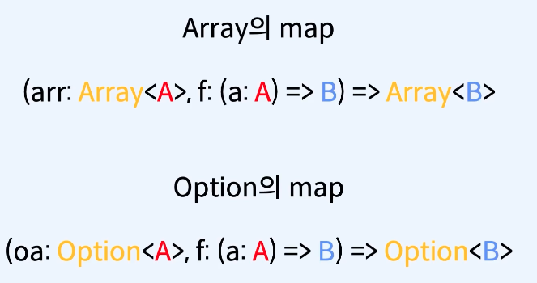
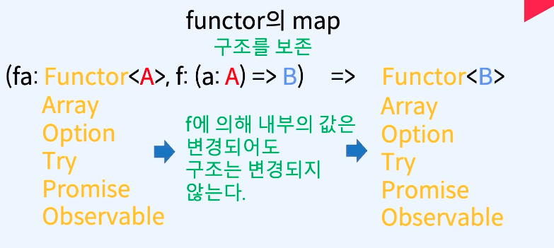

# 함수형 프로그래밍과 에러처리 1 - Option 없을 수도, 실패할 수도 있는 값

## 입력에 대응하는 출력이 없을 때
 - 의문
     - 주어진 인자에 대응되는 반환 값이 없으면 이전에는 어떻게 해왔나? 
 - 답
     - 타입에 포함된 임의의 값을 대신 반환하기
     - 타입 예시
       -  -1
       -  0
       -  null
       -  undefined
       -  Infinity
       -  NaN
       -  etc..
    - 예시
      - indexOf 함수가 인덱스를 찾지 못한 경우 -1을 반환
        - ```
                const arr =["apple", "banana", "strawberry"]; 
                arr.indexOf('Onion'); // -1 리턴 
          ``` 
        - 의문
          - -1을 리턴하는 게 옳은가?
      - 입력에 대응되는 계산이 불가능할 때
        - ```
            const div =(a,b) => a/b;

            div(10,5) //2 출력

            div(10,0) // 0으로 나누어질 수 없으므로, Infinity 출력

            div(0,0) //0을 0으로 나누는 것은 의미가 없으므로, NaN 출력
          ```
            - 프로그래밍 언어가 0을 제외한 모든 숫자를 허용하는 타입을 만드는 것은 쉽지가 않다.
            - 실제로 나누기 연산의 결과에 대한 타입을 만드는 방식으로 NaN과 관련된 타입을 만드는 것보다,
            - 입력값은 0을 허용하되, 이 입력값이 허용되지 않음을 값으로 돌려주어야 한다.
            - 이런 구현은 언어마다 조금씩 다르지만 자바스크립트는 Infinity, NaN를 리턴 시켜서 에러로 취급하게 만든다.
            - 자바스크립트를 기준으로 입력값에 대응하는 출력값이 Infinity, NaN 등 재각각의 여러 값이 존재하므로, 어떤 값이 올바른 출력 값이고, 어떤 값이 부재를 나타내는 값인지 알려면 구현한 맥락을 파악하는 수 밖에 없다.
            - 타입스크립트에서는 이러한 문제를 해결하기 위해 Option을 사용한다.
  - 보완점 부분
    - 순수함수는 정의역의 일부만 처리하는 파셜 펑션일 수 없고, 토탈 펑션이여야 한다.

## if문 살펴보기
 - 목적
     - 장바구니에서 할인 가격을 추가하고, 할인 가격이 존재하는 경우만 각 상품 별 가격에 (XX원 할인) 및 전체 가격에 (총 XX원 할인)을 표기한다.
     - if문을 통한 undefined 처리보다 option을 통한 처리가 더 효율적임을 학습하기 위한 예제이다.
 - 베이스 코드 예제

     - ```
        export interface Item {
            readonly code: string;
            readonly outOfStock: boolean;
            readonly name: string;
            readonly price: number;
            readonly quantity: number;
            readonly discountPrice?: number; // 추가 된 코드
        } 

        export const cart : Array<Item> = [
            {
                code : 'tomato,
                outOfStock: false,
                name: '토마토',
                price: 7000,
                quantity: 2,
                discountPrice: 1000
            },
            ... 생략

          {
                code : 'orange,
                outOfStock: false,
                name: '오렌지',
                price: 15000,
                quantity: 3,
                discountPrice: 2000
            },
        ]

        import {cart, Item} from './cart';

        const stockItem = (item:Item): string => {
            return `
                <li>
                    <h2>${item.name}</h2>
                    <div>가격: ${item.price}원</div>
                    <div>수량: ${item.quantity} 상자</div>
                </li>
            `
        }

        const outOfStockItem = (item:Item): string => {
            return `
                <li class="gray">
                    <h2>${item.name} (품절)</h2>
                    <div class="strike">가격: ${item.price}원 (XX원 할인)</div>
                    <div class="strike">수량: ${item.quantity}상자</div>
                </li>
            `
        }

        const item = (item: Item) : string => {
            if(item.outOfStock) {
                return outOfStockItem(item);
            } else {
                return stockItem(item);
            }
        }

        const totalCalculator = (list: Array<Item>, getValue: (item: Item) => number) : number {
            const result : Array<number> = [];

            list.forEach((function(item)){
                result.push(getValue(item));
            })
        }

        const totalCount = (list:Array<item>): string => {
            const totalCount = totalCalculator(list, (item)=> item.quantity);

            return `<h2>전체 가격 : ${totalCount} </h2>`;
        }

        const totalPrice = (list: Array<item>) : string => {
            const totalPrice = totalCalculator(list, (item)=> item.price * item.quantity);

            return `<h2>전체 가격: ${totalPrice} (총 XX원 할인)</h2>`;
        }

        const list = (list: Array<item>) => {
            let html =""

            for(let i = 0; i < list.length ; i++>) {
                html += item(cart[i]);
            }

            return `
                <ul>
                    ${html}
                </ul>
            `
        }

        const app = document.getElementById('app');
        if(app != null) {
            app.innerHTML = `
                <h1> 장바구니 </h1>
                ${list(cart)}
                ${totalCount(cart)}
                ${totalPrice(cart)}
            `
        }
       ```
        - 문제점
            - 과일의 가격이 1만원을 넘는지 판단하는 isExpensive 및 getPrice함수를 합성하는 함수에서 getPrice가 undefined를 출력하므로 isExpensive가 undefined를 입력받을 수 있게 처리를 해야 했다.
            - 장바구니에 할인 가격 필드를 추가하면서 undefined를 다루는 다른 상황을 살펴본다.
 - 예제 1 / if문을 통해서 개별 함수에서 undefined 처리하기 / stockItem 함수에서 if문을 추가해서, discountPrice가 유효한 경우 해당 정보를 출력함
     - ```
         export interface Item {
            readonly code: string;
            readonly outOfStock: boolean;
            readonly name: string;
            readonly price: number;
            readonly quantity: number;
            readonly discountPrice?: number; // 추가 된 코드
        } 

        export const cart : Array<Item> = [
            {
                code : 'tomato,
                outOfStock: false,
                name: '토마토',
                price: 7000,
                quantity: 2,
                discountPrice: 1000
            },
            ... 생략

          {
                code : 'orange,
                outOfStock: false,
                name: '오렌지',
                price: 15000,
                quantity: 3,
                discountPrice: 2000
            },
        ]

        import {cart, Item} from './cart';

        // 코드 수정된 부분!
        // if문을 추가해서, discountPrice가 유효한 경우 해당 정보를 출력함
        const stockItem = (item:Item): string => {
            let saleText = ``;
            if(item.discountPrice !== undefined) {
                saleText =`(${item.discountPrice}원 할인)`
            }

            return `
                <li>
                    <h2>${item.name}</h2>
                    <div>가격: ${item.price}원 ${saleText}</div>
                    <div>수량: ${item.quantity} 상자</div>
                </li>
            `
        }

        const outOfStockItem = (item:Item): string => {
            return `
                <li class="gray">
                    <h2>${item.name} (품절)</h2>
                    <div class="strike">가격: ${item.price}원 (XX원 할인)</div>
                    <div class="strike">수량: ${item.quantity}상자</div>
                </li>
            `
        }

        const item = (item: Item) : string => {
            if(item.outOfStock) {
                return outOfStockItem(item);
            } else {
                return stockItem(item);
            }
        }

        const totalCalculator = (list: Array<Item>, getValue: (item: Item) => number) : number {
            const result : Array<number> = [];

            list.forEach((function(item)){
                result.push(getValue(item));
            })
        }

        const totalCount = (list:Array<item>): string => {
            const totalCount = totalCalculator(list, (item)=> item.quantity);

            return `<h2>전체 가격 : ${totalCount} </h2>`;
        }

        const totalPrice = (list: Array<item>) : string => {
            const totalPrice = totalCalculator(list, (item)=> item.price * item.quantity);

            return `<h2>전체 가격: ${totalPrice} (총 XX원 할인)</h2>`;
        }

        const list = (list: Array<item>) => {
            let html =""

            for(let i = 0; i < list.length ; i++>) {
                html += item(cart[i]);
            }

            return `
                <ul>
                    ${html}
                </ul>
            `
        }

        const app = document.getElementById('app');
        if(app != null) {
            app.innerHTML = `
                <h1> 장바구니 </h1>
                ${list(cart)}
                ${totalCount(cart)}
                ${totalPrice(cart)}
            `
        } 
       ```
        - 개선사항
          -  각 아이템의 할인에 대한 정보는 출력되나, 할인된 경우 할인된 가격으로 계산되고 있지 않고 원가로 계산되고 있다.
          -  예: 토마토 가격이 7000원인데 1000원 할인되었음에도 여전히 7000원으로 출력되고 있다.
 -  예제 2 / if문을 통해서 개별 함수에서 undefined 처리하기 / 전체 할인 가격의 undefined 처리 
     - ```
         export interface Item {
            readonly code: string;
            readonly outOfStock: boolean;
            readonly name: string;
            readonly price: number;
            readonly quantity: number;
            readonly discountPrice?: number; // 추가 된 코드
        } 

        export const cart : Array<Item> = [
            {
                code : 'tomato,
                outOfStock: false,
                name: '토마토',
                price: 7000,
                quantity: 2,
                discountPrice: 1000
            },
            ... 생략

          {
                code : 'orange,
                outOfStock: false,
                name: '오렌지',
                price: 15000,
                quantity: 3,
                discountPrice: 2000
            },
        ]

        import {cart, Item} from './cart';

        const stockItem = (item:Item): string => {
            let saleText = ``;
            let discountPrice = 0;
            if(item.discountPrice !== undefined) {
                saleText =`(${item.discountPrice}원 할인)`
                discountPrice = item.discountPrice;
            }

            return `
                <li>
                    <h2>${item.name}</h2>
                    <div>가격: ${item.price - discountPrice}원 ${saleText}</div>
                    <div>수량: ${item.quantity} 상자</div>
                </li>
            `;
        }

        const outOfStockItem = (item:Item): string => {
            return `
                <li class="gray">
                    <h2>${item.name} (품절)</h2>
                    <div class="strike">가격: ${item.price}원 (XX원 할인)</div>
                    <div class="strike">수량: ${item.quantity}상자</div>
                </li>
            `
        }

        const item = (item: Item) : string => {
            if(item.outOfStock) {
                return outOfStockItem(item);
            } else {
                return stockItem(item);
            }
        }

        const totalCalculator = (list: Array<Item>, getValue: (item: Item) => number) : number {
            const result : Array<number> = [];

            list.forEach((function(item)){
                result.push(getValue(item));
            })
        }

        const totalCount = (list:Array<item>): string => {
            const totalCount = totalCalculator(list, (item)=> item.quantity);

            return `<h2>전체 가격 : ${totalCount} </h2>`;
        }


        // 코드 수정 된 곳!!
        const totalPrice = (list: Array<item>) : string => {
            const totalPrice = totalCalculator(list, (item)=> item.price * item.quantity);

            const totalDiscountPrice = totalCalculator(list, (item)=> {
                let discountPrice = 0; 

                if(item.discountPrice !== undefined) {
                    discountPrice = item.discountPrice;
                }

                return discountPrice * item.quantity;
            })

            return `<h2>전체 가격: ${totalPrice - totalDiscountPrice}원 (총 ${totalDiscountPrice}원 할인)</h2>`;
        }

        const list = (list: Array<item>) => {
            let html =""

            for(let i = 0; i < list.length ; i++>) {
                html += item(cart[i]);
            }

            return `
                <ul>
                    ${html}
                </ul>
            `
        }

        const app = document.getElementById('app');
        if(app != null) {
            app.innerHTML = `
                <h1> 장바구니 </h1>
                ${list(cart)}
                ${totalCount(cart)}
                ${totalPrice(cart)}
            `
        } 
       ``` 
 -  예제 3 / if문을 통해서 개별 함수에서 undefined 처리하기 / stockItem 함수에서 if문을 추가해서, 개별 아이템에 할인율 반영하기 
     - ```
         export interface Item {
            readonly code: string;
            readonly outOfStock: boolean;
            readonly name: string;
            readonly price: number;
            readonly quantity: number;
            readonly discountPrice?: number; // 추가 된 코드
        } 

        export const cart : Array<Item> = [
            {
                code : 'tomato,
                outOfStock: false,
                name: '토마토',
                price: 7000,
                quantity: 2,
                discountPrice: 1000
            },
            ... 생략

          {
                code : 'orange,
                outOfStock: false,
                name: '오렌지',
                price: 15000,
                quantity: 3,
                discountPrice: 2000
            },
        ]

        import {cart, Item} from './cart';

        // 코드 수정된 부분!
        // 할인율을 판매 가격에 반영하기
        const stockItem = (item:Item): string => {
            let saleText = ``;
            let discountPrice = 0;
            if(item.discountPrice !== undefined) {
                saleText =`(${item.discountPrice}원 할인)`
                discountPrice = item.discountPrice;
            }


            // 만일 가격을 ${item.price - item.discountPrice} 시 문제점
            //      1. typescript상 에러 발생
            //          - discountPrice가 optional 필드이기 때문에 숫자 또는 undefined이다.
            //      2. run 시 사과의 가격은 NaN이 출력됨
            //
            //  위 문제를 해결하기 위해서 일단은 if문을 통해 sale text를 처리한 것과 같은 방식인 if문을 통해 해결하도록 한다.
            return `
                <li>
                    <h2>${item.name}</h2>
                    <div>가격: ${item.price - discountPrice}원 ${saleText}</div>
                    <div>수량: ${item.quantity} 상자</div>
                </li>
            `;
        }

        const outOfStockItem = (item:Item): string => {
            return `
                <li class="gray">
                    <h2>${item.name} (품절)</h2>
                    <div class="strike">가격: ${item.price}원 (XX원 할인)</div>
                    <div class="strike">수량: ${item.quantity}상자</div>
                </li>
            `
        }

        const item = (item: Item) : string => {
            if(item.outOfStock) {
                return outOfStockItem(item);
            } else {
                return stockItem(item);
            }
        }

        const totalCalculator = (list: Array<Item>, getValue: (item: Item) => number) : number {
            const result : Array<number> = [];

            list.forEach((function(item)){
                result.push(getValue(item));
            })
        }

        const totalCount = (list:Array<item>): string => {
            const totalCount = totalCalculator(list, (item)=> item.quantity);

            return `<h2>전체 가격 : ${totalCount} </h2>`;
        }

        const totalPrice = (list: Array<item>) : string => {
            const totalPrice = totalCalculator(list, (item)=> item.price * item.quantity);

            return `<h2>전체 가격: ${totalPrice} (총 XX원 할인)</h2>`;
        }

        const list = (list: Array<item>) => {
            let html =""

            for(let i = 0; i < list.length ; i++>) {
                html += item(cart[i]);
            }

            return `
                <ul>
                    ${html}
                </ul>
            `
        }

        const app = document.getElementById('app');
        if(app != null) {
            app.innerHTML = `
                <h1> 장바구니 </h1>
                ${list(cart)}
                ${totalCount(cart)}
                ${totalPrice(cart)}
            `
        } 
       ``` 

## Option 예제 / 값이 있을수도, 없을수도 있는 자료구조
 - 개선 전 예제
   - ```
        export type Option<A> = A | undefined;
     ```
 - 개선 후 예제 1
   -  ```
       // 값이 있음을 나타냄 
       export type Some = {
           _tag: "Some",
       }   

       // 값이 없음을 나타냄
       //   값이 없음은 오직 1개의 값으로 표현이 가능
       export type None = {
           _tag: "None"
       } 
      ```
        - 개선 방향
          -   Some은 여러 값을 가질 수 있음을 표기하기 위해 제네릭 또는 유니온을 적용해야 한다.
- 개선 후 예제 2 / Some에 여러 값 가능하게 변경
  - ```
       export type Some<A> = {
           _tag: "Some",
           value: A,
       }   

       export type None = {
           _tag: "None"
       }  
    ``` 
- 개선 후 예제 3 / readonly 설정
  - 함수형 프로그래밍에서는 값의 변경을 허용하지 않으므로 모든 필드를 readonly 로 변경
  - ```
       export type Some<A> = {
           readonly _tag: "Some",
           readonly value: A,
       }   

       export type None = {
           readonly _tag: "None"
       }  
    ``` 

- 개선 후 예제 4 / Some과 None을 union 타입 설정
    - ```
         export type Some<A> = {
             readonly _tag: "Some",
             readonly value: A,
         }   

         export type None = {
             readonly _tag: "None"
         }

         export type Option<A> = Some<A> | None;

         const n1: Option<number> = { _tag: 'Some', value:1};
      ``` 
       - 개선이 필요한 부분
           - 값을 조금 더 쉽게 만들기 위해 Some과 None 타입을 만들 수 있는 함수를 구현하면 더 좋다.
           - 현재는 n1을 조금 더 개선 가능하다.

- 개선 후 예제 5 / Some과 Nome을 만드는 함수 생성
    - tagged union을 흉내냄 
    - tagged union이란
        - ADT라는 대수 자료구조에서의 합 타입의 일종이다 (이해 안됨, 추가 조사 필요)
    - 대수 자료구조를 적절히 사용하면 문제해결에 도움을 받는 경우가 많으므로, 추가 공부가 필요하다.
    - ```
         export type Some<A> = {
             readonly _tag: "Some",
             readonly value: A,
         }   

         export type None = {
             readonly _tag: "None"
         }

         export type Option<A> = Some<A> | None;

         export const some = <A>(value: A): Option<A> => ({ _tag:"Some", value });
         export const none = (): Option<never> => ({ _tag:"None" });
      ```
        - 개선이 필요한 부분
          -  주어진 옵션 타입의 값이 있는지 없는 여부를, Some인지 None인지 구별하는 방법

- 개선 후 예제 6 / Some 타입인지 구별하는 함수 생성
    - ```
         export type Some<A> = {
             readonly _tag: "Some",
             readonly value: A,
         }   

         export type None = {
             readonly _tag: "None"
         }

         export type Option<A> = Some<A> | None;

         export const some = <A>(value: A): Option<A> => ({ _tag:"Some", value });
         export const none = (): Option<never> => ({ _tag:"None" });

         // is는 type 가드이다.
         export const isSome = <A>(oa: Option<A>): oa is Some<A> => oa._tag === "Some";
      ``` 
- 개선 후 예제 7 / None 타입인지 구별하는 함수 생성
    - ```
         export type Some<A> = {
             readonly _tag: "Some",
             readonly value: A,
         }   

         export type None = {
             readonly _tag: "None"
         }

         export type Option<A> = Some<A> | None;

         export const some = <A>(value: A): Option<A> => ({ _tag:"Some", value });
         export const none = (): Option<never> => ({ _tag:"None" });

         export const isSome = <A>(oa: Option<A>): oa is Some<A> => oa._tag === "Some";

         export const isNone = <A>(oa: Option<A>): oa is None => oa._tag === "None"; 
      ``` 

## if 문 고찰
 - if문은 사용하는 맥락에 따라 다양하게 사용 될 수 있다.
 - null, undefined를 통해 값 부재 체크
 - 값의 대소 비교 및 분기 처리
 - 쓰임이 매우 다양하므로 사용되는 맥락도 같이 고려해야 한다.
 - 실제 값이 없을 때 null, undefined 외에 indexOf에서는 -1 등을 통해 값이 없음을 확인하고 있다.
 - if문 사용하는 게 무조건 안좋은 것은 아니나, 값의 부재로 사용하는 경우에는 정확하게 그러한 목적을 표현하는 타입을 쓰는 것이 부수적인 맥락을 파악하는 비용을 적게 사용 할 수 있다.
 - for 등 명령적인 구문에서는 합성에서 사용하기가 굉장히 까다롭다.
 - for, if 처럼 구문에 따라 재각각인 코드를 작성 시 알아야 하는 것과 신경써야 될 부분이 너무 많다.
 - 부수효과의 추상화, 추상화된 부수효과를 단일 인터페이스로 다룰 수 있다면 서로 다른 부수효과일지라도 통일된 방식으로 코드를 작성할 수 있다.
 - 통일된 방식에 대한 학습을 하는 것이 함수형 프로그래밍이다.
## Option 직접 만들기 / if문의 합성 / option을 통한 if문 리팩토링
 - 목적
     - if문을 통한 undefined 검사를 통한 분기 처리를 보다 편리하게 다루기 위한 Option을 학습 및 실습에 적용해본다.
 - 문제해결 접근방법
     - 할인 가격이 없을 때 해당 값을 추가로 가지는 타입을 가질 수 있어야 한다.
     - 값이 있거나 없음을 하나의 상태로 표시할 수 있는 하나의 타입이 필요로 하다. 
     - 제네릭과 유니온을 통해 값이 있거나 없음을 하나의 상태로 표시할 수 있는 하나의 타입을 만들 수 있다.
 - 참고
     - 프로그래밍에서는 값이 없음도 하나의 값으로 표현을 해야만 한다. (위 '입력에 대응하는 출력이 없을 때' 섹션 참고)
 - 베이스 코드 예제1
     - ```
           export type Some<A> = {
               readonly _tag: "Some",
               readonly value: A,
           }   

           export type None = {
               readonly _tag: "None"
           }

           export type Option<A> = Some<A> | None;

           export const some = <A>(value: A): Option<A> => ({ _tag:"Some", value });
           export const none = (): Option<never> => ({ _tag:"None" });

           export const isSome = <A>(oa: Option<A>): oa is Some<A> => oa._tag === "Some";

           export const isNone = <A>(oa: Option<A>): oa is None => oa._tag === "None"; 
        ```
 - 예제 1 - 1 / undefined를 사용해서 값의 부재를 나타내는 타입을 옵션으로 변환하는 함수를 제작
     - 해당 함수는 undefined와 union으로 조합된 모든 타입을 인자로 받아서 옵션을 리턴해야 한다.
     - ```
         export type Some<A> = {
             readonly _tag: "Some",
             readonly value: A,
         }   

         export type None = {
             readonly _tag: "None"
         }

         export type Option<A> = Some<A> | None;

         export const some = <A>(value: A): Option<A> => ({ _tag:"Some", value });
         export const none = (): Option<never> => ({ _tag:"None" });

         export const isSome = <A>(oa: Option<A>): oa is Some<A> => oa._tag === "Some";

         export const isNone = <A>(oa: Option<A>): oa is None => oa._tag === "None";  

         export const fromUndefined =<A> (a: A | undefined) : Option<A> => {
             if (a === undefined) return none();
             return some(a);
         }
        ``` 
 - 예제 1 - 2 / 값이 없으면 지정된 값을 사용한다. 값이 있다면 해당 값을 사용한다.
     - 베이스 예제 2의 stockItem, totalCalculator 함수를 통해 알 수 있는 사실
         - 기본 값(예시: let discountPrice = 0)을 설정 한다.
         - if를 통해 undefined를 확인하고 있다.
         - if문을 통해 undefined가 아닌 경우 기본 값을 변경한다.
         - 이러한 코드는 반복적으로 자주 사용된다.
     - ```
         export type Some<A> = {
             readonly _tag: "Some",
             readonly value: A,
         }   

         export type None = {
             readonly _tag: "None"
         }

         export type Option<A> = Some<A> | None;

         export const some = <A>(value: A): Option<A> => ({ _tag:"Some", value });
         export const none = (): Option<never> => ({ _tag:"None" });

         export const isSome = <A>(oa: Option<A>): oa is Some<A> => oa._tag === "Some";

         export const isNone = <A>(oa: Option<A>): oa is None => oa._tag === "None"; 

         export const fromUndefined =<A> (a: A | undefined) : Option<A> => {
             if (a === undefined) return none();
             return some(a);
         }

        // 코드 변경!
         export const getOrElse = <A>(oa: Option<A>, defaultValue: A): A => {
              // 값이 없으면 지정된 값을 사용한다.
              if(isNone(oa)) return defaultValue;

              // 값이 있다면 해당 값을 사용한다.
              return oa.value;
         }
       ``` 
 - 베이스 코드 예제2
     - ```
           export interface Item {
              readonly code: string;
              readonly outOfStock: boolean;
              readonly name: string;
              readonly price: number;
              readonly quantity: number;
              readonly discountPrice?: number; // 추가 된 코드
          } 

          export const cart : Array<Item> = [
              {
                  code : 'tomato,
                  outOfStock: false,
                  name: '토마토',
                  price: 7000,
                  quantity: 2,
                  discountPrice: 1000
              },
              ... 생략

            {
                  code : 'orange,
                  outOfStock: false,
                  name: '오렌지',
                  price: 15000,
                  quantity: 3,
                  discountPrice: 2000
              },
          ]

          import {cart, Item} from './cart';

          const stockItem = (item:Item): string => {
              let saleText = ``;
              let discountPrice = 0;
              if(item.discountPrice !== undefined) {
                  saleText =`(${item.discountPrice}원 할인)`
                  discountPrice = item.discountPrice;
              }

              return `
                  <li>
                      <h2>${item.name}</h2>
                      <div>가격: ${item.price - discountPrice}원 ${saleText}</div>
                      <div>수량: ${item.quantity} 상자</div>
                  </li>
              `;
          }

          const outOfStockItem = (item:Item): string => {
              return `
                  <li class="gray">
                      <h2>${item.name} (품절)</h2>
                      <div class="strike">가격: ${item.price}원 (XX원 할인)</div>
                      <div class="strike">수량: ${item.quantity}상자</div>
                  </li>
              `
          }

          const item = (item: Item) : string => {
              if(item.outOfStock) {
                  return outOfStockItem(item);
              } else {
                  return stockItem(item);
              }
          }

          const totalCalculator = (list: Array<Item>, getValue: (item: Item) => number) : number {
              const result : Array<number> = [];

              list.forEach((function(item)){
                  result.push(getValue(item));
              })
          }

          const totalCount = (list:Array<item>): string => {
              const totalCount = totalCalculator(list, (item)=> item.quantity);

              return `<h2>전체 가격 : ${totalCount} </h2>`;
          }
          

        const totalPrice = (list: Array<item>) : string => {
            const totalPrice = totalCalculator(list, (item)=> item.price * item.quantity);

            const totalDiscountPrice = totalCalculator(list, (item)=> {
                let discountPrice = 0; 

                if(item.discountPrice !== undefined) {
                    discountPrice = item.discountPrice;
                }

                return discountPrice * item.quantity;
            })

            return `<h2>전체 가격: ${totalPrice - totalDiscountPrice}원 (총 ${totalDiscountPrice}원 할인)</h2>`;
        }

          const list = (list: Array<item>) => {
              let html =""

              for(let i = 0; i < list.length ; i++>) {
                  html += item(cart[i]);
              }

              return `
                  <ul>
                      ${html}
                  </ul>
              `
          }

          const app = document.getElementById('app');
          if(app != null) {
              app.innerHTML = `
                  <h1> 장바구니 </h1>
                  ${list(cart)}
                  ${totalCount(cart)}
                  ${totalPrice(cart)}
              `
          } 
         ``` 
- 예제 2 - 1 / option을 stockItem에 적용
     - ```
             export interface Item {
                readonly code: string;
                readonly outOfStock: boolean;
                readonly name: string;
                readonly price: number;
                readonly quantity: number;
                readonly discountPrice?: number; // 추가 된 코드
            } 

            export const cart : Array<Item> = [
                {
                    code : 'tomato,
                    outOfStock: false,
                    name: '토마토',
                    price: 7000,
                    quantity: 2,
                    discountPrice: 1000
                },
                ... 생략

              {
                    code : 'orange,
                    outOfStock: false,
                    name: '오렌지',
                    price: 15000,
                    quantity: 3,
                    discountPrice: 2000
                },
            ]

            import {cart, Item} from './cart';
            import * as O from './option'

            // 코드 변경!
            const stockItem = (item:Item): string => {
                // 기존 코드가 let을 사용했으나, 현재는 const로 변경되었다.
                const optionDiscountPrice = O.fromUndefined(item.discountPrice);
                const discountPrice = O.getOrElse(optionDiscountPrice, 0);

                // 현재까지는 saleText는 discountPrice 값을 그대로 사용하는 게 아닌 응용해서 새로운 값을 만드므로 getOrElse를 통해 구현할 수는 없다. 아쉽게도 isSome을 통해 undefined를 구분하도록 하자
                // 현재의 getOrElse의 두번 째 인자는 콜백 함수형식이 아니다. 만약 콜백 형식이라면 인자에 의한 문자열 재가공이 가능했을 것이란 의문이 들지만 getOrElse는 단순한 if 처리를 하는 함수에 가깝다. 자세한 사항은 아래 색션 ' Option에도 map이 있을까?'을 참고
                // 일단 명령형 프로그래밍으로 saleText를 만든다.
                let saleText = ``;

                if (O.isSome(optionDiscountPrice)) {
                    saleText =`(${discountPrice}원 할인)`
                }

                return `
                    <li>
                        <h2>${item.name}</h2>
                        <div>가격: ${item.price - discountPrice}원 ${saleText}</div>
                        <div>수량: ${item.quantity} 상자</div>
                    </li>
                `;
            }

            const outOfStockItem = (item:Item): string => {
                return `
                    <li class="gray">
                        <h2>${item.name} (품절)</h2>
                        <div class="strike">가격: ${item.price}원 (XX원 할인)</div>
                        <div class="strike">수량: ${item.quantity}상자</div>
                    </li>
                `
            }

            const item = (item: Item) : string => {
                if(item.outOfStock) {
                    return outOfStockItem(item);
                } else {
                    return stockItem(item);
                }
            }

            const totalCalculator = (list: Array<Item>, getValue: (item: Item) => number) : number {
                const result : Array<number> = [];

                list.forEach((function(item)){
                    result.push(getValue(item));
                })
            }

            const totalCount = (list:Array<item>): string => {
                const totalCount = totalCalculator(list, (item)=> item.quantity);

                return `<h2>전체 가격 : ${totalCount} </h2>`;
            }

                    const totalPrice = (list: Array<item>) : string => {
            const totalPrice = totalCalculator(list, (item)=> item.price * item.quantity);

            const totalDiscountPrice = totalCalculator(list, (item)=> {
                    let discountPrice = 0; 

                    if(item.discountPrice !== undefined) {
                        discountPrice = item.discountPrice;
                    }

                    return discountPrice * item.quantity;
                })

                return `<h2>전체 가격: ${totalPrice - totalDiscountPrice}원 (총 ${totalDiscountPrice}원 할인)</h2>`;
            }

            const list = (list: Array<item>) => {
                let html =""

                for(let i = 0; i < list.length ; i++>) {
                    html += item(cart[i]);
                }

                return `
                    <ul>
                        ${html}
                    </ul>
                `
            }

            const app = document.getElementById('app');
            if(app != null) {
                app.innerHTML = `
                    <h1> 장바구니 </h1>
                    ${list(cart)}
                    ${totalCount(cart)}
                    ${totalPrice(cart)}
                `
            } 
           ``` 

- 예제 2 - 2 / option을 totalDiscountPrice에 적용
     - ```
             export interface Item {
                readonly code: string;
                readonly outOfStock: boolean;
                readonly name: string;
                readonly price: number;
                readonly quantity: number;
                readonly discountPrice?: number; // 추가 된 코드
            } 

            export const cart : Array<Item> = [
                {
                    code : 'tomato,
                    outOfStock: false,
                    name: '토마토',
                    price: 7000,
                    quantity: 2,
                    discountPrice: 1000
                },
                ... 생략

              {
                    code : 'orange,
                    outOfStock: false,
                    name: '오렌지',
                    price: 15000,
                    quantity: 3,
                    discountPrice: 2000
                },
            ]

            import {cart, Item} from './cart';
            import * as O from './option'

            const stockItem = (item:Item): string => {
                const optionDiscountPrice = O.fromUndefined(item.discountPrice);
                const discountPrice = O.getOrElse(optionDiscountPrice, 0);

                let saleText = ``;

                if (O.isSome(optionDiscountPrice)) {
                    saleText =`(${discountPrice}원 할인)`
                }

                return `
                    <li>
                        <h2>${item.name}</h2>
                        <div>가격: ${item.price - discountPrice}원 ${saleText}</div>
                        <div>수량: ${item.quantity} 상자</div>
                    </li>
                `;
            }

            const outOfStockItem = (item:Item): string => {
                return `
                    <li class="gray">
                        <h2>${item.name} (품절)</h2>
                        <div class="strike">가격: ${item.price}원 (XX원 할인)</div>
                        <div class="strike">수량: ${item.quantity}상자</div>
                    </li>
                `
            }

            const item = (item: Item) : string => {
                if(item.outOfStock) {
                    return outOfStockItem(item);
                } else {
                    return stockItem(item);
                }
            }

            const totalCalculator = (list: Array<Item>, getValue: (item: Item) => number) : number {
                const result : Array<number> = [];

                list.forEach((function(item)){
                    result.push(getValue(item));
                })
            }

            const totalCount = (list:Array<item>): string => {
                const totalCount = totalCalculator(list, (item)=> item.quantity);

                return `<h2>전체 가격 : ${totalCount} </h2>`;
            }


            // 코드 변경!
            const totalPrice = (list: Array<item>) : string => {
                const totalPrice = totalCalculator(list, (item)=> item.price * item.quantity);
            
                
                const totalDiscountPrice = totalCalculator(list, (item)=> {
                    let discountPrice = O.getOrElse(O.fromUndefined(item.discountPrice));

                    // 만약 js 표준 스펙에 pipe라인 operator가 도입된다면 getorElse 등의 래핑을 줄일 수 있을 것이다.
                    // 코드 예시
                    //      item.discountPrice |> O.fromUndefined($) |> O.getOrElse($, 0);
                    // **알아야 하는 점은 함수 합성을 위한 여러 방법을 연구해야 한다.**
                    // lamda.js, fp.js를 통해 해당 라이브러리에 구현되어 있는 pipe 또는 compose를 통해 비슷하게 구현이 가능하다.

                    return discountPrice * item.quantity;
                })

                return `<h2>전체 가격: ${totalPrice - totalDiscountPrice}원 (총 ${totalDiscountPrice}원 할인)</h2>`;
            }

            const list = (list: Array<item>) => {
                let html =""

                for(let i = 0; i < list.length ; i++>) {
                    html += item(cart[i]);
                }

                return `
                    <ul>
                        ${html}
                    </ul>
                `
            }

            const app = document.getElementById('app');
            if(app != null) {
                app.innerHTML = `
                    <h1> 장바구니 </h1>
                    ${list(cart)}
                    ${totalCount(cart)}
                    ${totalPrice(cart)}
                `
            } 
        ```

## Option에도 map이 있을까?
 - 위 섹션에서 getOrElse를 못쓰고 O.isNone를 if문을 통해 None 여부를 확인하고 있다.
 - 그 이유는 option 안의 값을 그대로 사용하는 게 아니라 그 안에서 파생된 값을 사용해야 했기 때문이다.
 - Array의 map
     - 
     - 입력 배열 길이와 동일한 결과도 배열 길이가 동일해야 한다.
         - 입력 배열이 비어 있다면, 결과도 빈 배열이 된다.
         - map 함수는 인자로 주어진 함수를 몇 번 실행할지 미리 알 수 없고, 심지어 한 번도 실행을 안할 수 있다.
         - 부수효과를 동반하지 않는 순수함수여야 map함수를 안전하게 쓸 수 있다.
         - 이 부분을 Option에 그대로 적용할 수 있을까?
         - 적용한다면 어떤 모습이 될 수 있을까? 아래 예를 보자
 - Option의 map 
     -  
     -   
          - Option은 값이 없을수도, 있을수도 있는 값이다.
          - 만약 Type이 None이면, 함수에 적용할 값이 없으므로, 함수를 한 번도 실행하지 않고 바로 `Option<B>: None`을 리턴을 하게 된다.
          - 인자로 주어진 함수를 Option의 상태가 None인지 Some인지에 따라 0 또는 1번만 실행하는 모습이여야 한다.
          - 그리고 None인지 Some인지를 상태를 변경하지 않고 그대로 돌려주어야 한다.


## Option에도 map이 있을까?
 - 베이스 예제 1
   - ```
        export type Some<A> = {
            readonly _tag: "Some",
            readonly value: A,
        }   

        export type None = {
            readonly _tag: "None"
        }

        export type Option<A> = Some<A> | None;

        export const some = <A>(value: A): Option<A> => ({ _tag:"Some", value });
        export const none = (): Option<never> => ({ _tag:"None" });

        export const isSome = <A>(oa: Option<A>): oa is Some<A> => oa._tag === "Some";

        export const isNone = <A>(oa: Option<A>): oa is None => oa._tag === "None"; 

        export const fromUndefined =<A> (a: A | undefined) : Option<A> => {
            if (a === undefined) return none();
            return some(a);
        }

        export const getOrElse = <A>(oa: Option<A>, defaultValue: A): A => {
            if(isNone(oa)) return defaultValue;

            return oa.value;
        }

        export const map =<A, B>(oa: Option<A>, f:(a: A)=> B): Option<B> => {
            
        }
     ```
 -  예제 1 - 1
     -  ```
            export type Some<A> = {
                readonly _tag: "Some",
                readonly value: A,
            }   

            export type None = {
                readonly _tag: "None"
            }

            export type Option<A> = Some<A> | None;

            export const some = <A>(value: A): Option<A> => ({ _tag:"Some", value });
            export const none = (): Option<never> => ({ _tag:"None" });

            export const isSome = <A>(oa: Option<A>): oa is Some<A> => oa._tag === "Some";

            export const isNone = <A>(oa: Option<A>): oa is None => oa._tag === "None"; 

            export const fromUndefined = <A>(a: A | undefined) : Option<A> => {
                if (a === undefined) return none();
                return some(a);
            }

            export const getOrElse = <A>(oa: Option<A>, defaultValue: A): A => {
                if(isNone(oa)) return defaultValue;

                return oa.value;
            }

            // 코드 번경!
            // 코드의 목적
            //      - 값이 없으면 None을 그대로 리턴하고, 값이 있으면 값에 함수를 적용하고 Option으로 만들어서 return한다.
            export const map = <A, B>(oa: Option<A>, f:(a: A)=> B): Option<B> => {
                // 값이 없으면 값이 없는 상태를 유지한다.
                if(isNone(oa)) return oa;

                // 값이 있으면 값을 함수에 적용한다.
                // 에러가 발생하고 있다.
                // 에러 사유는 타입이 Option<B> 타입이 아닌 B타입이여서 생기는 문제이다.
                // 문제를 해결하기 위해서는 함수의 리턴값을 Some 타입으로 만들어야 한다.
                return f(oa.value);
            }
        ```  
-  예제 1 - 2
     -  ```
            export type Some<A> = {
                readonly _tag: "Some",
                readonly value: A,
            }   

            export type None = {
                readonly _tag: "None"
            }

            export type Option<A> = Some<A> | None;

            export const some = <A>(value: A): Option<A> => ({ _tag:"Some", value });
            export const none = (): Option<never> => ({ _tag:"None" });

            export const isSome = <A>(oa: Option<A>): oa is Some<A> => oa._tag === "Some";

            export const isNone = <A>(oa: Option<A>): oa is None => oa._tag === "None"; 

            export const fromUndefined =<A> (a: A | undefined) : Option<A> => {
                if (a === undefined) return none();
                return some(a);
            }

            export const getOrElse = <A>(oa: Option<A>, defaultValue: A): A => {
                if(isNone(oa)) return defaultValue;

                return oa.value;
            }

            // 코드 번경!
            // 코드의 목적
            //      - 값이 없으면 None을 그대로 리턴하고, 값이 있으면 값에 함수를 적용하고 Option으로 만들어서 return한다.
            // 배열 인자의 타입에 따라 0번 또는 1번만 실행한다.
            export const map =<A, B>(oa: Option<A>, f:(a: A)=> B): Option<B> => {
                // 값이 없으면 값이 없는 상태를 유지한다.
                if(isNone(oa)) return oa;

                // 값이 있으면 값을 함수에 적용한다.
                return some(f(oa.value));
            }
        ```  
- 예제 1 - 3
     -  ```
            export type Some<A> = {
                readonly _tag: "Some",
                readonly value: A,
            }   

            export type None = {
                readonly _tag: "None"
            }

            export type Option<A> = Some<A> | None;

            export const some = <A>(value: A): Option<A> => ({ _tag:"Some", value });
            export const none = (): Option<never> => ({ _tag:"None" });

            export const isSome = <A>(oa: Option<A>): oa is Some<A> => oa._tag === "Some";

            export const isNone = <A>(oa: Option<A>): oa is None => oa._tag === "None"; 

            export const fromUndefined =<A> (a: A | undefined) : Option<A> => {
                if (a === undefined) return none();
                return some(a);
            }

            export const getOrElse = <A>(oa: Option<A>, defaultValue: A): A => {
                // 값이 없으면 값이 없는 상태를 유지한다.
                if(isNone(oa)) return defaultValue;

                // 값이 있으면 값을 함수에 적용한다. 
                return oa.value;
            }

            export const map =<A, B>(oa: Option<A>, f:(a: A)=> B): Option<B> => {
                // 값이 없으면 값이 없는 상태를 유지한다.
                if(isNone(oa)) return oa;

                // 값이 있으면 값을 함수에 적용한다.
                return some(f(oa.value));
            }

            // 코드 변경!
            // 목적
            //      자주 합성되는 map과 getOrElse를 합성
            export cosnt mapOrElse = <A, B>(
                oa: Option<A>, 
                f: (a: A) => B,
                defaultValue: B
            ): B => {
                return getOrElse(map(oa, f), defaultValue);
            }
        ``` 
 - 베이스 예제 2
   - ```
             export interface Item {
                readonly code: string;
                readonly outOfStock: boolean;
                readonly name: string;
                readonly price: number;
                readonly quantity: number;
                readonly discountPrice?: number;
            } 

            export const cart : Array<Item> = [
                {
                    code : 'tomato,
                    outOfStock: false,
                    name: '토마토',
                    price: 7000,
                    quantity: 2,
                    discountPrice: 1000
                },
                ... 생략

              {
                    code : 'orange,
                    outOfStock: false,
                    name: '오렌지',
                    price: 15000,
                    quantity: 3,
                    discountPrice: 2000
                },
            ]

            import {cart, Item} from './cart';
            import * as O from './option'

            const stockItem = (item:Item): string => {
                const optionDiscountPrice = O.fromUndefined(item.discountPrice);
                const discountPrice = O.getOrElse(optionDiscountPrice, 0);

                let saleText = ``;

                if (O.isSome(optionDiscountPrice)) {
                    saleText =`(${discountPrice}원 할인)`
                }

                return `
                    <li>
                        <h2>${item.name}</h2>
                        <div>가격: ${item.price - discountPrice}원 ${saleText}</div>
                        <div>수량: ${item.quantity} 상자</div>
                    </li>
                `;
            }

            const outOfStockItem = (item:Item): string => {
                return `
                    <li class="gray">
                        <h2>${item.name} (품절)</h2>
                        <div class="strike">가격: ${item.price}원 (XX원 할인)</div>
                        <div class="strike">수량: ${item.quantity}상자</div>
                    </li>
                `
            }

            const item = (item: Item) : string => {
                if(item.outOfStock) {
                    return outOfStockItem(item);
                } else {
                    return stockItem(item);
                }
            }

            const totalCalculator = (list: Array<Item>, getValue: (item: Item) => number) : number {
                const result : Array<number> = [];

                list.forEach((function(item)){
                    result.push(getValue(item));
                })
            }

            const totalCount = (list:Array<item>): string => {
                const totalCount = totalCalculator(list, (item)=> item.quantity);

                return `<h2>전체 가격 : ${totalCount} </h2>`;
            }

            const totalPrice = (list: Array<item>) : string => {
                    const totalPrice = totalCalculator(list, (item)=> item.price * item.quantity);
                
                    
                    const totalDiscountPrice = totalCalculator(list, (item)=> {
                        let discountPrice = O.getOrElse(O.fromUndefined(item.discountPrice));

                        return discountPrice * item.quantity;
                    })

                    return `<h2>전체 가격: ${totalPrice - totalDiscountPrice}원 (총 ${totalDiscountPrice}원 할인)</h2>`;
                }

            const list = (list: Array<item>) => {
                let html =""

                for(let i = 0; i < list.length ; i++>) {
                    html += item(cart[i]);
                }

                return `
                    <ul>
                        ${html}
                    </ul>
                `
            }

            const app = document.getElementById('app');
            if(app != null) {
                app.innerHTML = `
                    <h1> 장바구니 </h1>
                    ${list(cart)}
                    ${totalCount(cart)}
                    ${totalPrice(cart)}
                `
            } 
           ``` 
- 예제 2 - 1
  - ```
        export interface Item {
            readonly code: string;
            readonly outOfStock: boolean;
            readonly name: string;
            readonly price: number;
            readonly quantity: number;
            readonly discountPrice?: number;
        } 

        export const cart : Array<Item> = [
            {
                code : 'tomato,
                outOfStock: false,
                name: '토마토',
                price: 7000,
                quantity: 2,
                discountPrice: 1000
            },
            ... 생략

        {
                code : 'orange,
                outOfStock: false,
                name: '오렌지',
                price: 15000,
                quantity: 3,
                discountPrice: 2000
            },
        ]

        import {cart, Item} from './cart';
        import * as O from './option'

        // 코드 변경!
        const stockItem = (item:Item): string => {
            const optionDiscountPrice = O.fromUndefined(item.discountPrice);
            const discountPrice = O.getOrElse(optionDiscountPrice, 0);

            const optionSaleText = O.map(
                optionDiscountPrice,
                (discountPrice) => `${discountPrice}원 할인`
            )

            // const 로 선언 가능
            // 기존 명령적 방식을 선언적 방식으로 바꾸었다고 표현할 수 있다.
            const saleText = O.getOrElse(optionSaleText, "");

            return `
                <li>
                    <h2>${item.name}</h2>
                    <div>가격: ${item.price - discountPrice}원 ${saleText}</div>
                    <div>수량: ${item.quantity} 상자</div>
                </li>
            `;
        }

        const outOfStockItem = (item:Item): string => {
            return `
                <li class="gray">
                    <h2>${item.name} (품절)</h2>
                    <div class="strike">가격: ${item.price}원 (XX원 할인)</div>
                    <div class="strike">수량: ${item.quantity}상자</div>
                </li>
            `
        }

        const item = (item: Item) : string => {
            if(item.outOfStock) {
                return outOfStockItem(item);
            } else {
                return stockItem(item);
            }
        }

        const totalCalculator = (list: Array<Item>, getValue: (item: Item) => number) : number {
            const result : Array<number> = [];

            list.forEach((function(item)){
                result.push(getValue(item));
            })
        }

        const totalCount = (list:Array<item>): string => {
            const totalCount = totalCalculator(list, (item)=> item.quantity);

            return `<h2>전체 가격 : ${totalCount} </h2>`;
        }

        const totalPrice = (list: Array<item>) : string => {
                const totalPrice = totalCalculator(list, (item)=> item.price * item.quantity);
            
                
                const totalDiscountPrice = totalCalculator(list, (item)=> {
                    let discountPrice = O.getOrElse(O.fromUndefined(item.discountPrice));

                    return discountPrice * item.quantity;
                })

                return `<h2>전체 가격: ${totalPrice - totalDiscountPrice}원 (총 ${totalDiscountPrice}원 할인)</h2>`;
            }

        const list = (list: Array<item>) => {
            let html =""

            for(let i = 0; i < list.length ; i++>) {
                html += item(cart[i]);
            }

            return `
                <ul>
                    ${html}
                </ul>
            `
        }

        const app = document.getElementById('app');
        if(app != null) {
            app.innerHTML = `
                <h1> 장바구니 </h1>
                ${list(cart)}
                ${totalCount(cart)}
                ${totalPrice(cart)}
            `
        } 
    ``` 
- 예제 2 - 2 / discountPrice 변수를 getOrElse를 통해 선언형으로 변경하기
   - ```
             export interface Item {
                readonly code: string;
                readonly outOfStock: boolean;
                readonly name: string;
                readonly price: number;
                readonly quantity: number;
                readonly discountPrice?: number;
            } 

            export const cart : Array<Item> = [
                {
                    code : 'tomato,
                    outOfStock: false,
                    name: '토마토',
                    price: 7000,
                    quantity: 2,
                    discountPrice: 1000
                },
                ... 생략

              {
                    code : 'orange,
                    outOfStock: false,
                    name: '오렌지',
                    price: 15000,
                    quantity: 3,
                    discountPrice: 2000
                },
            ]

            import {cart, Item} from './cart';
            import * as O from './option'

            const stockItem = (item:Item): string => {
                const optionDiscountPrice = O.fromUndefined(item.discountPrice);
                const discountPrice = O.getOrElse(optionDiscountPrice, 0);

                let saleText = ``;

                if (O.isSome(optionDiscountPrice)) {
                    saleText =`(${discountPrice}원 할인)`
                }

                return `
                    <li>
                        <h2>${item.name}</h2>
                        <div>가격: ${item.price - discountPrice}원 ${saleText}</div>
                        <div>수량: ${item.quantity} 상자</div>
                    </li>
                `;
            }

            const outOfStockItem = (item:Item): string => {
                return `
                    <li class="gray">
                        <h2>${item.name} (품절)</h2>
                        <div class="strike">가격: ${item.price}원 (XX원 할인)</div>
                        <div class="strike">수량: ${item.quantity}상자</div>
                    </li>
                `
            }

            const item = (item: Item) : string => {
                if(item.outOfStock) {
                    return outOfStockItem(item);
                } else {
                    return stockItem(item);
                }
            }

            const totalCalculator = (list: Array<Item>, getValue: (item: Item) => number) : number {
                const result : Array<number> = [];

                list.forEach((function(item)){
                    result.push(getValue(item));
                })
            }

            const totalCount = (list:Array<item>): string => {
                const totalCount = totalCalculator(list, (item)=> item.quantity);

                return `<h2>전체 가격 : ${totalCount} </h2>`;
            }

            const totalPrice = (list: Array<item>) : string => {
                    const totalPrice = totalCalculator(list, (item)=> item.price * item.quantity);
                
                    
                    const totalDiscountPrice = totalCalculator(list, (item)=> {
                        let discountPrice = O.getOrElse(O.fromUndefined(item.discountPrice));

                        return discountPrice * item.quantity;
                    })

                    return `<h2>전체 가격: ${totalPrice - totalDiscountPrice}원 (총 ${totalDiscountPrice}원 할인)</h2>`;
                }

            const list = (list: Array<item>) => {
                let html =""

                for(let i = 0; i < list.length ; i++>) {
                    html += item(cart[i]);
                }

                return `
                    <ul>
                        ${html}
                    </ul>
                `
            }

            const app = document.getElementById('app');
            if(app != null) {
                app.innerHTML = `
                    <h1> 장바구니 </h1>
                    ${list(cart)}
                    ${totalCount(cart)}
                    ${totalPrice(cart)}
                `
            } 
           ``` 
- 예제 2 - 3 - saleText 값을 선언적으로 계산하기
  - ```
        export interface Item {
            readonly code: string;
            readonly outOfStock: boolean;
            readonly name: string;
            readonly price: number;
            readonly quantity: number;
            readonly discountPrice?: number;
        } 

        export const cart : Array<Item> = [
            {
                code : 'tomato,
                outOfStock: false,
                name: '토마토',
                price: 7000,
                quantity: 2,
                discountPrice: 1000
            },
            ... 생략

        {
                code : 'orange,
                outOfStock: false,
                name: '오렌지',
                price: 15000,
                quantity: 3,
                discountPrice: 2000
            },
        ]

        import {cart, Item} from './cart';
        import * as O from './option'

        // 코드 변경!
        const stockItem = (item:Item): string => {
            const optionDiscountPrice = O.fromUndefined(item.discountPrice);

            // 함수를 수작업으로 합성함
            // 사용 빈도가 많으므로 별도 합성 함수로 분리한다.
            const saleText = O.getOrElse(
                O.map(
                    optionDiscountPrice,
                    (discountPrice) => `${discountPrice}원 할인`
                ), 
            "");

            return `
                <li>
                    <h2>${item.name}</h2>
                    <div>가격: ${item.price - discountPrice}원 ${saleText}</div>
                    <div>수량: ${item.quantity} 상자</div>
                </li>
            `;
        }

        const outOfStockItem = (item:Item): string => {
            return `
                <li class="gray">
                    <h2>${item.name} (품절)</h2>
                    <div class="strike">가격: ${item.price}원 (XX원 할인)</div>
                    <div class="strike">수량: ${item.quantity}상자</div>
                </li>
            `
        }

        const item = (item: Item) : string => {
            if(item.outOfStock) {
                return outOfStockItem(item);
            } else {
                return stockItem(item);
            }
        }

        const totalCalculator = (list: Array<Item>, getValue: (item: Item) => number) : number {
            const result : Array<number> = [];

            list.forEach((function(item)){
                result.push(getValue(item));
            })
        }

        const totalCount = (list:Array<item>): string => {
            const totalCount = totalCalculator(list, (item)=> item.quantity);

            return `<h2>전체 가격 : ${totalCount} </h2>`;
        }

        const totalPrice = (list: Array<item>) : string => {
                const totalPrice = totalCalculator(list, (item)=> item.price * item.quantity);
            
                
                const totalDiscountPrice = totalCalculator(list, (item)=> {
                    let discountPrice = O.getOrElse(O.fromUndefined(item.discountPrice));

                    return discountPrice * item.quantity;
                })

                return `<h2>전체 가격: ${totalPrice - totalDiscountPrice}원 (총 ${totalDiscountPrice}원 할인)</h2>`;
            }

        const list = (list: Array<item>) => {
            let html =""

            for(let i = 0; i < list.length ; i++>) {
                html += item(cart[i]);
            }

            return `
                <ul>
                    ${html}
                </ul>
            `
        }

        const app = document.getElementById('app');
        if(app != null) {
            app.innerHTML = `
                <h1> 장바구니 </h1>
                ${list(cart)}
                ${totalCount(cart)}
                ${totalPrice(cart)}
            `
        } 
    ``` 
- 예제 2 - 3 / mapOrElse 적용
  - ```
        export interface Item {
            readonly code: string;
            readonly outOfStock: boolean;
            readonly name: string;
            readonly price: number;
            readonly quantity: number;
            readonly discountPrice?: number;
        } 

        export const cart : Array<Item> = [
            {
                code : 'tomato,
                outOfStock: false,
                name: '토마토',
                price: 7000,
                quantity: 2,
                discountPrice: 1000
            },
            ... 생략

        {
                code : 'orange,
                outOfStock: false,
                name: '오렌지',
                price: 15000,
                quantity: 3,
                discountPrice: 2000
            },
        ]

        import {cart, Item} from './cart';
        import * as O from './option'

        // 코드 변경!
        const stockItem = (item:Item): string => {
            const optionDiscountPrice = O.fromUndefined(item.discountPrice);

            // mapOrElse 적용
            //      합성된 함수를 쓰면 함수 사용 표기가 더 간단해진다.
            const saleText = O.mapOrElse(
                optionDiscountPrice,
                (discountPrice) => `${discountPrice}원 할인`,
                ""
            );

            return `
                <li>
                    <h2>${item.name}</h2>
                    <div>가격: ${item.price - discountPrice}원 ${saleText}</div>
                    <div>수량: ${item.quantity} 상자</div>
                </li>
            `;
        }

        const outOfStockItem = (item:Item): string => {
            return `
                <li class="gray">
                    <h2>${item.name} (품절)</h2>
                    <div class="strike">가격: ${item.price}원 (XX원 할인)</div>
                    <div class="strike">수량: ${item.quantity}상자</div>
                </li>
            `
        }

        const item = (item: Item) : string => {
            if(item.outOfStock) {
                return outOfStockItem(item);
            } else {
                return stockItem(item);
            }
        }

        const totalCalculator = (list: Array<Item>, getValue: (item: Item) => number) : number {
            const result : Array<number> = [];

            list.forEach((function(item)){
                result.push(getValue(item));
            })
        }

        const totalCount = (list:Array<item>): string => {
            const totalCount = totalCalculator(list, (item)=> item.quantity);

            return `<h2>전체 가격 : ${totalCount} </h2>`;
        }

        const totalPrice = (list: Array<item>) : string => {
                const totalPrice = totalCalculator(list, (item)=> item.price * item.quantity);
            
                
                const totalDiscountPrice = totalCalculator(list, (item)=> {
                    let discountPrice = O.getOrElse(O.fromUndefined(item.discountPrice));

                    return discountPrice * item.quantity;
                })

                return `<h2>전체 가격: ${totalPrice - totalDiscountPrice}원 (총 ${totalDiscountPrice}원 할인)</h2>`;
            }

        const list = (list: Array<item>) => {
            let html =""

            for(let i = 0; i < list.length ; i++>) {
                html += item(cart[i]);
            }

            return `
                <ul>
                    ${html}
                </ul>
            `
        }

        const app = document.getElementById('app');
        if(app != null) {
            app.innerHTML = `
                <h1> 장바구니 </h1>
                ${list(cart)}
                ${totalCount(cart)}
                ${totalPrice(cart)}
            `
        } 
    ``` 

## Array의 map vs Option의 map
 - Option map 함수가 필요한 이유에 대한 에시
     - 숫자를 문자열에 대응시키는 순수 함수
         -  ```
              평범한 순수 함수

              (salePrice: number) => string

              salePrice가 없는 경우 어떻게?  
              Some인지 None인지 여부를 판단하기 어려움
            ```
 - number의 부재를 나타내는 타입
      - 
 - 값이 없을 수 있는 값에 함수 적용하기
      - 
          - f 함수의 인자 a는 순수한 number 타입을 받는다.
          - map의 인자 oa의 타입인 `Option<number>`는 적절한 과정을 통해 f의 인자로 oa의 실제 값인 number를 넘겨주어야 한다.
  - Option map의 구현
      -  
            - `return some(f(oa.value));`
                - some으로 반환을 한다.
                - oa.value는 단순히 f의 입력으로만 사용되고 있다.
                - f의 결과를 some을 통해 Option으로 만들고 있다.
                - map 사용자 입장
                    - f의 입출력 타입과 f의 인자 oa.value가 어떤 타입의 옵션 값인지 알 필요가 없고, 가정도 필요없다.
                    - oa가 option이기만 하면 된다는 것과 f의 입력 타입이 oa의 내부타입인 number와 일치하기만 하면 된다는 것이다.
                    - 이는 map 함수를 더 일반화 할 수 있다는 근거가 된다.
    - Option map의 타입 일반화하기
        - 
            - 화살표에 의해 결과가 리턴된다고 그림을 해석할것! 
    - Array map의 타입과 비교하기
        - 
        - 공통점
            - 차이점 외 다 동일하다.
        - 차이점
            -  입력 타입과 출력 타입이 array인지 option인지 다르다
        - 의문
           - 차이점이 단순히 우연에 지나지 않는걸까?
           - map은 단순한 iterable 순회 및 배열 for를 위한 용도일까?
               - 답
                   - 특정 자료구조에 한정짓는다면 틀린 얘기는 아닐 수 있다.
         - 주석
             - map을 option으로 구현 한다든지, Promise, Observable에도 이런 타입의 함수가 존재하는지 생각해볼 수 있다.
             - map type 함수를 한 번 더 일반화시켜서 Array의 타입과 Option 타입의 일반화도 가능한지, 일반화를 시킨다면 어떤 의미가 있을지 생각해볼 수 있다.
             - 일반화된 map은 서로 다른 자료구조에서도 반드시 유지해야 하는 성질은 어떤 것이 있을까
             ?
             - 이전에서 알 수 있는 사실은 Array의 입력 갯수와 출력 갯수가 같아야 함과, Array의 map함수는 값의 부재 여부가 유지되어야 한다는 것을 알아보았다.
    - functor의 타입으로 일반화하기
        - 
            - `구조를 보존한다` 
              - 입력값인 자료구조의 성질에 따라 특정 성질이 변하지 않아야 하는데 이를 구조를 보존한다고 표현한다.
            - map의 의미를 다시 한 번 정리하면, 배열, 옵션처럼 특정 부수효과를 동반할 수 있는 자료구조에, 부수효과가 동반되지 않는 함수를 적용한다. 이 때 출력값은 입력 값에 대한 특정 부수효과에 대한 구조를 변경하지 않으면서 함수를 적용한 결과가 된다. 즉, 배열이면 입력된 배열의 갯수가 출력값에서도 유지되어야 하고, Option이라면 값이 없는 여부를 유지해야 한다. 
            - map 처럼 구조를 보존할 수 있는 자료구조를 Functor라고 표현을 한다.
            - 구조를 보존한다를 정의하고, map은 펑터의 제약 조건을 준수해야 한다. 이 주제는 굉장히 어렵다. (추가 공부 필요)
            - try, (펑터 조건을 준수하는) generic 자료구조, Observable도 functor의 일종이다.
            - 펑터의 조건을 준수하지 못하는 generic 자료구조 예시
                - 중복되는 원소를 지닐 수 없는 Set 자료구조, 원소가 중복되지 못하므로 map 함수가 구조를 보존 할 수 없다. 


## 참고
 - https://fastcampus.co.kr/courses/207789/clips/