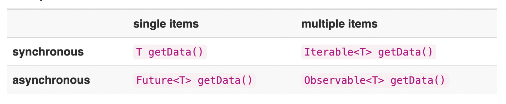
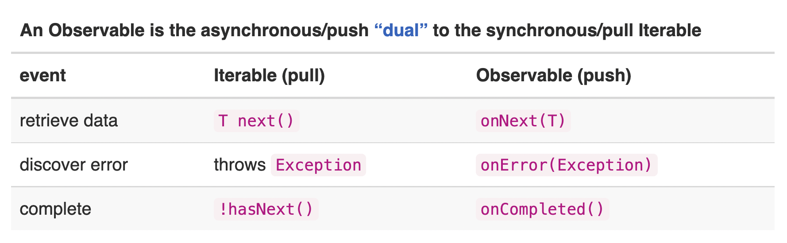

 
- 개선사항
  - Stream의 발행물, 발행값이라고 표기하고 있는 부분은 모호함이 크다. 추후 Stream 중간값, Stream 결과값으로 명확하게 표기한다.

# OnBoarding
 - reactivex.io 공식 도큐먼트 학습

## 메인
### 주요 특징
1. The Observer pattern done right.
  - Observer pattern
  - Iterator pattern
  - functional programming
2. Create
  - Easily create event streams or data streams.
3. Combine
  - Compose and transform streams with query-like operators.
4. Listen
  - Subscribe to any observable stream to perform side effects.
    - 의문
      - 의도적인 Side Effect를 만듬을 목적으로 함?

### Better codebases
1. Functional
  - Avoid intricate stateful programs (복잡한 상태를 가진 프로그래밍을 피하자), using clean input/output functions over observable streams.
2. Less is more (적을수록 낫다)
  - ReactiveX's operators often reduce what was once an elaborate challenge(치밀한 도전) into a few lines of code.
3. Async error handling
  - Traditional try/catch is powerless for errors in asynchronous computations, but ReactiveX is equipped with proper mechanisms for handling errors.
    - 의문
      - 왜 전통적인 try/catch가 async error에 효과적이지 않다고 주장할까?
      - ReactveX는 오류를 처리하는 어떤 적절한 메커니즘을 갖추었는가?
4. Concurrency made easy
  - Observables and Schedulers in Reactive X allow the programmer to abstract away low-level threading, synchronization, and concurrency issues.
    - 의문
      - ReactiveX는 저수준 스레딩, 동기화, 동시성 이슈를 어떻게 추상화 하는가?

## Introduction
### ReactiveX
  - ReactiveX is a library for composing asynchronous and event-based programs by using observable sequences.
      - 의문
        - event-based programs?
        - observable sequences?
  - 
  - it extends the observer patten to support sequences of data and/or events and adds operators that allow you to compose sequences together declaratively while abstracting away concerns about things like low-level threading, syncronization, thread-safety, concurrent data structures, and non-blocking I/O.
      - 의문
        - 옵저버 패턴에서 어떤 부분이 구체적으로 확장 되었는가?
        - 기존 옵저버 패턴은 data 외 event를 sequence를 지원하지 않았는가?
        - Observable을 통해서 아래 현상이 없어지는가?
          - 로우 레벨 스레딩? (어떠한?)
          - 동기화? (어떠한?)
          - 스레드 안정성? (어떠한?) 
          - non-blocking (어떠한?)
          - concurrent data structures (어떠한?)
 - Observables fill the gap by being the ideals way to access asynchronous sequences of multiple items.
  - synchronous, Iterable로 순차적으로 실행하면 처리
  - asynchronous, Observable을 통해서 구독으로 처리
- It is sometimes called "functional reactive programming" but this is a misnomer(부적절하다). ReactiveX maybe functional, and it maybe reactive, but "functional reactive programming"is a different animal.
  - 왜 maybe functional? 
  - 왜 maybe reactive?
  - functional reactive programming이 잘못된 표현이라고 주장하는 이유는?
    - One main point of difference is that functional reactive programming operates on values that change continuously over time, while ReactiveX operates on discrete values that are emitted over time. (반응형 함수형 프로그래밍은 시간이 지남에 따라 지속적으로 변화하는 값에 대해 작동하지만 <지속적으로 이전과 동일한 값을 의미하는가?>, ReactiveX는 시간이 지남에 따라 방출되는 Discrete values에 대해 작동함)

      - 자세한 내용
        - https://github.com/conal/talk-2015-essence-and-origins-of-frp
  - reactive의 개념이 무엇일까?

### Why Use Observables?
  - The ReactiveX Observable model allows you to treat streams of asynchronous events with the same sort of simple(간단한 종류), composable (조합 가능한 작업) that you use for collections of data items like arrays.
  - It frees you from tangled(복잡한, 뒤엉킨) webs of callbacks, and thereby(그렇게 함으로써, 그것 때문에) makes your code more readable and less prone(덜 경향이 있는) to bugs.

### Observables Are Composable (전반적으로 이해가 안됨. Java Futures 는 순서 교체가 가능한 Iterable 개념으로 짐작함.)
  - Techniques like Java Futures are straightforward(복잡하지 않은) to use for a single level of asynchronous execution but they start to add non-trivial complexity(사소한 복잡성) when they're nested(중첩 될 때 사소한 복잡성이 추가되기 시작한다).
    - 의문
      - Java Futures를 잘 모름. 
        - (문서) https://docs.oracle.com/javase/7/docs/api/java/util/concurrent/Future.html
  - It is difficult to use Futures to optimally compose conditional asynchronous exceution flows -조건부 비동기 실행 흐름을 최적으로 구성하는 것은 어렵다(불가능)- (or impossible, since latencies of each request vary(서로 각각 다르다) at runtime - 불가능한 이유는, 지연 시간은 런타임에 따라 다르기 떄문이다). 
      - 참고
          - https://gist.github.com/benjchristensen/4671081#file-futuresb-java-L163
  - This can be done, of course, but it quickly becomes complicated-복잡한- (and thus error-prone, 오류가 발생하기 쉽다) or it prematurely blocks(조기에 막는다) on Future.get(), which eliminates(없애다. 제거하다) the benefit of asynchronous execution.
      - 전반적으로 이해가 안됨
      - 의문
        - Futures가 비동기의 이점을 막는 요소는 무엇이 있을까? 
  - ReactiveX Observables, on the other hand, are intended for composing flow(합성 흐름) and sequences of asyncronous data.
      - 참고 
          - https://github.com/ReactiveX/RxJava/wiki/#composition

### Observables Are Flexible
  - ReactiveX Observables supports not just the emission(배출) of single scalar values (as Futures to), but also of sequences of values or even infinite streams.
  - Observable is a single abstraction(단일 추상화 객체) that can be used for any of these use cases(사용 사례).
  - An Observable has all of the flexibility(유연함) and elegance(우아함) associated with its mirror-image cousin the Iterable.
  - 
  
### Observables Are Less Opinionated(독선적인)
  - ReactiveX is not biased(편향된) toward(...쪽으로) some particular source(특정 소스) of concurrency or asynchronicity.
  - Observables can be implemented using(...를 사용하여 구현할 수 있습니다) thread-pools, event loops, non-blocking I/O, actors (such as from Akka), or whatever implementation suits your needs, your style, or your expertise(전문지식). Client code treats all of its interactions with Observables as asynchronous, whether your underlying(근본적인) implementation is blocking or non-blocking and however you choose to implement it.
  - How is this Observable implemented?
    - ```
        public Observable<data> getData();
      ```
        - does it work synchronously on the same thread as the caller?
        - does it work asynchronously on a distinct(뚜렷한) thread?
        - does it divide its work over(한쪽에서 다른 사물이 덮이도록) multiple threads that may return data to the caller in any order(어떤 순서)?
        - does it use an Actor (or multiple Actors) instead of a thread pool?
        - does it use NIO(무슨 약자?) with an event-loop to do asynchronous network access?
        - does it use an event-loop to separate the work thread from the callback thread?
    - From the Observers's point of view, it doesn't matter!
  - And importantly: with ReactiveX you can later change your mind, and radically(본래) change the underlying nature of your Observable implementation, without breaking the consumers of your Observable.

## Callbacks Have Their Own Problems
- Callbacks solve the problem of premature(정상 또는 예상 보다 이른) blocking (조기 차단 문제?) on `Future.get()` by not allowing anything to block. (콜백은 Future.get()에 대한 사전 블로킹 문제 문제를 블로킹을 허용하지 않는 것으로 해결했다.)
- They are naturally efficient(효율적인) because they excute when the response is ready. 
  - 당연히 사전 블로킹이 없는 게 더 효율적이다.
- But as with Futures, while callbacks are easy to use with a single level of asynchronous excution, with nested composition they become unwieldy(손을 떼다?).
  - 콜백 중첩의 단점을 언급
  - 참고
    - https://gist.github.com/benjchristensen/4677544

## ReactiveX Is a Polyglot Implementation
- 생략

## Reactive Programming
- ReactiveX provides a collection of operators with which you can filter, select, transform, combine, and compose Observables.
- This allows for efficient execution and composition.
- You can think of the Observable class as a "push" equivalent(가치 있는) to Iterable, Which is a "pull". 
  - 의문
    - Iterable은 Push인가 Pull인가?
      - push이다.
        - Array를 불변으로 다루는 행위
    - Observable 클래스는 Iterable과 동등한 Push로 생각할 수 있다. Iterable을 사용한다면 소비자가 생산자에게 값을 Pull하고, 해당 값이 도착 할 때까지 스레드가 차단된다. 
      - 추측
        - Observable은 Push이면서 Pull이다? 생산자와 소비자의 관점에 따라 해석이 다를 수 있을 것으로 보임. 
          - 답
            - 생산자가 소비자에게 값을 Push 한다.
            - 소비자는 값을 Pull (구독) 한다.
        - Observable 또는 Stream에 값을 넣는 행위는 Push이고, (확장해서 해석한다면) Observable의 pipe를 통해서 값의 발행하는 과정 또한 불변성 배열을 다시 생성하는 과정으로 볼 때, 이는 Iterable하다.  
        - 생산자 입장에서는 Push이고, subscribe하는 소비자 입장에서는 pull로 Subscribe 한다.
  - 참고 
    - (Iterable) https://docs.oracle.com/javase/7/docs/api/java/lang/Iterable.html
- With an Iterable, the consumer pulls values from the producer and the thread blocks until ( ...(때)까지 ) those values arrive.
    - 의문 
      - 스레드가 차단됨()은 동기로 처리됨으로 맥락을 이해하면 될까?
- *By contrast, with an Observable the producer pushes values to the consumer whenever values are available.*
- This approach is more flexible, because values can arrive synchronously or asynchronously.
    - 의문
        - 해당 방식이 아닌 다른 방식으로 동기 또는 비동기를 어떻게 처리하는지 궁금하다.
- Example code showing how similar high-order functions can be applied to an Iterable and an Observable
  - Iterable Code Example
    - ```
        getDataFromLocalMemory()
        .skip(10)
        .take(5)
        .map({ s -> return s + " transformed" })
        .forEach({ println "next => " + it })
      ```
  - Observable Code Example
    - ```
       getDataFromNetwork()
        .skip(10)
        .take(5)
        .map({ s -> return s + " transformed" })
        .subscribe({ println "onNext => " + it }) 
      ```
  - 정리
    - The Observable type adds two missing semantics(놓친 의미론) to the  the Gang of Four’s Observer pattern, to match those that are available in the Iterable type:
      1. the ability for the producer to signal to the consumer that there is no more data available (a foreach loop on an Iterable completes and returns normally in such a case(이러한 경우); an Observable calls its observer's onCompleted method)
        - 의문
          - Iterable은 반환을 통해 완료됨(또는 종료됨)을 파악하는 게 최선일까? 장단점은 무엇인가?
          - 더이상 사용할 수 있는 데이터가 없음을 명시적으로 보내는 것의 장단점은?
            - 답
              - 굳이 Observable이 onCompleted method를 구현한 이유는 굳이 유휴 자원을 계속 점유할 필요가 없기 때문이다. (최소한의 자원)
        - 참고
          - ( the Gang of Four’s Observer pattern) https://en.wikipedia.org/wiki/Observer_pattern
      2. the ability for the producer to signal to the consumer that an error has occurred (an Iterable throws an exception if an error taks place during iteration; an Observable calls its observer's onError method)
        - 오류 발생을 명시적으로 구분할 수 있다. 
        - 의문
          - Iterable은 에러 발생을 명시적으로 구분할 수 있는가? typescript의 Error Type을 반환시킨다? 이 경우 Error Type 반환 관련 로직은 Iterable과 강한 결합성을 가지지 않을까?
    - With these additions(첨가제), ReactiveX harmonizes(조화를 이루다) the Iterable and Observable types. **The only difference between them is the direction in which the data flows**. This is very important because now any operation you can perform on an Iterable, you can also perform on an Observable.
      - 잘 이해가 안되는 부분 
        - Iterable에서 수행할 수 있는 모든 작업을 Observable에서도 수행할 수 있다. (Docs 복습 필요)
      


## 함수형 프로그래밍
1. 코딩 중 오류의 소지가 될 수 있는 변수 사용 지양
   - 스레드의 동시접근에 의한 오류 또는 교착 문제에서 자유로운(?) 코딩 가능하다.
      - 의문
        - 구체적 예시?
   
2. 순수 함수 사용
    - 큰 단위 기능은 순수 함수의 조합을 통해 구성한다.

3. 선언형 프로그래밍

4. 다양한 함수의 기능과 활용법을 아는 게 좋다.
   
## reactive x
1. Observable
   1. 일련의 값들을 발행한다.
   2. 관찰 할 수 있는 대상이다.

2. Operators
   1. 순수함수 목록
   2. Pipe 형식

3. Observer
   1. Stream을 구독하며, 값이 발행되면 작업을 실행한다.
   2. 발행물을 기다린다. (구독하다, 반응하다)

## 로대쉬, 자바스크립트 표준과 다른점?
1. 1차원적인 값(예: Iterable) 뿐 아닌, 연속된 값들의 흐름을 stream으로 관리한다. (파이프라인을 통해)
   1. 시간의 흐름
   2. 사용자의 동작
   3. 네트워크 요청의 결과
2. stream을 통해 관심사인 요소를 배열처럼 관리한다.

## 예제) Ajax 직렬화
  ```
    const {range} = rxjs
    cosnt {ajax} = rxjs.ajax
    const {mergeMap, toArray, pluck, retry} = rxjs.operator

    range(1,20).pipe(
        mergeMap(index => ajax(
            'https://127.0.0.1:3000/people/quater-error/${index}'
        )).pipe(
            pluck('response', 'first_name'),
            retry(3)
        )
        , 4),
        toArray()
    ).subscribe(console.log)
  ```
  - Operator 설명
    - range
      - 1에서 20까지 숫자를 스트림으로 생성한다.
    - mergeMap 
      - stream에서 나온 각 값 마다 이를 사용하는 지정된 또다른 스트림을 만들어낸다.
      - 이 스트림들이 동시에 실행되도록 한다. 
        - 의문
          - 병렬 개념?
          - 개별적으로 동시에 실행됨을 의미?
      - 한 번에 실행될 수 있는 최대 개수를 4개로 제한 한다.
        - 의문
          - 최대 요청 개수는 4개이지만, Queue로 순차적으로 모든 요청을 처리하는가?
    - pluck
      - response 항목의 first_name 항목을 추출한다.
    - retry
      - 최대 3 번 재실행한다.
    - toArray
      - 스트림의 모든 값이 발행 되기를 기다렸다가 그것들을 한 배열에 묶어 내보내게 된다.
      - 의문
          - 정확한 단위를 모르겠음. 모든 스트림에 대해서? 개별 스트림에 대해서? 4개의 요청이 모이면 한번에 묶어서 방출한다?
## 실습) 프롬프터 만들기
1. 키보드로부터 스트림을 만든다.
  ```
    // 방향키만 1 또는 -1로 치환한 스트림
    const keypress$ = fromEvent(document, 'keydown').pipe(
      pluck('key'),
      filter(k, k.includes('arrow)),
      map(k => {
        return {
          ArrowDown:1,
          ArrowUp:-1,
          ArrowLeft:-1,
          ArrowRight:1
        }[k]
      })

    )
  ```
  - 키보드 이벤트를 생성함.
  - key 항목 뽑음.
  - arrow 만 뽑음.
  - 방향키에 따라 -1 또는 1로 치환. (이전, 이후 구분을 위해서)
2. 스크롤에 의한 스트림
  ```
  // 마우스 스크롤을 1초 간격으로 끊은 뒤
  // 방향에 따라 1 또는 -1로 치환한 스트림
  const scroll$ = merge(
    fromEvent(document, 'mousewheel),
    fromEvent(document, 'wheel)
  ).pipe(
    throttleTime(1000),
    map(s => s.deltaY > 0 ? 1 : -1)
  )
  ```
  - 브라우저 별 mousewheel, wheel 이벤트에 대해서 작동한다.
    - 스트림 두 개 만들고 merge를 통해 병합함.
  - throttleTime
    - 주어진 시간에 한 값만 통과하도록 한다.
    - 초당 1회만 이벤트에 반응함.

3. 위 1, 2를 하나의 스트림으로 병합
  ```
    // 위의 키보드 스트림과 마우스 스트림
    // 그리고 최초값 0을 병합한 스트림
    const input$ = merge(
      keypress$, scroll$
    ).pipe(startWith(0))
  ```
  - merge
    - 하나의 스트림으로 병합함.
  - startWith
    - stream의 시작 부분에 프로그램 실행 시 바로 발행하는 값을 넣을 수 있음. (초기값 개념)
    - 0 이라는 값을 통해 첫 화면을 띄움.

4. lines$
  ```
    const lines =[
      "반응형 프로그래밍 반응형 프로그래밍",
      "꿀잼 꿀잼 꿀잼 꿀잼"
    ]

    const spaces = 10

    // 출력 할 시작과 마지막 라인에 대해서 각각 앞뒤 공백으로 들어갈 스트림을 생성함.
    const spaces$ = range(0, spaces).pipe(mapTo(''))

    // 프롬프터에 표시할 행들을 앞뒤 공백과 이어붙인 뒤, spaces + 1개 라인, 1줄 간격으로 묶어 배열 형태로 반환하는 스트림을 생성함.
    const lines$ = concat(
      spaces$, from(lines), spaces$
    ).pipe(
      bufferCount(spaces * 2 + 1, 1),
      skipLast(spaces * 2),
      toArray()
    )
  ```
  - concat
    - 스크립트 앞뒤에 이어 붙임.
  - bufferCount
    - 스트림을 앞의 인자만큼 떼어내고 이를 뒤의 인자만큼 이동하면서 반복함. (?, 이해 안됨)
  - skipLast 
    - 끝에서 N개를 제거함.
  - toArray
    - 스트림의 모든 발행물들을 하나의 배열에 넣어서 반환함.

4. 최종
  ```
  const final$ = inputs$.pipe(
    scan((acc, cur)=> {
      return Math.main(Math.max(acc += cur, 0), lines.length -1)
    }),
    mergeMap(cursor=> {
      return lines$.pipe(
        map(buffereds => buffereds[cursor])
      )
    })
  )
  ```
  - inputs$에서 발행되는 값들을 scan이란 오퍼레이터를 사용해서, 각 값마다 이전에 나온 모든 값들의 누적값을 발행하도록 함.
  - 최대값과 최소값을 제한함.

## 질문
  - 반응형 프로그래밍?
  - 반응형 프로그래밍과 ReactiveX는 차이가 존재하는가?
  - Observable이 어떻게 구현되어 있을까?
  - actor란?
  - NIO는 무슨 약자임?
  - thread pool과 actor의 차이?
  - Concurrency와 Asynchronicity의 차이?
  - Push와 Pull의 차이점?
  - Observable의 Push와 Pull에서 Pull인 이유는?
    - 답
      - *By contrast, with an Observable the producer pushes values to the consumer whenever values are available.*
  - iterable은 push?
    - 답
      - JS Array가 Iterable로 구현됨을 의미하고, Array에 요소를 Push해서 map 등의 기능을 구현함.
  - Work thread와 callback thread의 차이?
  - Callback의 단점은?
  - Scalar value?
    - 하나의 숫자로만 표시되는 양.
    - 즉, 단위 크기만 있는 물리량.
    - 참고
      - https://ko.wikipedia.org/wiki/%EC%8A%A4%EC%B9%BC%EB%9D%BC_(%EB%AC%BC%EB%A6%AC)
  - 멀티 캐스팅? 캐스팅?
    - 멀티 캐스트
      > 한 번의 송신으로 메시지나 정보를 목표한 (불특정 다수가 아닌, 특정 수신 대상)여러 컴퓨터에 동시에 전송하는 것.
      - 참고
        - http://www.terms.co.kr/broadcast.htm
        - https://ko.wikipedia.org/wiki/%EB%A9%80%ED%8B%B0%EC%BA%90%EC%8A%A4%ED%8A%B8
        - https://m.blog.naver.com/PostView.naver?isHttpsRedirect=true&blogId=eqqus&logNo=140188701607
  - 브로드 캐스트
    - 참고
      - http://www.terms.co.kr/broadcast.htm
  - 동기, 비동기와 블로킹, 논블로킹 차이 (추후 별도 문서로 분리)
    - 동기, 비동기는 프로세스의 수행 순서 보장에 대한 매커니즘
    - 블로킹, 논블로킹은 프로세스의 유휴 상태에 대한 개념
    - 두 개념은 직접적인 관련은 거의 없고, 단지 조합하여 사용되는 것 뿐이다.
    - 참고
      - https://evan-moon.github.io/2019/09/19/sync-async-blocking-non-blocking/

## 참고
  - 인프런 얄코-자바스크립트-reactivex 강의
  - (reactiveX 공식 도큐먼트, Resource) https://reactivex.io/tutorials.html