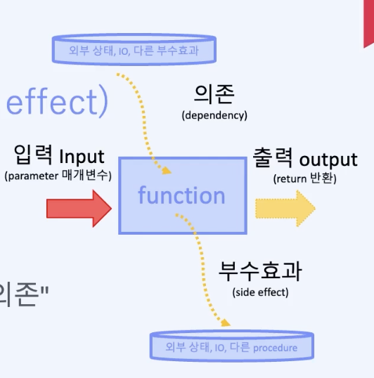
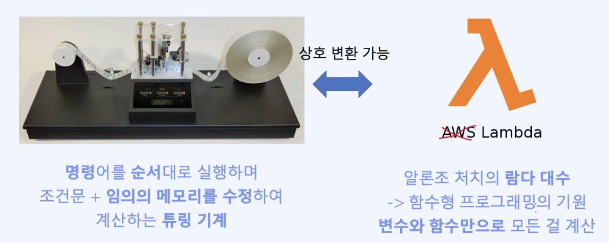
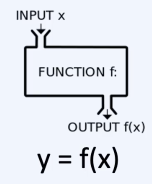

# 자바스크립트 함수형 프로그래밍 온보딩

## 함수형 프로그래밍
 - **(공통) 작은 순수 함수들을 합성 하기**
     - 작은 함수들을 합성하는 것(compsing) - 함수형 프로그래밍에서 온 핵심 아이디어 (Key Idea) - PureScript By Example
     - 함수형 프로그래밍은 오로지 순수(pure) 함수와 이를 더 큰 구조로 합성(compose)하는 일에 대한 것일 뿐입니다. - fp-ts_docs
     - 함수형 프로그래밍에서는 공통의 가능성을 추출하고, 합성(compose)을 통해 재사용 가능한 일반적 구성요소를 만들기 쉬우며, 그런 일이 당연시 된다. - 스칼라로 배우는 함수형 프로그래밍 
 - 이외에는 함수를 잘 합성하기 위한 도구
   - 불변성, 1급함수, 게으른 평가 등...

## 핵심 개념 2가지
 - 함수를 합성해서 복잡한 프로그램을 쉽게 만들기
     - 복잡한 프로그램을 작은 함수들로 쪼개기
     - 쪼갤 때 안전한 방법으로 쪼갬
 - 부수효과를 공통적인 방법으로 추상화

## 명령형 vs 함수형 (선언형)
 - 명령형
   - 어떻게 하는가?
   - 기계에게 효율적인 방식
       - 컴퓨터에게 계산을 직접 지시
           - 예시로 저수준의 메모리 등
       - 사람이 이해하기 어려움
   - 상태 변경, 부수효과
   - 복잡한 흐름
 - 함수형(선언형)
   - (원하는 것이) 무엇인가?
       - 논리구조 및 수학적 구조로 코딩에 중점
   - 인간이 이해하기 쉬운 방식
   - 부수효과가 없는 순수함수
   - 작고 예측하기 쉽다
       - 실행 결과에 대해서
       - 거대한 로직을 작게 쪼갤 수 있다

## Real World 함수형 프로그래밍
 - 

## 함수형 프로그래밍 2
 - 특정 라이브러리 또는 특정 언어에 대한 강제가 아니다.
 - 부수효과 분리 및 공통점 추상화
     - 예시
         - Array와 map
         - 비동기 Promise와 async
         - 반응형(Reactive) Observable
 - 컴퓨터가 일하는 방식보다 사람이 생각하는 방식에 가깝게 하기 위해서 부수효과를 지양하고 순수함수로 프로그래밍을 한다.

## 함수를 합성해서 복잡한 프로그램을 쉽게 만들기 위한 질문 목록
 - 프로그램이 왜 복잡해질까?
 - 함수란 무엇인가?
 - 함수를 합성한다는건?
 - 함수를 합성하면 어떤 게 편해질까?

## 프로그램이 왜 복잡하게 느껴질까?
 - 부수효과가 얽히고 장황해진 명령형 코드
     - 코드가 길어짐
     - 코드를 재사용을 하지 못하는 경우 기존 코드를 바탕으로 코드 복사-붙여넣기 후 붙여넣은 코드를 약간 씩 수정해서 추가적인 기능 개발
     - 예시는 레거시 코드
     - 마이클 페더스 - Object 멘토, 레거시 코드 활용 전략 저자
       -  ```
            That's the goal, really Simplify understanding No surprises. Honest code.
          ```

## 객체지향과 함수형 차이
 - 명사의 왕국인 객체지향 세계(역할, 책임, 협력), 동사의 왕국인 함수형 세계 - STEVE YEGGE
 - 100개의 함수를 하나의 자료구조에 적용하는 것이 10개의 함수를 10개의 자료구조를 적용하는 것보다 낫다. - 엘런 펄리스(튜링상을 수상한 최초의 컴퓨터 과학자)
 - 객체지향 프로그래밍은 *움직이는 부분을 캡슐화*하여 코드 이해를 돕고, *함수형 프로그래밍은 움직이는 부분을 최소화*하여 코드 이해를 돕는다. - 마이클 페더스 (Object 멘토, 레거시 코드 활용 전략의 저자)
 - OOP와 함수적 계산은 완전히 조화될 수 있습니다. (그리고 그래야만 하죠!) - Alan Kay (객체지향과 SmallTalk 언어 창시자)
    - 예시) 자바에서 함수형 도입 됨
    - 함수형과 OOP는 대립되는 관점보다 조화시킬 수 있는 관점도 존재

## 부수효과 (Side Effect)
 - 정의 by 위키백과
     - ```
         컴퓨터 과학에서 함수가 결과값 이외에 다른 상태를 변경시킬 때 부작용이 있다고 말한다. 

         예를 들어, 함수가 전역변수나 정적변수를 수정하거나, 인자로 넘어온 것들 중 하나를 변경하거나 화면이나 파일에 데이터를 쓰거나, 다른 부작용이 있는 함수에서 데이터를 읽어오는 경우가 있다.

         부작용은 프로그램의 동작을 이해하기 어렵게 한다.

         명령형 프로그램은 부작용을 사용하여 프로그램이 동작하게 하는 것으로 알려져 있다.
         
         함수형 프로그래밍은 부작용을 최소화하는 것으로 알려져 있다.
       ```
 - 정의 by 패스트 캠퍼스 TS 강의
     - 값을 반환하는 것 외에 부수적으로 일으키는 효과(side effect)
     - 
     - 기계와 저수준에 최적화된 명령형 방식 예시
        - 변수나 상태를 바꾸거나 수정
        - 화면이나 파일에 데이터를 쓰는 IO 작업
        - 다른 부수효과가 있는 함수나 상태 값에 의존
     - 기타 예시 
       - 에러 및 예외에 프로그램 흐름을 변경함
       - 그외 더 많은 예시가 존재한다.
## 합성을 어렵게 만드는 부수효과
 - **인간이 한 번에 생각할 수 있는 작업 기억 용량은 3~5개 정도에 불과하다(by 어떤 심리학)**
   - 코드를 이해하고 결과를 예측하기 불가능하게 만드는 요소
       - 변화하는 상태를 모두 기억해야 한다
       - 코드 실행 순서, 횟수, 분기에 따라 결과가 달라짐
       - 그외 비동기, 병렬처리, 전역까지 추가 된다면?
           - 변경 가능한 상태가 공유되는 부수효과가 존재시 프로그래밍 동작 예측은 불가능에 가까워진다.
   - 기능 추가 및 변경을 어렵게 만듬
   - 변경 시 원하는 결과인지 테스트 하기 어렵다.
   - 값의 변화에 대해 디버깅으로 추적 시, 잘못된 상태를 재현하고 해당 값을 알기 위해서 같은 코드를 수십번씩 수행해야 하는 경우가 많다
   - 과거 컴퓨팅 자원이 한정적이고 프로그램이 상대적으로 단순했던 경우에는 비용이 더 저렴했을지 모르겠으나, 지금은 컴퓨팅 자원도 한정적이지 않으면서 많은 개발자와 협업 및 프로그램의 복잡도가 높아진 경우 더 많은 비용을 필요로 한다.

## 함수형으로 모든 프로그램을 짤 수 있을까?
 - 람다 대수는 튜링 완전성(?)을 만족시키며, 보편 튜링 기계와 동치(상호 호환 가능)이다. (즉 명령형 코드 <-> 함수형 코드)
 -  
 - 의문 (조사 필요)
   - 람다 대수란?
   - 튜링 완전성 이란?
   - 부수효과가 필요한 IO 작업이나, 전역 상태가 필요한 random 함수는 사용 불가능한가?
       - 답
           - 코드에서 분리하고 격리해서, 순수하게 추상화하여 사용한다.

## 하나의 메인 프로그램
 - 구성
     - 부 프로그램
     - 서브 루틴
     - ... 그리고 함수
 - 주석
     - 만약 하나의 메인 프로그램을 하나의 함수로 작성한다고 가정하면, 끔찍할 것이다.
     - 절차지향
         - 부수효과를 배제하는 것이 불가능하다
             - 예시
                 - 전역 변수
                 - IO 작업 
         - *프로그래밍 언어의 함수는 주어진 입력을 기반으로 부수효과를 발생시키고 결과를 리턴한다.*
## (순수)함수 (fure function)
 - 
 - 똑같은 매개변수(입력)를 받으면, 항상 같은 값을 반환하는 함수
 - (비교적...) 인간의 뇌로 생각하기 쉽고 합성하기도 쉽다.
 - 절차지향 함수와 다른 순수함수 특징
    - 부수효과(아마도)가 없음
    - 수학의 함수 -> 증명 가능
        - 안전하게 합성, 조작 가능
    - 순서나 실행 횟수랑 상관 없이, 항상 예측 가능한 결과
        - 함수의 호출부분을 단순한 값으로 치환
    - 리팩토링 용이
        - 절차지향보다 안전하게 리팩토링 가능
        - 예시) 방정식을 인수분해, 등식적 추론 등으로 분리 및 조합 가능
    - 코드 이해가 쉽다.
  
## 왜 함수형 프로그래밍은 순수함수를 이용하려고 할까? 
 - 절차지향 함수
     - 부수효과가 존재하는 함수는 구조 분해 및 합성이 상대적으로 어렵다.
     - 함수를 호출하는 순서 및 방법에 따라 동작이 달라질 가능성이 높다. (단순한 값으로 치환하기 어려움)
     - 추가 사항은 순수함수 섹션 참고
## 참고
 - https://fastcampus.co.kr/courses/207789/clips/
 - https://fastcampus.co.kr/courses/207789/clips/