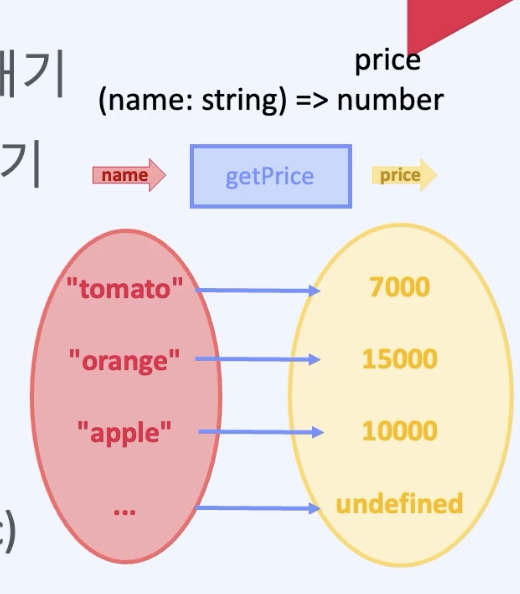
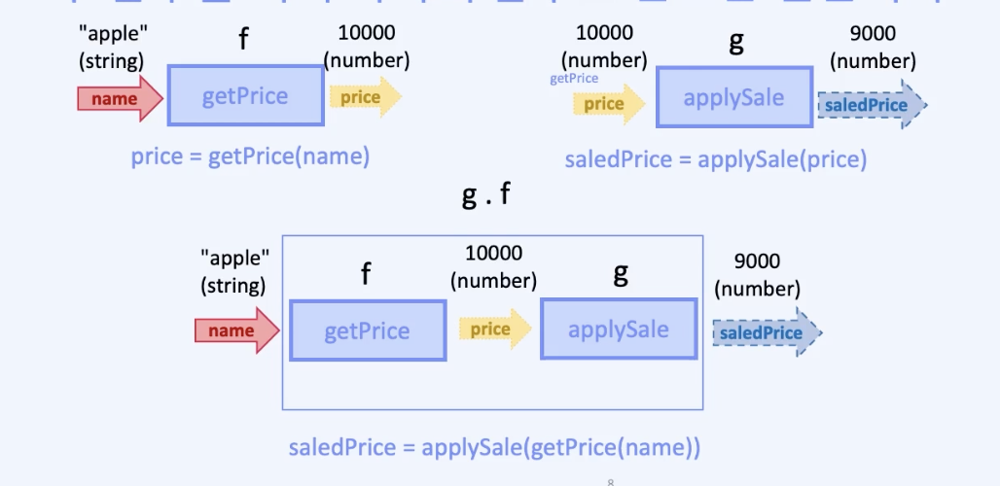
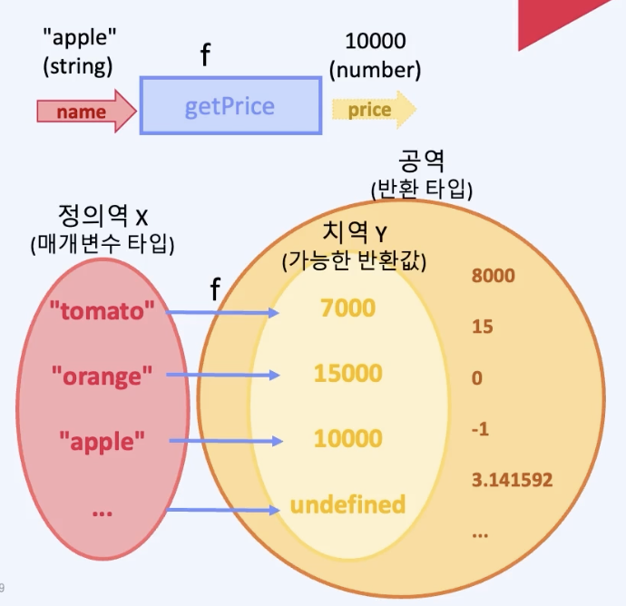
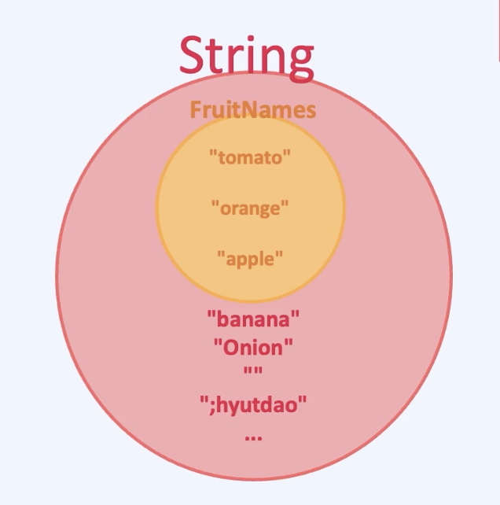
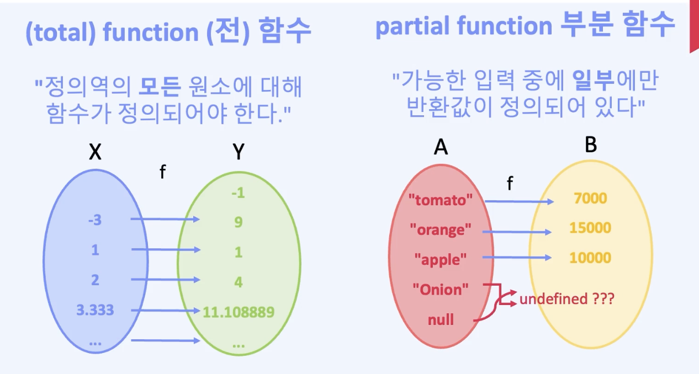

# 함수와 함수 합성

## 명령적 사고에서 선언적 사고로 전환
 -  
 - 전역 변수에 숨겨진 부수효과 찾아내기
 - 절차(Procedure)를 순수함수로 바구기
 - Record Data와 함수 비교하기
 - 함수 합성(composition)
 - 함수와 타입, 집합
 - 타입을 만드는 함수, 제네릭(Generic)

## 계산과 부수효과의 분리 - 전역 변수에 숨겨진 부수효과 찾아내기
 - 예제 1
     - ```
        // 토마토 : 7000원
        // 오렌지 : 15000원
        // 사과 : 10000원

        export let totalPrice = 0;

        totalPrice += 7000;
        totalPrice += 15000;
        totalPrice += 10000;

        totalPrice += 30000; // 문제 발생! - 30000원의 근원이 불분명 (사과 3개 또는 오렌지 2개)
        
        totalPrice += 8000; // 문제 발생 - 토마토를 7000원이 아닌 8000원을 더 하게 됨

        totalPrice +=700; // 문제 발생 - 토마토의 마지막 자릿수 오타

        // 만약 새롭게 계산을 해야 하는 경우, export let 아래의 모든 코드를 다 지우고 다시 totalPrice를 계산해야 한다.
       ```
 - 에제 2 - 명령형 프로그래밍 적용
     - ```
        // 토마토 : 7000원
        // 오렌지 : 15000원
        // 사과 : 10000원

        // 전역상태 - 부수효과
        export let totalPrice = 0; 


        // 프로시저 1
        export function addTomato() {
            totalPrice+= 7000;
        }

        // 프로시저 2
        export function addOrange() {
            totalPrice+= 15000;
        }

        // 프로시저 3
        export function addApple() {
            totalPrice += 10000;
        }

        // 프로시저 4
        export function list1() {
            // 토마토, 오렌지, 사과 한 박스
            addTomato();
            addOrange();
            addApple();
        }

        // 프로시저 5
        export function list2() {
            // 토마토 2상자
            addTomato();
            addTomato();
        }

        // 프로시저 6
        export function list3() {
            // 오렌지 100상자

            // 직접 타이핑
            //  - 문제 발생 - 직접 타이핑 시 100번의 동일한 코드 필요, 실수 발생 가능성이 높고 확인이 쉽지 않다.
            //  - 문제 발생 - 만일 100개 중 30개를 뺀다면? 코드 변경 후 제대로 변경된 여부를 확인이 필요
            addOrange();
            addorange();
            ... // 반복 생략
            addOrange();

            // 반복문 사용
            for(i = 0; i < 100 ; i++) {
                addOrange();
            }
        }

        export function main() {
            list1();
        }
       ```
        - 계산 과정에 초점을 맞춰서 코딩
    - 예제2 - 사이드 이펙트 발생시키기
        - ```
           import * as from './clip3_2";

           C.main()

           const app = document.getElementById("app");
           if(app !== null) {
               app.innerHTML = `
                <h1>Total price:${Math.round(C.totalPrice)}</h1>
               `
           }
          ```
            - 원본 코드 결과는 1500000이고
            - `<h1>total price ... 생략</h1>`으로 T를 t로 변경시 값이 3000000으로 변경됨
                - 왜 문자 하나의 대소문자 변경에 의해 이러한 사이드 이펙트가 발생했을까?
                    - 이유는 코드 샌드 박스에서 구동 시 핫 모듈 리플레이스먼트가 변경된 코드에만 적용되고 다른 코드에 대해서는 적용이 안되서이다. 즉 js 파일에서 main은 실행 되었지만, 전역 변수인 totalPrice 변수가 초기화 될 기회를 얻지 못하고 기존 변수 값에 추가 연산을 해서 발생한다.
                    - 즉 부수효과의 원인을 찾기 어렵고 이해하기 어려운 예시이다.

## data와 function
 - 예제 - 순수함수화 적용
     - ```
        // 토마토 : 7000원
        // 오렌지 : 15000원
        // 사과 : 10000원

        export function priceOfTomato() {
            return 7000;
        }

        export function priceOfOrange() {
            return 15000;
        }

        export function priceOfApple() {
            return 10000;
        }

        export function list1() {
            // 토마토, 오렌지, 사과 한 상자
            return priceOfTomato() + priceOfOrange() + priceOfApple();
        }

        export function list2() {
            // 토마토 2상자
            return priceOfTomato() + priceOfTomato();
        }

        export function list3() {
            // 오렌지 100상자

            // (주목!) 전역변수를 쓰지 않으면서 생기는 효과
            //   - 전역 변수를 사용한 전역 변수에 값을 더하는 '어떻게' 라는 관점에서 과일의 가격이 얼마이다라는 '무엇'의 관점으로 변경됨
            return priceOfOrange() * 100;
        }

       ```
          - 이제는 `<h1>total ....</h1>`에서 `<h1>Total ....</h1>`으로 변경해도 사이드 이펙트가 발생하지 않음
- 예제 - 순수함수화 적용2
     - ```
        // 토마토 : 7000원
        // 오렌지 : 15000원
        // 사과 : 10000원

        export function priceOfTomato() {
            return 7000;
        }

        export function priceOfOrange() {
            return 15000;
        }

        export function priceOfApple() {
            return 10000;
        }


        // 순수함수로서 name에 대한 값을 반환하고 있다.
        // 입력 이외에 다른 추가적인 operator는 진행하고 있지 않다.
        // getPrice 함수는 사상 매핑(입력값에 대한 결과값이 대응된다 - 에시로 typescript record type)이라고도 한다.
        function getPrice(name: string) {
            if( name=== 'tomato) {
                return 7000;
            } else if(name ==='orange') {
                return 15000;
            } else if(name ==='apple') {
                return 10000;
            }
        }

        // 사상 매핑 예시
        // 계산이 오래걸리는 함수(예 getPrice)의 출력을 메모라이즈 처리해서 캐싱 사용
        // 단 테이블로 다루는 값이 적어야 함
        // 현실적으로 무한에 가까운 입력값에 대응해야 한다.
        // 데이터가 많을 수록 키에 대응하는 레코드를 직접 만들어서 사용하는 것은 비효율적
        const priceOfFruit = {
            tomato: 7000,
            orange: 15000,
            apple: 100000
        }

        // 어떤 문자열의 길이가 홀수 또는 짝수인지 판별시 테이블을 만든다면
        // 필요한 문자열이 있을 때마다 추가로 아이템을 추가해야 한다.
        // 이를 추상화한다면 어떤 문자열이라도 해당 문자열의 길이가 홀수인지 짝수인지 판별이 가능하다.
        const isEvent = {
            tomato: true,
            orange: true,
            apple: false
        }

        // 입력값이 출력값에 대응한다는 본질과 동일하다.
        const isEventFn = (str: string) => str.length %2 === 0;

        export function list1() {
            // 토마토, 오렌지, 사과 한 상자
            return priceOfTomato() + priceOfOrange() + priceOfApple();
        }

        export function list2() {
            // 토마토 2상자
            return priceOfTomato() + priceOfTomato();
        }

        export function list3() {
            // 오렌지 100상자

            // (주목!) 전역변수를 쓰지 않으면서 생기는 효과
            //   - 전역 변수를 사용한 전역 변수에 값을 더하는 '어떻게' 라는 관점에서 과일의 가격이 얼마이다라는 '무엇'의 관점으로 변경됨
            return priceOfOrange() * 100;
        }

       ```


## 함수
   -  
   - (수학적) 정의
       - 한 함수의 공역이, 다른 함수의 정의역과 일치하는 경우 두 함수를 이어 하나의 함수로 만드는 연산이다. 
   - 주석
       - 정의역과 공역을 파악 후 합성 가능 여부를 판단할 수 있다.
       - 수학에서 함수: 정의역과 공역
           - 
           - 정의
                 -  **어떤 집합의 각 원소를 다른 집합의 유일한 원소에 대응시키는 이항 관계**다.
            - 정의역
                - 입력 값들의 집합
            - 공역
                - 이 함숫값들이 속하는 더 큰 집합을 공역
                    - 분류
                        -  치역
                             - 가능한 반환값의 집합
                        -  치역 외 값들

## 타입
 - 정의
     - 
     - 할당할 수 있는 값들의 집합
 - (수학적 정의)
     - 특정한 조건에 맞는 별개의 원소들의 모임
 - 예제 - type 적용
    - ```
        // typescript에 의해 자동 추론으로 Union type으로 tomato, orange, apple 처리
        function getPrice(name: string) {
            if( name=== 'tomato) {
                return 7000;
            } else if(name ==='orange') {
                return 15000;
            } else if(name ==='apple') {
                return 10000;
            }
        }
      ```
  - total function 전 함수 vs partial function 부분 함수
      - 
      - 일반적인 함수는 total function이다.
      - partial function에 대응하는 모든 정의역의 함수는 total function으로 부를 수 있다.
      - partial function은 순수함수가 아니다. 구현을 할 수 없는 함수이다.
      - 예제 
          - ```
                // 입력 타입은 string 이지만 tomato, orange, apple에만 대응하고, 그 외에는 대응 되지 않으므로 total function이 아닐 수 있다는 판단에 의해 결과의 타입은 추가적으로 undefined 처리가 된다.
                // undefined가 추가되므로서 total function이 되었다.
                // typescript 컴파일러는 리턴 구문이 모두 if 문이므로 자동 추론으로 undefined도 추론한 것일 뿐, 정확한 추론은 아니다.
                // 결론으로 partial function도 허용이 된다.
                function getPrice(name: string) {
                    if( name=== 'tomato) {
                        return 7000;
                    } else if(name ==='orange') {
                        return 15000;
                    } else if(name ==='apple') {
                        return 10000;
                    }
                } 
            ```
              - **결론으로 partial function도 허용이 된다**
    - 프로그래밍의 상속 관점에서 공역은 치역의 상위 타입, 상위 클래스이다. (더 넓은 범위)
    - 치역은 공역의 하위 타입, 하위 클래스 (더 좁은 범위)
    - 의문
        - 부분 함수를 쓸 수 없다면, 애초에 정의역의 타입 자체를 입력 가능한 타입의 집합으로 만들면 되지 않는가?
            - 답
                -  getPirce처럼 값이 한정적이지 않은 경우, 생각보다 특정 타입만을 허용하는 함수 생성은 어렵고, 비용이 많이 소비된다. 
                -  예로, 짝수만 허용되는 타입은? 가능한 프로그래밍 언어가 극소수 존재하지만, 실무에서는 그런 타입을 만드는 것은 극히 어렵다.
                -  자세한 내용은 typescript option 참고

## 함수 합성
 - 의문
   -  함수를 어떻게 이을 것인가?
   -  함수를 어떻게 잇는 것이 효율적인가?
 - 예제 1
     - ```
        // 토마토 : 7000원
        // 오렌지 : 15000원
        // 사과 : 10000원

        // 입력값에 대해 값이 정의되지 않음을 return의 undefined를 통해 파악 가능
        // 함수 내부를 보지 않고 대략적인 함수 기능 파악 가능
        // 공역의 값 중 실제 리턴 값의 집합을 치역이라고 한다.
        // 공역은 모든 숫자, undefined 이지만, 반환값에 해당하는 치역은 7000, 15000, 10000, 및 타입스크립트 컴파일러가 유추한 undefined가 된다. 
        // 치역과 공역이 일치된다.
        function getPrice(name: string): number | undefined {
            if( name=== 'tomato) {
                return 7000;
            } else if(name ==='orange') {
                return 15000;
            } else if(name ==='apple') {
                return 10000;
            }
        }

        const isExpensive = (price: number) => {
            return price > 10000;
        }

        // 과일이 비싼지 여부를 판단
        export const main = () => {
            const price = getPrice('tomato');

            // typescript 애러 발생!
            // 이유는 isExpensive의 타입 중 undefined은 성립되지 않는다.
            // 즉, getPrice와 isExpensive의 공역과 정의역이 일치하지 않는다.
            // 합성 불가 판정!
            return isExpensive(price);
        }
       ``` 
 - 예제 1 - 2
     - ```
          // 토마토 : 7000원
          // 오렌지 : 15000원
          // 사과 : 10000원

          function getPrice(name: string): number | undefined {
              if( name=== 'tomato) {
                  return 7000;
              } else if(name ==='orange') {
                  return 15000;
              } else if(name ==='apple') {
                  return 10000;
              }
          }

          // 인자값에 undefined 추가
          const isExpensive = (price: number | undefined) => {

              // price에서 타입스크립트 컴파일러가 에러를 출력한다.
              // undefined는 숫자를 비교할 수 없다.
              return price > 10000;
          }

          // 과일이 비싼지 여부를 판단
          export const main = () => {
              const price = getPrice('tomato');

              return isExpensive(price);
          }
         ``` 

- 예제 1 - 3
   - ```
        // 토마토 : 7000원
        // 오렌지 : 15000원
        // 사과 : 10000원
        function getPrice(name: string): number | undefined {
            if( name=== 'tomato) {
                return 7000;
            } else if(name ==='orange') {
                return 15000;
            } else if(name ==='apple') {
                return 10000;
            }
        }

        const isExpensive = (price: number | undefined) => {
            
            // 추가
            if (price === undefined) {
                return faslse
            }
         
            return price > 10000;
        }

        // 과일이 비싼지 여부를 판단
        export const main = () => {
            // 에러 없이 계산 가능
            // 해결은 됨
            return isExpensive(getPrice('tomato'));
        }
       ```
        - 굉장히 많은 코드를 수정해야 함
        - 왜 굳이 타입스크립트 쓸까? 자바스크립트는 이렇게 안해도 되는데? 생산성이 떨어지는데?
            - 타입스크립트는 미리 문제를 알려주는 좋은 도구이다. 자바스크립트는 런타임 시 문제가 발생한다. 항상 재연되는 게 아니라 디버깅 재현도 쉽지 않다.
  - 예제2 - 개선
      - ```
        // 토마토 : 7000원
        // 오렌지 : 15000원
        // 사과 : 10000원
        function getPrice(name: string): number | undefined {
            if( name=== 'tomato) {
                return 7000;
            } else if(name ==='orange') {
                return 15000;
            } else if(name ==='apple') {
                return 10000;
            }
        }

        export const isExpensive = (price: number | undefined) => {
            // 추가
            if (price === undefined) {
                return faslse
            }
         
            return price > 10000;
        }

        // 제네릭을 통해 추가적인 개선 가능
        export function isExpensivePrice(name: string): boolean {
            return isExpensive(getPrice(name))
        }

        // 과일이 비싼지 여부를 판단
        export const main = () => {
            // 에러 없이 계산 가능
            // 해결은 됨
            return isExpensive(getPrice('tomato'));
        }
       ```
 - 수학의 쓸모
     - 의문
          - 프로그래밍에 엄밀히 수학이 꼭 필요할까?
          - 우리가 만든 추상화에 잘못된 케이스가 있다면?
     - 답변
         - 수학으로 증명할 수 있다면 ...
             - (순수 함수라는) 가정만 잘 지키면 믿을 수 있다
             - 자신 있게 합성할 수 있다
             - 이미 잘 증명되어 있는 펑터나 모나드 등을 믿고 가져다 쓸 수 있다.


## 참고
 - https://fastcampus.co.kr/courses/207789/clips/