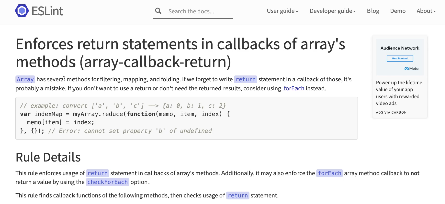

# Array, 여러 개일 수 있는 값

## Array
 - 의문
     - Array와 List의 차이점은?
     - 자바스크립트, 타입스크립에서는 기존 내장된 Array를 범용적으로 사용하고, List를 덜 사용하지만
     - 일반적인 함수형 프로그래밍에서는 원소들에 대한 임의 접근이 꼭 필요한 경우가 아니면 List를 더 선호한다. 이유는 List는 재귀적, 순차적으로 다루기에 최적화 되있음. 그리고 생각보다 배열의 임의 요소에 접근할 경우는 생각보다 많지 않다.
     - 일반적으로 반복적인 처리를 위한 loop 시 요소의 인덱스에 직접 접근하는 경우가 많으나, loop 대신 map, reduce 등을 사용하면 배열의 특정 인덱스의 요소에 직접 접근하지 않고도 동일한 처리가 가능하다.
 - Array
     - 일반적으로 한가지 타입의 여러 개의 값을 담을 수 있는 자료구조
     - 자바스크립트에서는 배열에 임의의 타입의 값이라도 사용 가능한 이유는 동적 타입이여서 가능하다.
     - 타입스크립트는 임의의 타입의 값을 삽입하는 것은 불가능하다. 
     - 특징
       - 인덱스로 임의 접근이 편하다 (최적화됨)
       - 몇 개인지 결정할 수 없는 비결정성
         - 예시
           -  ```
                []
                [1]
                [1,2]
                [1,2,3,4]
                ...  
              ```

 - List
     - 특징
         - 순차 처리 이점(원소들에 대한), 재귀적 구조
     - 예시
         - ```
            nil

            List {a, nil}

            List{a, List{b, nil}}

            List{a, List{b, List{c, nil}}}

            ...
           ``` 

## Array - 비결정적인 함수
 - 예제
    - ```
        type filter = <A>(arr: Array<A>, pred: (x: A) => boolean) => Array<A>
      ```
        - `filter`는 입출력 값의 갯수와 상관없이 항상 같은 동작을 해야 한다.
        - `Array<A>`는 몇 개의 값이 입력 될 지 모르고  
        - `Array<A>`는 몇 개의 값이 출력 될지 알 수 없다.
        - `Array<A>`는 여러 개의 값을 하나의 값으로 취급하는 효과를 얻을 수 있다.
        - 결론으로 `Array<A>`는 의미상 값이 여러개가 될 수 있지만 Array 또는 List라는 타입에 의해, 여러 개의 값은 하나의 값으로 취급이 가능하다. 즉 Array 또는 List를 함수거 반환한다고 순수함수가 아니라는 것은 성립되지 않는다.    

## for문으로 해결하기 (명령적 프로그래밍)
 - 에제 1
   -  ```
        import './index.css';
        import {cart} from './cart';

        // 의문
        //      왜 타입이 아니라 인터페이스를 사용 할까?
        export interface Item {
            code: string;
            outOfStock: boolean;
            name: string;
            price: number;
            quantity: number;
        }

        export const cart : Array<Item> = [
            {
                code:"tomato",
                outOfStock: false,
                name: '토마토',
                price: 7000,
                qunatity: 2
            }

            ... 이하 생략

        ]

        const list = () => {
            let html = "";

            for(let i = 0; i < cart.length; i++) {
                html+= "<li>";
                html+= `<h2> ${cart[i].name} </h2>`;

                html+= `<div>가격: ${cart[i].price} </div>`;

                html+= `<div>수량: ${cart[i].quantity} </div>`;
                html+= "</li>";
            }

            return `
                <ul>
                    ${html}
                </ul>
            `;
        };

        const app = document.getElementById('app');
        if(app != null) {
            app.innerHTML = `
                <h1> 장바구니 </h1>
                ${list()}
            `;
        }
      ```  
- 에제 2 - 총 수량, 총 가격 추가
   -  ```
        import './index.css';
        import {cart} from './cart';

        // 의문
        //      왜 타입이 아니라 인터페이스를 사용 할까?
        export interface Item {
            code: string;
            outOfStock: boolean;
            name: string;
            price: number;
            quantity: number;
        }

        export const cart : Array<Item> = [
            {
                code:"tomato",
                outOfStock: false,
                name: '토마토',
                price: 7000,
                qunatity: 2
            }

            ... 이하 생략

        ]

        const list = () => {
            let html = "<ul>";
            let totalCount = 0;
            let totalPrice = 0;

            for(let i = 0; i <ul cart.length; i++) {
                html+= "<li>";
                html+= `<h2> ${cart[i].name} </h2>`;

                html+= `<div>가격: ${cart[i].price} </div>`;

                html+= `<div>수량: ${cart[i].quantity} </div>`;
                html+= "</li>";

                totalCount += cart[i].qunatity;
                totalPrice += cart[i].price * cart[i].quantity;
            }

            html += "</ul>";

            html += `<h2>전체 수량: ${totalCount} 상자 </h2>`
            html += `<h2>전체 가격: ${totalPrice}원 </h2>`

            return `
                <ul>
                    ${html}
                </ul>
            `;
        };

        const app = document.getElementById('app');
        if(app != null) {
            app.innerHTML = `
                <h1> 장바구니 </h1>
                ${list()}
            `;
        }
      ```
        - 이전 예제는 for문의 관심사가 출력만 담당을 하였지만, 지금 예제에서는
        - 전체 수량과 전체 가격을 추가하면서, for문의 관심사가 출력 외 합계 계산을 위한 코드도 추가가 되어버렸다.
        - 즉, for문의 관심사가 분산이 되어버렸다.
        - 원인은 for문 내에서 모든 문제를 해결하려고 하기 때문이다.
        - for 문을 분리해서 해결하도록 해보자 (리팩토링 시도
 - 예제3 - 리팩토링
    -  ```
        import './index.css';
        import {cart} from './cart';

        export interface Item {
            code: string;
            outOfStock: boolean;
            name: string;
            price: number;
            quantity: number;
        }

        export const cart : Array<Item> = [
            {
                code:"tomato",
                outOfStock: false,
                name: '토마토',
                price: 7000,
                qunatity: 2
            }

            ... 이하 생략

        ]

        const list = () => {
            let html = "<ul>";
           
            let totalPrice = 0;

            for(let i = 0; i <ul cart.length; i++) {
                html+= "<li>";
                html+= `<h2> ${cart[i].name} </h2>`;

                html+= `<div>가격: ${cart[i].price} </div>`;

                html+= `<div>수량: ${cart[i].quantity} </div>`;
                html+= "</li>";
            }

            html += "</ul>";

            let totalCount = 0;
            for(let = 0; i <cart.length ; i++>) {
                totalCount += cart[i].qunatity;
            }
            html += `<h2>전체 수량: ${totalCount} 상자 </h2>`;

            let totalPrice = 0;
            for(let = 0; i <cart.length ; i++>) {
                totalPrice += cart[i].price * cart[i].quantity;
            }
            html += `<h2>전체 가격: ${totalPrice}원 </h2>`

            return `
                <ul>
                    ${html}
                </ul>
            `;
        };

        const app = document.getElementById('app');
        if(app != null) {
            app.innerHTML = `
                <h1> 장바구니 </h1>
                ${list()}
            `;
        }
       ```
        - 해당 코드의 문제는 품절 처리 시 발견할 수 있다. 
 - 예제3 - 품절 처리
    - ```
        import './index.css';
        import {cart} from './cart';

        export interface Item {
            code: string;
            outOfStock: boolean;
            name: string;
            price: number;
            quantity: number;
        }

        export const cart : Array<Item> = [
            {
                code:"tomato",
                outOfStock: false,
                name: '토마토',
                price: 7000,
                qunatity: 2
            }

            ... 이하 생략

        ]

        const list = () => {
            let html = "<ul>";
           
            let totalPrice = 0;

            for(let i = 0; i <ul cart.length; i++) {
                if (cart[i].outOfStock === false) {
                    html+= "<li>";
                    html+= `<h2> ${cart[i].name} </h2>`;

                    html+= `<div>가격: ${cart[i].price} </div>`;

                    html+= `<div>수량: ${cart[i].quantity} </div>`;
                    html+= "</li>";
                } else {
                    html+= "<li class="gray">";
                    html+= `<h2> ${cart[i].name} (품절)</h2>`;

                    html+= `<div class="strike">가격: ${cart[i].price} </div>`;

                    html+= `<div class="strike">수량: ${cart[i].quantity} </div>`;
                    html+= "</li>";
                }
            }

            html += "</ul>";

            let totalCount = 0;
            for(let = 0; i <cart.length ; i++>) {
                if(cart[i].outOfStock === false) {
                    totalCount += cart[i].qunatity;
                }
            }
            html += `<h2>전체 수량: ${totalCount} 상자 </h2>`;

            let totalPrice = 0;
            for(let = 0; i <cart.length ; i++>) {
                if(cart[i].outOfStock === false) {
                    totalPrice += cart[i].price * cart[i].quantity;
                }
            }
            html += `<h2>전체 가격: ${totalPrice}원 </h2>`

            return `
                <ul>
                    ${html}
                </ul>
            `;
        };

        const app = document.getElementById('app');
        if(app != null) {
            app.innerHTML = `
                <h1> 장바구니 </h1>
                ${list()}
            `;
        }
       ```
        - 명령형 프로그래밍에서 요구사항이 추가 될수록 경우 각각의 for에 대한 추가적인 분기 처리가 필요로 해진다.
        - 함수형 프로그래밍을 통해 동일한 작업을 추상화해서 선언적으로 처리하자.

## 고차 함수 (higher-order function)
 - 정의 from 위키백과
     - 수학과 컴퓨터 과학에서 적어도 다음 중 하나를 수행하는 함수이다.
         - 하나 이상의 함수를 인수로 취한다. (예: 절차적 매개변수)
         - 함수를 결과로 반환한다.
     - 예제 - 다른 함수를 매개변수로 입력 받는 함수
         - ```
            type hof1 = (func: 함수, x: 인자) => B

            function(func: 함수, x: 인자): B {
                ...

                const y = func(x)
                return y;
            }
           ```
     - 예제 - 새로운 함수를 반환하는 함수
         - ```
            type hof2 =(a:A) => 함수

            function(a: A): 함수 {
                ...

                return (b:B) => a+b;
            } 
           ```

## 고차함수 조합의 예
  - 고수준 모듈
    - cartToItemList (카트 데이터를 아이템 배열로)
    - filterInStock (품절이 아닌 상품만 골라내기)
    - sum (총 합계 구하기)
  - 저수준 모듈 - 객체.매서드(함수) 포멧을 사용한다.
    - array.map(item);
    - array.filter(inInStock);
    - array.reduce(plus, 0);

## map
 - 목적
     - 모든 Array의 요소에 대해 동일한 함수를 적용 후 결과를 반환
 - 구현 시
     - 인자는 동일한 함수, 배열로 구성된다.
     - 구현 방법은 for문, 재귀, 배열 함수 활용으로 가능하다.
 - 구현의 결과는 인자에 의한 사용방법 또는 구현 방법은 다를 수 있으나 인자와 결과는 같다.
 - 예제 - 제네릭 적용
     - ``` 
        export const map = <A, B>(array: Array<A>, f(a: A)=> B) : Array<B> => {
          .. 생략   
        }
       ```
 - 예제 - for문 + Array 매서드 of 활용
     - ```
        export const map = <A, B>(array: Array<A>, f(a: A)=> B) : Array<B> => {
          for(const value of array) {
            f(value);
          }   
        } 
       ``` 
     - ```
        export const map = <A, B>(array: Array<A>, f(a: A)=> B) : Array<B> => {
          const result : Array<B> = [];
          for(const value of array) {
            result.push(f(value));
          } 
          return result;
        }
       ```

## 함수의 타입
 - 예시
     - 이 함수는 ... 어떤 A 타입의 값을 입력 받아서, 어떤 B 타입의 값을 반환(return)하는가?
     - 표기
         - (input:A) => B
         - A => B
         - 예시 - 문자열을 입력으로 받아서, 숫자를 반환하는 함수
           -  (str: string) => number
           -  (string) => number
      -  의문
             - 항상 number만 리턴한다고 보장할 수 있을까?
             - 보장 할 수 없다면 그 이유는 무엇일까?
                   - 답변 : 특정 상황에 대해서 예외가 존재 시 발생 가능
                       - ```
                          function stringToNumber(s) {
                              const result = Number(s);
                              if(isNaN(result)) {
                                  // 부수효과
                                  throw Error(s+'숫자가 아닙니다.');
                              }
                              return result;
                          } 
                         ```
                       - 이 경우 프로그램이 중단되거나 try, catch에 의해 catch 절로 점프가 가능하다.
                       - 순수 함수형 프로그래밍에서는 이처럼 실행 흐름이 바뀌는 것은 불가능하므로, 예외 처리의 데이터도 Error로 인코딩하여서 타입을 명시적으로 부여하고 처리해야 한다.

## 예외를 표현하는 데이터 타입 - 예외를 명시적으로 타입으로 표기
 - 포멧 
   - ```
      type Try<T> = T | Error 
     ```
 - ReScript 포멧
    - ```
        Result.t(result, error) | Ok(result) | Error(error) 
      ```
 - Haskell 포멧
     - ```
        Data Either a b 
       ```
 - TS 포멧
     - ```
        type:Try<T> = Error | T 
       ```
     - ```
        (s: string) => Try<number> 
       ```

## Array map의 타입 다시보기
 - 제네릭으로 구현한 map
 - 포멧
     - ```
        type map<A,B> = (Array<A>, A => B) => Array<B> 
       ``` 
  - 포멧 예시 - 타입 파라미터 A가 number 타입이라면?
    - ```
        (Array<number>, number => B) => Array<B> 
      ```
        - Array의 요소의 타입이 number인 경우 map의 인자 함수의 인자는 반드시 number여야 한다.
        - 하지만 map의 인자 함수의 인자 number에 대한 리턴 타입은 don't care(같던 다르던 상관 안함)이다.
        - map의 Array 반환값 B는, map의 인자 함수의 인자의 반환값과 일치해야 한다.
  - 예제
    - ```
       export type MapType<A, B> = (xs: Array<A>, f: (x: A) => B) => Array<B>;
       // 예시 - (Array<A>, A => B) => Array<B>

       export type MapType1 = MapType<number, string>;
       // 예시 - (Array<number>, number => string) => Array<string> 

       export type Compose<A,B,C> = (g: (y: B)=> C, f: (x: A) => B) => (a:A) => C;
       // 예시 - (B => C, A => B) => A => C

       export type Compose1 = compose<string, number, boolean>;
       // 예시 - (number => boolean, string => number) => string => boolean
      ```
        - 만일 MapType1의 마지막 string을 number로 변경하면 다른 type에도 적용이 된다.

## map으로 해결하기 - 장바구니 
 - 요구사항
     - 장바구니를 그려야 한다.
         - 장바구니를 순회하면서
         - 화면에 상품 이름, 가격, 수량을 표시한다.
     - 전체 가격과 전체 수량도 화면에 그려야 한다.
         - 2번의 동작을 수행 할 때 totalprice, totalCount에 값을 누적한다.
     - 재고 없는 상품의 처리
         - 2번과 6번의 동작을 수행 할 때 재고 여부에 따라 다르게 동작시킨다.
  - 장바구니 페이지를 기능단위 분리
      - 아이템 목록 화면
          - 재고가 있는 아이템
          - 재고가 없는 아이템
      - 전체 수량 표시
      - 전체 가격 표시
  - 예제 1
    - ```
        import './index.css';
        import { cart, item } from './cart';

        export interface Item {
            code: string;
            outOfStock: boolean;
            name: string;
            price: number;
            quantity: number;
        }

        export const cart : Array<Item> = [
            {
                code:"tomato",
                outOfStock: false,
                name: '토마토',
                price: 7000,
                qunatity: 2
            }

            ... 이하 생략

        ]

        // 화살표 함수의 장점
        //      template literal을 바로 반환 가능하다.
        const stockItem = (item: Item): string => `
                <li>
                    <h2> ${item.name} </h2>
                    <div>가격: ${item.price} </div>
                    <div>수량: ${item.quantity} </div>
                </li>
        `

        const outOfstockItem = (item:Item) : string => `
                <li class="gray">
                   <h2> ${cart[i].name} (품절)</h2>`;
                   <div class="strike">가격: ${cart[i].price} </div>
                   <div class="strike">수량: ${cart[i].quantity} </div> 
                </li>
        `

        const item = (item: Item): string => {
            if(item.outOfStock) {
                return outOfstockItem(item)
            } else {
                return stockItem(item)
            }
        }

        const totalCount = () : string => {
            let totalCount = 0;
            for(let = 0; i <cart.length ; i++>) {
                if(cart[i].outOfStock === false) {
                    totalCount += cart[i].qunatity;
                }
            }
            return `<h2>전체 수량: ${totalCount} 상자 </h2>`;
        }

        const totalPrice = () : string => {
            let totalCount = 0;
            for(let = 0; i <cart.length ; i++>) {
                if(cart[i].outOfStock === false) {
                    totalCount += cart[i].price;
                }
            }
            return `<h2>전체 가격: ${totalCount} 상자 </h2>`;
        }

        const list = () => {
            let html = "<ul>";
           
            for(let i = 0; i < cart.length; i++) {
                html+= item(cart[i]);
            }

            html += "</ul>";

           
            return `
                <ul>
                    ${html}
                </ul>
            `;
        };

        const app = document.getElementById('app');
        if(app != null) {
            app.innerHTML = `
                <h1> 장바구니 </h1>
                ${list()}
                ${totalCount()}
                ${totalPrice()}
            `;
        } 
      ```
        - 단점 
          - cart가 전역변수로 주어져야만 한다.
          - cart에 의존적인 여러 기능들을 별도 모듈로 분리하기 어려움
 - 예제 2 - 기능들이 참고하는 전역변수 cart를 개별 함수의 인자로 대입
    - ```
        import './index.css';
        import { cart, item } from './cart';

        export interface Item {
            code: string;
            outOfStock: boolean;
            name: string;
            price: number;
            quantity: number;
        }

        export const cart : Array<Item> = [
            {
                code:"tomato",
                outOfStock: false,
                name: '토마토',
                price: 7000,
                qunatity: 2
            }

            ... 이하 생략

        ]

        // 화살표 함수의 장점
        //      template literal을 바로 반환 가능하다.
        const stockItem = (item: Item): string => `
                <li>
                    <h2> ${item.name} </h2>
                    <div>가격: ${item.price} </div>
                    <div>수량: ${item.quantity} </div>
                </li>
        `

        const outOfstockItem = (item:Item) : string => `
                <li class="gray">
                   <h2> ${list[i].name} (품절)</h2>`;
                   <div class="strike">가격: ${list[i].price} </div>
                   <div class="strike">수량: ${list[i].quantity} </div> 
                </li>
        `

        const item = (item: Item): string => {
            if(item.outOfStock) {
                return outOfstockItem(item)
            } else {
                return stockItem(item)
            }
        }

        const totalCount = (list: Array<item>) : string => {
            let totalCount = 0;
            for(let = 0; i <list.length ; i++>) {
                if(list[i].outOfStock === false) {
                    totalCount += list[i].qunatity;
                }
            }
            return `<h2>전체 수량: ${totalCount} 상자 </h2>`;
        }

        const totalPrice = (list: Array<item>) : string => {
            let totalCount = 0;
            for(let = 0; i <list.length ; i++>) {
                if(list[i].outOfStock === false) {
                    totalCount += list[i].price;
                }
            }
            return `<h2>전체 가격: ${totalCount} 상자 </h2>`;
        }

        const list = (list: Array<item>) => {
            let html = "<ul>";
           
            for(let i = 0; i < list.length; i++) {
                html+= item(cart[i]);
            }

            html += "</ul>";

           
            return `
                <ul>
                    ${html}
                </ul>
            `;
        };

        const app = document.getElementById('app');
        if(app != null) {
            app.innerHTML = `
                <h1> 장바구니 </h1>
                ${list(cart)}
                ${totalCount(cart}
                ${totalPrice(cart)}
            `;
        } 
      ```
        - 문제점
            - totalCount와 totalPrice의 if문은 if문 내부 연산빼고 동작이 일치한다. 이 부분은 고차함수를 통해 추상화하여서 해결이 가능하다.

 - 예제3 - totalCount, totalPrice를 고차함수 적용
     - ```
        import './index.css';
        import { cart, item } from './cart';

        export interface Item {
            code: string;
            outOfStock: boolean;
            name: string;
            price: number;
            quantity: number;
        }

        export const cart : Array<Item> = [
            {
                code:"tomato",
                outOfStock: false,
                name: '토마토',
                price: 7000,
                qunatity: 2
            }

            ... 이하 생략

        ]

        // 화살표 함수의 장점
        //      template literal을 바로 반환 가능하다.
        const stockItem = (item: Item): string => `
                <li>
                    <h2> ${item.name} </h2>
                    <div>가격: ${item.price} </div>
                    <div>수량: ${item.quantity} </div>
                </li>
        `

        const outOfstockItem = (item:Item) : string => `
                <li class="gray">
                   <h2> ${list[i].name} (품절)</h2>`;
                   <div class="strike">가격: ${list[i].price} </div>
                   <div class="strike">수량: ${list[i].quantity} </div> 
                </li>
        `

        const item = (item: Item): string => {
            if(item.outOfStock) {
                return outOfstockItem(item)
            } else {
                return stockItem(item)
            }
        }

        const totalCalculator = (list: Array<Item>, getValue: (item: Item) => nuber ): number {
            let total = 0;
            for(let = 0; i <list.length ; i++>) {
                if (list[i].outOfStock === false) {
                    total += getValue(list[i]);
                }
            }

            return total;
        }

        const totalCount = (list: Array<item>) : string => {
            const totalCount = totalCalculator(list, (item)=> item.quantity);

             return `<h2>전체 가격 : ${totalCount} </h2>`
        }

        const totalPrice = (list: Array<item>) : string => {
            let totalPrice = totalCalurator(list, (item)=> item.price * item.quantity);

            return `<h2>전체 가격 : ${totalPrice} </h2>`
        }

        const list = (list: Array<item>) => {
            let html = "<ul>";
           
            for(let i = 0; i < list.length; i++) {
                html+= item(cart[i]);
            }

            html += "</ul>";

           
            return `
                <ul>
                    ${html}
                </ul>
            `;
        };

        const app = document.getElementById('app');
        if(app != null) {
            app.innerHTML = `
                <h1> 장바구니 </h1>
                ${list(cart)}
                ${totalCount(cart}
                ${totalPrice(cart)}
            `;
        }  
       ``` 
        - 단점
          -  아직 total링alculator가 절차지향 프로그래밍을 따른다.

- 예제4 - total링alculator 리팩토링
     - ```
        import './index.css';
        import { cart, item } from './cart';

        export interface Item {
            code: string;
            outOfStock: boolean;
            name: string;
            price: number;
            quantity: number;
        }

        export const cart : Array<Item> = [
            {
                code:"tomato",
                outOfStock: false,
                name: '토마토',
                price: 7000,
                qunatity: 2
            }

            ... 이하 생략

        ]

        // 화살표 함수의 장점
        //      template literal을 바로 반환 가능하다.
        const stockItem = (item: Item): string => `
                <li>
                    <h2> ${item.name} </h2>
                    <div>가격: ${item.price} </div>
                    <div>수량: ${item.quantity} </div>
                </li>
        `

        const outOfstockItem = (item:Item) : string => `
                <li class="gray">
                   <h2> ${list[i].name} (품절)</h2>`;
                   <div class="strike">가격: ${list[i].price} </div>
                   <div class="strike">수량: ${list[i].quantity} </div> 
                </li>
        `

        const item = (item: Item): string => {
            if(item.outOfStock) {
                return outOfstockItem(item)
            } else {
                return stockItem(item)
            }
        }

        // 절차지향적인 계산형에서 함수형 프로그래밍의 선언형으로 변경해보자
        const totalCalculator = (list: Array<Item>, getValue: (item: Item) => nuber ): number {
            // 전체 목록 중 재고가 있는 상품만 getValue를 실행하고 그 값을 모두 더한다.
            //  1. 재고가 있는 상품만 분류하기 => Array.filter
            //  2. 분류한 상품들에 대해서 getValue 실행하기 => Array.map
            //  3. getValue가 실행된 값 모두 더하기 => Array.reduce

            return list
            .filter(item => item.outOfStock === false)
            .map(getValue)
            .reduce((total, value)=> total + value, 0);

            return total;
        }

        const totalCount = (list: Array<item>) : string => {
            const totalCount = totalCalculator(list, (item)=> item.quantity);

             return `<h2>전체 가격 : ${totalCount} </h2>`
        }

        const totalPrice = (list: Array<item>) : string => {
            let totalPrice = totalCalurator(list, (item)=> item.price * item.quantity);

            return `<h2>전체 가격 : ${totalPrice} </h2>`
        }

        const list = (list: Array<item>) => {
            let html = "<ul>";
           
            for(let i = 0; i < list.length; i++) {
                html+= item(cart[i]);
            }

            html += "</ul>";

           
            return `
                <ul>
                    ${html}
                </ul>
            `;
        };

        const app = document.getElementById('app');
        if(app != null) {
            app.innerHTML = `
                <h1> 장바구니 </h1>
                ${list(cart)}
                ${totalCount(cart}
                ${totalPrice(cart)}
            `;
        }  
       ```
        - 단점 
            - 리스트 함수도 리팩토링을 해보자

- 예제5 - list 함수 리팩토링
     - ```
        import './index.css';
        import { cart, item } from './cart';

        export interface Item {
            code: string;
            outOfStock: boolean;
            name: string;
            price: number;
            quantity: number;
        }

        export const cart : Array<Item> = [
            {
                code:"tomato",
                outOfStock: false,
                name: '토마토',
                price: 7000,
                qunatity: 2
            }

            ... 이하 생략

        ]

        // 화살표 함수의 장점
        //      template literal을 바로 반환 가능하다.
        const stockItem = (item: Item): string => `
                <li>
                    <h2> ${item.name} </h2>
                    <div>가격: ${item.price} </div>
                    <div>수량: ${item.quantity} </div>
                </li>
        `

        const outOfstockItem = (item:Item) : string => `
                <li class="gray">
                   <h2> ${list[i].name} (품절)</h2>`;
                   <div class="strike">가격: ${list[i].price} </div>
                   <div class="strike">수량: ${list[i].quantity} </div> 
                </li>
        `

        const item = (item: Item): string => {
            if(item.outOfStock) {
                return outOfstockItem(item)
            } else {
                return stockItem(item)
            }
        }

        // 절차지향적인 계산형에서 함수형 프로그래밍의 선언형으로 변경해보자
        const totalCalculator = (list: Array<Item>, getValue: (item: Item) => nuber ): number {
            // 전체 목록 중 재고가 있는 상품만 getValue를 실행하고 그 값을 모두 더한다.
            //  1. 재고가 있는 상품만 분류하기 => Array.filter
            //  2. 분류한 상품들에 대해서 getValue 실행하기 => Array.map
            //  3. getValue가 실행된 값 모두 더하기 => Array.reduce

            return list
            .filter(item => item.outOfStock === false)
            .map(getValue)
            .reduce((total, value)=> total + value, 0);

            return total;
        }

        const totalCount = (list: Array<item>) : string => {
            const totalCount = totalCalculator(list, (item)=> item.quantity);

             return `<h2>전체 가격 : ${totalCount} </h2>`
        }

        const totalPrice = (list: Array<item>) : string => {
            let totalPrice = totalCalurator(list, (item)=> item.price * item.quantity);

            return `<h2>전체 가격 : ${totalPrice} </h2>`
        }

        const list = (list: Array<item>) => {
            let html = "<ul>";
           
            for(let i = 0; i < list.length; i++) {
                html+= item(cart[i]);
            }

            html += "</ul>";

           
            return `
                <ul>
                    ${html}
                </ul>
            `;
        };

        const app = document.getElementById('app');
        if(app != null) {
            app.innerHTML = `
                <h1> 장바구니 </h1>
                ${list(cart)}
                ${totalCount(cart}
                ${totalPrice(cart)}
            `;
        }  
       ```
        - 단점
          - list 함수 리팩토링 필요
          - list 함수를 절차지향이 아닌 함수지향 선언형으로 변경한다.

- 예제6 - list 함수 리팩토링1
     - ```
        import './index.css';
        import { cart, item } from './cart';

        export interface Item {
            code: string;
            outOfStock: boolean;
            name: string;
            price: number;
            quantity: number;
        }

        export const cart : Array<Item> = [
            {
                code:"tomato",
                outOfStock: false,
                name: '토마토',
                price: 7000,
                qunatity: 2
            }

            ... 이하 생략

        ]

        // 화살표 함수의 장점
        //      template literal을 바로 반환 가능하다.
        const stockItem = (item: Item): string => `
                <li>
                    <h2> ${item.name} </h2>
                    <div>가격: ${item.price} </div>
                    <div>수량: ${item.quantity} </div>
                </li>
        `

        const outOfstockItem = (item:Item) : string => `
                <li class="gray">
                   <h2> ${list[i].name} (품절)</h2>`;
                   <div class="strike">가격: ${list[i].price} </div>
                   <div class="strike">수량: ${list[i].quantity} </div> 
                </li>
        `

        const item = (item: Item): string => {
            if(item.outOfStock) {
                return outOfstockItem(item)
            } else {
                return stockItem(item)
            }
        }

        // 절차지향적인 계산형에서 함수형 프로그래밍의 선언형으로 변경해보자
        const totalCalculator = (list: Array<Item>, getValue: (item: Item) => nuber ): number {
            // 전체 목록 중 재고가 있는 상품만 getValue를 실행하고 그 값을 모두 더한다.
            //  1. 재고가 있는 상품만 분류하기 => Array.filter
            //  2. 분류한 상품들에 대해서 getValue 실행하기 => Array.map
            //  3. getValue가 실행된 값 모두 더하기 => Array.reduce

            return list
            .filter(item => item.outOfStock === false)
            .map(getValue)
            .reduce((total, value)=> total + value, 0);

            return total;
        }

        const totalCount = (list: Array<item>) : string => {
            const totalCount = totalCalculator(list, (item)=> item.quantity);

             return `<h2>전체 가격 : ${totalCount} </h2>`
        }

        const totalPrice = (list: Array<item>) : string => {
            let totalPrice = totalCalurator(list, (item)=> item.price * item.quantity);

            return `<h2>전체 가격 : ${totalPrice} </h2>`
        }

        // 리팩토링 1
        const list = (list: Array<item>) => {
            // 1. 목록에 있는 아이템을 태그로 변경 => map
            // 2. 태그의 목록을 하나의 문자열로 연결 => reduce
           
            return `
                <ul>
                    ${
                        html += list
                        .map(item)
                        .reduce((tags, tag) => tags +tag, "")
                    }
                </ul>
            `;
        };

        const app = document.getElementById('app');
        if(app != null) {
            app.innerHTML = `
                <h1> 장바구니 </h1>
                ${list(cart)}
                ${totalCount(cart}
                ${totalPrice(cart)}
            `;
        }  
       ```

- 예제6 - list 함수 리팩토링1
     - ```
        import './index.css';
        import { cart, item } from './cart';

        export interface Item {
            code: string;
            outOfStock: boolean;
            name: string;
            price: number;
            quantity: number;
        }

        export const cart : Array<Item> = [
            {
                code:"tomato",
                outOfStock: false,
                name: '토마토',
                price: 7000,
                qunatity: 2
            }

            ... 이하 생략

        ]

        // 화살표 함수의 장점
        //      template literal을 바로 반환 가능하다.
        const stockItem = (item: Item): string => `
                <li>
                    <h2> ${item.name} </h2>
                    <div>가격: ${item.price} </div>
                    <div>수량: ${item.quantity} </div>
                </li>
        `

        const outOfstockItem = (item:Item) : string => `
                <li class="gray">
                   <h2> ${list[i].name} (품절)</h2>`;
                   <div class="strike">가격: ${list[i].price} </div>
                   <div class="strike">수량: ${list[i].quantity} </div> 
                </li>
        `

        const item = (item: Item): string => {
            if(item.outOfStock) {
                return outOfstockItem(item)
            } else {
                return stockItem(item)
            }
        }

        // 절차지향적인 계산형에서 함수형 프로그래밍의 선언형으로 변경해보자
        const totalCalculator = (list: Array<Item>, getValue: (item: Item) => nuber ): number {
            // 전체 목록 중 재고가 있는 상품만 getValue를 실행하고 그 값을 모두 더한다.
            //  1. 재고가 있는 상품만 분류하기 => Array.filter
            //  2. 분류한 상품들에 대해서 getValue 실행하기 => Array.map
            //  3. getValue가 실행된 값 모두 더하기 => Array.reduce

            return list
            .filter(item => item.outOfStock === false)
            .map(getValue)
            .reduce((total, value)=> total + value, 0);

            return total;
        }

        const totalCount = (list: Array<item>) : string => {
            const totalCount = totalCalculator(list, (item)=> item.quantity);

             return `<h2>전체 가격 : ${totalCount} </h2>`
        }

        const totalPrice = (list: Array<item>) : string => {
            let totalPrice = totalCalurator(list, (item)=> item.price * item.quantity);

            return `<h2>전체 가격 : ${totalPrice} </h2>`
        }

        // 리팩토링 1
        const list = (list: Array<item>) => {
            // 1. 목록에 있는 아이템을 태그로 변경 => map
            // 2. 태그의 목록을 하나의 문자열로 연결 => reduce
           
            return `
                <ul>
                    ${
                        html += list
                        .map(item)
                        .reduce((tags, tag) => tags +tag, "")
                    }
                </ul>
            `;
        };

        const app = document.getElementById('app');
        if(app != null) {
            app.innerHTML = `
                <h1> 장바구니 </h1>
                ${list(cart)}
                ${totalCount(cart}
                ${totalPrice(cart)}
            `;
        }  
       ```

## map의 잘못된 사용
 - 만약 totalCalcualtor를 통해 선언형으로 만들 때 map, filter 등으로 적용 시 단계적으로 진행하면 성능저하가 존재할 수 있으므로 map, filter를 한 번에 묶어서 해볼까? getValue를 통해 해당 작업을 해보도록 하자. 
 - 예제 - totalCalculator를 절차지향적인 프로그래밍으로 구현된 경우, 하나의 map으로 처리하기
   -  ```
          import './index.css';
          import { cart, item } from './cart';

          export interface Item {
              code: string;
              outOfStock: boolean;
              name: string;
              price: number;
              quantity: number;
          }

          export const cart : Array<Item> = [
              {
                  code:"tomato",
                  outOfStock: false,
                  name: '토마토',
                  price: 7000,
                  qunatity: 2
              }

              ... 이하 생략

          ]

          const stockItem = (item: Item): string => `
                  <li>
                      <h2> ${item.name} </h2>
                      <div>가격: ${item.price} </div>
                      <div>수량: ${item.quantity} </div>
                  </li>
          `

          const outOfstockItem = (item:Item) : string => `
                  <li class="gray">
                     <h2> ${list[i].name} (품절)</h2>`;
                     <div class="strike">가격: ${list[i].price} </div>
                     <div class="strike">수량: ${list[i].quantity} </div> 
                  </li>
          `

          const item = (item: Item): string => {
              if(item.outOfStock) {
                  return outOfstockItem(item)
              } else {
                  return stockItem(item)
              }
          }

          const totalCalculator = (list: Array<Item>, getValue: (item: Item) => nuber ): number {
              count result : Array<number> = []

              // 문제점
              // function(item)에서 eslint/ array-callback-return rule 위반 에러가 발생 중
              list.map((function(item){ 
                  if (item.outOfStock === false) {
                      result.push(getValue(item));
                  }
              }))

              // 문제점
              //   메서드 체이닝이 일어나고 있지 않고 있다.
              return result.reduce((total, value)=> total+value)
          }

          const totalCount = (list: Array<item>) : string => {
              const totalCount = totalCalculator(list, (item)=> item.quantity);

               return `<h2>전체 가격 : ${totalCount} </h2>`
          }

          const totalPrice = (list: Array<item>) : string => {
              let totalPrice = totalCalurator(list, (item)=> item.price * item.quantity);

              return `<h2>전체 가격 : ${totalPrice} </h2>`
          }

          const list = (list: Array<item>) => {
              let html = "<ul>";
             
              for(let i = 0; i < list.length; i++) {
                  html+= item(cart[i]);
              }

              html += "</ul>";

              return `
                  <ul>
                      ${html}
                  </ul>
              `;
          };

          const app = document.getElementById('app');
          if(app != null) {
              app.innerHTML = `
                  <h1> 장바구니 </h1>
                  ${list(cart)}
                  ${totalCount(cart}
                  ${totalPrice(cart)}
              `;
          }  
     ``` 
 - eslint/array-callback-return rule 알아보기
     - 
     - 요약
       -  map, filter 등의 함수에서 return 문이 없다면, 그것은 아마도 실수일 것이라고 eslint가 판단한다.
       -  그리고 정말로 return 문이 필요 없다면 forEach를 대신 사용하라
    -  해당 에러가 발생한 이유는 즉, 예제1에서 map에서 return 값이 없다. 
 - 예제 2 - totalCalculator - eslint/array-bacllback-return rule 제거하기
   -  ```
          import './index.css';
          import { cart, item } from './cart';

          export interface Item {
              code: string;
              outOfStock: boolean;
              name: string;
              price: number;
              quantity: number;
          }

          export const cart : Array<Item> = [
              {
                  code:"tomato",
                  outOfStock: false,
                  name: '토마토',
                  price: 7000,
                  qunatity: 2
              }

              ... 이하 생략

          ]

          const stockItem = (item: Item): string => `
                  <li>
                      <h2> ${item.name} </h2>
                      <div>가격: ${item.price} </div>
                      <div>수량: ${item.quantity} </div>
                  </li>
          `

          const outOfstockItem = (item:Item) : string => `
                  <li class="gray">
                     <h2> ${list[i].name} (품절)</h2>`;
                     <div class="strike">가격: ${list[i].price} </div>
                     <div class="strike">수량: ${list[i].quantity} </div> 
                  </li>
          `

          const item = (item: Item): string => {
              if(item.outOfStock) {
                  return outOfstockItem(item)
              } else {
                  return stockItem(item)
              }
          }

          const totalCalculator = (list: Array<Item>, getValue: (item: Item) => number ): number {
              count result : Array<number> = []

              // forEach는 return이 void만 허용되므로, 여기서는 map을 쓰는 게 의미가 없긴 하다. 이전 예제처럼 map을 통해 부수 효과를 일으키는 것은 map을 잘 못 사용하고 있는 것이다.
              list.forEach((function(item){ 
                  if (item.outOfStock === false) {
                      result.push(getValue(item));
                  }
              }))

              return result.reduce((total, value)=> total+value)
          }

          const totalCount = (list: Array<item>) : string => {
              const totalCount = totalCalculator(list, (item)=> item.quantity);

               return `<h2>전체 가격 : ${totalCount} </h2>`
          }

          const totalPrice = (list: Array<item>) : string => {
              let totalPrice = totalCalurator(list, (item)=> item.price * item.quantity);

              return `<h2>전체 가격 : ${totalPrice} </h2>`
          }

          const list = (list: Array<item>) => {
              let html = "<ul>";
             
              for(let i = 0; i < list.length; i++) {
                  html+= item(cart[i]);
              }

              html += "</ul>";

              return `
                  <ul>
                      ${html}
                  </ul>
              `;
          };

          const app = document.getElementById('app');
          if(app != null) {
              app.innerHTML = `
                  <h1> 장바구니 </h1>
                  ${list(cart)}
                  ${totalCount(cart}
                  ${totalPrice(cart)}
              `;
          }  
      ``
 - 결론
    - forEach는 return이 void만 허용되므로, 여기서는 map을 쓰는 게 의미가 없긴 하다. 이전 예제 처럼 map을 통해 부수 효과를 일으키는 것은 map을 잘 못 사용하고 있는 것이다.
    - forEach는 void를 리턴하므로 더이상 함수를 합성할 수 없다.
    - forEach는 화면에 값을 출력하는 경우같은 특이한 케이스 외에는 반환 값 없이 작동하는 forEach보다 map을 더 선호한다.
    - map이 보다 사람에 가까운 선언형 함수형 프로그래밍에 가깝다.
    - 성능보다 협업을 통해 쉽게 이해할 수 있는 코드가 더 중요하다.
    - 성능이 정말 더 중요하다면 표현력은 비슷하지만 더 적게 자료를 순회하는 iterator를 통한 lazy 처리가 필요로 하다.

## 2중 for문을 함수형 프로그래밍에서 다루는 방법 - 모든 프럼프 카드 출력 (조커 제외한) 
 - 예제 - 베이스 코드
     - ```
        const suits =['스페이스', '하트', '클로버', '다이아몬드'];
        const numbers = ['1','2','3','4','5','6','7','8','9','10', 'J', 'Q', 'K', 'A'];

        const main = () => {
            const app = document.getElementById('app');
            if(app === null) {
                return;
            }

            app.innerHTML = `
                <h1>cards</h1>
                <pre>${JSON>stringify(null, null, 2)}</pre>
            `;

            main();
        } 
       ```
 - 예제 1 - for 루프 사용
     - ```
        const suits =['스페이스', '하트', '클로버', '다이아몬드'];
        const numbers = ['1','2','3','4','5','6','7','8','9','10', 'J', 'Q', 'K', 'A'];

        const cards: Array<string> = []
        for (const suit of suits) {
            for (const number of numbers) {
                cards.push(suit + number);
            }
        }

        const main = () => {
            const app = document.getElementById('app');
            if(app === null) {
                return;
            }

            app.innerHTML = `
                <h1>cards</h1>
                <pre>${JSON>stringify(cards, null, 2)}</pre>
            `;

            main();
        }  
       ```
 - 함수형을 통한 리팩토링 전략
     - 모든 카드 목록은 아래의 작업이 완료된 것이다.
         - 아래의 작업을 모든 무늬에 적용한다.
             - 아래의 작업을 모든 숫자에 적용한다.
                 - 카드는 무늬와 숫자를 연결한 문자열이다.
 - 에제 2
     - ```
        // 모든 카드 목록은 아래의 작업이 완료된 것이다.
        const card2 = 
            // 아래의 작업을 모든 무늬에 적용한다.
            suits.map((suit)=> { 
                // 아래의 작업을 모든 숫자에 적용한다.
                number.map((number) => 
                    // 카드는 무늬와 숫자를 연결한 문자열이다.
                    suit + number; ))
       ```
        - 문제점
            - suit 별 별도 배열이 생겼음
                - 예시
                    - ```
                        [
                            [
                                '하트 1', 
                                ...,
                                '하트 A',
                            ], 
                            ... 생략
                            ,[
                                '스페이스 1', 
                                ...,
                                '스페이스 A',
                            ], 
                        ] 
                      ```
        - 문제점을 해결하기 위해 `무늬별로 나누어진 카드를 하나로 합친다`.
            - 함수의 타입은 `Array<Array<T>> => Array<T>`
            - 이러한 배열의 메서드는 flat가 존재한다
            - 또는 flatMap을 통해 map을 대체할 수 도 있다.
  - 예제 3 - flat 메서드 적용
      - ```
        // 모든 카드 목록은 아래의 작업이 완료된 것이다.
        const card2 = 
            // 아래의 작업을 모든 무늬에 적용한다.
            suits.map((suit)=> { 
                // 아래의 작업을 모든 숫자에 적용한다.
                number.map((number) => 
                    // 카드는 무늬와 숫자를 연결한 문자열이다.
                    suit + number; ))
                        // 무늬별로 나뉘어진 카드를 하나로 합친다.
                        .flat()
       ``` 
  - 예제 4 - flatMap 메서드 적용
      - ```
        // 모든 카드 목록은 아래의 작업이 완료된 것이다.
        const card2 = 
            // 아래의 작업을 모든 무늬에 적용한다.
            suits.flatMap((suit)=> { 
                // 아래의 작업을 모든 숫자에 적용한다.
                number.map((number) => 
                    // 카드는 무늬와 숫자를 연결한 문자열이다.
                    suit + number; ))
       ```

## 참고 
 - https://fastcampus.co.kr/courses/207789/clips/
            
