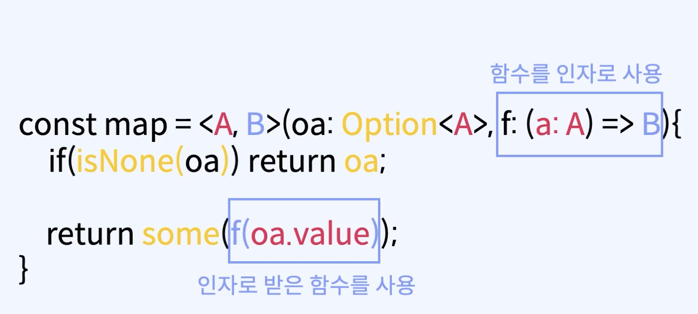
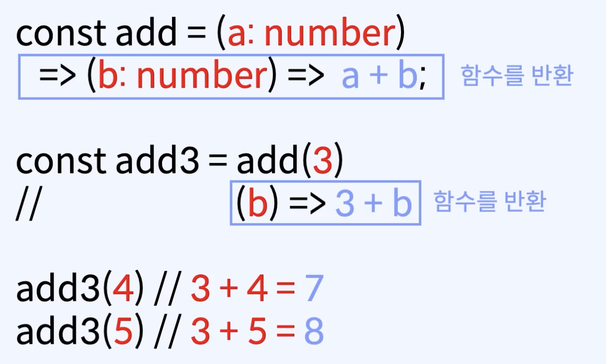

# 부분 적용과 커링 

## 함수를 인자로 받는 고차함수 
 - 
 - 활용
   -  재사용성 증가
      - 반복적이지만 조금씩 다른 일을 하는 코드에서 같은 부분을 하나의 함수로 추상화하고, 다른 부분 작업을 하는 부분만 함수의 인자로 분리가 가능하다.

## 함수를 반환하는 고차함수
 -  
 - 활용 예시
   - 일부 인자들을 미리 입력 받아 함수를 재사용하는 기법

## 부분적용과 커링 간단 비교 - 함수를 재사용하는 기법 
 - 부분 적용
   - 정의
       - 여러 매개변수를 받는 함수에 일부 인자만 미리 적용해서, 나머지 인자를 받는 함수 만들기
   - 예시 - 적용 전
       -  ```
            (a :A, b: B, c: C) => D  
          ``` 
   - 예시 - 적용 후
       - ```
            (a: A, b: B) => (c: C) => D 
         ```   
 - 커링
   - 정의
       - 여러 매개변수를 받는 함수를 한 개의 인자만 받는 단인자 함수들의 함수열로 만들기
   - 예시 - 적용 전
    - ```
        (a: A, b: B, c: C) => D 
      ``` 
   - 예시 - 적용 후
     - ```
        (a:A) => (b: B) => (c: C) => D 
       ```
  - 커링과 부분 적용과 약간 다른 점을 고찰해보자

## 부분 함수(Partial function) 리마인드
 - 매개 변수로 가능한 값들 중에 일부 경우에만 반환 값이 있는 함수
 - 부분적용과 커링과 전혀 다르다.

## Partial Application (부분 적용)
 - 정의
   - 인자가 여러 개인 함수의 전체 인자 중 인자 몇 개를 고정하여 더 작은 개수의 인자를 가지는 또 다른 함수를 생성하는 프로세스
 - 베이스 예제
     - ```
        const delivery = (prensent: string, from: string, to: string) => {
          return `
            보내는 물건: ${present}
            보내는 사람: ${from}
            받는 사람: ${to}
          `;
        }

        export const main =()=> {
          console.clear();

          console.log(delivery("상품권", "엄마", "아들"));
          console.log(delivery("상품권", "엄마", "딸"));
          console.log(delivery("상품권", "엄마", "할머니"));
        }
       ```
        - 개선 사항
          - 만약 '엄마'가 '상품권'을 보낼 횟수가 매우 많다면? (상품권과 엄마 고장)
          - 이 경우 partial Application을 적용하면 함수 재사용을 쉽게 만들 수 있다.
 - 예제1 - partial Application 적용
     - ```
        const delivery = (prensent: string, from: string) =>  (to: string) => {
          return `
            보내는 물건: ${present}
            보내는 사람: ${from}
            받는 사람: ${to}
          `;
        }

        export const main =()=> {
          console.clear();

          const momsPresent = delivery("상품권", "엄마")
          console.log(momsPresent("아들"));
          console.log(momsPresent("딸"));
          console.log(momsPresent("할머니"));
        }
       ```
         - partial Application에 의해 번거로운 입력이 줄어들었다.
         - 함수를 재사용하기 쉬워졌다.
         - 기타
           -  partial application은 앞에서 부터 뒤의 함수를 순차적으로 함수를 실행시키지 않고 뒤에서 부터 순차적으로 앞의 함수를 함수를 실행이 가능하다.
  
## currying (커링)
 - 정의
   - 인자가 여러 개인 함수를 인자가 하나인 함수들의 함수열(seqeunce of functions)로 변환시킨다.
 - 주석
   - 함수열은 함수가 함수를 연속적으로 반환함을 의미한다. 
   - currying이 완료된 함수를 curried function이라고 한다.
       - curried function 표기 예시 : (A) => (B) => (C) => D

## currying 예제
- 베이스 예제 
   - ```
      const delivery = (prensent: string, from: string, to: string) => {
        return `
          보내는 물건: ${present}
          보내는 사람: ${from}
          받는 사람: ${to}
        `;
      }

      export const main =()=> {
        console.clear();
       
      }
     ```
- 예제 1 / currying 적용
  - ```
      // 코드 변경! 
      const delivery = (prensent: string) => (from: string) => (to: string) => {
        return `
          보내는 물건: ${present}
          보내는 사람: ${from}
          받는 사람: ${to}
        `;
      }

      export const main =()=> {
        console.clear();
        
      } 
      ```
      - 의문
        - qurrying 단점으로 함수 호출 시 순서에 맞는 인자를 넣었음을 어떻게 보장할 수 있을까? 함수의 인자 별 별도 type 정의를 통해 타입스크립트 컴파일러로 확인하면 해결이 될까?
        - delivery의 첫 호출인 왜 to 인자를 호출하는 함수에서 이전에 함수의 인자였던 해당 present에 접근이 가능할까? 함수 안에서 또 함수를 호출했기 때문에 바깥 스코프 인자에 접근이 가능걸로 추측하면 될까?

## currying 예제 2 - auto curried function generator
 - 개선 방향
    - 직접 수작업으로 currying으로 변환하는 것보다 임의의 함수를 curried function으로 변환해주는 함수를 만들어 볼 수 도 있다.
    - 가변적인 인자를 curried function으로 만드는 것은 까다로우므로, 여기 에제에서는 3개의 인자만을 가정하고 만든다향
 - 베이스 예제
    - ```
        const delivery = (prensent: string, from: string, to: string) => {
          return `
            보내는 물건: ${present}
            보내는 사람: ${from}
            받는 사람: ${to}
          `;
        }

        export const main =()=> {
          console.clear();
        
        }
      ```
 - 예제 1 / 가변 인자(3개 기준) curried function 제작
    - ```
        const delivery = (prensent: string, from: string, to: string) => {
          return `
            보내는 물건: ${present}
            보내는 사람: ${from}
            받는 사람: ${to}
          `;
        }

        // 코드 변경!
        const curry3 = <A, B, C, D>(f: (a: A, b: B, c: C) => D) =>
           (a: A)=> (b: B) => (c: C) => f(a, b, c)
    

        export const main =()=> {
          console.clear();
        
        } 
      ```
 - 예제 2 /  
    - ```
      const delivery = (prensent: string, from: string, to: string) => {
        return `
          보내는 물건: ${present}
          보내는 사람: ${from}
          받는 사람: ${to}
        `;
      }

      const curry3 = <A, B, C, D>(f: (a: A, b: B, c: C) => D) =>
          (a: A)=> (b: B) => (c: C) => f(a, b, c)

      const curriedDelivery = curry3(delivery);

      export const main =()=> {
        console.clear();

        const mamsPresent = curriedDelivery("상품권")("엄마");
        console.log(momsPresent("아들"));
      } 
      ```
       - 주석
         - 일부 함수형 프로그래밍 언어는 인자가 여러 개인 함수 대신 기본적으로 커링된 함수를 사용하는 경우도 있다.

## 참고
 - https://fastcampus.co.kr/courses/207789/clips/