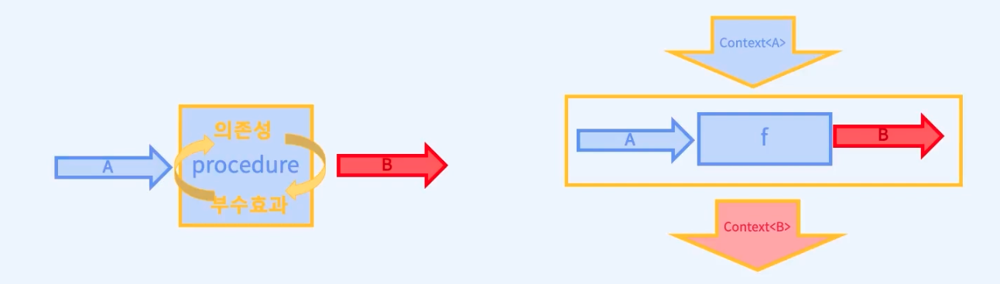

# map의 본질


## 예제 1
- ```
    import * as O from './option';

    export const curry2 = <A,B,C>(f: (a: A, b: B) => C) => (a: A) => (b: B) : C => f(a, b);

    export const flip = <A, B, C>(f: (a: A, b: B) => C) => (b: B, a: A) : C => f(a, b);

    // Array<A> == A[]
    // map :: (Array<A>, (A => B)) => Array<B>
    export const map = <A, B>(array<A>, f(a: A) => B) : Array<B> => {
        const result: Array<B> = [];
        for (const value of array) {
            result.push(f(value));
        }
        return result;
    };

    export const main = () => {
        const numbers = [1,2,3];
        const isEven = (x: number) => x % 2 === 0;

        map(numbers, isEven);

        // curriedMap :: Array<A> => ((A => B) => Array<B>)
        const curriedMap = curry2(map);
        curriedMap(numbers)(isEven);

        // map :: Array<A> ~> (A => B) => Array<B>
        numbers.map(isEven);

        //  map_ :: (A => B) => Array<A> => Array<B>
            //  참고
                // (A => B) : A 타입의 인자를 받아서 B타입의 값을 출력하는 함수를 인자로 받는다(map_은 curried function임을 명심하자. (A => B)는 isEven을 의미한다.)). 괄호로 묶은 이유는 함수 전체가 하나의 인자이기 때문이다(첫 currying을 강조하기 위해서!)
                // 커링된 함수이기 때문에 개별적인 함수의 매개변수가 되어야 해서 => 로 연결된다. 
                // Array<A> : 실제 사용 할 값
                // 커링된 함수이기 때문에 개별적인 함수의 매개변수가 되어야 해서 => 로 연결된다. 
                // Array<B> : map 함수 실행 결과
            // 참고 2
                // map_은 순차적으로 호출 될 커링의 인자들에 대한 타입임을 명심해야 한다.
        const map_ = curry2(flip(map));

        //  의문
             // map_은 flip에 의해서 (A => B) => Array<B> => Array<A>로 되지 않을까라고 생각이 들 수 있으나, isEvent과 numbers는 map의 인자이다. 그러므로 flip이 아닌 map_은 flip과 독립되게 타입을 가져야 한다.
        map_(isEven)(number2);

        // isEven :: number => boolean
        // mapIsEven :: Array<number> => Array<boolean>
            // 참고
                     // map에 의해 isEvent의 타입이 배열 처리 됨
        const mapIsEven = map_(isEven);
    }
  ```
    - mapIsEven
        - map을 통해 isEven 타입이 배열화 됨을 알 수 있다.

## 예제 2 - map은 lifting 효과를 가진다.
- ```
    import * as O from './option';

    export const curry2 = <A,B,C>(f: (a: A, b: B) => C) => (a: A) => (b: B) : C => f(a, b);

    export const flip = <A, B, C>(f: (a: A, b: B) => C) => (b: B, a: A) : C => f(a, b);

    // Array<A> == A[]
    // map :: (Array<A>, (A => B)) => Array<B>
    export const map = <A, B>(array<A>, f(a: A) => B) : Array<B> => {
        const result: Array<B> = [];
        for (const value of array) {
            result.push(f(value));
        }
        return result;
    };

    export const main = () => {
        const numbers = [1,2,3];
        const isEven = (x: number) => x % 2 === 0;

        map(numbers, isEven);

        // curriedMap :: Array<A> => ((A => B) => Array<B>)
        const curriedMap = curry2(map);
        curriedMap(numbers)(isEven);

        // map :: Array<A> ~> (A => B) => Array<B>
        numbers.map(isEven);

        // 코드 변경!
        //  map_ :: (A => B) => (Array<A> => Array<B>)
            // map_(isEvent) 시 (A => B)는 A: string, b: boolean이 된다. 
        const map_ = curry2(flip(map));

        map_(isEven)(number2);

        // isEven :: number => boolean
        // mapIsEven :: Array<number> => Array<boolean>
        const mapIsEven = map_(isEven);
    }
  ```
## map에 lifting 적용
  - map 함수를 사용해서 일반적인 순수함수를 부수효과를 동반하는 타입에 대해서 동작하는 함수로 변환하는 과정
  - 예시
    - ```
        isEven은(42);
        mapIsEven([42]);
      ```
## Option에 lifting 적용 
  - liting은 배열에만 가능한 것이 아니다.
  - 예시
    - ```
         const omap = curry2(flip(O.map));

         // 타입 스크립트 상 타입 추론
         //     const optionIsEven : (b: Option<number>) => O.Option<boolean>
         // 커링상 타입 추론
         //     optionIsEven :: Option<number> => Option<boolean>
         const optionIsEven = omap(isEven);

         optionIsEven(O.some(42));
         optionIsEven(O.None());
      ```
## 결론
 - map 함수에 직접 인자값을 넣는 게 아닌, 다른 함수의 출력값이 입력된다면, 즉 함수를 합성해서 쓴다면 그 위력은 배가 된다.
 - 부수효과를 추상화한 자료구조인 배열과 옵션을 만들어보고 사용했다.
 - 이 자료구조들에는 map이라는 부수효과를 동반하는 데이터에 순수함수를 적용할 수 있는 공통적인 인터페이스를 가지고 있는 함수를 발견했다.
 - 공통적으로 추상화 되어있는 인터페이스를 가진 map이라는 함수에 의해서, 순수한 함수를 서로 다른 부수효과에 적용할 수있는 효과(map의 입력타입과 출력타입이 다른 것 처럼)가 생긴 것이다.
 - 이러한 과정을 통해 부수효과를 찾아내고, 분리하고, 공통적으로 추상화 시키는 방법에 대한 이야기였다.
 - functor와 map에 대해서 얘기시, map 함수의 일반적인 의미를 이야기했다면, 이번 섹션에서는 map의 실용적인 쓰임을 얘기했다.
 - functor(구조 보존 측면에서)를 실용적으로 해석한다면 map 함수를 이용해서 부수효과가 없는 순수함수를 부수효과를 다루는 함수로 만들어주고, 이것이 특정한 부수효과가 아니라 다양한 부수효과에 범용적으로 적용 가능한것이 아닐까란 의문이 든다.
 - map 함수 이외에 다양한 타입에 대해 추상화 할 수 있는 다양한 함수가 존재한다. (flatMap 포함)
 - currying 된 map 함수를 만드는 과정에서 map 함수가 일반적인 순수함수를 부수효과를 동반하는 타입에 대한 함수로 변환하는 과정을 알아보았고, 그를 통해 하나의 함수를 여러 부수효과에 대해서 사용할 수 있다는 것도 알아보았다.

## 의문
 - 목록
   - 부수효과를 동반하는 데이터의 의미
       - 부수효과는 결과값 이외의 값을 바꿈을 의미하는 데, 해당 예제들에서 무슨 값을 바꾸는지 잘 모르겠다.
   - 순수함수를 부수효과를 동반하는 타입에 대한 함수로 변환하는 과정록
 - 의문들의 답
   - 참고
       - 
         - 부수 효과를 찾아내고, 분리해서 공통적인 방법으로 추상화
         - 같은 타입의 값이 반복되면 Array로 다루고, 값이 없을 수 있다는 부수효과는 Option을 통해 표현했다.
         - 순수함수를 부수효과의 맥락에서 다룰수있게 해주는 map이라는 공통적인 인터페이스에 대해서 이야기를 하였다.
       - 제네릭과 고차함수를 사용하면 함수를 보다 일반화 시킬 수 있다. 
   - 답
     - currying 등의 기법은 함수의 합성을 쉽고 안전하게 하기 위한 방법이다.
     - curried function의 인자를 하나하나씩 순차적으로 넣을 때마다 인자의 타입 또는 리턴 값의 타입이 바뀐다.
     - 함수 합성을 통해서, 부수효과를 찾아내고, 분리해서 공통적인 방법으로 추상화 했다. 
     - 즉 함수 합성의 효과 중 하나로 순수함수의 부수효과를 격리 시킴으로써 의문의 답을 내릴 수 있다.
## 참고
 - https://fastcampus.co.kr/courses/207789/clips/