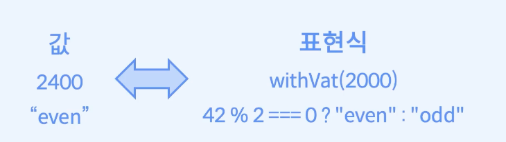

# 숨겨진 부수효과의 위험

## Try - 명령형 프로그래밍
 - ```
    const tenDividedBy = (n: number) : number => {
        in (n ===0) {
            throw new Error("0으로 나눌 수 없습니다");
        }

        return 10 /n;
    }

    const main = () => {
        try {
            return tenDivided(0);
        } catch(e) {
            return 1;
        }
    }
   ```
    - 예외가 발생할 가능성이 있는 코드를 Try 안에 삽입하고, catch문에서 에러에 대한 적절한 처리를 제공한다.
    - throw를 통해 개발자가 직접 에러를 발생시킬 수 있다. 
    - throw를 Try를 통해 잡아낼 수 있다면 코드 실행 중단은 거기서 중단되고, catch 블록으로 이동해서 코드가 계속 실행된다. 이는 에러가 발생했을 때 컴퓨터가 어떠한 처리를 할 지 명령을 내리는 방식에 가깝다.
    - 예외를 Try catch문을 통해 처리하는 방식은 부수효과에 해당한다.


## Try의 타입 - 함수형 프로그래밍
 - 


## 참조 투명성
 - 정의
    - 표현식(expression)을 그것을 평가한 값으로 대체하거나 또는 그 반대로 값을 표현식으로 대체하더라도 프로그램의 동작이 변하지 않으면 해당 표현식을 참조 투명하다고 한다.
        - 
    - 표현식이 참조 투명하기 위해서는 표현식이 순수해야 한다. 즉, 동일한 입력에 대한 표현식의 값은 항상 동일해야 하고, 해당 평가에 부수효과가 없어야 한다.
        -  
 - 알아야 하는 이유
    - try-catch가 포함된 함수는 순수 함수가 아니고, 함수 합성이 어렵다. 함수 합성이 어려워지는 이유를 알려면 참조 투명성을 알아야만 한다.

## 참조 reference 
 - 참조는 어떤 값이나 표현식을 가리키는 간접적인 방식
 - 예제
    - ```
        const w = 2;
        const x = 3;
        const y = w * x;
        const z = x - (y-y) + w; //5
      ```
        - const로 선언되었기 때문에 값 또는 표현식은 변경될 일이 없다. 
        - y는 w, x를 참조하고, z는 x, y, w를 참조한다.
        - w는 2라는 값을 참조하고,
        - y는 w * x이란 표현식을 참조한다.


## 투명 transparency
 - 정의
    - 등호의 오른쪽에 있는 어떤 기호라도, 표현식으로 변경하거나 또는 어떤 표현식을 그것을 가리키는 변수(참조)로 변경하더라도 평가의 결과가 바뀌지 않을 때를 참조에 투명하다고 의미한다.
 - 예시
    - ```
        const z = x - (y-y) + w;

        // z의 값을 표현식으로 변경
        // 평가의 결과는 다르지 않다.
        const z = x - ((w * x) - (w * x)) + w;

        // z의 값을 표현식 중 x를 참조값 3으로 변경하면 
        // 평가의 결과는 다르지 않다.
        const z = 3 - ((w * x) - (w * x)) + w; 
        ``` 
         - **수식의 특징 중 하나는 수식에 나타난 변수들을 그것이 참조하는 표현식으로 변경해도 그 값은 항상 같다는 것이다.**
         - z의 표현식의 참조를 계산하면 5가 된다. z의 표현식에 있는 변수들을 그 변수가 참조하는 값이나 표현식으로 변경해도 z의 값은 변경이 없다. 이를 참조의 투명이라고 표현한다.
 - 기타
    - 변수는 자신이 참조하는 표현식을 가리는 것 없이, 언제라도 변화 없이 그것을 고스란히 드러내므로 투명하다는 표현과 잘 어올린다. (상호 치환이 가능한 이유)
    - 참조 투명성은 수식에만 적용되는 개념이 아니고, 함수 호출 등과 같은 모든 표현식에 적용 할 수 있는 개념이다.

## 참조에 불투명한 경우 
 - 예시
    - ```
        let n = 0;
        n = n + 1; // n:1
        n = n + 1; // n:2
      ```
        - 참조에 불투명한 이유
            - n 값이 statement 실행시마다 변경되고 있다.
            - 특정 statement마다 항상 같은 값을 도출하지 못한다. 이유는 n은 가변 변수이다. 가변 변수의 변경이 포함된 표현식은 실행 시점마다 참조하는 내용이 달라지게 된다.
            - 함수형 프로그래밍에서 불변성을 강조하는 이유이다.
            - 어떤 변수에 할당된 값이 변경될 가능성이 있다면 참조에 투명한 코드를 작성하기 어렵게 되고, 이는 코드의 동작을 예측하기 어렵게 만드는 결과로 이어진다.
 - 참고
   - 이전 예제(생략)에서 전역 변수를 사용 시 발생하는 부수효과를 떠올려본다.
 - 예제 / 평가식(함수)에 부수효과가 포함되어 있을 때
    - ```
        const getPrice = (name) => {
            console.log(`${name}의 가격을 조회`);

            if(name ==='tomato') {
                return 7000;
            } else if(name === 'orange') {
                return 15000;
            } else if(name === 'apple') {
                return 10000;
            }
        }

        const priceOfApple = getPrice('apple');
        console.log(priceOfApple + priceOfApple);

        console.log(getPrice('tomato') + getPrice('tomato'));
        ```
          - getPrice에서 console.log르 하고 있다. 이는 getPrice를 여러 번 반복 한다면 console.log도 그 횟수만큼 반복적으로 출력하게 된다.
          - log 출력 횟수가 달라지는 부분은 프로그램의 동작이 변경됨을 의미한다. (프로그램의 동작에 영향을 미친다.)


## 참조에 투명한 경우
 - 부수효과가 없는 평가식(함수)의 사용
 - 예제 1 - 1
    - ```
        const getPrice = (name) => {
            if(name === 'tomato') {
                return 7000;
            } else if (name === 'orange') {
                return 15000;
            } else if (name === 'apple') {
                return 10000;
            }
        }

        const proceOfApple = getPrice('apple');
        console.log(priceOfApple + priceOfApple); //20000 출력
      ```
 - 예제 1 - 2
    - ```
        const getPrice = (name) => {
            if(name === 'tomato') {
                return 7000;
            } else if (name === 'orange') {
                return 15000;
            } else if (name === 'apple') {
                return 10000;
            }
        }

       // 코드 변경!
       // 결과값이 예제1 - 1과 다르지 않으므로 참조에 투명하다고 말할 수 있다.
       console.log(getPrice('apple')+ getPrice('apple)); // 20000 
      ```
 - 효과
    - 표현식이 참조에 투명하다면 반복적인 표현식을 하나의 변수로 치환하여도 프로그램의 동작이 동일함을 보장하므로, 아무리 복잡한 코드라도 안심하고 리팩토링을 할 수 있게 된다.
    - 함수를 직접 호출해야 할지, 함수를 호출한 값을 사용해야 할지 고민을 할 필요가 없으므로, 함수 합성을 마음 놓고 할 수 있다.
    - 그 외 지연 평가, 병렬 실행 등을 통한 코드 최적화가 가능하다.
    - **순수 함수형 언어들이 부수효과를 최소화하고 불변성을 강조하는 이유는 코드의 대부분을 최대한 참조 투명하게 만들어 이와 같은 장점을 취하기 위해서이다.**


## 구문 Statement
 - 정의
    - 독립적으로 실행이 가능한 코드의 조각
 - 예시
    - if문
    - for문

## 표현식 expression
 - 정의
    - 구문 내 연산(예시로 사칙연산, 삼항 연산자 등)을 통해 **값으로 평가 가능한 코드 조각**
    - Statement (구문)의 일종
    -  
 - 주석
    - 구문은 실행이 되고나면 어떤 값으로 치환이 가능하다.
    - 값으로 변경되는 부분을 표현식이라고 한다.
    - 실행해서 값을 구하는 과정을 평가한다고 표현한다.

## 평가 evaluation
 - 정의
    - 값으로 평가 가능한 코드 조각
    - 표현식을 평가해서 값을 구하는 과정
    - 코드를 실행해서 값을 구하는 과정
    - 
    
## 평가와 부수효과
 - 평가에 부수효과가 없어야 한다는 의미
    - 같은 코드를 실행했을 때 항상 같은 값으로 평가되어야 한다는 의미이다.
    - 그 코드가 값으로 평가되는 일 이외에 다른 값을 변경하는 일을 해서는 안된다.

## Try의 map
 - Array의 map
    - `map:: (A => B) => Array<A> => Array<B>`
 - Option의 map
    - `map:: (A => B) => Option<A> => Option<b>`
 - Try의 map
    - `map:: ??`


## try-catch와 부수효과
 - 부수효과는 함수를 순수하게 만들 수 없는 모든 동작을 의미한다.
 - 에러 처리도 부수효과의 일종이다.
 - 에러는 경우에 따라 복구가 가능한 경우와 불가능한 경우가 존재한다.
 - 즉 상황에 따라 프로그램을 즉시 중단 시키는 경우가 있을 수 있고, 어떤 경우에는 자신을 호출한 함수에게 에러를 전파하기도 한다. 이 경우 호출한 함수에서 예외처리를 통해 해결한다.

 ## 예외처리 Exception Handling
  -  
  - 정의
    - 프로그램이 정상적으로 실행될 수 없는 예외 상황을 처리하고 대응하는 방법
  - 원인
    - 보통 프로그램 외부에서 들어오는 요인 때문이다.
  - 에러의 문제점
    - 에러 발생 시 에러 라인의 다음 라인의 코드 실행을 하지 못하는 경우가 대부분이다.
    - 그 이유는 작성된 대부분의 코드가 독립적으로 병렬적으로 실행되는 코드가 아닌, 이전 코드 값에 의존해서 다음 동작을 실행되기 떄문이다. 
  - 원인 해결 방법
    - 많은 프로그래밍 언어들이 예외처리 매커니즘을 제공한다.
    - 에러가 발생했을 경우 프로그램을 즉시 종료시키는 대신 에러가 발생했다는 사실을 알리고 코드를 재실행한다던지, 유저에게 어떤 종류의 에러가 발생했는지 알린다는 등의 적절한 처리를 프로그래머에게 위임을 시킨다.
  - try-catch 
     - 예외처리 매커니즘의 대표적인 방법이 try-catch를 통해서 에외처리를 한다.
     - 그외 방법으로 프로그래머가 직접 에러를 발생시키는 throw 구문을 제공한다.
     - 만약 try-catch 구문이 존재하지 않는다면 에러가 발생하는 코드들을 하나의 블록으로 묶어서 사용하지 못하고, 에러가 발생하는 코드마다 if문으로 에러를 검사해야 했을 것이다.
     - if문을 반복 사용하는 것보다 try-catch 구문이 편리성이 있지만 단점도 분명 존재한다.
     - try-catch는 예외를 다루는 방식에 따라 프로그램의 실행 흐름을 변경하는 부수효과가 발생하기 때문에, 순수함수가 아니다. 따라서 합성이 어렵다.
  - 예외처리가 필요한 예시
    - 잘못된 사용자 입력
    - 요청
    - 외부 상태
    - 통신 에러
    - 기기 결함 등등 

## 참고
 - https://fastcampus.co.kr/courses/207789/clips/