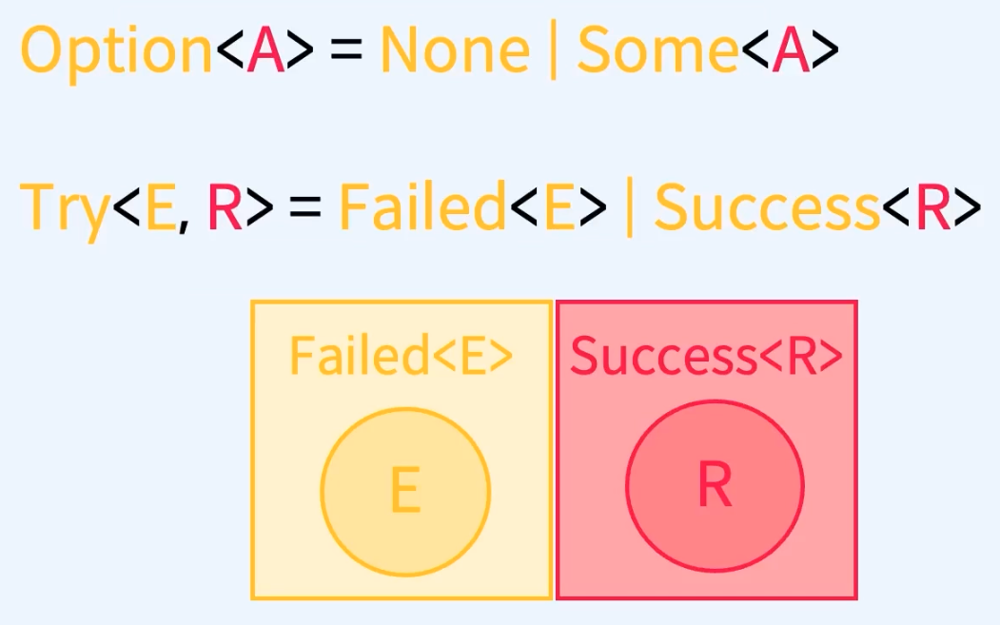
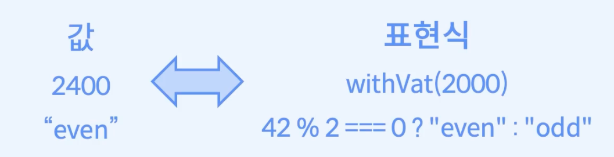
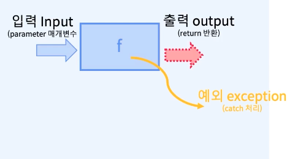

# 숨겨진 부수효과의 위험

## Try - 명령형 프로그래밍
 - ```
    const tenDividedBy = (n: number) : number => {
        in (n ===0) {
            throw new Error("0으로 나눌 수 없습니다");
        }

        return 10 /n;
    }

    const main = () => {
        try {
            return tenDivided(0);
        } catch(e) {
            return 1;
        }
    }
   ```
    - 예외가 발생할 가능성이 있는 코드를 Try 안에 삽입하고, catch문에서 에러에 대한 적절한 처리를 제공한다.
    - throw를 통해 개발자가 직접 에러를 발생시킬 수 있다. 
    - throw를 Try를 통해 잡아낼 수 있다면 코드 실행 중단은 거기서 중단되고, catch 블록으로 이동해서 코드가 계속 실행된다. 이는 에러가 발생했을 때 컴퓨터가 어떠한 처리를 할 지 명령을 내리는 방식에 가깝다.
    - 예외를 Try catch문을 통해 처리하는 방식은 부수효과에 해당한다.


## Try의 타입 - 함수형 프로그래밍
 - 


## 참조 투명성
 - 표현식(expression)을 그것을 평가한 값으로 대체하거나 또는 그 반대로 값을 표현식으로 대체하더라도 프로그램의 동작이 변하지 않으면 해당 표현식을 참조 투명하다고 한다.
  - 

## Try의 map
 - Array의 map
    - `map:: (A => B) => Array<A> => Array<B>`
 - Option의 map
    - `map:: (A => B) => Option<A> => Option<b>`
 - Try의 map
    - `map:: ??`


## try-catch와 부수효과
 - 부수효과는 함수를 순수하게 만들 수 없는 모든 동작을 의미한다.
 - 에러 처리도 부수효과의 일종이다.
 - 에러는 경우에 따라 복구가 가능한 경우와 불가능한 경우가 존재한다.
 - 즉 상황에 따라 프로그램을 즉시 중단 시키는 경우가 있을 수 있고, 어떤 경우에는 자신을 호출한 함수에게 에러를 전파하기도 한다. 이 경우 호출한 함수에서 예외처리를 통해 해결한다.

 ## 예외처리 Exception Handling
  -  
  - 정의
    - 프로그램이 정상적으로 실행될 수 없는 예외 상황을 처리하고 대응하는 방법
  - 원인
    - 보통 프로그램 외부에서 들어오는 요인 때문이다.
  - 에러의 문제점
    - 에러 발생 시 에러 라인의 다음 라인의 코드 실행을 하지 못하는 경우가 대부분이다.
    - 그 이유는 작성된 대부분의 코드가 독립적으로 병렬적으로 실행되는 코드가 아닌, 이전 코드 값에 의존해서 다음 동작을 실행되기 떄문이다. 
  - 원인 해결 방법
    - 많은 프로그래밍 언어들이 예외처리 매커니즘을 제공한다.
    - 에러가 발생했을 경우 프로그램을 즉시 종료시키는 대신 에러가 발생했다는 사실을 알리고 코드를 재실행한다던지, 유저에게 어떤 종류의 에러가 발생했는지 알린다는 등의 적절한 처리를 프로그래머에게 위임을 시킨다.
  - try-catch 
     - 예외처리 매커니즘의 대표적인 방법이 try-catch를 통해서 에외처리를 한다.
     - 그외 방법으로 프로그래머가 직접 에러를 발생시키는 throw 구문을 제공한다.
     - 만약 try-catch 구문이 존재하지 않는다면 에러가 발생하는 코드들을 하나의 블록으로 묶어서 사용하지 못하고, 에러가 발생하는 코드마다 if문으로 에러를 검사해야 했을 것이다.
     - if문을 반복 사용하는 것보다 try-catch 구문이 편리성이 있지만 단점도 분명 존재한다.
     - try-catch는 예외를 다루는 방식에 따라 프로그램의 실행 흐름을 변경하는 부수효과가 발생하기 때문에, 순수함수가 아니다. 따라서 합성이 어렵다.
  - 예외처리가 필요한 예시
    - 잘못된 사용자 입력
    - 요청
    - 외부 상태
    - 통신 에러
    - 기기 결함 등등 

## 참고
 - https://fastcampus.co.kr/courses/207789/clips/