# 6장 스트림 코딩 정리

- NodeJS 디자인 패턴 바이블 스터디 발표용

## 개요 (다룰 내용)

1. 스트림 개념 이해
2. Node.js에서 스트림이 중요성 발견
3. Stream의 이해와 사용 및 생성

## 다루지 않는 내용

4. 프로그래밍 패러다임으로서의 Stream : I/O 뿐만 아니라, 다양한 상황에서 강력한 기능의 활용
5. 여러 환경에서의 스트리밍 패턴 및 스트림 연결

## 참고

- Rx 공식 페이지 (<https://reactivex.io/intro.html>)
- RxJS 공식 페이지 (<https://rxjs.dev/guide/observable>)
- Node.js 디자인 패턴 바이블 - 6장

## 1. 스트림이란?

- 스트림은 OOP, FP와 같은 수준의 프로그래밍 `패러다임`이다.

### 1. 왼쪽에서 오른쪽으로 흐른다. (단방향성)

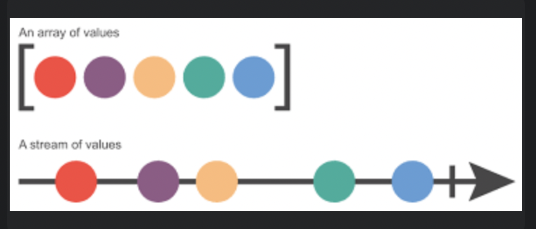

### 2. 지연평가가 가능하다

- 이터레이터 프로토콜 처럼, 필요한 순간에 지연 평가를 할 수 있다.
- 각 요소를 시간축의 인덱스로 다룰 수 있다.

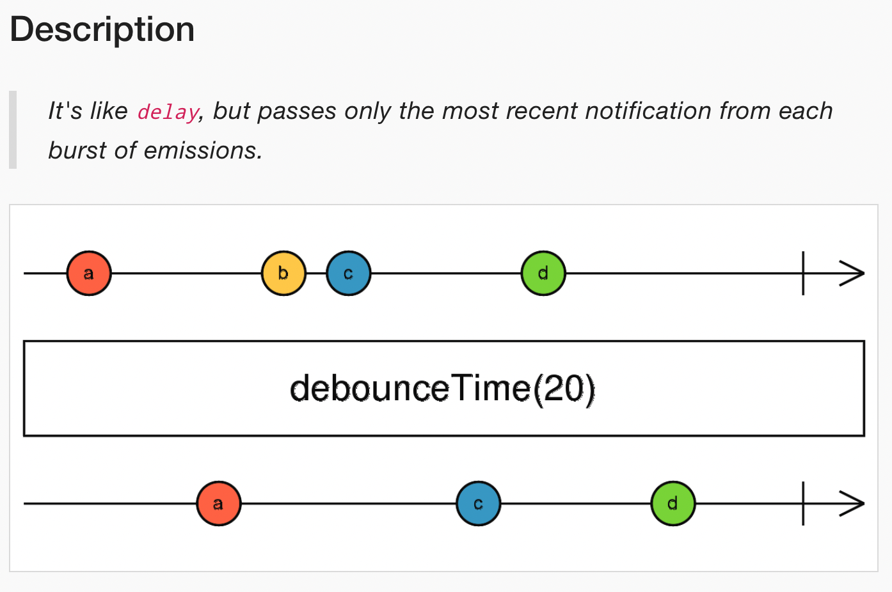

### 3. Observer 패턴상 생산자(Subject), 소비자(Observer) 관점

- 생산자가 소비자에게 단방향으로 데이터를 `notify()`를 통해서 Push한다.
- 소비자는 생산자가 Push한 데이터를 관찰(생산자에 의해서 `update()` 메서드가 호출됨.)한다.

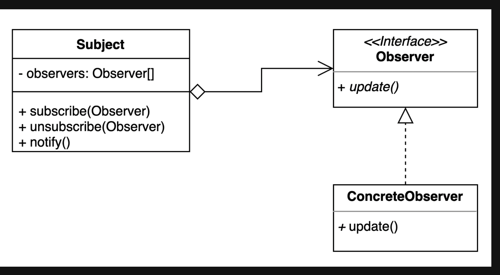

## 4. RxJS Stream의 구현체인 Observable로 Push, Pull 기반 데이터 처리 이해하기

### 고민거리

- 왜 함수와 Iterator는 Pull 기반인가?
- 왜 Observable과 Promise는 Push 기반인가?
- Single, Multiple로 구분지어지는 이유는 무엇인가?
- Promise의 단점은 무엇인가?
  - 단일 값만 생성 가능
  - 재실행 불가능
  - 중도 취소 불가능

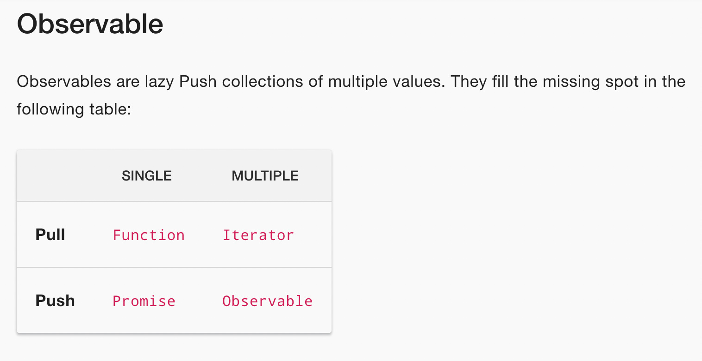
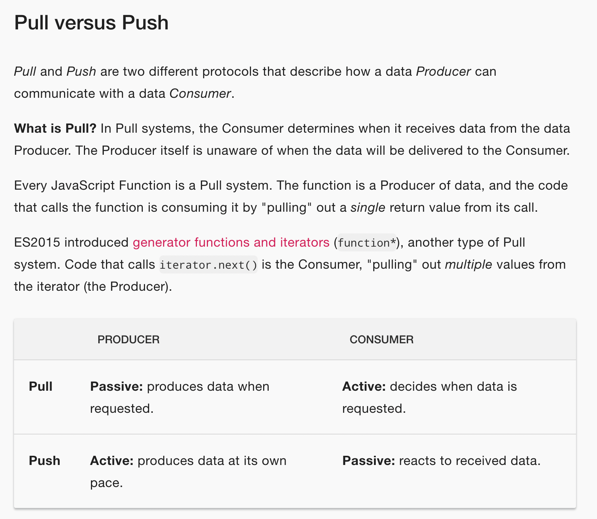
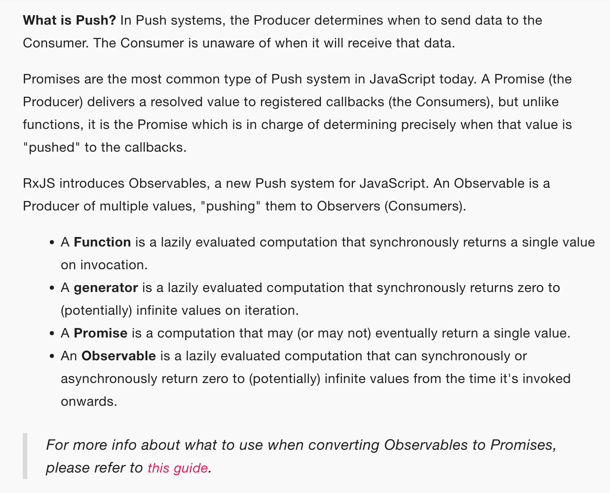

## 2. 스트림의 중요성 발견

### 1. Node.js 환경인 이벤트 기반 플랫폼 측면에서, I/O를 처리하는 가장 효율적인 방법

- 실시간으로 사용할 수 있는 즉시 사용하고,
- 애플리케이션이 처리하는 즉시 출력을 내보는 것

### 2. 버퍼링 대 스트리밍 비교하기

- 예시, "Hello node .js"  문자열 수신하기

#### 버퍼링 방식


- 소비자에게 전체 리소스 단위로 전달한다.

#### 스트리밍 방식

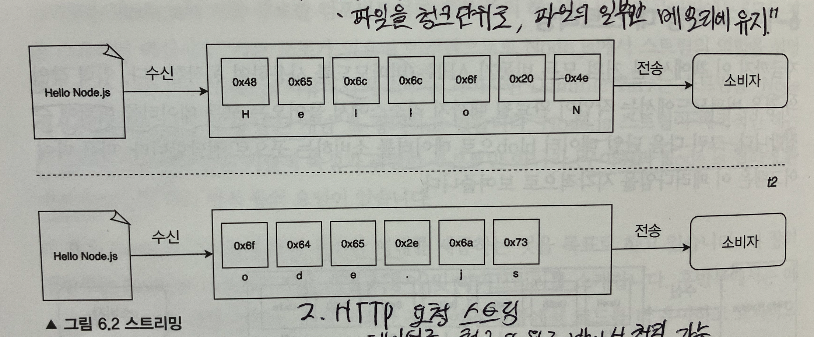

- 소비자에게 전체 리소스를 순차적으로 청크 단위로 전달한다.

## 스트림 방식의 장점

### 1. 도식화

- 프로세스가 완전히 *순차적*이다.
- *청크를 수신하자마자, 바로 조립라인*이 시작된다.
- 다른 청크를 사용할 수 있을 때, 이전 데이터 청크의 작업이 완료 될 때 까지 기다릴 필요가 없다.
- 대신 *다른 조립라인이 병렬*로 시작된다.
  - 이는 각 작업이 비동기적이므로, Node.js에 의해 병렬화 처리된다.
- 유일한 제약은 각 단계에 도착하는 순서를 유지하는 것이다.
  - Node.js 스트림 내부 구현에서 자동으로 순서가 유지됨.

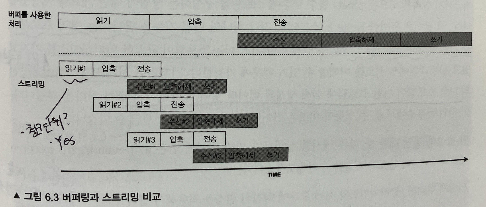

### 2. 공간의 효율성

- 예시로, 매우 커다란 파일인 경우, 큰 파일을 몇 개 동시에 읽는다고 가정 시
  - 버퍼링 방식은, V8 버퍼의 크기 제한으로 인해, *한정된 할당 가능한 메모리가 부족*해질 수 있다.
  - 스트리밍 방식은, 파일을 청크 단위로 읽기 때문에, *청크 단위의 버퍼만 할당*하면 된다.

### 3. 시간의 효율성

- 예시로, 클라이언트에서 서버로 압축된 파일을 업로드한 후, 서버에서 압축을 해제 후 파일 시스템에 저장하는 경우
  - 버퍼링 방식은 생략
  - 스트리밍 방식
    - 클라이언트는, 파일 시스템에서 읽은 즉시 데이터 청크를 압축하고 전송할 수 있다.
    - 서버는, 청크 단위로 수신하는 즉시, 청크 단위로 압축을 해제하고 파일 시스템에 저장할 수 있다.

### 4. 스트리밍 방식 예제 : 압축 파일 전송하기

- 클라이언트 (생성자)

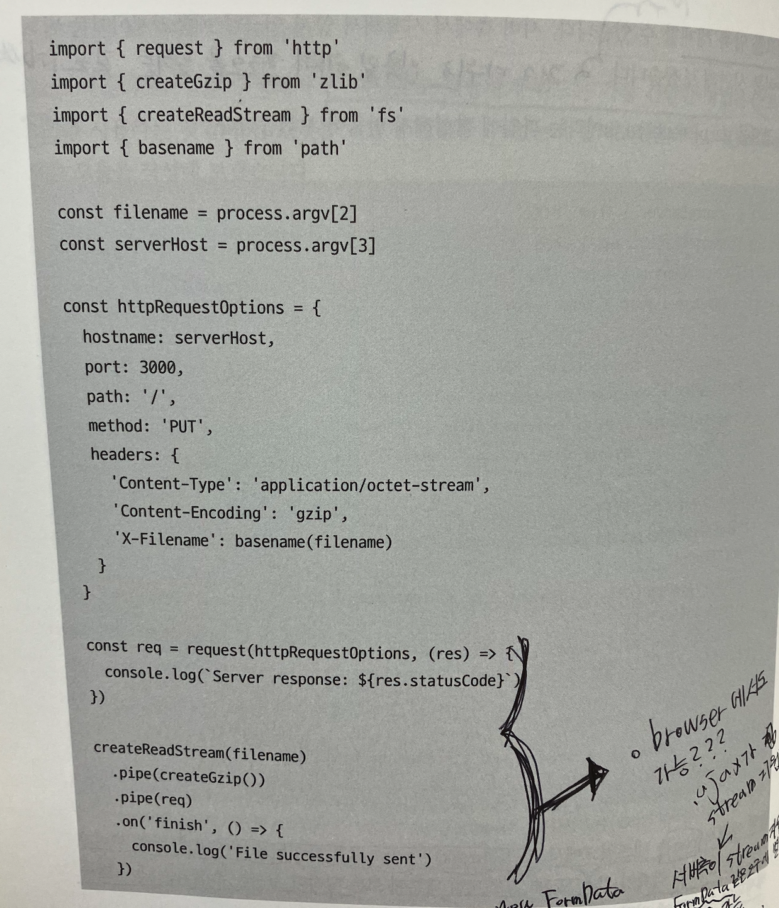

- 서버 (소비자)


### 5. pipe 개념으로 조립성 이해하기

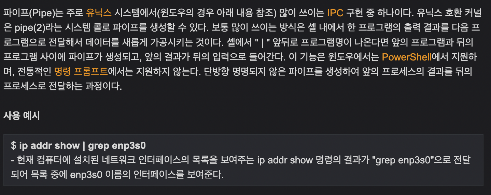

- `pipe()` 함수 내부를 통해서 단일 목적을 담당하는 여러 프로세스(기능 또는 Operator)들을 연결한다

- 연결이 가능한 이유
  - (호환성 측면) 스트림이 단일 인터페이스 제공
  - 즉, 파이프라인의 다음 스트림이 이전 스트림에 의해 생성된 데이터 형태(유형)을 지원해야 한다.
- 스트림은 모듈화된 코드 및 조합을 통한 기능의 확장을 가능하게 한다. (위 소스코드 참고)

## 스트림 시작하기

### 특징

- Node의 `HTTP 요청 및 응답 객체`는 *기본적으로 스트림*이다.
- Node에서 제공하는 *모든 스트림은 EventEmitter의 인스턴스*이다.
  - Emit(방출 또는 Push) 및 subscribe(구독 또는 Observable)이 가능해야 한다.
  - 이것이, 단일 인터페이스로 스트림 간 호환성을 제공할 수 있는 이유이다.

### 모드

1. binary 모드
    - 버퍼 또는 문자열과 같은 청크 형태로 데이터를 수신한다.
2. 객체 모드
    - 데이터를 일련의 개별 객체로 스트리밍한다. (JSON, XML, CSV 등)

### 기본적인 4가지 스트림

1. Readable
2. Writable
3. Duplex
4. Transform

## Readable 스트림

### 1. non-flowing 모드

- `pause 모드`(*Stream이 흐르지 않는다*)라고도 표현한다.
- 동작
    1. 읽을 수 있는 데이터가 있는 경우, 호출되는 `readable 이벤트`에 리스너를 연결하는 작업이 포함된다.
    2. 내부 버퍼가 비워질 때 까지 데이터를 계속 읽는다.
    3. (*non-flowing 고유 특징으로*) `read()` 함수를 통해서, 내부 버퍼에서 동기적으로 데이터를 동기적으로 Pull한다.  

        ```js
        readable.read([size]) // 반환 된 청크는 기본적으로 Buffer 객체이다.
        ```

#### 예제 - stdin 표준 입력(Stream 이기도 함)에서 읽고 모든 것을 표준 출력으로 다시 echo하는 코드

```js
process.stdin
    .on('readable', () => {
        let chunk;
        console.log('New data available');
        while ((chunk = process.stdin.read() !== null)) {
            console.log(`Chunk read: (${chunk.length}) "${chunk.toString()}"`);
        }
    })   
    .on('end', () => process.stdout.write('End of stream'));
```

- 코드 해설
    1. 새로운 데이터가 사용할 수 있는 즉시 호출 되는 `readable 리스너`에서만 읽힌다.
    2. 내부 버퍼에 더 이상 사용 가능한 데이터가 없을 때 null을 반환한다.
    3. 다시 읽을 수 있음을 알려주는 다른 `readable 이벤트`가 시작 될 때 까지 기다리거나, 스트림의 끝을 알리는 `end 이벤트`를 기다려야 한다.

### 2. flowing 모드

- 데이터 이벤트에 리스너를 연결하면, 스트림이 flowing 모드를 사용하도록 전환한다.
- (*flowing 고유 특징으로*) read()를 통해 데이터를 가져오지 않고, 데이터를 수신하는 즉시 바로 데이터 리스너로 전달된다.

#### 예제 - stdin 표준 입력(Stream 이기도 함)에서 읽고 모든 것을 표준 출력으로 다시 echo하는 코드

```js
    process.stdin
        .on('data', (chunk)=> {
            console.log('New data available')
            console.log(`Chunk read: (${chunk.length}) "${chunk.toString()}"`)
        })
        .on('end', () => process.stdout.write('End of stream'));
```

- 그 외 특징으로, `Readable Stream`은 비동기 반복자(Iterator)이다. 즉 이터러블/이터레이터 프로그래밍이 가능하다.

### Readable Stream 구현 방법 1. Readable 프로토타입을 상속하여 새로운 클래스를 만든다

#### 예제 - 무작위 문자열을 생성하는 코드

```js
    import {Readable} from 'stream'; 
    import Chance from 'chance';

    const chance = new Chance();

    export class RandomStream extends Readable {
        constructor (options) {

            // super(options)를 통해서, 부모 생성자 상속 생략 가능
            super(options)
            this.emittedBytes = 0;
        }

        _read (size) {
            const chunk = chance.string({length: size});
            this.push(chunk, 'utf8');
            this.emittedBytes += chunk.length;

            // 5%의 가능성으로 true를 반환한다.
            if(chance.bool({likelihood: 5})) {
                this.push(null);
            }
        }
    }
```

- 코드 설명

    1. `chance`를 통해서, size와 동일한 길이의 무작위 문자열을 생성한다.
    2. 문자열을 내부 버퍼로 밀어넣는다.
    3. EOF 처리를 위해서, 스트림 끝을 나타내는 null을 내부 버퍼로 푸시한다. (5% 확률)

### Readable Stream 구현 방법 2. Readable 프로토타입을 상속하여 새로운 클래스를 만든다

- 복잡한 상태를 관리할 필요가 없는 경우 유용하다.
- 간결한 구문을 활용
- 여러 번 호출을 할 수 있는 팩토리 함수에 초기화 로직을 감쌀 수 있다.

#### 예제 - 무작위 문자열을 생성하는 코드

```js
    import { RandomStream } from './random-stream';

    const randomStream = new RandomStream();

    randomStream
        .on('data', (chunk) => {
            console.log(`Chunk received (${chunk.length}) "${chunk.toString()}"`);
        })
        .on('end', ()=> {
            console.log(`End of stream ${randomStream.emittedBytes}`);
        })
```

## Writable 스트림

- Writable 스트림은 대상 데이터의 목적지를 나타낸다.
- 예시로, 파일 시스템의 파일, 데이터 베이스 테이블, 소켓, 표준 오류 또는 표준 출력 인터페이스 등이 있다.

### 인터페이스 소개

```js
// chunk를 스트림으로 밀어 넣음
writable.write(chunk, [encoding], [callback])

// 더 이상 스트림에 기록할 데이터가 없음을 알림
writable.end([chunk], [encoding], [callback])
```

### 예제 - Writable 스트림: 임의의 문자열 시퀀스를 출력하는 초소형 HTTP 서버


#### 코드 설명

1. HTTP 응답 헤더를 작성한다.
    - `WriteHead()`는 Writable 인터페이스의 일부가 아니다.
2. 5%의 확률로 종료되는 루프를 실행한다.
3. 루프 내에서 임의의 문자열을 스트림에 쓴다.
4. 루프를 벗어나면, 스트림에서 `end()`를 호출하여 더 이상 기록할 데이터가 없음을 나타낸다.
5. 마지막으로 모든 데이터가 기본 소켓으로 플러시 될 때 발생하는 `finish 이벤트`에 대한 리스너를 등록한다.

### 배압(Backpressure)

- 실제 배관 시스템처럼, 스트림이 소비하는 것보다 데이터가 기록되는 `병목 현상`을 겪을 수 있다.
- *대처하는 메커니즘*이 들어오는 데이터를 버퍼링하는 것이다.
- 그러나 스트림이 데이터 생성자에게 피드백을 제공하지 않는 한, 내부 버퍼에 점점 많은 데이터가 축적되어 원하지 않는 수준의 메모리 사용량이 발생하는 상황이 발생할 수 있다.
- 이를 방지하기 위해 `writable.write()`는 내부 버퍼가 `highWaterMark 제한`을 초과하면 false를 반환한다.
- 버퍼가 비어지면 `drain 이벤트`가 발생하여, 다시 쓰기를 해도 안정함을 알린다. 이를 `배압(Backpressure) 메커니즘`이라고 한다.
  > nodejs 공식문서 `drain 이벤트` 설명(<https://nodejs.org/api/stream.html#event-drain>), If a call to stream.write(chunk) returns false, the 'drain' event will be emitted when it is appropriate to resume writing data to the stream.
- 참고로 배압은 권고 메커니즘이다.
  - `write()`가 false를 반환하더라도, 이 신호를 무시하고 쓰기를 계속할 수 있다. 즉 `highWaterMark 임계값`에 도달한다고 스트림이 자동으로 차단되지 않는다.

### Writable 스트림 구현

- Writable Stream을 확장(상속)한다.

#### 예제 - 주어진 경로에 생성된 파일에 content 속성값을 저장하는 Writable 스트림

```js
    // 수신 측
    import {Writable} from 'stream';
    import {promises as fs} from 'fs';
    import {dirname} from 'path';
    import mkdirp from 'mkdirp';

    export class ToFileStream extends Writable {
        constructor (options) {
            super({...options, objectMode: true});
        }   

        _write (chunk, encoding, db) {
            mkdirp(dirname(chunk.path))
                .then(()=> fs.writeFile(chunk.path, chunk.content))
                .then(()=> cb())
                .catch(cb)
        }
    }

    // 발신 측
    import {join} from 'path';
    import {ToFileStream} from './to-file-stream';
    const tfs = new ToFileStream();

    tfs.write({
        path: join(__dirname, 'file1.txt'),
        content: 'Hello'
    });

    tfs.write({
        path: join(__dirname, 'file2.txt'),
        content: 'Node.js'
    });

    tfs.write({
        path: join(__dirname, 'file3.txt'),
        content: 'Streams'
    });
    tfs.end(() => console.log('All files created'));
```

- 참고사항
    1. 함수는 완료될 떄 호출해야 하는 콜백 cb를 받는다. (비동기 완료 시점을 알리기 위함)

## Duplex 스트림

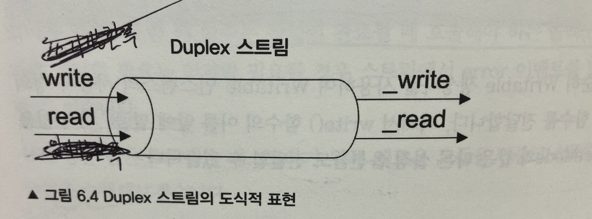

- 이중 스트림이다.
- (데이터의 양방향 흐름 구현 가능) 즉, 읽기 및 쓰기가 가능한 스트림이다.
  - 각각 별도의 버퍼를 가진다.
  - 독립적인 흐름을 관리하고 복잡한 데이터 처리 작업을 효과적으로 수행할 수 있다.
- 예시로, 네트워크 소켓과 같이 데이터 소스이자 데이터 목적지인 엔티티를 설명하는 경우 유용하다.
- 그 외 예시
    1. 네트워크 통신
        - 클라이언트와 서버 간의 양방향 통신을 구현할 수 있다.
    2. 프로세스 간 통신
        - 두 개 이상의 독립된 프로세스 간에 데이터 통신이 필요한 경우에, IPC(Inter-Process Communication)을 구현할 수 있다.
    3. 텔넷(Telnet) 클라이언트 및 서버
        - 텍스트 기반의 양방향 통신을 제공하며, Duplex 스트림을 사용하여 텔넷 클라이언트와 서버를 구현할 수 있다.
    4. 채팅 애플리케이션
        - 실시간 채팅 애플리케이션을 구현할 때, Duplex 스트림을 사용하여 클라이언트와 서버 간의 양방향 통신을 구현할 수 있다.
- `stream.Redable`과 `stream.Writable` *두 스트림의 함수를 상속*한다.
- `read()`, `write()` 및 `drain()` 이벤트 모두를 수신할 수 있다.
- `options 객체`는 내부적으로 Redable 및 Writable 스트림에 전달된다.
- 옵션 중 `allowHalfOpen(기본값 true)`이 false인 경우 Readable 쪽이 끝날 때 스트림이 Writable 쪽을 자동으로 종료하며, 그 반대도 마찬가지이다.

## Transform 스트림

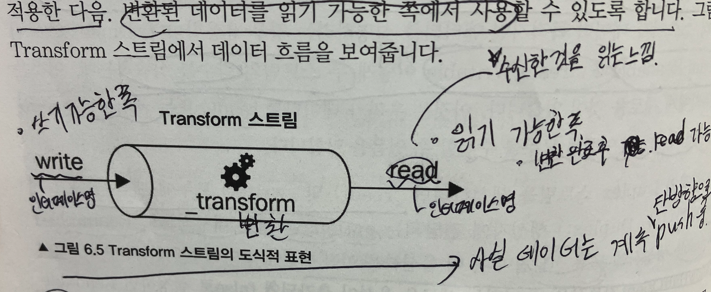

- 데이터 변환을 처리하는 목적으로 사용된다.

## Duplex 스트림과 비교

### 차이점

- 단순 `Duplex 스트림`에서는 스트림에서 읽은 데이터와, 스트림 안에 기록된 데이터 사이에 즉각적인 관계가 없다.
  - 예시로, 소켓은 입력과 출력 사이의 관계를 인식하지 못한다. (소켓 내부에 쓰기 버퍼와 읽기 버퍼가 별도로 존재한다.)
- 반면 `Transform 스트림`은 쓰기 가능한 쪽에서 받은 각 데이터 청크에 일종의 변환을 적용한 다음, 변환된 데이터를 읽기 가능한 쪽에서 사용할 수 있도록 한다.

### 공통점

- (인터페이스가 동일하다) Duplex 스트림과 마찬가지로, `Readable` 및 `Writable` 스트림의 함수를 상속한다.
- 단 Transform 스트림을 구현하려면, `_transform()` 및 `_flush()` 메서드를 별도로 구현해야 한다.

## 예제 - 주어진 항목을 대체하는 Transform 스트림 구현

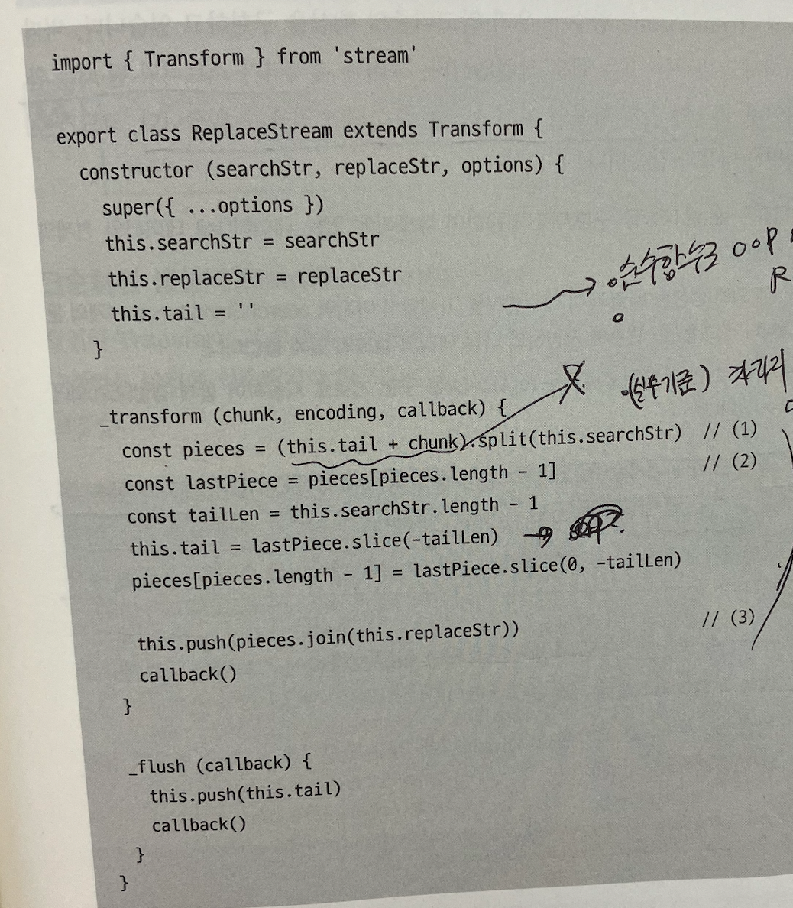

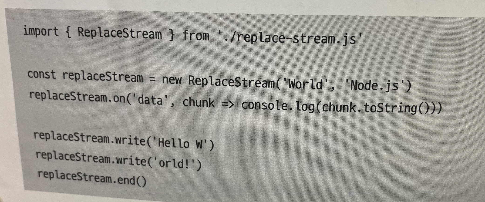

### 코드 설명

1. 생성자에서 내부에서 사용할 tail 변수를 초기화한다.
2. 스트림이 종료될 떄, 내부 버퍼로 푸시되지 않은 tail 변수에 일부 콘텐츠(content)가 있을 수 있다.
    - 이것이 바로 `flush()` 함수의 용도이다.
    - `flush()` 함수는 스트림이 종료 되기 전에 호출되며, 여기에서 스트림을 완료하거나 스트림을 완전히 종료하기 전에 남은 데이터를 푸시할 수 있는 마지막 기회가 존재한다.
