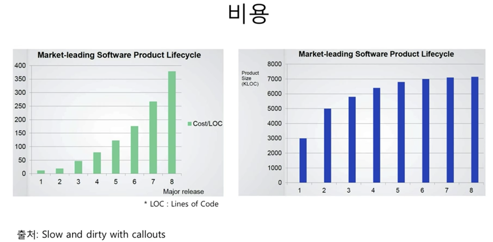
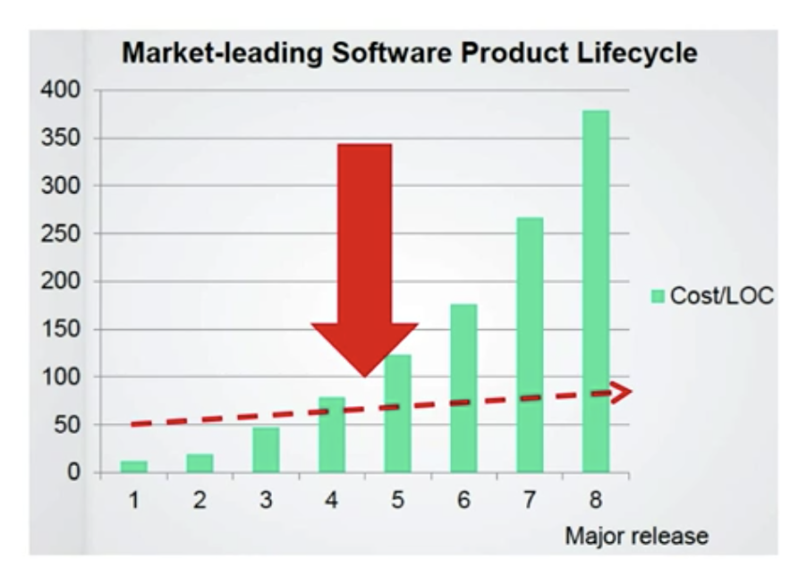

# Intro

## 비용

- 종류
    1. 코드 *분석 시간* 증가
    2. 코드 *변경 시간* 증가
 
  - 왼쪽 그래프
    - LOC : 코드 라인 수
    - Major release : 출시 횟수
    - Coast/LOC : 코드 라인 당 비용
  - 오른쪽 그래프
    - Major release가 5회 이상 부터 증가가 둔감
- 시간 측정 예
  - example 1

    - ```
         long start = System.currentTimeMillis();

         ... (코드량과 측정 시간은 정비례 할 확률이 높다)

         long end = System.currentTimeMillis();
         long elapsed = end - start; 
       ```

      - 실행 시간을 Milli 단위로 측정
  - exmaple2 (example1의 개선판)

    - ```
        long start = System.nanoTime();

        ... (코드량과 측정 시간은 정비례 할 확률이 높다)

        long end = System.nanoTime();

        long elapsednano = end - start 
       ```

      - 실행 시간을 nano 단위로 측정 (보다 정밀)
      - nano 단위로 측정 시 코드량과 측정 시간 차이가 milli 단위보다 극대화되게 차이가 보다 구체적으료 파악할 수 있음.
- 예시 1
  - 1 - 1

    - ```
        int mode = 10;

        if (mode == 10) {
            ... 수십 줄
        }

        ...

        if (mode != 10) {
            ...
            ...
        }
      ```

  - 1 - 2 (example 1을 스파게티 방식으로 유지보수되는 경우)

    - ```
        int mode = 10;

        if (mode ==10) {
            ...

            // 주목
            if (조건) {
                mode = 20
            }
            ...
        }
        ...

        if (mode != 10) {
            ...
            ...
        }
      ```

      - 주목 주석이 달린 조건문을 알지 못하는 상황에서 유지보수 또는 버그 수정 시, 'mode = 20'으로 변경되는 부분을 사전에 인지하지 못한다면, 기능 수정 또는 버그 수정에 많은 비용을 소모
- 예시 2
  - 2 - 1
    - ```
        if (acc.getRegdate().isAfter(fiveDaysAgo)) {
            acc.setMembership(REGULAR);
        } 

        ...

        if (acc.getMembership() == REGULAR && acc.getExpDate().isAfter(now)) {
            ... 유료 회원 기능
        }
      ```

  - 2 - 2
    - ```
        if (acc.getRegdate().isAfter(fiveDaysAgo)) {
            acc.setMembership(REGULAR);
        } 

        ...

        // PRO 회원이 추가됨
        if ( (acc.getMembership() == REGULAR || acc.getMembership() == PRO) && acc.getExpDate().isAfter(now)) {
            ... 유료 회원 기능
        }
      ```    
        - PRO 회원이 추가 된 경우, 수 많은 if 중 가장 아래 if 까지 코드를 확인 후 PRO 회원에 대한 처리를 확인 가능

## 소프트웨어의 가치 : 변화

- `Software maintenance is not "keep it working like before" it is "keep beging useful in a changing world" - by jessica Kerr @jessitron`
  - (해석) 소프트웨어의 동작은 이전과 동일하게 유지하는 게 아니라 변화하는 세계에서 계속 유용해야 한다.
  - 즉, 바꾸는 비용에 대한 허들이 높은 경우 바꾸기 어려워 진다. 이는 소프트웨어 경쟁력이 떨어짐.
  - 앞으로의 변화에도 적용 가능한 코드를 작성하자!

## 비용과 변화

- 낮은 비용으로 변화할 수 있어야 함
- 
- 방법
  - 패러다임
    - 객체 지향, 함수형, 리액티브, ...
  - 코드, 설계, 아키텍처
    - DRY, TDD, SOLID, DDD, ...
    - 클린 아키텍처, MSA
  - 업무 프로세스/문화
    - 애자일, Devops, ...

## 객체 지향과 비용

- 방식
  - 캡슐화 + 다형성(추상화)

## 참고

- <https://www.inflearn.com/course/%EA%B0%9D%EC%B2%B4-%EC%A7%80%ED%96%A5-%ED%94%84%EB%A1%9C%EA%B7%B8%EB%9E%98%EB%B0%8D-%EC%9E%85%EB%AC%B8/lecture/13426?tab=note&volume=0.17>
