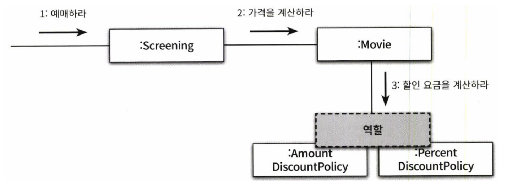

# 역할, 책임, 협력
  
## **협력 (Collaboration)**

- 정의
  - 객체 간 메시지를 통해 수행하는 상호 작용
- 수단
  - 메시지 전송
    - 객체 사이의 협력을 위해 사용하는 유일한 커뮤니케이션 수단
    - 외부의 객체는 오직 메시지만 전송(Don't tell, ask - 단방향 커뮤니케이션만 허용)할 수 있다.
    - 메시지를 수신한 객체는 자율적으로 처리한다.
    - 예시
      - 
        - 상영객체는 메시지를 전송하고 영화 객체는 메서드를 수행한다.
        - 상영객체는 영화 객체의 내부 구현을 알 수 없다. (자율적인 객체를 만드는 가장 기본적인 방법은 캡슐화)
- 자율적인 객체 == 객체 내부 구현의 캡슐화
  - 자신의 상태를 직접 관리하고 스스로 결정에 따라 행동하는 객체
  - 객체의 자율성을 보장하기 위해서는 필요한 정보와 정보에 기반한 행동을 캡슐화 해야 한다.
  - 특정 객체가 할 수 없는 책임은 다른 객체에게 위임을 통해 협력한다면, 협력에 참여하는 객체들의 전체적인 자율성을 향상 시킬 수 있다. (== 제어 흐름은 한 객체에 의한 통제가 아닌 다양한 객체들 사이에 균형 있는 분배를 통해서 전체적인 자율성을 향상시킬 수 있다)
  - 만약 특정 객체가 자신이 하지 못하는 일에 대해서 책임이 부여된다면, 이는 역할을 정상적으로 수행하지 못함을 의미한다. 역할을 정상적으로 수행하지 못하는 객체가 다른 객체와 협력을 한다는 것은 객체지향 설계의 실패를 의마한다.
- 예시
  - 영화예매 시스템
    - 
      - 다양한 객체들이 상호작용을 통해 협력하고 있다.
      - 기타
        - screening : 상영
      - 의문
        - 실제 웹 MVC 패턴에서는 어떻게 구현될까?
        - **각 객체 별 메시지 송, 수신 시, 객체 간 호출 관계가 깊을 수록(또는 호출 당 계산 시간이 길수록) 처음 객체는 메시지 송신 후, 수신까지 시간이 오래 걸릴 수 있다. 이 경우 Timeout을 설정하는 방법이 있는가?**
        - screening -> movie -> AmountDiscountPolicy .... 등보다 screening 에서 1depth로 모든 객체를 관리하면 안되는가?
          - 답: 책임 측면에서 screening이 모두 아는 것은 적절한 역할 분배가 아님.
- 참고
  - `협력을 설계 시 객체를 서로 분리된 인스턴스가 아닌 협력하는 파트너로 인식해야 한다 - Rebecca Wirfs-Brock <<오브젝트 디자인: 소프트웨어 개발의 성공 열쇠>>`

## 협력이 설계를 위한 문맥을 결정한다

- 객체가 가질 수 있는 상태와 행동을 어떤 기준으로 결정해야 할까?
- 또는 객체를 설계할 때 어떤 행동과 상태를 할당했다면 그 이유는 무엇인가?
  - 답
    - 애플리케이션 안에 특정 객체가 필요하다면 그 이유는 단 하나여야 한다.
    - 특정 객체가 어떤 협력에 참여하고 있기 때문이다.
    - 그리고 객체가 협력에 참여할 수 있는 이유는 협력에 필요한 적절한 행동을 보유하고 있기 때문이다.

## 유연하고 재사용 가능한 협력

- 역할을 통해 유연하고 재사용 가능한 협력을 얻을 수 있다.
- 즉 역할은 객체의 추상화를 통한 다형성을 통해 유연하고 재사용 가능한 협력 구축 가능
- 
  - 할인 요금을 계산하는 두 개의 객체가 있다.
  - 두 객체를 같이 사용하는 대신 하나의 슬롯으로 구성하여 교대로 교체할 수 있게 구성한다.
  - 슬롯이 역할이다.
  - 역할을 구현하는 가장 일반적인 방법은 추상 클래스와 인터페이스 사용

## **책임 (Responsibility)**

- 정의
  - 객체가 협력에 참여하기 위해 수행하는 로직
  - 또는 객체에 의해 정의되는 응집도 있는 행위의 집합
  - 객체가 유지해야 하는 정보와 수행할 수 있는 행동에 대해 대략적으로 서술한 문장이다.
  - 즉, 객체의 책임은 객체가 '무엇을 알고 잇는가'와 '무엇을 할 수 있는가'로 구성된다.
- 책임의 관점에서 '아는 것'과 '하는 것'이 밀접하게 연관돼 있다는 점
- 객체에게 적절한 책임을 할당하는가에 의해 설계의 전체적인 품질을 결정한다.
- 종류
    1. 객체가 무엇을 알고 있는가
        - private 정보에 관해 아는 것
        - 관련된 객체에 관해 아는 것
            - 상태값
            - 의문
                - 외부 객체의 상태값을 가지는 것은 캡슐화 또는 Don't tell, ask에 위배되지 않는지?
        - 자신이 유도하거나 계산할 수 있는것에 대해 아는 것
            - 의문
                - 무엇을 유도?
                - 무엇을 계산?
    2. 무엇을 할 수 있는가
        - 스스로 다른 객체를 생성
        - 계산을 수행
        - 다른 객체의 행동을 시작시키는 것
        - 다른 객체의 활동을 제어하고 조절
- 예시
  - 
- 주석
  - 특정 대상에 대한 요청 시, 특정 대상은 요청을 처리할 책임이 있음을 암시한다.

## 책임 할당

- 자율적인 객체를 만드는 가장 기본적인 방법은 특정 책임을 수행하는 데 필요한 정보를 가장 잘 알고 있는 전문가에게 특정 책임을 할당하는 것을 INFORMATION EXPERT 패턴이라고 한다.
- 협력에 필요한 지식과 방법을 가장 잘 아는 객체(응집도 높은)에게 도움을 요청
- 요청에 응답하기 위해 필요한 행동은 객체가 수행할 책임으로 이어지는 것이다. (협력)
- 협력을 설계 시, 객체의 책임을 식별해 나가는 과정에서 최종 산출물은 시스템을 구성하는 객체들의 인터페이스와 오퍼레이션의 목록이다. (클래스 다이어그램?)
- 단, 특정 책임 할당의 경우에는 응집도와 결합도의 관점에서 정보 전문가가 아닌 다른 객체에게 책임을 할당하는 것이 더 적합한 경우도 존재한다.
- 
  - 영화를 예약하기 위해서는, 영화 회차/시간 정보를 알아야 한다.
  - 이 정보를 가장 잘 아는 것은 상영 객체이다.
  - 상영 객체는 요금을 계산해야 한다.
  - 단 상영 객체는 요금 정보가 없으므로 Movie에게 책임을 위임한다.

## 책임 주도 설계 (Responsibility-Driven Design, RDD)

- 정의
  - 책임을 구하고, 책임을 수행할 적절한 객체를 찾아 책임을 부여하는 방식으로 협력을 설계하는 기법
- 책임 주도 설계 과정
    1. 시스템이 사용자에게 제공해야 하는 기능인 시스템 책임을 파악한다.
    2. 시스템 책임을 더 작은 책임으로 분할한다.
    3. 분할된 책임을 수행할 수 있는 적절한 객체 또는 역할을 찾아 책임을 할당한다.
    4. 객체가 책임을 수행하는 도중 다른 객체의 도움이 필요한 경우 이를 책임 질 적절한 객체 또는 역할을 찾는다.
    5. 해당 객체 또는 역할에게 책임을 할당함으로써 두 객체가 협력하게 한다.
- 주석
  - 어떤 책임을 선택하는가에 의해, 전체적인 설계의 방향과 흐름을 결정한다.
  - 구현이 아닌 책임에 집중하는 것이 중요한 이유는 유연하고 견고한 객체지향 시스템을 위해서 가장 중요한 요소는 바로 책임이다.

## 책임 할당 고려 요소

- 메시지가 객체를 결정
  - 객체에게 책임을 부여 시 필요한 메시지를 먼저 식별
  - 메시지를 처리할 객체를 나중에 선택
    - 객체가 메시지를 선택하는 것이 아니라, 메시지가 객체를 선택한다
- 행동이 상태를 결정
  - 객체의 행동은 객체가 협력에 참여할 수 있는 유일한 방법
  - 협력이 객체의 행동을 결정하고 행동이 객체의 상태를 결정한다. 그 행동이 바로 객체의 책임
  - 의문
    - 행동은 구체적으로 어떤 행동? 메서드를 의미?
    - 행동이 왜 상태를 결정?
    - 그 행동이 바로 객체의 책임?

## 메시지가 객체를 결정한다

- 메시지가 객체를 선택하게 해야 하는 두 가지 중요한 이유가 있다.
    1. 객체가 최소한의 인터페이스를 가질 수 있게 된다.
    2. 객체는 충분히 추상적인 인터페이스를 가질 수 있게 된다.
- 의문
  - 전체적으로 모호해서 이해가 안됨

## 행동이 상태를 결정한다

- 객체를 객체답게 만드는 것은 객체의 상태가 아닌 객체가 다른 객체에게 제공하는 행동이다. (Don't tell, ask)
- 주석
  - 초보 설계자는 먼저 객체에 필요한 상태가 무엇인지를 결정하고, 그 후에 상태에 필요한 행동을 결정한다. 이런 방식은 객체의 내부 구현이 객체의 퍼블릭 인터페이스에 노출되도록 만들기 때문에 캡슐화를 저해한다. 객체의 내부 구현에 초점을 맞춘 설계 방법을 데이터 주도 설계(Data-Driven Design)이라 부르기도 했다.

## **역할 (Role)**

- 정의
  - 객체들이 협력 안에서 수행하는 책임들이 모여 객체가 수행하는 역할을 구성한다. (자신의 책임과 다른 객체에 위임한 책임을 합쳐서(협력을) 수행하는 객체의 역할 )
- 주석
  - 역할이 중요한 이유는 역할을 통해 유연하고 재사용 가능한 협력을 얻을 수 있기 때문이다.
  - 

## 객체 대 역할

- 만약 오직 한 종류의 객체만 협력에 참여하는 상황에서 역할이라는 개념을 고려하는 것이 유용할까? 이 경우 역할이라는 개념을 생략하고 직접 객체를 이용해서 협력을 설계하는 방향이 더 옳지 않을까? 역할을 사용하는 것이 오히려 더 복잡한 설계가 되지 않을까?
- 애매한 경우 단순하게 객체로 시작하고, 반복적으로 책임과 협력을 정제해가면서 필요한 순간에 객체로부터 역할을 분리해 내는 것이 가장 좋은 방법이다.
- 다양한 시나리오를 탐색하고 유사한 협력들을 단순화하고 합치는 과정에서 자연스럽게 역할이 구체화 될 것이다.

## 참고

- 책 : 오브젝트
- 책 : 객체지향의 사실과 오해 (조영호)
- <https://hewonjeong.github.io/role-responsibility-and-collaboration/>
- <https://incheol-jung.gitbook.io/docs/study/object/2020-03-10-object-chap3>
- <https://yhmane.tistory.com/188>
