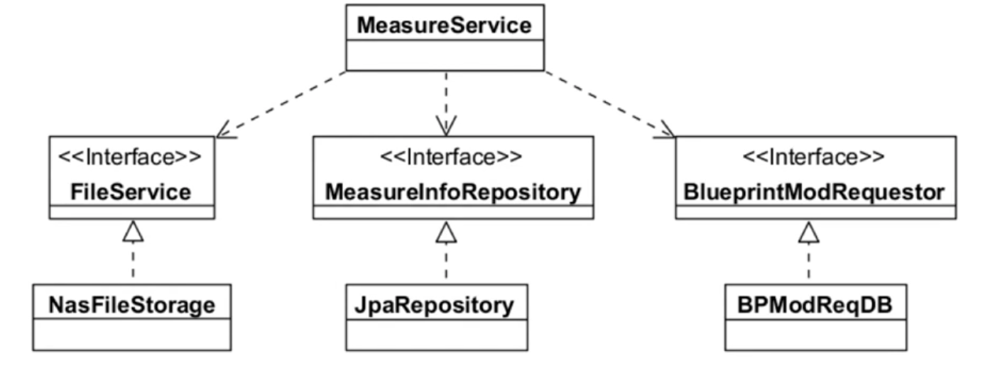
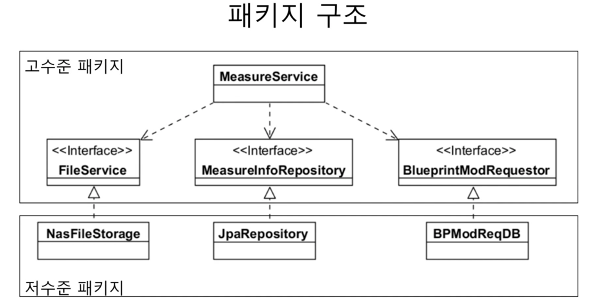
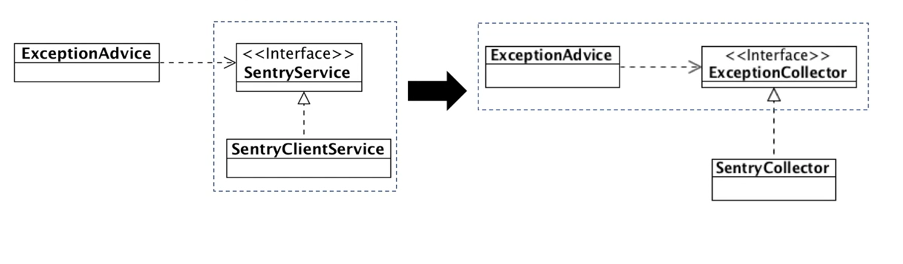
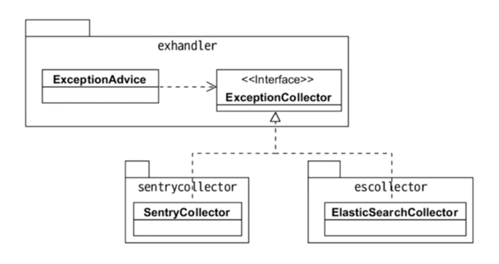
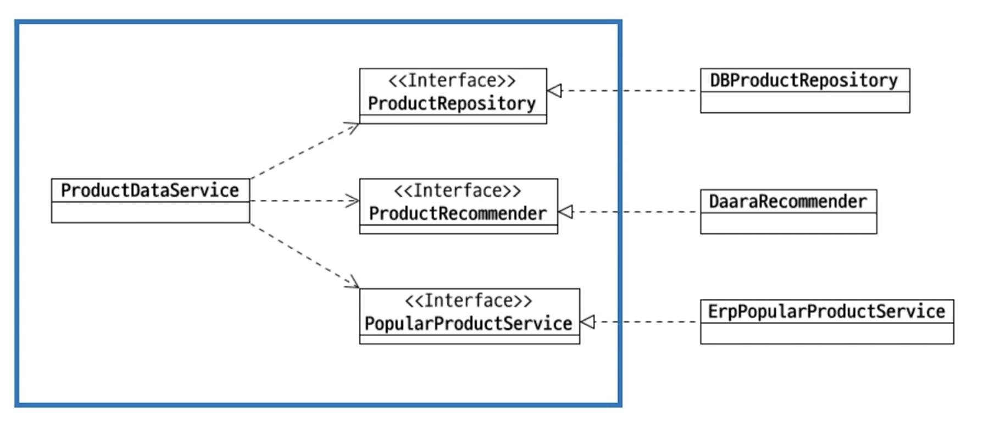
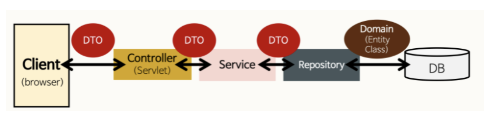
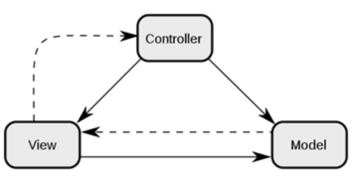

# DIP 소개
 
## 고수준 모듈, 저수준 모듈
 - 고수준 모듈
     -  의미 있는 단일 기능을 제공
     -  상위 수준의 정책 구현
 - 저수준 모듈
     - 고수준 모듈의 기능을 구현하기 위해 필요한 하위 기능의 실제 구현 

## 고수준 모듈, 저수준 모듈 예
 - 기능 예: 수정한 도면 이미지를 NAS에 저장하고 측정 정보를 DB 테이블에 젖아하고 수정 의뢰 정보를 DB에 저장하는 기능
 - 고수준
     - 도면 이미지를 저장하고
     - 측정 정보를 저장하고
     - 도면 수정 의뢰를 한다
 - 저수준
     - NAS에 이미지를 저장한다
     - MEAN_INFO 테이블에 저장한다
     - BP_MOD_REQ 테이블에 저장한다

## 고수준이 저수준에 직접 의존하면
 - 저수준 모듈 변경 -> 고수준 모듈에 영향
 - 예제
   -  변경 전 코드
      - ```
          public class MeasureService {
              public void measure(MeasureReq req) {
                  File file = req.getFile();
                  nasStorage.save(file); // 저수준 구현

                  jdbcTemplete.update(
                      "insert into MEAS_INFO ..."
                  );

                  jdbcTemplate.update(
                      "insert into BP_MOD_REQ ..."
                  ); // 저수준 구현
              }
          } 
        ``` 
   - 변경 후 코드 (nas 저장에서 AWS s3에 저장으로 저수준 모듈 변경)
     - ```
        public class MeasureService {
            public void measure(MeasureReq req) {
                File file = req.getFile();
                s3storage.update(file); // 저수준 구현

                jdbcTemplete.update(
                    "insert into MEAS_INFO ...
                );

                rabitmq.convertAndSend(...); // 저수준 구현
            }
        } 
       ```
     - 고수준 정책이 바뀌지 않았으나 저수준 구현 변경으로 코드 변경 발생 

## DEPENDENCY INVERSION PRINCIPLE 
 - 의존 역전 원칙
   - 고수준 모듈은 저수준 모듈의 구현에 의존하면 안됨
   - 저수준 모듈이 고수준 모듈에서 정의한 추상타입에 의존해야 함
      - 같은 의미로, 저수준 모듈은 고수준 모듈에 포함된 추상 타입을 상속해서 구현함
   - 
       - 고수준 모듈에 포함된 추상 타입
           1. FileService
           2. MeasureInfoRepository
           3. BlueprintModRequestor 
   - 결론: 의존의 방향을 역전시키는 것을 목적으로 함

## 패키지 구조
 - 

## 고수준 관점에서 추상화
 - 고수준 입장에서 저수준 모듈을 추상화
     -  구현 입장에서 추상화하지 말 것 
 - 
     - 요구사항 
         - Exception이 발생 시, Sentry로 Exception을 수집한다.
         - 이를 위해 SentryClient를 이용해서 Exception date를 전송한다. 
     - 왼쪽은 저수준 관점(Sentry 중심)에서 저수준 모듈을 추상화
     - 오른쪽은 고수준 관점(ExceptionCollector를 도출)에서 저수준 모듈을 추상화
 - 주석
     - sentry 해석 : 보초

## DIP는 유연함을 높임
 - 고수준 모듈의 변경을 최소화하면서 저수준 모듈의 변경 유연함을 높임
 -  
     - Sentry외 ElasticSearch를 확장하는 경우, 고수준 모듈은 바뀌지 않으면서 저수준 모듈만 변경 가능

## 부단한 추상화 노력 필요
 - 처음부터 바로 좋은 설계가 나오지는 않음
     - 요구사항/업무 이해가 높아지면서 저수준 모듈을 인지하고 상위 수준 관점에서 저수준 모듈에 대한 추상화 시도
     - 예시
        - 처음 : 익센션 발생 시 Sentry에 익셉션 정보를 보냄
        - 중간 : 익센셥이 발생 시 Sentry에 익셉션 정보를 모음
        - 끝 : 익셉션이 발생 시 익셉션을 모음

## 연습
 - 요구사항
     -  상품 상세 정보와 추천 상품 목록 제공 기능
           - 상품 번호를 이용해서 상품 DB에서 상세 정보를 구함
           - Daara API를 이용해서 추천 상품 5개 구함
           - 추천 상품이 5개 미만이면 같은 분류에 속한 상품 중 최근 한달 판매가 많은 상품을 ERP에서 구해서 5개를 채움
 - 고수준과 저수준 분류
     -  고수준
           - 상품 번호로 상품 상세 정보 구함
           - 추천 상품 5개 구함
           - 인기 상품 구함
     -  저수준
           -  DB에서 상세 정보 구함
           -  Daara API에서 상품 5개 구함
           -  같은 분류에 속한 상품에서 최근 한 달 판매가 많은 상품 ERP에서 구함
  - 설계 결과
      -   

## 질문
 1. controler와 service의 차이는?
    - 답
        - 출처 
            - https://velog.io/@jybin96/Controller-Service-Repository-%EA%B0%80-%EB%AC%B4%EC%97%87%EC%9D%BC%EA%B9%8C
        -    
        - MVC를 사전에 알아야 함
        - MVC
            - Model-View-Controller 약자
            - 
            - Model
                - 어플리케이션이 무엇을 할 것인지 정의하는 부분 (시스템의 입력과 출력을 통해 파악)
                - DB와 연동하여 사용자가 입력한 데이터 또는 사용자에게 출력할 데이터를 다룸
            - View
                - 사용자에게 시각적으로 보여주는 부분 
                - 예시는 UI
            - Controller
                - Model의 입력과 출력의 과정, 즉 데이터를 어떻게 처리할 지 알려주는 역할
                - 사용자에 의해 클라이언트가 보낸 데이터가 있는 경우 모델을 호출하기 전에 적절한 가공 과정을 거친 후 모델을 호출한다. 그 후 모델이 업무 수행을 완료 시 모델에게 반환 받은 결과를 View에게 전달하는 역할 수행
            - MVC 패턴을 사용하는 이유
                - 역할과 책임을 UIUX를 구현한 페이지과 데이터 처리와 그 사이를 중간에서 제어하는 컨트롤로 총 3가지로 구성되는 하나의 애플리케이션을 만들면 각각 맡은 역할과 책임에 집중 할 수 있음
                - 즉 서로 분리되어 각자의 역할에 집중할 수 있게 개발 시 장점은 유지보수성, 애플리케이션 확장성, 유연성 증가, 중복코딩 문제 감소 효과를 가질 수 있음
          - Controller
              - 역활
                  - MVC 패턴의 C에 해당
                  - 주로 사용자의 요청을 처리한 후 지정된 View에 모델 객체를 넘겨주는 역할
                  - 즉 사용자의 요청이 진입하는 지점
                  - 요청에 따라 어떤 처리를 할 지 결정을 Service에게 넘긴다.
                  - 그 후 Service에서 실질적으로 처리한 내용을 View에게 전달한다활
              - 왜 사용 할까?
                  - 대규모 여러 서비스가 존재 시 각 서비스 별 별도의 Controller라는 중간 제어자를 만들어서 처리 시 MVC 패턴을 사용하는 이유 처럼 장점이 발생
          - Service
              - 웹 서버의 일반적인 과정은
                1. Client가 Request를 보낸다 (Ajax 등)
                2. Request URL에 알맞은 Controller가 수신 받는다. (Spring에서 @controller, @RestController)
                3. Controller는 넘어온 요청을 처리하기 위해 Service를 호출한다.
                4. Service는 알맞은 정보를 가공하여 Controller에게 데이터를 넘긴다.
                5. Controller는 Service의 결과물을 Client에게 전달해준다.
              - 역할
                  - Service가 알맞은 정보를 가공하는 과정을 '비즈니스 로직을 수행한다' 라고 한다.
                  - Service가 비즈니스 로직을 수행하고 데이터베이스에 접근하는 DAO를 이용해서 결과값을 받아 온다.
          - DAO
              - 만약 단순한 기능의 페이지인 경우, DB 정보를 한 번에 불러와서 처리 시에는 Service와 DAO는 차이가 거의 없을 수 있다
              - DAO는 쉽게 말해서 DB 서버에 접근을 통해 SQL 문을 실행 할 수 있는 객체이다.
          - JPA
              - 매우 작은 코드로 DAO를 구현하도록 도와주는 기술
              - 예시로 인터페이스를 만드는 것만으로도 Entity (@Entity)클래스에 대한 insert, Update, Delete, Select를 실행할 수 있게 해준다. 그 외에 인터페이스에 메소드를 선언하는 것만으로 라이트한 쿼리를 수행하는 코드를 만드는 것과 동등한 작업을 수행한다.
              - JPA를 사용하더라도 DAO는 사용해야 한다. 이유는 JPA가 만들 수 있는 코드는 매우 가볍고 쉬운 쿼리를 대체하는 것이므로, 복잡도가 높아지면 사용하기가 비례해서 어려워진다. 
              - JPA를 깊게 공부해서 JPA로 복잡도가 높은 쿼리를 작성하거나 복잡도가 높은 곳은 DAO를 같이 사용해서 해결
          - Repository
              - Entity에 의해 생성된 DB에 접근하는 메서드들을 사용하기 위한 인터페이스
              - 스프링에서는 @Entity라는 어노테이션으로 데이터베이스 구조를 만들었다면 여기에 CRUD를 해야한다. CRUD를 어떻게 할 것인지 정의해주는 계층이다.
              - 스프링 코드 예시
                - ```
                    public interface ProductRepository extends JpaRepository<Product, Long> {
                    } 
                  ``` 
                    - 주석
                      -  Product는 Entity 클래스 명
                      -  Long은 그 Entity 클래스의 PK의 자료형을 넣어주면 된다(무슨 말? PK 개념이 해깔림)
 2. ```
        주소 : https://www.inflearn.com/course/%EA%B0%9D%EC%B2%B4-%EC%A7%80%ED%96%A5-%ED%94%84%EB%A1%9C%EA%B7%B8%EB%9E%98%EB%B0%8D-%EC%9E%85%EB%AC%B8/lecture/13443?tab=community&volume=0.24&q=341175
        다른 분 질문
        질문 내용 = {
            안녕하세요! 

            객체지향과 디자인패턴 - 최범균
            님 책을 읽고 여기까지 왔네요! ㅎㅎㅎ

            복습하기 좋은 강의였습니다.

            다만, DIP 에서 조금 헷갈리는게 있는데요.
            하나의 예를들면서 여쭤보고 싶습니다.

            Controller 와 Service가 있다고 하면
            Controller 에서 Service 를 의존하고 있을 때,

            Service의 구체적인 구현체를 Controller 에서 의존하고 있기에 이것은 Controller ( 고모듈 ) 이 Service (저모듈 ) 을 의존하고 있는 거잖아요.?

            그럼 여기서 Controller 와 Service 사이에 Interface를 둬서 Controller에서는 ServiceInterface의 고수준 모듈을 의존하고 ServiceInterface를 상속한 저모듈 구현체는 상속을 한 Interface ( 고수준 ) 에 의존 되어있기에 딱 좋은 예제라고 생각하는데 맞을까요?!

            감사합니다.
        }

        답변 (최범균) = {
            DIP를 적용하는 이유는 의존의 방향을 바꿔서 하위 수준의 구현 변경 때문에 상위 수준이 영향 받지 않도록 하기 위함입니다. 이를 통해 상위 수준의 정책은 유지하면서 하위 수준의 구현을 변경할 수 있게 되죠. 이 관점에서 보면 컨트롤러는 사용자와 서비스를 연결해주는 매개체이기 때문에 컨트롤러가 상위 수준이고 서비스가 하위 수준이라고 보기는 어렵습니다.

            소스 코드 위치로 생각해보면 조금 더 이해하기가 쉽습니다. DIP에서 인터페이스는 고수준 패키지에 위치하지, 저수준 패키지에 위치하지 않습니다. 이를 컨트롤러와 서비스에 대입해보죠. web, service 패키지가 있을 때 web 패키지에는 컨트롤러가, service 패키지에는 서비스가 위치할 겁니다. 이 구조에서 서비스 인터페이스가 web 패키지에 위치하는 걸 생각해보세요? web이 없으면 서비스를 구현할 수 없다는 뜻이 되는데 뭔가 이상하죠? web에 상관없이 서비스는 존재할 수 있으니까요(배치가 서비스를 호출할 수도 있죠)

            컨트롤러 자체는 "사용자 요청을 처리한다"는 상위 수준의 저수준 구현에 해당합니다. 예를 들어 회원 가입 요청을 생각해보죠. 시스템 입장에서 사용자의 가입 요청을 폼으로 받을지 웹소켓으로 받을지 REST API로 받을지는 요구사항에 따라 달라질 겁니다. 즉, 폼 처리용 컨트롤러, 웹소켓용 컨트롤러, REST API용 컨트롤러가 존재할 겁니다. 즉, 시스템을 큰 덩어리로 보면 "사용자의 요청을 받아 가입 서비스를 실행한다"라는 상위 수준 정책이 있고, 그 상위 수준 정책을 구현한 저수준 구현체(컨트롤러)가 존재하는 겁니다. 그리고 여기서 웹의 경우 상위 수준은 보통 프레임워크가 맡아서 처리하구요.
        }
    ```

## 참고
 - https://www.inflearn.com/course/%EA%B0%9D%EC%B2%B4-%EC%A7%80%ED%96%A5-%ED%94%84%EB%A1%9C%EA%B7%B8%EB%9E%98%EB%B0%8D-%EC%9E%85%EB%AC%B8/lecture/13443?tab=note&volume=0.24