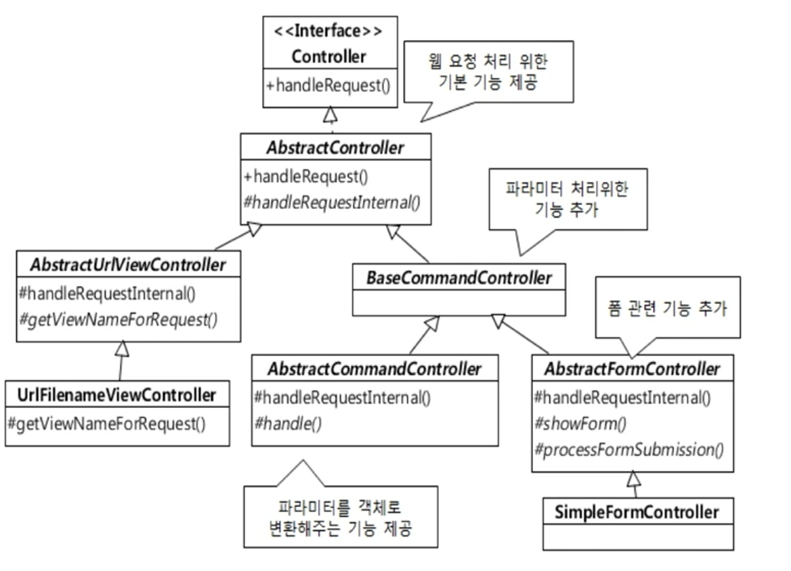
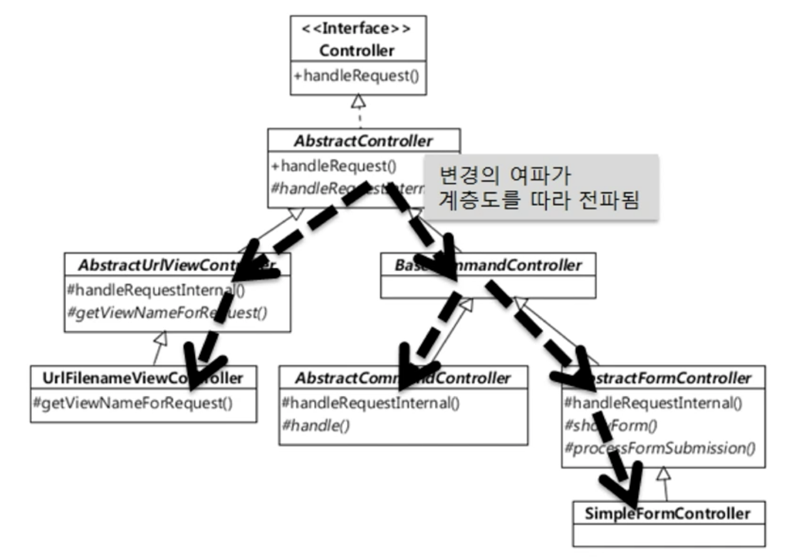
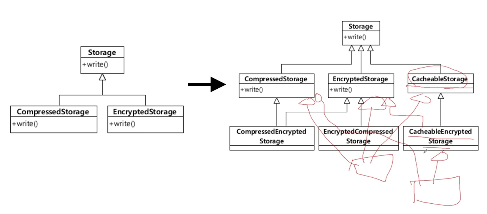

# 상속
## 상속과 재사용
 - 
 - 상위 클래스의 기능을 재사용, 확장하는 방법으로 활용하지만 단점이 존재
 - 상속을 통한 기능 재사용 시 발생할 수 있는 단점
    1. 상위 클래스 변경 어려움
    2. 클래스 증가 (불필요한 클래스 포함)
    3. 상속 오용 

## 상속 재활용 단점 1: 상위 클래스 변경이 어려움
 - 
 - 상위 클래스를 변경 시 하위 클래스에 사이드 이펙트 발생
     - 상위 클래스는 어떤 하위 클래스가 추가 될 지 사전에 알기 어렵고
     - 하위 클래스가 많아질 수록 상위 클래스 변경 비용도 비례한다
 - 상위 클래스가 어떤식으로 동작을 하는지 어느정도 파악 후 하위 클래스가 기능 재사용이 가능하다
     - 상위 클래스는 하위 클래스에 대해 캡슐화가 약해지는 문제점 발생
         - 질문
             - 상위 클래스는 하위 클래스에 대해 캡슐화가 약해지는 문제에 대해서 자세한 설명 필요
     - 상위 클래스의 내부 구현 변경이 어려워짐

## 상속 재활용 단점 2: 클래스 증가 (불필요한 클래스 포함)
  - 
  - 요구사항이 추가 될 때 마다 하위 클래스가 증가함
    - 문제
      -  어떤 클래스를 상속받아서 구현해야 할 지 애매한 상황이 발생
    - 예시
      1. cache 기능이 필요한 스토리가 추가된 경우
         - chacheableStorage 클래스 구현
      2. cache 기능에 암호화 기능의 스토리지가 추가 된 경우
         - 방법
              1. cacheableStorage 상속한 CacheableEncrypedStorage 클래스 구현
              2. 또는 EncryptedStorage를 상속한 CacheableEncrypedStorage 클래스 구현
      3. 암호화 기능과 압축 기능의 스토리지가 추가 된 경우
          - 방법
              1. CompressedStroage와 EncrytedStorage를 동시에 상속한 클래스 구현
      4. 압축, 암호, 캐쉬 기능의 스토리지가 추가 된 경우
          - 방법
              1. CompressedStorage, EncryptedStorage, CacheableStorage를 동시에 상속한 클래스 구현
              2. CacheableEncrytedStorage를 상속 받은 클래스 구현, 바로 EncryptedStorage를 상속 받은 클래스 구현, 바로 CompressedStorage를 상속 받은 클래스 구현

## 상속 재활용 단점 3: 상속 (자체를)오용
 - 예시
     - ```
        public class Container extends ArrayList<Luggage> {
            private int maxSize;
            private int currentSize;

            public Container(int maxSize) {
                this.maxSize;
            }

            public void put(Luggage lug) throw NotEnoughSpaceException {
                if (!canContain(lug)) throw new NotEnoughSpaceException();

                super.add(lug);
                currentSize+= lug.size();
            }

            public void extract (Luggage lug) {
                
                super.remove(lug);
                this.currentSize -=lug.size();
            }

            public boolean canContain(Luggage lug) {
                return maxSize >= currentSize + lug.size();
            }
        } 
       ```
     - ```
        // 올바른 사용법
        Container c = new Container(5);
        if (c.canContain(size2Luggage)) {
            c.put(size2Luggage);
        } 
       ```
     - ``` 
        Luggage size3Lug = new Luggage(3);
        Luggage size2Lug = new Luggage(2);
        Luggage size1Lug = new Luggage(1);

        Container c = new Container(5);
        if(c.canContain(size3Lug)) {
            c.put(size3Lug); //정상 사용. Container 여분 5에서 2로 줄어듬
        } 

        if(c.canContain(size2Lug)) {
            c.add(size2Lug); // 비정상 사용. Container 여분 2에서 줄지 않음
        }

        if (c.canContain(size1Lug)) { // 통과됨! 원래는 통과되면 안됨!
            c.add(size1Lug);
        }
       ``` 
         - 주석
             - 만약 인텔리제이 등에서 c. 누르면 자동 완성 메서드(Container 메서드 리스트, Container가 상속된 메서드의 리스트)가 출력된다
             - add(Luggage e) boolean - ArrayList는 겉으로 보기에 Container에 새 요소를 추가하는 것 처럼 보이나, Container의 정확한 사용법을 숙지 하지 않으면 c.add(size2Lug); 같은 비정상 사용 문제가 발생
             - c.add(size2Lug)에 의해 c.add(size1Lug)가 통과되는 오류가 발생 가능함.
             - 과연 add 메서드를 잘 못 사용한 사람의 문제일까? 아니다. 잘못 사용할 가능성이 많은 Container 클래스를 설계한 사람이 잘못이다.
         - 참고
             - luggage : 수화물 