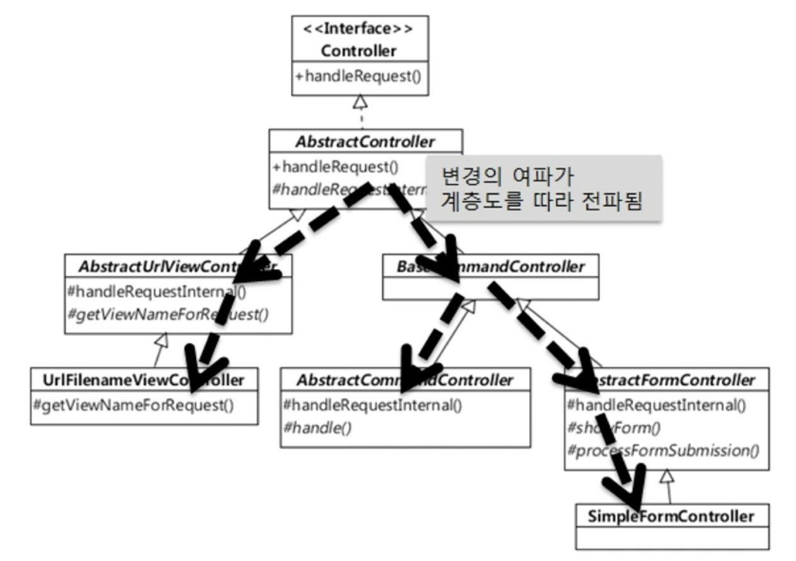

# 상속
## 상속과 재사용
 - 
 - 상위 클래스의 기능을 재사용, 확장하는 방법으로 활용하지만 단점이 존재
 - 상속을 통한 기능 재사용 시 발생할 수 있는 단점
    1. 상위 클래스 변경 어려움
    2. 클래스 증가 (불필요한 클래스 포함)
    3. 상속 오용 

## 상속 재활용 단점 1: 상위 클래스 변경이 어려움
 - 
 - 상위 클래스를 변경 시 하위 클래스에 사이드 이펙트 발생
     - 상위 클래스는 어떤 하위 클래스가 추가 될 지 사전에 알기 어렵고
     - 하위 클래스가 많아질 수록 상위 클래스 변경 비용도 비례한다
 - 상위 클래스가 어떤식으로 동작을 하는지 어느정도 파악 후 하위 클래스가 기능 재사용이 가능하다
     - 상위 클래스는 하위 클래스에 대해 캡슐화가 약해지는 문제점 발생
         - 질문
             - 상위 클래스는 하위 클래스에 대해 캡슐화가 약해지는 문제에 대해서 자세한 설명 필요
     - 상위 클래스의 내부 구현 변경이 어려워짐

## 상속 재활용 단점 2: 클래스 증가 (불필요한 클래스 포함)
  - 
  - 요구사항이 추가 될 때 마다 하위 클래스가 증가함
    - 문제
      -  어떤 클래스를 상속받아서 구현해야 할 지 애매한 상황이 발생
    - 예시
      1. cache 기능이 필요한 스토리가 추가된 경우
         - chacheableStorage 클래스 구현
      2. cache 기능에 암호화 기능의 스토리지가 추가 된 경우
         - 방법
              1. cacheableStorage 상속한 CacheableEncrypedStorage 클래스 구현
              2. 또는 EncryptedStorage를 상속한 CacheableEncrypedStorage 클래스 구현
      3. 암호화 기능과 압축 기능의 스토리지가 추가 된 경우
          - 방법
              1. CompressedStroage와 EncrytedStorage를 동시에 상속한 클래스 구현
      4. 압축, 암호, 캐쉬 기능의 스토리지가 추가 된 경우
          - 방법
              1. CompressedStorage, EncryptedStorage, CacheableStorage를 동시에 상속한 클래스 구현
              2. CacheableEncrytedStorage를 상속 받은 클래스 구현, 바로 EncryptedStorage를 상속 받은 클래스 구현, 바로 CompressedStorage를 상속 받은 클래스 구현

## 상속 재활용 단점 3: 상속 (자체를)오용
 - 예시
     - ```
        public class Container extends ArrayList<Luggage> {
            private int maxSize;
            private int currentSize;

            public Container(int maxSize) {
                this.maxSize;
            }

            public void put(Luggage lug) throw NotEnoughSpaceException {
                if (!canContain(lug)) throw new NotEnoughSpaceException();

                super.add(lug);
                currentSize+= lug.size();
            }

            public void extract (Luggage lug) {
                
                super.remove(lug);
                this.currentSize -=lug.size();
            }

            public boolean canContain(Luggage lug) {
                return maxSize >= currentSize + lug.size();
            }
        } 
       ```
     - ```
        // 올바른 사용법
        Container c = new Container(5);
        if (c.canContain(size2Luggage)) {
            c.put(size2Luggage);
        } 
       ```
     - ``` 
        Luggage size3Lug = new Luggage(3);
        Luggage size2Lug = new Luggage(2);
        Luggage size1Lug = new Luggage(1);

        Container c = new Container(5);
        if(c.canContain(size3Lug)) {
            c.put(size3Lug); //정상 사용. Container 여분 5에서 2로 줄어듬
        } 

        if(c.canContain(size2Lug)) {
            c.add(size2Lug); // 비정상 사용. Container 여분 2에서 더이상 여분이 줄지 않음
        }

        if (c.canContain(size1Lug)) { // 통과됨! 원래는 통과되면 안됨!
            c.add(size1Lug);
        }
       ``` 
         - 주석
             - 만약 인텔리제이 등에서 c. 누르면 자동 완성 메서드(Container 메서드 리스트, Container가 상속된 메서드의 리스트)가 출력된다
             - add(Luggage e) boolean - ArrayList는 겉으로 보기에 Container에 새 요소를 추가하는 것 처럼 보이나, Container의 정확한 사용법을 숙지 하지 않으면 c.add(size2Lug); 같은 비정상 사용 문제가 발생 (add 기능은 부모로 부모 상속받은 기능임.)
             - c.add(size2Lug)에 의해 c.add(size1Lug)가 통과되는 오류가 발생 가능함.
             - 과연 add 메서드를 잘 못 사용한 사람의 문제일까? 아니다. 잘못 사용할 가능성이 많은 Container 클래스를 설계한 사람이 잘못이다.
         - 참고
             - luggage : 수화물 

## 조립 (Composition)
 - 여러 객체를 묶어서 더 복잡한 기능을 제공
 - 구현
     - 보통 필드로 다른 객체를 참조하는 방식으로 조립
     - 또는 객체를 필요 시점에 생성/구하기
 - 예시
     - ```
        public class FlowController {
            private Encryptor encryptor = new Encryptor(); // 필드로 조합 (상속이 아닌)

            public void process() {
                ...
                byte[] encryptedData = encryptor.encrypt(data);
                ...
            }
        } 
       ```
  - 
      - 추가로 서명 기능이 필요한 경우
          -  Signer 클래스를 만들어서 Storage에서 조립한다.
          -  장점
             - storage 클래스는 자식이 없으므로 storage 클래스의 내부를 바꾸는 것도 수월
  - 예시2
      - 개선 전
          - ```
                public class Container extends ArrayList<Luggage> {
                    private int maxSize;
                    private int currentSize;

                    ...

                    public void put(Luggage lug) {
                        if(!canContain(lug)) {
                            throw new NotEnoughSpaceException();
                        }
                        super.add(lug);
                        currentSize+=lug.size
                    }
                } 
            ```
      - 개선 후
          - ```
               public class Container {
                   private int maxSize;
                   private int currentSize;
                   private List<Luggage> luggages = new ArrayList(); //조립!

                   ...

                   public void put(Luggage lug) {
                       if(!canContain(lug)) {
                           throw new NotEnoughSpaceException();
                       }
                       luggages.add(lug);
                   }

                   ...
               }
            ```
        - Container는 ArrayList의 한 종류가 아니므로, 상속에 적합하지는 않다.
        - ArrayList는 단순히 목록 관리를 위해서 사용 중이다. 기능 재사용을 위해 사용하는 개념이다.

## 결론: 상속보다는 조립 (Composition over inheritance) 
 - 상속하기에 앞서 조립으로 풀 수 없는지 검토
 - 진짜 하위 타입인 경우에만 상속으로 구현해야 한다.

## 질문
 1. ```
        주소 : https://www.inflearn.com/questions/435620

        질문 제목 : 상속 재활용 단점 중 상위 클래스 변경 어려움에 대해서 질문이 있습니다.

        질문 내용 : {
            상속 재사용 단점 중 상위 클래스 변경이 어렵다는 부분에서 "상위 클래스가 어떤식으로 동작 하는지 어느정도 파악 후 하위 클래스가 기능 재사용이 가능하다"고 구두로 설명해주셨는데요, 여기에 추가적으로 상위 클래스는 하위 클래스에 대해 캡슐화가 약해지는 문제가 발생한다고 추가로 설명을 해주셨습니다.

            여기서 상위 클래스는 하위 클래스에 대해 캡슐화가 약해진다는 게 구체적으로 어떤 의미 일까요?

            제가 파악하기에는 예시로 계층 관계의 깊이가 깊어질 수록(루트와 단말 사이에 많이 상속 객체가 존재할  경우) 최상위 클래스와 최하위 클래스의 기능이 많이 다른 경우 최상위 클래스는 최하위 클래스를 캡슐화 하기 어렵다고 보는게 옳을까요?

            감사합니다.
            이상입니다.

            감사합니다.
            이상입니다.
        }

        답변 (by 최범균) : {
            상위 클래스의 캡슐화가 약해진다는 의미입니다.

            상속을 통해 기능을 재사용하다보면 하위 클래스가 상위 클래스의 내부 구현에 직접적으로 의존하는 상황이 벌어질 수 있습니다. 예를 들어 상위 클래스에 정의된 필드에 직접 접근하거나 상위 클래스의 메서드의 실행 순서를 보고 그에 맞게 하위 클래스를 구현하는 식으로요. 상위 클래스의 private 메서드를 protected로 바꾸기도 하구요. 이런 코드가 증가할수록 상위 클래스의 캡슐화하는 약해지게 됩니다.
        }
    ```
 2. ```
        (다른 분 질문)

        주소: https://www.inflearn.com/course/%EA%B0%9D%EC%B2%B4-%EC%A7%80%ED%96%A5-%ED%94%84%EB%A1%9C%EA%B7%B8%EB%9E%98%EB%B0%8D-%EC%9E%85%EB%AC%B8/lecture/13435?tab=community&volume=0.20&q=68675

        질문 제목: 상속과 조합 문의드립니다
        질문 내용 = {
            안녕하세요 상속의 단점이 상위 클래스의 변경이 하위 클래스에 영향을 주는것도 있다 하셧는데요 조합일 경우도 비슷한건 아닌가요? 조합에 사용한 클래스에 변경이 있어서 내부로직에 변화가 있을 때 사용하는 쪽에도 영향을 주는건 상속과 똑같은게 아닌가 해서요..
        }

        답변 (by 최범균) : {
            상속은 하위 타입이 상위 타입의 동작 구조에 매우 밀접하게 엮이는 경향이 있습니다. 그래서 상위 타입의 구현 변경이 하위 타입에 영향을 줄 가능성이 높아지구요. 즉 상위 타입의 캡슐화가 하위 타입에 대해서 약해질 가능성이 있는거죠. 반면에 조합은 제공하는 기능을 사용하므로 기능의 내부 구현이 변경되더라도 영향을 받을 가능성이 줄어들게 되구요.
        }
    ```

## 참고 
 - https://www.inflearn.com/course/%EA%B0%9D%EC%B2%B4-%EC%A7%80%ED%96%A5-%ED%94%84%EB%A1%9C%EA%B7%B8%EB%9E%98%EB%B0%8D-%EC%9E%85%EB%AC%B8/lecture/13435?tab=note&volume=0.20