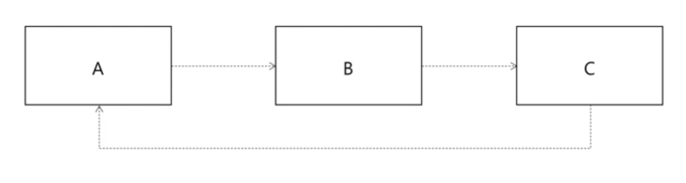
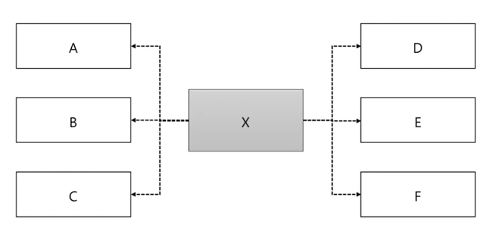
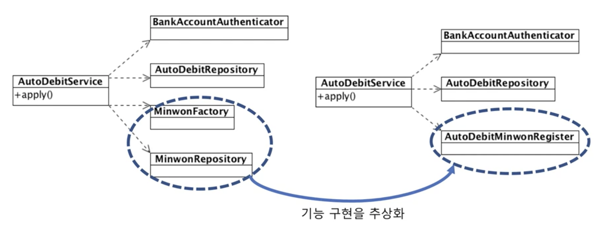

# 의존과 DI

## 의존
 - 기능 구현을 위해 다른 구성 요소를 사용하는 것
     -  의존의 예시
        1. 객체 생성
        2. 메서드 호출
        3. 데이터 사용
 - 의존은 변경이 전파될 가능성을 의미
   -  의존하는 대상이 바뀌면 (나도) 바뀔 가능성이 높아짐
         - 예시
            1. 호출하는 메서드의 파라미터가 (예시: 파라미터 갯수) 변경
            2. 호출하는 메서드가 발생할 수 있는 익셉션 타입이 추가

## 순환 의존
 - 순환 의존 -> 변경 연쇄 전파 가능성
     - 클래스, 패키지, 모듈 등 모든 수준에서 순환 의존이 없도록 설계 필요
     - 

## 의존하는 대상이 많다면?
 - 
   - A, ...F 등 각 의존 대상이 바뀔 때마다 X도 변경이 필요로 할 수 있다.

## 의존 대상이 많은 경우 1 - 기능이 많은 경우
  - 한 클래스에서 많은 기능을 제공하는 경우
  - 개선 전 예제
    - ```
        public class UserService {
            public void regist(RegReq regReq) {
                ...
            }

            public void changePw(changeReq chgReq) {
                ...
            }

            public void blockUser(String id, String reason) {
                ...
            }

            ...
        } 
      ```
          - 각 기능마다 의존하는 대상이 다를 수 있음
          - 한 기능 변경이 다른 기능에 영향을 줄 수 있음
          - 예시
              - changePw 변경 시 blockUser 코드가 변경 되어야 할 수 있다.
              - 한 메소드만 테스트하고 싶어도 나머지 기능의 의존성 객체까지 초기화 필요 (테스트 비용 상승)
    - 개선 후 예제
      - ```
          public class UserRegistService {
              public void regist(...) {
                  ...
              }

              public class ChangePwService {
                  public void changePw(...) {
                    ...
                  }
              }

              public class UserBlockService {
                  public void blockUser(...) {
                      ...
                  }
                  ...
              }
          } 
        ``` 

## 의존 대상이 많은 경우 2 - 묶어보기
 - 몇 가지 의존 대상을 단일 기능으로 묶어서 생각해보면 의존 대상을 줄일 수 있음
 - 

## 의존 대상 객체를 직접 생성하면?
 - 생성 클래스가 바뀌면 의존하는 코드도 바뀜
     -  추상화에서 언급 (추상화를 통해 생성 클래스의 다형성 도입)
 - 의존 대상 객체를 직접 생성하지 않는 방법
     - 팩토리, 빌더
     - 의존 주입(Dependency Injection)
     - 서비스 로케이터(Service Locator)


## 의존 주입(Dependency Injection)
 - 외부에서 의존 객체를 주입
   -  생성자나 메서드를 이용해서 주입
 - 예제
   -  ```
        public class ScheduleService {
            private UserRepository repository;
            private Calculator cal;

            public ScheduleService(
                UserRepository repository
            ) {
                this.repository = repository;
            }

            public void setCalculator(
                Calculator cal
            ) {
                this.cal = cal;
            }
        }

        // 초기화 코드
        UserRepository userRepo = new DbUserRepository();
        Calculator cal = new Calculator();

        ScheduleService schSvc = new ScheduleService(userRepo);
        schSvc.setCalculator(cal);
      ```  
        - 의문
          -  왜 userRepo는 생성자를 통해 삽입했는데 cal은 setCalculator를 통해 setter를 사용하는가? (자주 바뀔 수 있어서? 근데 setter는 지양하라고 하지 않았나?)
             -  답은 아래 질문 참고


## 조립기 (Assembler)
 - 조립기가 객체 생성, 의존 주입을 처리
     -  예: 스프링 프레임 워크
 - 예제
     - 부분1
        -  ```
            @configuration
            public class config {
                @Bean
                public ScheduleService scheduleSvc() {
                    ScheduleService svc = new ScheduleService(repo());
                    svc.setCalculator(expCal());
                    return svc;
                }
            }

            @Bean
            public UserRepository repo() {
                ...
            }

            @Bean
            public Calculator expCal() {
                ...
            }
           ```  
     - 부분2
         - ```
            // 초기화
            // annotationConfig...Context 클래스가 스프링에서 제공하는 조립기이다.
            ctx = new annotationConfigApplicationContext(Config.class);

            // 사용할 객체 구함
            ScheduleService svc = ctx.getBean(ScheduleService.class);

            // 사용
            svc.getSchedule(...); 
           ```

## DI 장점 1
 - 예제
   - 설명: 상위 타입을 사용할 경우, 의존 대상이 바뀌면 조립기(설정)만 변경하면 됨
   - 부분1
       -  ```
            public class OrderService {
                private Notifier notifier;

                public OrderService(Notifier notifier) {
                    ...
                    notifier.notify(..);
                }
            }  
          ```
    - 부분2
        - ```
            @Configuration
            public class Config {
                @Bean
                public Notifier notifier() {
                    return new EmailNotifier();
                }

                @Bean
                public OrderService orderService() {
                    return new OrderService(notifier());
                }
            } 
          ```
    - 부분3
        - ```
            @Configuration
            public class Config {
                @Bean
                public Notifier notifier() {
                    return new Composite능otifier(
                        new EmailNotifier(),
                        new KakaoNotifier()
                    );
                }
            }

            @Bean
            public OrderService orderService() {
                return new orderService(notifier());
            } 
          ``` 

## DI 장점 2
 - 의존하는 객체 없이 대역 객체를 사용해서 테스트 가능
 - 예제
   -  ```
        private MemoryUserRepository userRepo = new MemoryUserRepository();
        private ScheduleService svc = new ScheduleService();

        @BeaforeEach
        public void init() {
            // **대역 객체를 사용**
            // 실제 DB가 아닌 DB와 연동하는 기능을 대신 가능 MemoryUserRepository 사용
            svc.setUserRepository(userRepo);
        }

        @Test
        public void givenUser noCheckPoint_then_getExceptedSchedule() {
            // **대역 객체 사용**
            // 원하는 대로 상태 초기화 가능
            // 다양한 경우의 수로 테스트 가능
            userRepo.addUser("1", new User(...));
            Schedule schedule = svc.getSchedule("1");
            assertEquals(EXPECTED, schedule.getType());
        }
      ```  

## DI를 습관처럼 사용하기
 - 의존 객체는 주입받도록 코드 작성하는 습관  

## 질문
 - 다른 분 질문
     - ```
        (다른 분 질문) 
            제목 : 의존하는 대상이 많을 때 질문 드립니다.
            내용 : {
                1분 58초 부근을 보게 되면 X 는 A, B, C, D, E, F에 의존하고 있습니다. 이 때 만약 A를 수정하면 의존하고 있는 X에도 변경의 여파가 미치게 됩니다.

                저는 보통 이럴 때 X와 A의 의존관계를 없애게 되더라도 A는 결국 남은 B, C, D, E, F 중에 하나와 의존관계를 갖게 되더라구요.

                그래서 만약 X와 A의 의존관계를 끊고 B가 A에 의존하게 되었다고 가정하겠습니다.

                이 때 A를 수정하면 X에는 변경의 여파가 미치지 않지만 새롭게 의존하게된 B에게 변경의 여파가 미치는데요.

                이렇게 된다면 A와 X의 의존관계를 끊고 A와 B의 의존관계를 설정한 것이 좋은 선택인가요??
            } 

         (답변 - 최범균)
            내용 : {
                말씀하신 것처럼 X -> A의 관계를 끊으면 X -> B -> A 형태로 의존이 연결되는 구조로 바뀔 때가 있죠.

                그럼 A가 바뀔 때 X만 영향을 받던 구조에서, B와 X가 영향을 받는 구조로 바뀌게 되면, 이러면 오히려 안 좋아질 수도 있죠.

                이런 상황일 때 DIP를 검토해 보면 좋을 것 같아요. 이 강의 부록에 DIP에 대한 내용이 나오는데 DIP를 적용하면 X --> A에 의존하던 방식을 다른 구조로 변경해서 A의 변경이 X에 영향을 덜 주도록 만들 수 있습니다.
            }
       ```
 - ```
    질문 내용 = {
        의존 주입 관련 질문입니다. (동영상 5:13초)
        코드 예제에서 오른쪽 하단에 schSvc.setCalculator(cal); 코드가 존재하고 있습니다.

        Q1. 왜 SchSvc.setCalculcator(cal);은 굳이 생성자를 통해서 의존 주입을 하지 않나요? 

        Q2. 혹시 SchSvc.setCalculator(cal);의 이유가 생성된 이후에도 여러 번 setCalculator을 통해 ScheduleService의 cal 필드 변경이 필요해서 일까요?

        Q3.  Q2의 질문의 답변이 만약 맞는 경우(생성된 이후 여러 번 setCalculator를 통해 계산법 변경이 필요하다) setter는 지양해야 된다는 한 블로그를 보게 되었습니다.(출처:  https://velog.io/@sezeom/Getter-Setter-%EC%A7%80%EC%96%91%ED%95%98%EA%B8%B0) 
        혹시 setCalculator 방식 말고 ScheduleService 객체가 이미 생성된 이후에도 private Calculator cal을 변경 시킬 수 있는 다른 방법이 있을까요? 

        지금 떠오르는 것은 setter로 cal을 갱신하는 것이 아닌 계산과 관련된 메소드를 만들고, 메소드의 파라미터를  계산 기능과 관련된 추상화를 통한 객체 다형성을 통해 해결하는 방법 밖에 생각이 나지 않습니다. 
        그 외 다른 방법이 존재할까요?

        Q4. Q3과 연관된 질문인데 만일 조립을 통해 생성된 객체가 생성된 이후 특정 상황에 따라 조립을 통해 생성된 객체가 다른 객체로 변경이 필요한 경우에는 setter(조립된 객체를 저장한 특정 필드를 변경) 말고 다른 방법을 통해 조립을 통해 이미 생성된 객체를 변경이 가능할까요?
        기존 강의의 여러 내용을 훑어보았지만 마땅한 해결책이 떠오르지 않습니다. 이 경우는 조립을 쓰지 않는 게 답일까요? 아니면 다른 좋은 해결 방법이 존재하는 지 궁금합니다.

        

        Q5. 어떤 특정한 경우에는 새로운 객체를 생성하지 않고 기존 생성한 객체를 계속 사용하면서 setter 등을 통해서 기능을 바꾸어야 할 때가 있을 것 같습니다.

        (억지 예시로 생성에 비용이 큰 객체는 매번 재생산 시 비용의 부담이 있을수도 있어서 static을 통해 한번만 생성하고 여러 상황에 맞게 setter 등을 통해 기능을 바꾼다. 기능 기능과 책임의 분리 측면에서는 맞지 않지만 아주 억지적인 가정을 한다면요...)

        이 때 setter 방식보다는 메소드의 파라미터를 통해서 기능을 메소드 내에서만 사용하도록 하는 방식이 객체지향에 알맞지 않을까 싶습니다.

        근데 위 내용의 반론으로 만약 동일한 기능을 여러 메소드에게 공통적으로 전달하여 사용하고 setter 변경 주기가 짧은 편이 아니라면 어쩌면 setter 한번 쓰고 메소드의 파라미터로 기능을 전달하지 않고 메소드를 사용하는 게 옳을수도 있겠다는 생각이 듭니다. 

        하지만 또 생각해보면 setter를 통해 객체를 전달한 것 자체가 setter로 전달된 객체는 private일지라도 캡슐화 된 객체 내에서 다른 메소드가 접근이 가능해서 오류가 발생하지 않을까 싶기도 합니다.

        혹시 강사님이 생각하시는 좋은 해결법이 존재할까요?

        이상입니다.
        감사합니다.
    } 

    답변 (최범균 강사님) = {
        영상에서는 생성자 방식과 set 메서드 방식을 둘 다 보여주기 위한 예제를 작성한 것으로, 개인적으로 생성자를 통한 의존 객체 주입을 선호합니다.

        의존 객체를 런타임에 변경할 일은 거의 없고, 만약 그런 상황이 자주 벌어진다면 말씀하신 것처럼 메서드 파라미터로 전달받아야 합니다. 전략 패턴이 이에 해당합니다.

        간혹 테스트 코드에서 의존 객체를 변경해야 할 때가 있어 set 메서드를 추가할 때가 있습니다. 예를 들어 아래 코드처럼 validator 필드에 기본으로 사용하는 객체가 있는데 테스트 코드에서는 대역으로 대신해야 할 때 set 메서드를 이용해서 대역 객체를 주입합니다.

        public class AService {
            private Validator validator = new DefaultValidate();
            ...
            void setValidator(Validator validator) { this.validator = validator; }
        }
    }
   ```
## 참고 
 - https://www.inflearn.com/course/%EA%B0%9D%EC%B2%B4-%EC%A7%80%ED%96%A5-%ED%94%84%EB%A1%9C%EA%B7%B8%EB%9E%98%EB%B0%8D-%EC%9E%85%EB%AC%B8/lecture/13439?tab=curriculum&volume=1.00
