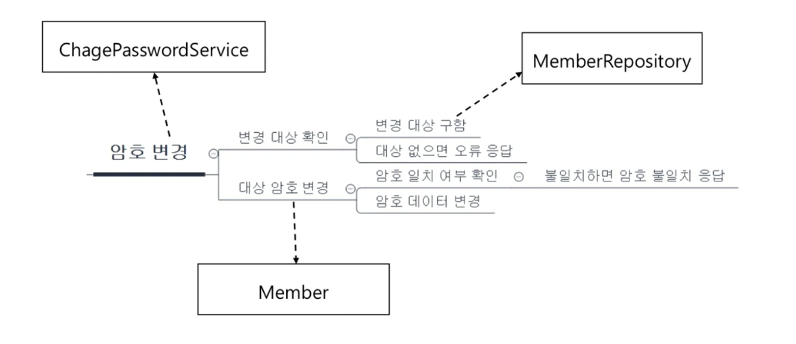
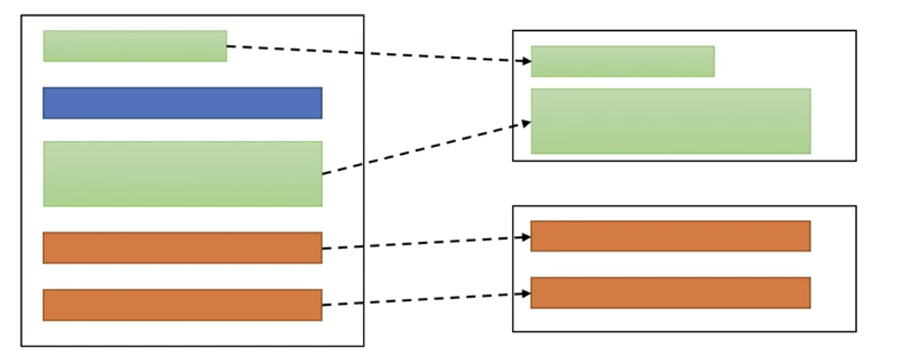

# 기능과 책임을 분리

## 기능 분해
 - 기능은 하위 기능으로 분해
 - 
 - 기능은 여러 하위 기능의 모임에 의해 구현됨

## 기능을 누가 제공할 것인가?
 - 기능은 곧 책임
     - 분리한 각 기능을 알맞게 분배
     - 
         - 주석
             - chagePasswordService => changePasswordService
     - 의문
         1. member와 memberRepository의 차이는?
             - 답변
                 - 아래 하위 기능 사용 섹션의 예제 코드 참고

## 하위 기능 사용
 - 예제
   -  ```
        public class ChangePasswordService {
            public Result changePassword(
                String id,
                String oldPw,
                String newPw
            ) {
                Member mem = memberRepository.findOne(id);
                if (mem == null) {
                    return Result.NO_MEMBER;
                }

                try {
                    mem.changePassword(oldPw, newPw);
                    return Result.Success
                } catch (BadPasswordException ex) {
                    return Result.BAD_PASSWORD;
                }
            }
        }  
      ```  

## 큰 클래스, 큰 메서드
 - 클래스나 메서드가 커지면 절차 지향의 문제 발생
     - 큰 클래스 -> 많은 필드를 많은 메서드가 공유
     - 큰 메서드 -> 많은 (메서드 내) 변수를 많은 코드가 공유
     - 여러 기능이 한 클래스/메서드에 섞여 있을 가능성 존재
 - 책임에 따라 알맞게 코드 분리 필요
     - 

## 몇 가지 책임 분배/분리 방법
 - 패턴 적용
 - 계산 기능 분리
 - 외부 연동 분리
 - 조건별 분기는 추상화
 - 그 외 더 존재..

## 패턴 적용
 - 전형적인 역할 분리
     -  간단한 웹
         - 컨트롤러, 서비스, DAO
     -  복잡한 도메인
         - 엔티티, 벨류, 리포지토리, 도메인 서비스
     - AOP
         - Aspect(공통 기능)
     - GoF
         - 팩토리, 빌더, 전략, 템플릿 메서드, 프록시/데코레이터 등

## 계산 분리
 - 개선 전 예제
     -  ```
            Member mem = memberRepository.findOne(id);
            Product prod = productRepository.findOne(prodId);

            int payAmount = prod.price() * orderReq.getAmount();
            
            // 아래 코드 주의!
            double pointRate = 0.01;
            if (mem.getMembership() == GOLD) {
                pointRate =0.03;
            } else if (mem.getMembership() == SILVER) {
                pointRate = 0.02;
            }

            if (isDoublePointTarget(prod)) {
                pointRate *=2;
            }

            int point = (int) (payAmount * pointRate);

            ...
        ```  
    - 개선 후 예제
        - ```
            Member mem = memberRepository,findOne(id);
            Product prod = productRepository.findOne(prodId);

            int payAmount = prod.price() * orderReq.getAmount();
            PointCalculator cal = new PointCalculator(
                payAmount,
                mem.getMembership(),
                prod.getId()
            );
            int point = cal.calculate()
          ```
        - ```
            public class PointCalculator {
                ...membership, payAmount, prodId 필드/생성자

                public int calulate() {
                    double pointRate = 0.01;
                    if (membership == GOLD) {
                        pointRate = 0.03;
                    } else if (membership == SILVER) {
                        pointRate = 0.02;
                    }

                    if (isDoublePointTarget(prodId)) {
                        pointRate *=2;
                    }
                    return (int) (payAmount * pointRate);
                }
            }
          ```

## 연동 분리
 - 네트워크, 메시징, 파일 등 연동 처리 코드 분리
 - 개선 전 예제
     -  ```
          Product prod = findOne(id);

          RestTemplate rest = new RestTemplate();
          List<RecoItem> recoItems = rest.get("http://internal/recommend?id=" + prod.getId() + "&user=" + userId + "&category" + prod.getCategory(), RecoItem.class)  
        ```
  - 개선 후 예제
      - ```
          Product prod = findOne(id);

          RecommendService recoService = new RecommendService();
          List<RecoItem> recoItems = recoService.getRecoItems(prod.getId(), userId, prod.getCategory()); 
        ``` 
## 조건 분기는 추상화
 - 연속적인 if-else는 추상화 고민
 - 개선 전 예제
   -  ```
        String fileUrl ="";
        if (fileId.startWith("local:")) {
            fileUrl = "/files/" + fileId.substring(6);
        } else if (fileId.startWith("ss:")) {
            fileUrl = "http://fileserver/files/" + fileId.substring(3);
        }
      ```
 - 개선 후 예제
     - ```
        FileInfo fileInfo = FileInfo.getFileInfo(fileUrl);
        String fileUrl = fileInfo.getUrl(); 
       ```   
    - ```
        public interface fileInfo {
            String getUrl();
            static FileInfo getFile(...) {...}
        } 

        public class SSFileInfo implements FileInfo {
            private String fileId;

            public String getUrl() {
                return "http://fileserver/files" + fileId.substring(3);
            }
        }
      ```
        - 다형성을 통해 if-else 해결
  - 주의: 의도가 잘 드러나는 이름 사용
    - 예
        - HTTP로 추천 데이터 읽어오는 기능 분리 시
            - RecommendService(의도 보다 명확) > HttpDataService
## 역할 분리와 테스트
 - 역할 분리가 잘 되면 테스트도 용이 해짐
 - 예제 1 (안좋은)
     -  ```     
            Member mem = memberRepository.findOne(id);
            Product prod = productRepository.findOne(prodId);

            int payAmount = prod.price() * orderReq.getAmount();
            
            // 아래 코드 주의!
            double pointRate = 0.01;
            if (mem.getMembership() == GOLD) {
                pointRate =0.03;
            } else if (mem.getMembership() == SILVER) {
                pointRate = 0.02;
            }

            if (isDoublePointTarget(prod)) {
                pointRate *=2;
            }

            int point = (int) (payAmount * pointRate);

            ... 
        ```
            - memberRepository와 productRepository를 실행 해야만 아래 포인트 관련된 코드를 실행 가능하다. (의존성 존재)
  - 예제 2 (좋은)
          - ```
            public class PointCalculator {
            ...membership, payAmount, prodId 필드/생성자

            public int calulate() {
                double pointRate = 0.01;
                if (membership == GOLD) {
                    pointRate = 0.03;
                } else if (membership == SILVER) {
                    pointRate = 0.02;
                }

                if (isDoublePointTarget(prodId)) {
                    pointRate *=2;
                }
                return (int) (payAmount * pointRate);
                }
            }   
            ```
            - PointCalculator는 독립된 모듈이므로, 별도 테스트 가능

## 분리 연습1
 - pending, 돌아와서 할 예정

## 참고 
 - https://www.inflearn.com/course/%EA%B0%9D%EC%B2%B4-%EC%A7%80%ED%96%A5-%ED%94%84%EB%A1%9C%EA%B7%B8%EB%9E%98%EB%B0%8D-%EC%9E%85%EB%AC%B8/lecture/13437?tab=note&volume=0.20