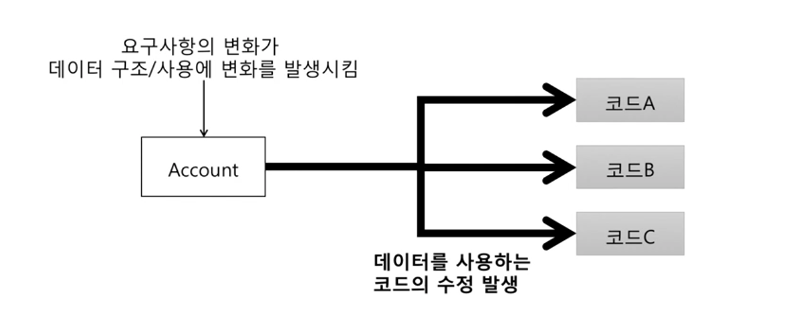
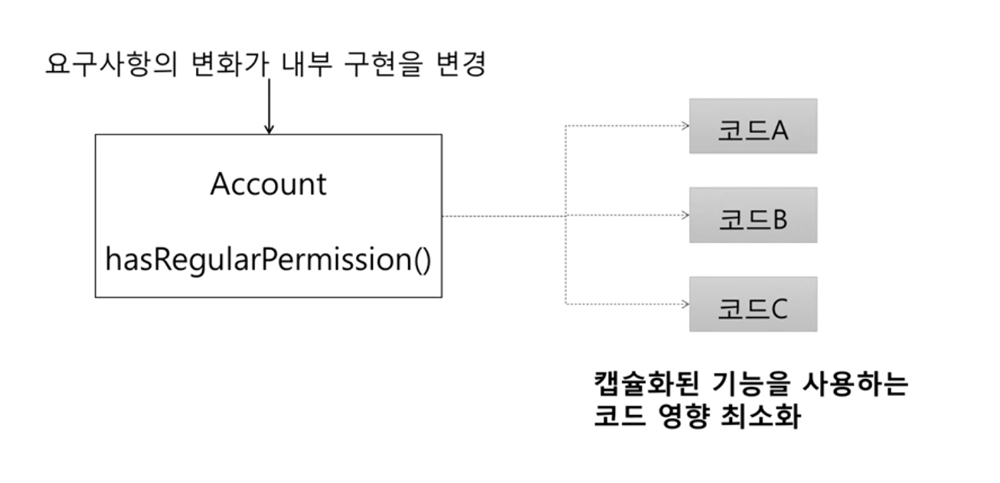

# 캡슐화 (Encapsulation)
 - 데이터 + 관련 기능 묶기
 - 객체가 기능을 어떻게 구현했는지 외부에 감추는 것 (구현의 블랙박스화)
   - 구현에 사용된 데이터의 상세 내용을 외부에 감춤
 - 정보 은닉(Information Hiding) 의미 포함
 - 외부에 영향 없이 객체 내부 구현 변경 가능
 - 캡슐화를 통해 변경하는 비용을 낮출 가능성을 높일 수 있다.
 - 캡슐화 된 객체를 사용하는 입장에서 최소한의 객체 구현 정보(메서드)만 파악 후 사용 가능 

## 캡슐화 하지 않으면
 - 안 좋은 예시
   - 기본 예제
      - ```
        if (acc.getmembership() ===REGULAR && acc.getExpDate().isAfter(now())) {
            ... 정회원 기능
        } 
        ```
         - REGULAR : 정회원
         - ExpDate : 만료일
         - ServiceDate(): 시작일
   - 기본 예제에서 요구사항에 추가됨 
       - 추가된 요구사항 : (이벤트) 5년 이상 사용한 현재 정회원에게 정회원 혜텍 1개월 무상 제공
       - ```
         if (acc.getMembership() == REGULAR && 
            (
                (acc.getServiceDate().isAfter(fiveYearAgo) && acc.getExpDate().isAfter(now())) ||
                (acc.getServiceDate().isBefore(fiveYearAgo) && addMonth(acc.getExpDate()).isAfter(now())) 
            )
         ) {
            ... 정회원 기능
         }
         ```
   -  
      -  요구사항 변경 예
        1. 장기 사용자에게 특정 기능 실행 권한을 연장 (단 유효 일자는 그대로 유지)
        2. 계정을 차단하면 모든 실행 권한 없음
        3. Date를 LocalDateTime으로 변경

## 캡슐화하면
 - 기능을 제공하고 구현 상세를 감춤
 - 개선 예시
   - ```
      if (acc.hasRegularPermission()) {
          ... 정회원 기능
      }
     ```
   - ```
      public class Account {
          private Membership membership;
          private Date expDate;

          public boolean hasReqularPermission() {
              return membership === REGULAR && expDate.isAfter(now())
          }
      } 
     ```
 - 기능 조건 변경 예시
   - ```
      if (acc.hasRegularPermission()) {
          ...정회원 기능
      } 
     ```
   - ```
      public class Account {
          public boolean hasRegularPermission() {
              return membership === REGULAR && 
                 ( expDate.isAfter(now()) || 
                    (
                        serviceDate.isBefore(fiveYearAgo()) && addMonth(expDate).isAfter(now())
                    )
                )
          }
      } 
     ```
 - 캡슐화 효과
     - 연쇄적인 변경 전파를 최소화
     -  

## 캡슐화와 기능
 - 캡슐화 시도 -> 기능에 대한 (의도) 이해를 높임
 - ```
    if(acc.getMembership() ==REGULAR) {
        ...
    }
   ```
    - 멤버십이 REGULAR와 같은지 검사하는 이유는 실제로 무엇 때문인가?
 - 검사하는 이유는 계정이 REGULAR 권한 소유 여부를 확인 하기 위함
    - 예시
        - ```
            if (acc.hasRegularPermission()) {
                ...
            }
            ```
        - ```
            public class Account {
                public boolean hasRegularPermission() {
                    ...
                }
            }
            ```

## 캡슐화를 위한 규칙
 - Tell, Don't Ask
    - 데이터 요청이 아닌 객체 메서드 동작(getter가 아닌)하기
    - 나쁜 예시
        - ```
            if (acc.getMembership() == REGULAR) {
                ... 정회원 기능
            }
          ```
    - 개선 예시
        - ```
            if (acc.hasRegularPermission()) {
                ... 정회원 기능
            }
          ```
 - Demeter's Law (디미터의 법칙)
    - 지향
        - 높은 캡슐화를 통한 객체의 자율성과 응집도 향상 (변경 비용 최소화)
        - 객체지향의 중요한 점은 "객체가 어떤 데이터를 가지는가?" 가 아닌, "객체가 어떤 메시지를 주고 받는가?" 이다.
    - 의미
        - 객체에게 데이터를 숨기는 대신 함수를 공개
            - Principle of least knowledge (최소 지식 원칙)
            - Don't Talk to strangers (낯선 이에게 말하지 말라)
            - 여러 개의 .(도트)를 사용하지 말라
    - 방법
        - (객체 내의) 메서드에서 생성한 객체의 메서드만 호출
        - (객체 내의) 파라미터로 받은 객체의 메서드만 호출 
        - (객체 내의) 필드로 참조하는 객체의 메서드만 호출
    - 예시1
        - ```
            // 수정 전
            acc.getExpDate().isAfter(now);

            // 수정 후
            acc.isExpired()
            acc.isValid()
          ```
           - acc.getExpDate() -> 메서드에서 생성한 객체 (를 반환)
    - 예시2
        - ```
            // 수정 전
            Date date = acc.getExpDate();
            date.isAfter(now);

            // 수정 후
            acc.isExpired()
            acc.isValid(now)
          ```
    - 예시3 
        - 디미터 법칙 미준수 코드
        - ```
            @Getter
            public class User {
                private String email;
                private String name;
                private Address address;

            }

            @Getter
            public class Address {
                private String region;
                private STring details;
            }

            // 어떤 사용자가 서울에 살고 있는 경우, 알람을 보내줌
            @service 
            public class NotificationService {
                public void sendMessageForSeoulUser(final User user) {
                    if("서울".equals(user.getAddress().getRegion())) {
                        sendNotification(user);
                    }
                }
            }
          ```
            - 디미터 법칙 위반 내역
                - NotificationService 객체는 user 객체에게 요청이 아닌 데이터를 확인하고 있음
                - NotificationService 객체는 users 객체에 대해서 데이터를 가짐을 파악할 수 있는 getter 함수인 getAddress, getRegion을 통해서데이터를 직접 확인해서 비즈니스 로직을 처리함
        - 디미터 법칙을 준수하는 코드
        - ```
            // @Getter 제거 가능
            public class Address {
                private String region;
                private String details;

                public boolean isSeoulRegion() {
                    return "서울".equals(region)
                }
            }

            // @Getter 제거 가능
            public class User {
                private String email;
                private String name;
                private Address address;

                public boolean isSeoulUser() {
                    return address.isSeoulRegion()
                }
            }

            @Service
            public class NotificationService {
                public void sendMessageForSeoulUser(final User user) {
                    if(user.isSeoulUser()) {
                        sendNotification(user)
                    }
                }
            }

            // 또는
            public List<User> getSeoulUserList() {
                final List<User> userList = userRepository.findAll()

                return userList.stream()
                    .filter(this::isSeoulUser)
                    .collect(toList)
            }
          ```
            - getSeoulUserList
                -  디미터 법칙을 위배하지 않음
                - userList.stream().filter(this::isSeoulUser).collect(toList)의 경우 여러 . (도트)를 사용했으나 외부로 도트를 노출하지는 않음
                - 즉, 디미터 법칙은 결합도와 관련된 것이므로 객체의 내부 구조가 외부로 노출되는지에 따라 위배 여부가 결정된다.    

## 캡슐화 연습 1
 - 개선 전 예제
    - ```
        public AuthResult authenticate(String id, String pw) {
            Member mem = findOne(id);
            if(mem == null) return AuthResult.NO_MATCH;

            if(mem.getVerificationEmailStatus() != 2) {
                return AuthResult.NO_EMAIL_VERIFIED;
            }
            if(passwordEncoder.isPasswordValid(mem.getPassword(), pw, mem.getId())) {
                return AuthResult.SUCCESS;
            }

            return AuthResult.NO_MATCH;
        }
      ```
        - Tell, Don't ask 적용 필요
 - 개선 후 예제
    - ```
        public class Member {
            private int verificationEmailStatus;

            public boolean isEmailVerified() {
                return verificationEmailStatus == 2;
            }
        }

        public AuthResult authenticate(String id, String pw) {
            Member mem = findOne(id);
            if (mem === null) return AuthResult.NO_MATCH

            if(!mem.isEmailVerified()) {
                return AuthResult.NO_EMAIL_VERIFIED;
            }

            if
        }
      ```


## From : 오브젝트
 - 객체들의 협력 경로를 제한하면 결합도를 효과적으로 낮출 수 있다.

## From : UML과 패턴의 적용
 - 구조 은닉 설계 (structure-hiding design)
    - 9개의 GRASP 패턴 중 하나로서 Don't Talk to Strangers (낯선 사람에게 말하지 마라) 패턴 또는 디미터 법칙
    - 긴 객체 구조의 경로에 따라 멀리 떨어져 있는 간접적인(낯선) 객체에 메시지를 보내는 (또는 이야기하는) 설계를 피하라. 이러한 설계는 일반적으로 불안정한 지점으로, 객체 구조의 변화에 부서지기 쉽다.
        - 의문
            - 간접적인 것은 아래 조건이 아닌 경우를 의미함
    - Don't Talk to Strangers 패턴은 (객체의) 메소드 내에서 어떤 객체에 메시지를 보내야 하는가에 대한 제약을 가한다. 메소드 안에서 아래의 5가지 경우의 객체에게만 메시지를 보내야 한다.
      1. this(또는 self) 객체
      2. 메소드의 매개변수
      3. this의 속성
      4. this의 속성인 컬렉션의 요소
      5. 메소드 내에서 생성된 객체

## From : 소트웍스 앤솔로지
 - 디미터의 법칙("친구하고만 대화하라")의 예시로 자기 소유의 장난감, 자기가 만든 장난감, 그리고 누군가 자기에게 준 장난감하고만 놀 수 있다. 하지만 절대 장난감의 장난감과 놀면 안된다.

## From: 테스트 주도 개발로 배우는 객체 지향 설계와 실천
 - 서로 메시지를 전달하는 객체가 있다면 객체는 서로 무슨 이야기를 할까?
 - 경험상 객체를 호출 시, 호출된 객체의 주변의 객체들의 역할을 고려하여 호출한 객체가 호출된 객체에게 무엇을 원하는 지 기술하고, 호출된 객체가 그러한 바를 어떻게 실현할지 결정하게 해야 한다.
 - 이것을 흔히 '묻지 말고 말하라' 스타일이나 좀 더 형식적으로 말하면 디미터의 법칙으로 알려져 있다.
    - 예시
        - "야 obj, 너 age가 뭐야? 20살 미만은 출입 불가야 -> if(obj.age >=20) { 출입불가 }" 보다는 obj.isAdult().
        - 분기문을 통해 묻지 않고, 바로 isAdult인지 말한다. (caller 측면에서 callee의 메서드를 호출하는 것을 callee가 말하게 함을 의미) 
 - 객체는 그것이 내부적으로 보유하고 있거나 메시지를 통해 확보한 정보만 가지고 의사 결정을 내려야 한다.
    - 예시
        - 정보의 비대칭 측면에서 obj.isAdult는 obj만이 정말 성인인지 판단할 수 있다(?) 그것을 호출하는 caller가 isAdult 여부를 if(obj.age >=20)으로 확인하는 것은 메시지를 통해 확보한 정보가 아니다.
        - 반대로 obj.isAdult는 obj 내부의 필드인 age(내부적으로 보유하고 있는)를 통해 isAdult 여부를 말할 수 있다.
 - 객체는 다른 객체를 탐색해 뭔가를 일어나게 해서는 안된다.
    - 추측상, 탐색은 다른 객체의 데이터를 의미한다고 보임
    - 객체의 데이터를 탐색하는 코드를 짜느니 해당 객체가 말하게 하는 게 디미터의 법칙에 적합
 - 결론으로 객체는 그것이 내부적으로 보유하고 있거나 메시지를 통해 확보한 정보만 가지고 의사 결정을 내려야 한다.

## From: Clean Code
 - 디미터의 법칙은 잘 알려진 휴리스틱이다
 - 모듈은 자신이 조작하는 객체의 내부에 대해서는 블랙박스화
 - 예시로 객체는 조회 함수로 내부 구조를 공개하면 안됨
 - 만약 공개시, 내부 구조를(숨기지 않고) 노출함을 의미함 (지양을 넘어 금지)
 - 클래스 C의 메서드 f는 다음과 같은 객체의 메서드만 호출해야 한다
    - 클래스 C
    - f가 생성한(메서드 내부에서 생성된) 객체
    - f 인수로 넘어온 객체
    - C 인스턴스 변수에 저장된 객체
 - 일반적으로 한 모듈은 주변 모듈을 모를수록 좋다. 구체적으로 A가 B를 사용하고 B가 C를 사용한다 하더라도 A가 C를 알아야 할 필요는 없다.
## From : 오브젝트
 - 협력 경로를 제한하라
   - 협력하는 개체의 내부 구조에 대한 결합으로 인해 발생하는 설계의 문제를 해결하기 위해 제안된 원칙이 바로 디미터의 법칙이다.
   - 디미터의 법칙을 요약시, 객체의 내부 구조에 강하게 결합되지 않도록 협력 경로를 제한하라는 것이다.
        - 의문
            - 협력 경로?
                - 잘 생각해보면 협력을 위한 경로이다. Form: Clean Code 섹션의 '클래스 C의 메서드 f는 다음과 같은 객체의 메서드만 호출해야 한다' 등을 참고
 - 객체의 내부 구조를 묻지 말고, 무언가를 시켜라.
   - 디미터의 법칙은 객체가 자기 자신을 책임지는 자율적인 존재여야 한다는 사실을 강조
        - 본인에게 역할과 책임을 부여한다. 위 예시 obj.isAdult()를 떠올릴 것
   - 정보를 처리하는 데 필요한 책임을 정보를 알고 있는 객체에게 할당하기 때문에 응집도가 높은 객체가 만들어진다.
        -  예시로 obj.isAdult()의 adult 판단 여부를 obj가 직접 하므로 (다른 객체를 통해 판단하지 않으므로) obj 내부에 age가 존재하고 isAdult(), 그리고 추가적인 isKid, isOlder 등의 확장이 가능하다. 

## From : UML을 활용한 객체지향 분석 설계
 - 객체 간 관계를 설정할 때 한 가지 유용한 지침을 디미터 법칙이라고 부른다.
 - 한 클래스에 속한 메소드들은 어떤 식으로든지 다른 클래스 구조에 의존해서는 안된다.
 - 단, 직 상위 클래스 구조만은 예외로 의존해도 된다.
    - 의문
        - 직 상위 클래스 구조란?
            - 바로 1단계 위에서 상속하는 부모 클래스를 의미
 - 각 메소드가 메시지를 보낼 때도 극히 제한된 클래스 집합에 속하는 개체에게만 보내야 한다.
    - 의문
        - 극히 제한된 클래스 집합이란? 
            - 의미 그대로 최소한의 클래스 집합을 활용을 해서 느슨한 결합을 성립시키고 최소한의 클래스는 내부의 응집도를 높인다.
 - 디미터의 법칙에 의해 얻을 수 있는 기본 효과는 느슨히 결합된 클래스가 생성되고, 그들의 구현 비밀은 캡슐화로 감춰진다는 것.
 - 디미터의 법칙을 준수하는 클래스라면 어떤 클래스의 의미를 알려고 하는 경우 여러 클래스의 상세한 내용까지 알지 않아도 된다.

## From: 실용주의 프로그래머
 - 디미터 법칙은 객체의 모든 메서드는 다음에 해당하는 메서드만을 호출해야 한다
    - 자신
    - 메서드로 넘어온 인자
    - 자신이 생성한 객체
    - 직접 포함하고 있는 객체
 - 디미터 법칙을 준수 시 함수를 호출하는 클래스의 응답 집합(?) 크기를 줄일 수 있기 때문에 보다 적은 에러를 가진 클래스를 만들 수 있다.

 ## 법칙의 준수와 위반
  - 디미터 법칙을 따르는 형태의 코드 형식은 매우 단순한다.
    - ```
        object.method(parameter);
      ```
  - 법칙을 지킬 필요가 없는 경우
    - ```
        Options opts = ctxt.getOptions();
        File scratchDir = opts.getScratchDir();
        final String outputDir = scrachDir.getAbsolutePath();
      ```
        - 디미터 법칙 위반 여부는 ctxt, Options, ScratchDir이 객체인지 아니면 자료 구조인지에 따라 결정된다.
        - 만일 객체인 경우 객체 구조를 숨겨야 하므로 확실히 디미터 법칙을 위반하지만, 반면 자료 구조인 경우 당연히 내부 구조를 노출하므로 디미터의 법칙이 적용되지 않는다.
   - 디미터 법칙은 경우에 따라 판별하기 애매한 경우가 존재하므로, 이분법적으로 생각하지 않도록 한다.

## 디미터 법칙을 위반한 코드 - 기차 충돌
 - 디미터 법칙을 따르지 않으면 메시지 체인(Message Chains)이란 악취가 발생한다.
 - ```
    object.getChild().getContent().getItem().getTitle();
   ```
    - getter가 메서드 체이닝이 일어나는 현상을 열차전복 또는 기차 충돌(train wreck)이라는 단어로 표현하기도 한다.
  - 원거리의 간접적인 객체에 메시지를 보내기 위해서(즉, 원거리의 낯선 사람에게 이야기하기 위해서) 객체의 연결 경로를 따라 더 멀리 순회한다.
  - 이러한 설계는 객체들이 어떻게 연결되어 있는지를 나타내는 특정한 구조와 결합된다.
  - 프로그램 순회의 경로가 길어질수록 프로그램은 더 불안정해진다. 그 이유는 객체 구조(연결)는 변경 될 수 있다. (예시로 중간 지점의 어느 객체의 메소드가 달라진 경우 체이닝이 끊긴다.)

## 주의 : 디미터 법칙은 하나의 .을 강제하는 규칙이 아니다
 - 예시
   ```
    IntSTream.of(1, 15, 20, 3, 9)
    .filter(x -> x > 10)
    .distinct()
    .count();
   ```
   - 디미터 법칙을 위반하지 않음. 
   - 이유는 of, filter, distinct 메서드는 모두 IntStream이라는 동일한 클래스의 인스턴스를 반환
   - 디미터 법칙은 결합도와 관련것이며, 이 결합도가 문제가 되는 것은 객체의 내부 구조가 외부로 노출되는 경우로 한정된다.
   - IntStream 내부 구조가 외부로 노출되지 않았다. 단지 IntStream을 통해 다른 IntStream으로 반환할 뿐, 객체를 둘러싸고 있는 캡슐은 그대로 유지된다.
   - 결론으로 하나 이상의 도트(.)를 사용하는 모든 케이스가 디미터 법칙 위반은 아니다. 기차 충돌 처럼 보이는 코드라도 내부 구현에 대한 어떠한 정보도 외부로 노출하지 않는다면 그것은 디미터 법칙을 준수한 것이다.

## 메시지 체인의 리팩토링
 - 마틴 파울러의 "리팩토링"의 메시지 체인에 대한 언급
 - 메시지 체인은 클라이언트가 한 객체에 제 2의 객체를 요청하면, 제의 객체가 제3의 객체를 요청하고, 제 3의 객체가 제 4의 객체를 요청하는 식으로 연쇄적 요청이 발생하는 문제점을 뜻한다.
 - 메시지 체인은 수 많은 코드 행이 든 getThis 메서드나 임시변수 세트라고 봐도 된다.
 - 이러한 요청의 왕래로 인해 클라이언트는 그 왕래 체제에 구속된다. 그 사이의 관계들에 수정이 발생할 때 마다 클라이언트도 수정해야 한다.
 - 메시지 체인에 대해서 대리 객체 은폐 (Hide DElegate, 195쪽)을 실시해야 한다.
 - 대리 객체 은폐는 원칙적으로 체인을 구성하는 모든 객체에 적용할 수 있지만, 그렇게 하면 모든 중간 객체가 중개 메서드로 변해서 과잉 중개 메서드(middle man)의 구린내를 풍기는 문제가 흔히 발생한다.
     - 의문
       -  대리 객체 은폐란?
             -  체인을 구성하는 객체들을 은폐함. 모든 객체에 적용 시 중간 객체가 중개 메서드로 변해서 과잉 중개 메서드가 됨.
       -  과잉 중개 메서드란? 
             -  답: 너무 많은 메서드 체이닝을 통해 객체를 중개하는 경우
 - 그렇다면 차라리 결과 객체가 어느 대상에 사용되는지를 알아내는 방법이 더 낫다. (이를 통해 메서드 체이닝의 과잉 중개를 제거 가능)
 - 알아낸 객체가 사용되는 코드 부분을 메서드 추출(Extract Method, 142쪽)을 통해 별도의 메서드로 빼낸 후 메서드 이동(Move Method, 178쪽)을 실시해서 체인 아래로 밀어낼 수 있는지 여부를 검사해야 한다.
     - 의문
       - 메서드 추출(Extract Method)이란?
           - 결과 객체가 사용되는 코드 부분을 메서드 추출을 통해 별도 메서드로 분리함
       - 메서드 이동(Move Method)이란?
           - 분리한 메서드를 다른 코드로 이동해서 체인에서 분리 (코드 레벨에서 메서드를 이동시킴을 의미하는 듯)
 - 만약 체인에 속한 객체 중 한 객체의 여러 클라이언트가 나머지 객체들에 왕래한다면 여러 클라이언트가 왕래하는 한 객체 부분을 별도 메서드로 추출하면 된다

## 객체지향 생활 체조
 - 규칙 4. 한 줄에 한 점만 사용 할 것!
 - 종종 하나의 동작에 대해 어떤 오브젝트가 맡고 있는지 구분하기 어려울 때가 있다.
 - 여러 개의 점이 들어 있는 코드 몇 줄을 들여다보기 시작하면, 책임 소재의 오률 많이 발견하기 시작한다.
 - 어떠한 코드 한줄이라도 점이 하나 이상 있으면 그른 곳(?)에서 동작이 일어난다는 의미이다.
 - 어쩌면 오브젝트는 다른 두 오브젝트들을 동시에 다루고 있는 것이다.
 - 이 경우 오브젝트는 중개상, 즉 너무 많은 살마들에 대해 지나치게 알고 있는 꼴이다(마치 유통에 있어 중개상을 배제하고 직거래하듯이). 문제의 동작을 관련 오브젝트 중 하나로 옮겨보자.
 - 그 모든 점들이 연결되어 있다면 대상 오브젝트는 딴 오브젝트에 깊숙이 관여하고 있다.
 - 이런 중복된 점들은 캡슐화를 어기고 있다는 방증이기도 하다.
 - 오브젝트가 자기 속을 들여다 보려 하기보다는 뭔가 작업을 하도록 만들려고 해야 한다. 캡슐화의 주요점은 클래스 경계를 벗어나 알 필요가 없는 타입으로 진입하지 않는 것이다.

## 객체지향 생활 체조
 1. 한 메서드에오직 한 단계의 들여쓰기만 한다.
 2. else 예약어(keyword)를 쓰지 않는다
 3. 모든 원시값과 문자열을 포장(wrap)한다.
    - 의문
      - 원시값 포장?
        - 답
          - 출처는 객체지향 생활 체조
          - Primitive Obsession Anti Pattern (도메인의 객체를 나타내기 위해 primitive 타입을 쓰는 나쁜 습관)을 피하기 위해서 필요
          - 원시점 포장은 원시 유형의 값(변수)를 이용해 의미를 나타내지 않고, 의미 있는 객체로 포장함.
          - 예시
          - ```
             // Foo는 bettingMoney에 대한 의문이 존재한다. 의문은 int인가? 음수인가 양수인가 등 
             public class Foo {
                 private int bettingMoney;
                 public void addMoney (final int money) {
                     this.bettingMoney += money;
                 }
             } 

             // Foo 개선
             public class Foo {
                 private BettingMoney bettingMoney;

                 public void addMoney(final int money) {
                     this.bettingMoney = bettingMoney.addMoney(money)
                 }
             }

             // 유효성 검사, 동등성 검사, 불변을 BettingMoney 객체 내부에서 관리할 수 있다.
             public class BettingMoney {
                 private final int bettingMoney;

                 public BettingMoney (final int bettingMoney) {
                     validatePositiveBettingMoney(bettingMoney);
                     this.bettingMoney = bettingMoney
                 }

                 public BettingMoney addMoney(final int money) {
                     return new BettingMoney(bettingMoney + money)
                 }

                 private void validatePositiveBettingMoney(int bettingMoney) {
                     if(bettingMoney <= 0) {
                         throw new IllegalArgumentException(String.format(NOT_POSITIVE_MONEY_EXCEPTION_MESSAGE))
                     }
                 }

             }
            ```
             - 효과
               - 원시값으로 도메인의 의미를 나타내는 경우 도메인을 사용하는 곳에서 믿고 사용이 불가능 (유효성, 동등성, 불변을 사용하는 곳에서 관리해야 하기 때문에)
               - 결국 원시값 포장을 통해 사용하려는 도메인의 의미를 더 정확하게 드러낼 수 있다.
         - 원시값 포장이랑 VO는 같은 것일까?
             - 아니다. 위 예제는 원시값 포장하여 VO를 만든 것은 맞다.
             - 원시값 포장과 동시에 VO로 만들 수 있으나, 원시값 포장이 VO다라고 할 수는 없다.
             - 예시로 원시값 포장을 하고 불변이 아니길 원하는 경우도 존재할 수 있다.
         - VO (값 객체)
             - Immutablility(불변성) - 수정자에게 setter가 없음
             - value equality (값 동등성) - 내부 값 동등성 검사
             - self validation (자가 유효성 검사) - 생성자에서 validation
             - 예시
             - ```
                // 원시값을 포장해서 VO 성립하는 경우
                public class BettingMoney { 
                     private final int bettingMoney;
                     
                    public BettingMoney(final int bettingMoney) {   
                        validatePositiveBettingMoney(bettingMoney); 
                        this.bettingMoney = bettingMoney;
                    } 
                }

                // 원시값을 포장했으나 VO는 아닌 경우
                public class BettingMoney {
                    private int bettingMoney;

                    public BettingMoney (final int bettingMoney) {
                        validatiePositiveBettingMoney(bettingMoney);
                        this.bettingMoney = bettingMoney
                    }

                    public void setMoney(int money) {
                        this.bettingMoney = money
                    }
                }

                // BigDecimal을 포장해서 VO 성립하는 경우
                public class bettingMoney {
                    private final BigDecimal bettingMoney;

                    public BettingMoney(final BigDecimal bettingMoney) {
                        validatePositiveBettingMoney(bettingMoney);
                        this.bettingMoney = bettingMoney;
                    }
                }

                // BigDecimal을 포장헀지만 VO는 아닌 경우
                public class BettingMoney {
                    private BigDecimal bettingMoney;

                    public BettingMoney (final BigDecimal bettingMoney) {
                        validatePositiveBettingMoney(bettingMoney);
                        this.bettingMoney = bettingMoney;
                    }

                    public void setMoney(BigDecimal money) {
                        this.bettingMoney = money;
                    }
                }

               ``` 
             - 결론 : 원시값 포장은 말 그대로 primitive type을 포장함을 의미.
             - BigDecimal은 BigDecimal 포장이다. 원시값 포장이 아니다.
 4. 한 줄에 점을 하나만 찍는다.
 5. 줄여쓰지 않는다(축약 금지)
 6. 모든 엔티티(Entity)를 작게 유지한다.
 7. 2개 이상의 인스턴스 변수를 가진 클래스를 쓰지 않는다.
 8. 제일 클래스(First-class) 콜렉션을 쓴다.
 9. getter/setter/property를 쓰지 않는다.  

## 후기
 - 참고 내용을 주로 타이핑을 통해 정리함
 - 잘 이해가 안되고 난해하고 모호한 부분이 많음.. 언젠가 이해되겠지?
## 참고
 - https://dl.acm.org/doi/10.1145/62084.62113 디미터의 법칙
 - https://www.inflearn.com/course/%EA%B0%9D%EC%B2%B4-%EC%A7%80%ED%96%A5-%ED%94%84%EB%A1%9C%EA%B7%B8%EB%9E%98%EB%B0%8D-%EC%9E%85%EB%AC%B8/lecture/13429?tab=community&volume=0.15&q=380856
 - https://johngrib.github.io/wiki/law-of-demeter/ - 많이 따라 타이핑 함