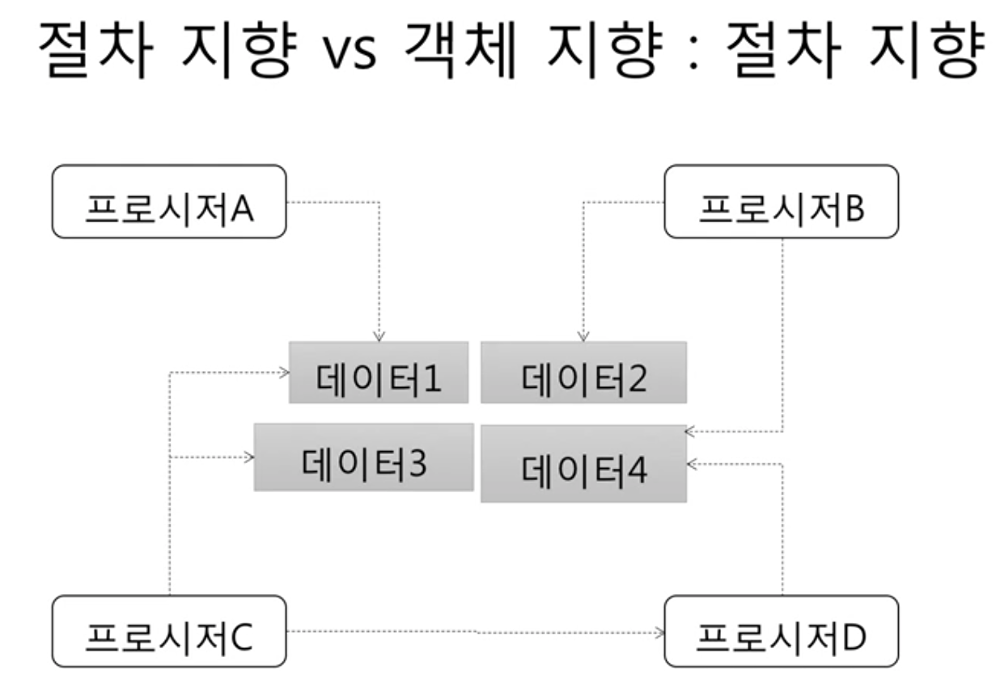
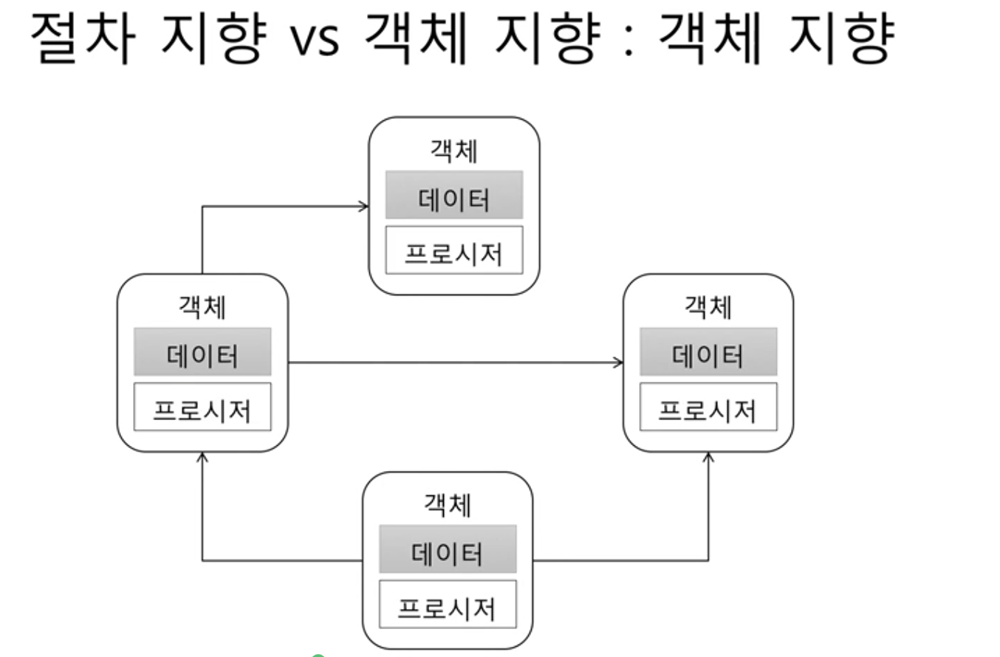
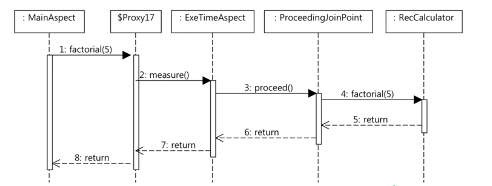

# 객체

## 절차 지향 vs 객체 지향 - 절차 지향
 -  
 - 데이터를 여러 프로시저가 공유하는 방식
 - 단점
     - 데이터 공유 방식은 시간이 흐를수록 구조를 복잡하게 만들고, 수정을 어렵게 만드는 요인이 된다.
 - 예시
     - example 1
        ```
            // 인증 API
            Account account = findOne(id);
            if (account.getState() == DELETED) {

            }

            // 암호 변경 API
            Account account = findOne(id);
            if (account.getState() == DELETED) {

            }
        ```
      - example 2
        ```
            // 인증 API
            Account account = findOne(id);
            if (account.getState() === DELETE || account.getBlackCount() >0 ) {
                ...
            }

            // 암호 변경 API
            Account account = findOne(id);
            if (account.getState() === DELETED || account.getBlockCount() > 0) {
                ...
            }
        ```
          - 차단 횟수인 getBlockCount에 대한 요구사항이 변경되면서, state 외 blockCount도 검사 해야 함. 
          - 요구사항이 바뀔 때마다, 그에 맞게 필요한 데이터가 바뀌고 코드도 같이 바뀐다.
      - example 3
        ```
            // 인증 API
            Account account = findOne(id);
            if (account.getState() ===DELETED || account.getBlockCount() >0 || account.getEmailVerifyStatus() ===0) {
                ...
            }

            // 암호 변경 API
            Account account = findOne(id);
            if (account.getState() == DELETED || account.getBlockCount() > 0 || account.getActiveStatus() == ENABLE) {
                ...
            }
        ```
          - 시간이 흐를수록 복잡해지고 수정이 어려워지는 코드
          - 동일한 코드가 여러 곳에서 사용됨 (getState, getBlockCount, getActiveStatus)

## 절차 지향 vs 객체 지향 - 객체 지향
 - 
 - 객체가 갖고 있는 데이터는 해당 객체의 프로시저만 접근 가능
 - 각 객체는 다른 객체의 데이터에 즉시 접근 불가
 - 객체는 프로시저를 이용해서 외부에 기능을 제공
 - 객체와 객체는 서로 프로시저를 호출하는 방식으로 상호작용 함
 - 초기 작업 시, 작업 속도는 상대적으로 느릴 수 있으나, 시간이 흐를수록 유지보수에 이점이 존재

## 객체란
 - 객체의 핵심 -> 기능 제공
     - 객체는 제공하는 기능으로 정의
         - 내부적으로 가진 필드(데이터)로 정의하지 않음
 - 예
   1. 회원 객체 
        - 암호 변경하기 기능
        - 차단 여부 확인하기 기능   
   3. 소리 제어기
        - 소리 크기 증가하기 기능
        - 소리 크기 감소하기 기능

## 기능 명세
 - 메서드(오퍼레이션)를 이용해서 기능 명세 (구현)
     - 이름, 파라미터, 결과로 구성
 - example 1
   - ```
      public class VolumeController {
          public void increase (int inc) {
              ...
          }

          public void decrease (int dec) {
              ...
          }

          public int volumn() {
              ...
          }
      } 
     ```
 - example 2
    - ```
        public Member {
            public void changePassword(
                string curPw, string newPw
            ) {
                ...
            }
        } 
      ```

## 객체와 객체
 - 객체와 객체는 기능을 사용해서 연결
     - 기능 사용 = 메서드 호출
     - ```
        VolumnController volCont = new VolumnController();

        volCont.increase(4);
        volCont.decrease(3);

        int currentVol = volCont.volumn(); 
       ```

## 용어: 메시지
  - (메시지는) 객체와 객체 상호 작용로 이해하자
      - 메시지를 주고 받는다고 표현
      - 종류
        - 메서드를 호출하는 메시지
        - 리턴하는 메시지
        - 익셉션 메시지
        - ... etc 
  - 
      - 주석
          - UML - 시퀀스 다이어그램

## 객체?
```
    public class Member {
        private String name;
        private String id;
    }

    public void setName(String name) {
        this.name = name;
    }

    public string getName() {
        return name;
    }

    public void setId(string id) {
        this.id
    }

    public String getId() {
        return id;
    }
```
 - getter, setter 만 존재하는 클래스는 객체보다 데이터에 더 가깝다. (데이터 클래스로 표현, 또는 구조체-자바에는 구조체가 없다)
 - 결론
   - 객체는 기능으로 정의된다.

## 참고
 - https://www.inflearn.com/course/%EA%B0%9D%EC%B2%B4-%EC%A7%80%ED%96%A5-%ED%94%84%EB%A1%9C%EA%B7%B8%EB%9E%98%EB%B0%8D-%EC%9E%85%EB%AC%B8/lecture/13428?tab=note&volume=0.17