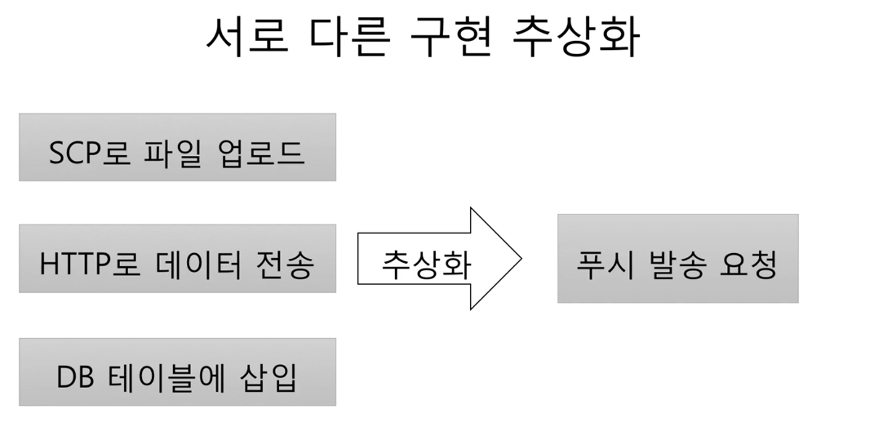
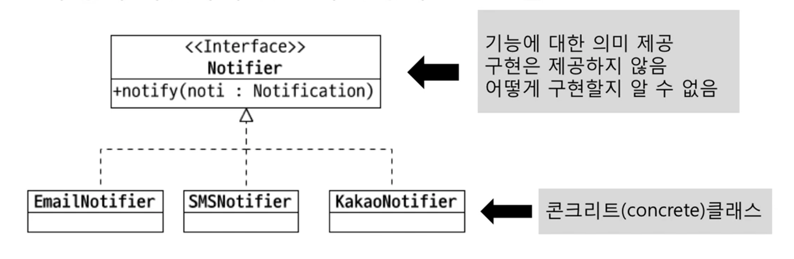
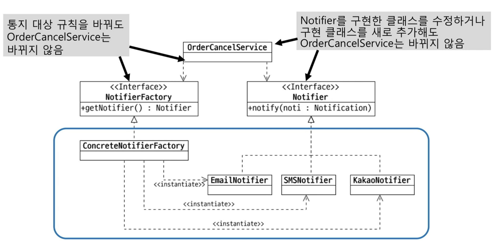
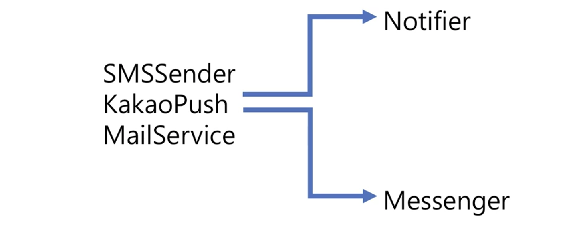

# 다형성과 추상화

## 다형성
 - 여러(poly) 모습(morph)을 갖는 것
 - 객체 지향에서는 한 객체가 여러 타입을 갖는 것
     - 즉 한 객체가 여러 타입의 기능을 제공
     - 타입 상속으로 다형성 구현
         - 하위 타입은 상위 타입의 슈퍼셋
 - **다형성은 추상화를 통해 공통된 성질, 특정 성질을 뽑아내는 것!**

## 다형성 예시
   - ```
      // 1 
      public class Timer {
          public void start() { ... }
          public void stop() { ... }
      } 

      public interfcae Rechargeable {
          void charge();
      }

      // 2
      public class IotTimer 
      extends Timer implements Rechargeable {
          public void charge() {
              ...
          }
      }

      // 3
      IotTimer it = new IotTimer();
      it.start();
      it.stop();

      Timer t = it;
      t.start();
      t.stop();

      Rechareable r = it;
      r.charge()
     ```

## 추상화 (Abstraction)
 - 데이터나 프로세스 등을 의미가 비슷한 개념(개념화)이나 의미 있는 표현(표현 도출)으로 정의하는 과정
 - 두 가지 방식의 추상화
     1. 특정한 성질
     2. 공통 성질(일반화)
 - 간단한 예
     - 특정할 성질 
         - DB의 USER 테이블 : 아이디, 이름, 이메일
         - Money 클래스 : 통화, 금액
     - 공통 성질
         - 프린터 : HP MXXX, 삼성 SL-M2XXX
         - GPU : 지포스, 라데온 

## 서로 다른 구현 추상화
 - 
   - SCP로 파일 업로드, HTTP로 데이터 전송, DB 테이블에 삽입, 3가지 동작이 모두 푸시 발송 요청을 공통으로 한 경우 

## 타입 추상화
 - 여러 구현 클래스를 대표하는 (공통화 된)상위 타입 도출
   - 흔히 인터페이스 타입으로 추상화
   - 추상화 타입과 구현은 타입 상속으로 연결
 -  

## 추상 타입 사용
 - 추상 타입을 이용한 프로그래밍
   -  ```
        Notifier notifier = getNotifier( ... ); // getNotifier가 어떤 type의 Notifier 인지는 알 수 없다.
        notifier.notifier(someNoti);  // 단 무언가 통제한다는 의도는 잘 들어남
      ```
 - 추상 타입은 구현을 감춤
   - 기능의 구현이 아닌 의도를 더 잘 드러냄 

## 추상 타입 사용에 따른 이점 : 유연함(변경 용이)
 - 콘크리트 클래스를 직접 사용하면
     - 요구사항 변경에 따라 주문 취소 코드(cancel 메서드 구현)도 함께 반영되는 중
         - cancel 메서드의 ... 주문 취소 처리는 바뀌지 않는 중
     - 단계 1 예제
         - ```
             private SmsSender smsSender;

             public void cancel(String ono) {
                 ... 주문 취소 처리

                 smsSender.sendSms(...);
             } 
           ```
     - 단계 2 예제
         - ```
            private SmsSender smsSender;
            private KakaoPush kakaoPush;

            public void cancel(String ono) {
                ...주문 취소 처리

                if(pushEnabled) {
                    KakaoPush.push(...); // Kakao Push를 통해 전달하는 기능 추가 된 경우
                } else {
                    smsSender.senderSms(...);
                }
            } 
           ```
     - 단계 3 예제
         - ```
            private SmsSender smsSender;
            private KakaoPush kakaoPush;

            public void cancel(String ono) {
                ...주문 취소 처리

                if(pushEnabled) {
                    KakaoPush.push(...);
                } else {
                    smsSender.senderSms(...);
                }
                mailSvc.sendMail(...); // email을 통해 취소 사실을 보내야 하는 경우
            }      
           ```  
  - 공통점을 도출하면
      - SMS 전송, 카카오톡 보냄, 이메일 발송은 추상화 시 통지가 된다.
  - 도출한 추상 타입 사용
      - 단계1 예제
        - ```
            public void cancel(String ono) {
                ...주문 취소 처리

                Notifier notifier = getNotifier(...); // 상황에 맞게 알맞은 getNotifier 생성
                notifier.notify(...);
            } 

            private Notifier getNotifier(...) {
                if(pushEnabled) {
                    return new KakaoNotifier();
                } else {
                    return new SmsNotifier();
                }
            }
         ```
     - 단계2 예제
       - 사용할 대상 접근도 추상화
       - ```
           // 만약 새 notifier가 추가된 경우 cancel 코드는 수정 되지 않고 아래 DefaultNotifierFactory 코드에서만 기능 추가가 됨 
           public void cancel (String ono) {
               ... 주문 취소 처리
               Notifier notifier = NotifierFactory.instance().getNotifier(...);
               notifier.notify(...);
           } 

           public interface NotifierFactory {
               Notifier getNotifier(...);

               static NotifierFactory instance() {
                   return new DefaultNotifierFactory();
               }
           }

           public class DefaultNotifierFactory implements NotifierFactory {
               public Notifier getNotifier(...) {
                   if(pushEnabled) {
                       return new KakoNotifier();
                   } else {
                       return new SmsNotifier();
                   }

               }
           }
         ```
  - 추상화 결과: 사용 대상 변경 유연함
    -   

## 추상화 타이밍
 - 추상화는 의존 대상이 변경하는 시점에 진행
 - 추상화 -> 추상 타입 증가 -> 복잡도 증가
 - 아직 존재하지 않는 기능에 대한 이른 추상화는 주의 
     - 잘못 된 추상화 가능성
     - 복잡도만 증가
 - 실제 변경 및 확장이 발생할 때 추상화 시도
 - 예시
     - 예시 1단계
         - ```
             public class OrderService {
                 private MailSender sender;

                 public void order(...) {
                     ...
                     sender.sender(message);
                 }
             } 
           ```
     - 예시 2단계
         - ```
             public class OrderService {
                 private MailSender sender;
                 private SmsService smsService;

                 public void order(...) {
                     ...
                     sender.send(meesage);

                     ...
                     smsService.send(smsMsg);
                 }
             } 
           ```
      - 예시 3단계
          - ```
              public class OrderService {
                  private Notifier notifier;

                  public void order(...) {
                      ...
                      notifier.notify(noti);
                  }
              } 
            ```

## 추상화를 잘 하려면 
  - 추상화를 구현을 한 이유가 무엇 때문인지 생각해야 함
  - 
      - 공통점이 무엇인가?
      - 공통점은 Notifier 또는 Messenger
 
 ## 참고 
  - https://www.inflearn.com/course/%EA%B0%9D%EC%B2%B4-%EC%A7%80%ED%96%A5-%ED%94%84%EB%A1%9C%EA%B7%B8%EB%9E%98%EB%B0%8D-%EC%9E%85%EB%AC%B8/lecture/13432?tab=note&volume=0.20