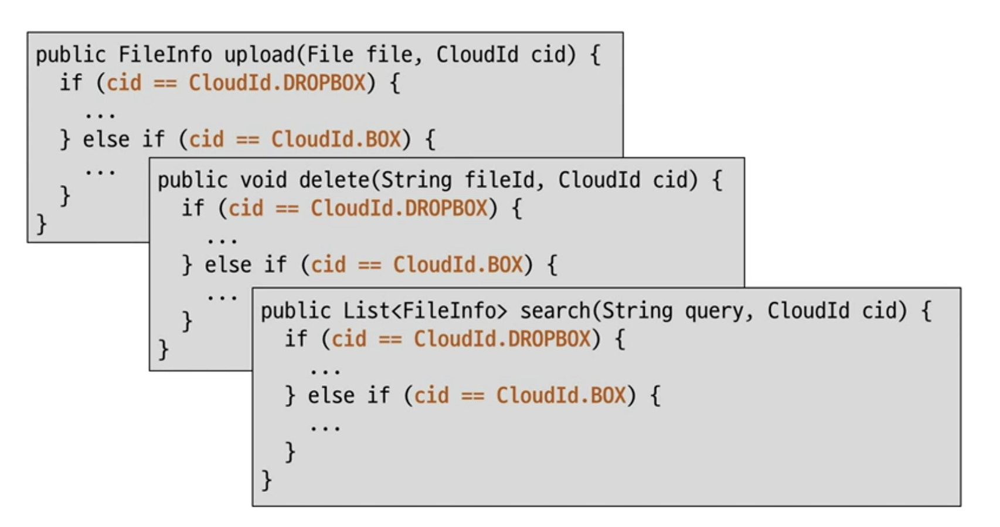
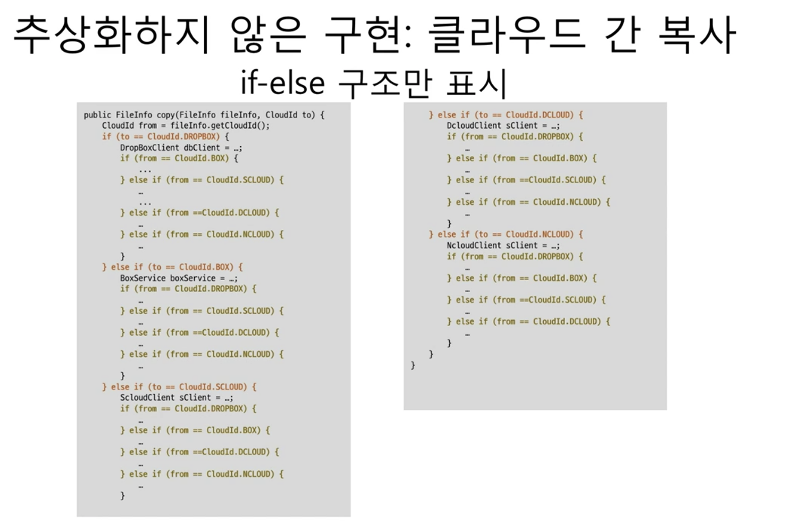
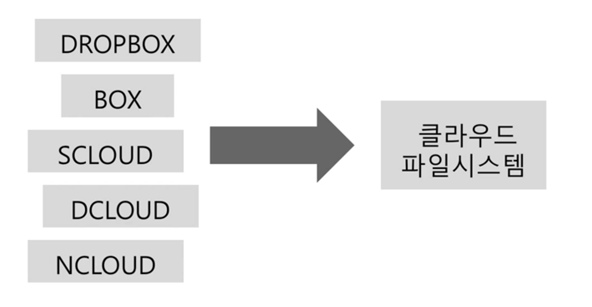
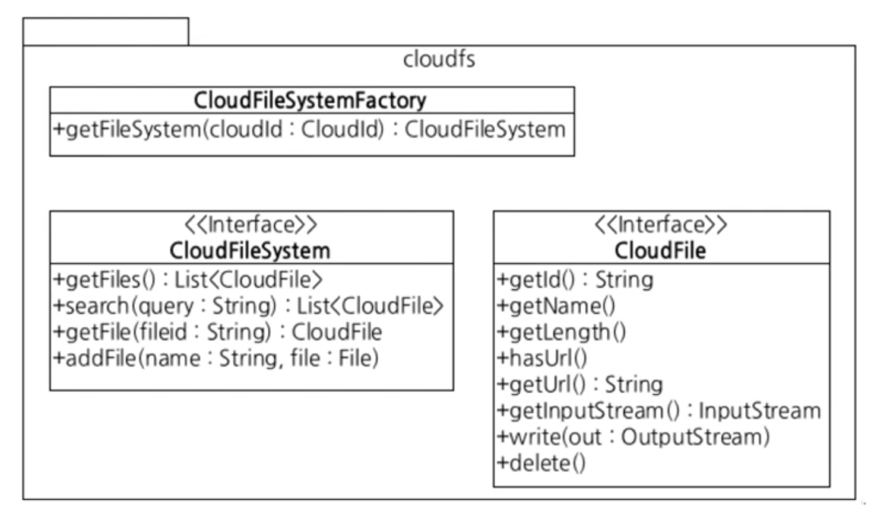
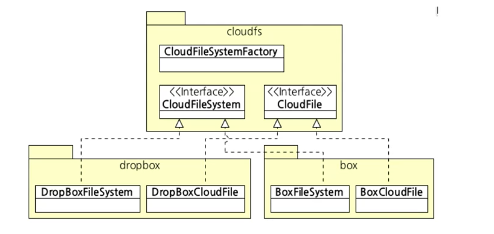
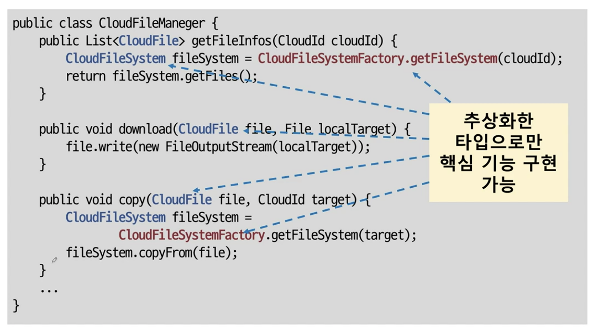
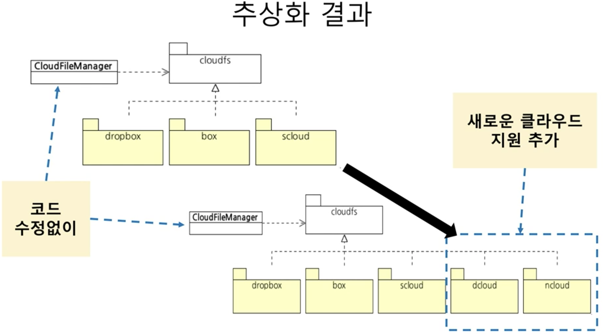
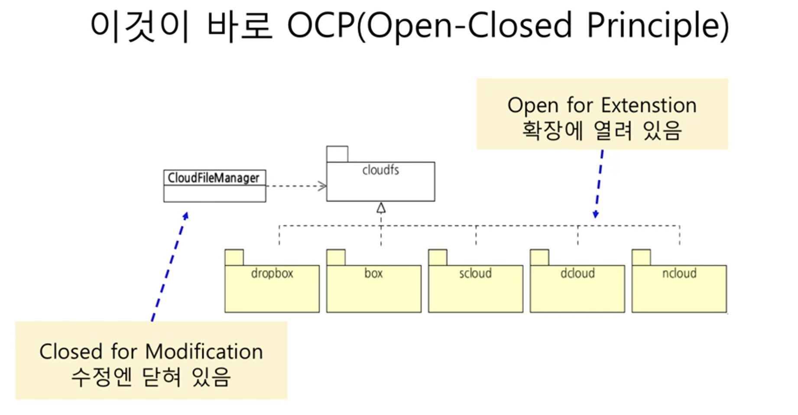

# 추상화 예시


## 기능 예시
- 클라우드 파일 통합 관리 기능 개발
- 대상 클라우드
    1. 드롭박스
    2. 박스
- 주요 기능
    - 각 클라우드의 파일 목록 조회, 다운로드, 업로드, 삭제, 검색
- 추상화 하지 않은 코드 vs 추상화 한 코드

# 추상화 하지 않은 구현
## 추상화 하지 않은 구현 : 파일 목록 조회
 - 예제1 - 1
    - ```
       public enum CloudId {
           DROPBOX,
           BOX
       } 
      ```
  - 예제1 - 2
    - ```
       public class FileInfo {
           private CloudId cloudId;
           private String fileId;
           private String name;
           private long length;

           ... // get 메서드
       } 
      ```
  - 예제1 - 3
    - ```
         public class CloudFileManager {
             public List<FileInfo> getFileInfos(CloudId cloudId) {
                 if(cloudId === CloudId.DROPBOX) {
                     DropboxClient dc = ...;
                     List<DbFile> dbFiles = db.getFiles();
                     List<FileInfo> result = new ArrayList<>();

                     for (DbFile dbFile : dbFiles) {
                         FileInfo fi = new FileInfo();
                         fi.setCloudId(CloudId.DROPBOX);
                         fi.setFileId(fi.getFileId);

                         ...
                         result.add(fi)
                     }
                 } else if (cloudId == CloudId.BOX) {
                     BoxService boxSvc = ...;
                     ... //
                 }
             }
         }
      ```    

## 추상화하지 않은 구현 : 파일 다운로드
 - 예제
   -  ```
        // CloudFileManager의 메소드
        public void download(FileInfo file, File localTarget) {
            if(file.getCloudId() == CloudId.DROPBOX) {
                DropboxClient dc = ...;
                FileOutputStream out = new FileOutputStream(localTarget)
                dc.copy(file.getFileId(), out)
                out.close();
            } else if (file.getCloudId() == CloudId.BOX) {
                BoxService boxSvc = ...;
                InputStream is = boxSvc.getInputStream(file.getId());
                FileOutputStream out = new FileOutputStream(localTarget);
                CopyUtil.copy(is, out);
            }
        }  
      ``` 
## 추상화 하지 않은 구현 : 기타 기능 추가
 - 
    - 참고
        - CloudFileManager의 메소드

## 추상화하지 않은 구현: 이어지는 추가
 - 클라우드 추가
     - S클라우드
     - N클라우드
     - D클라우드
 - 기능 추가
     - 클라우드 간 파일 복사
 - 예제
   -  ```
        // CloudFileManager의 메소드  
        public List<FileInfo> getFileInfos(CloudId cloudId) {
            if(cloudId == CloudId.DROPBOX) {
                ...
            } else if (cloudId == CloudId.SCLOUD) {
                ...
            } else if (cloudId == CloudId.NCLOUD) {
                ...
            } else if (cloudId == CloudId.DCLOUD) {
                ...
            }
        }  
      ```
        - download(), upload(), delete(), search()도 구현 시 위와 유사한 else-if 블록 추가 된다.

## 추상화하지 않은 구현 : 클라우드 간 복사
 - 예제
     - ```
        // CloudFileManager의 메소드
        public FileInfo copy(FileInfo fileinfo, CloudId to) {
            CloudId from = fileInfo.getCloudId();
            if(to == CloudId.DROPBOX) {
                DropBoxClient dbClient = ...;
                if(from == Cloud.BOX) {
                    dbClient.copyFromUrl("http://www.box.com/files/"+fileInfo.getFileId());
                } else if(from ==CloudId.SCLOUD) {
                    ScloudClient sClient = ...;
                    InputStream is = sClient.getInputStream(fileinfo.getFileId());
                    dbClient.copyFromInputStream(is, fileInfo.getName());
                } else (from == CloudId.DCLOUD) {
                    dbClient.copyFromUrl("http://www.dcloud.com/getfile?fileId="+fileInfo.getFileId());
                } else if(from == CloudId.NCLOUD) {
                    NCloudClient nClient = ...;
                    File temp = File.createTemp();
                    nClient.save(fileInfo.getFileId(), temp);
                    InputStream is = new FileInputStream(temp);
                    dbClient.copyFromInputStream(is, fileInfo.getName());
                }
            }
        } 
       ```
        - CloudId to의 세부 저장 경로는 생략
        - 추가
            - 

## 개발 시간 증가 이유
 - 코드 구조가 길어지고 복잡해짐
     -  새로운 클라우드 추가시 모든 메서드에 새로운 if 블록 추가 (객체 다형성이 없으므로 클라우드 종류 별 별도 조건식을 통해 구분 필요)
         - 중첩 if-else의 깊이는 복잡도의 배로 증가
         - if-else가 많을수록 진척 더딤 (신중 모드)
  - 관련 코드가 여러 곳에 분산됨
      - 한 클라우드 처리와 관련된 코드가 여러 메서드에 흩어짐 (캡슐화를 통해 개선 필요!)
  - 결과적으로, 코드 가독성과 분석 속도 저하
      - 코드 추가에 따른 노동 시간 증가
      - 실수하기 쉽고 이로 인한 불필요한 디버깅 시간 증가


## 추상화 해보면
 - 

## 클라우드 파일 시스템 설계
 - 
 - cloudfs
     - CloudFileSystemFactory
         - getFileSystem(cloudId : CloudId) : CloudFileSystem
     - `<<Interface>>` CloudFileSystem
         - getFiles() : List`<CloudFile>`
         - search(query: String): List`<CloudFile>`
         - getFile(fileid: String) : `<CloudFile>`
         - addFile(name: String, file: File)
         - download(...)
         - copyFrom(...)
     - `<<interface>>` CloudFile
         - getId(): String
         - getName()
         - getLength()
         - hasUrl()
         - getUrl(): String
         - getInputStream(): InputStream
         - write(out: OutputStream)
         - delete()

# 추상화 리팩토링
## DROPBOX용 구현
 - 예제 1 - 1
      - ```
          public class DropBoxFileSystem implements CloudFileSystem {
              private DropBoxClient dbClient = new DropBoxClient(...);

              @Override
              public List<CloudFile> getFiles () {
                  List<DbFile> dbFiles = dbClient.getFiles();
                  List<CloudFile> results = new ArrayList<>(dbFiles.size());
                  for (DbFile file : dbFiles) {
                      DropBoxCloudFile cf = new DropBoxCloudFile(file, dbClient);
                      results.add(cf);
                  }
                  return results;
              }
          }
        ```
 - 예제 1 - 2
     - ```
        public class DropBoxCloudFile implements CloudFile {
            private DropBoxClient dbClient;
            private DbFile dbFile;

            public DropBoxCloudFile(DbFile dbFile, dbClient) {
                this.dbFile = dbFile;
                this.dbClient = dbClient;
            }

            public String getId() {
                return dbFile.getId();
            }

            public boolean hasUrl () {
                return true;
            }

            public String getUrl() {
                return dbFile.getFileUrl();
            }

            public String getName() {
                return dbFile.getFileName();
            }

            public InputStream getinputStream() {
                return dbClient.createStreamOfFile(dbFile);
            }

            public void write(OutputStream out) {
                ...
            }

            public void delete() {
                dbClient.deleteFile(dbFile.getId());
            }
        }
       ```  

## 파일 목록, 다운로드 기능 구현
 - 예제
     -  ```
          public List<CloudFile> getFileInfos(CloudId cloudId) {
              CloudFileSystem fileSystem = CloudFileSystemFactory.getFileSystem(cloudId);
              return fileSystem.getFile();
          }

          public void download(CloudFile file, File localTarget) {
              file.write(new FileOutputStream(localTarget));
          }
        ```  

## BOX 클라우드 지원 추가
 -  

## 파일 목록, 다운로드 기능 구현 (BOX 지원 추가 이후)
 - 예제
   -  ```
        public List<CloudFile> getFileInfos(CloudId cloudId) {
            CloudFileSystem fileSystem = CloudFileSystemFactory.getFileSystem(cloudId);
            return fileSystem.getFiles();
        }

        public void download(CloudFile file, File localTarget) {
            file.write(new FileOutputStream(localTarget));
        }
      ```

## 파일 복사 기능
 - 예제 1 - 1
   -  ```
        // file은 복사 대상
        public void copy(CloudFile file, CloudId target) {
            

            CloudFileSystem fileSystem = CloudFileSystemFactory.getFileSystem(target);
            fileSystem.copyFrom(file);
        }  
      ``` 
 - 예제 1 - 2 (DropBoxFileSystem)
     - ```
          private DropBoxClient dbClient = new DropBoxClient(...);
          public void copyFrom(CloudFile file) {
              if(file.hasUrl()) {
                  dbClient.copyFromUrl(file.getUrl);
              } else {
                  dbClient.copyFromInputStream(file.getInputStream(), file.getName());
              }
          }
       ```
  - 예제 1 - 3 (NCloudFileSystem)
      - ```
            private NcloudClient nClient = new NCloudClient(...);
            public void copyFrom(CloudFile file) {
                File tempFile = File.createTemp();
                file.write(new FileOutputStream(tempFile));
                nClient.upload(tempFile, file.getName());
            } 
        ```

## 추상화 결과
 - 
 - 예제
     -  ```
            public class CloudFileManager {
                public List<CloudFile> getFileInfos(CloudId cloudId) {
                    CloudFileSystem fileSystem = CloudFileSystemFactory.getFileSystem(cloudId);
                    return fileSystem.getFiles();
                }

                public void download(CloudFile file, File localTarget) {
                    file.write(new FileOutputStream(localTarget));
                }

                public void copy(Cloud file, CloudId target) {
                    CloudFileSystem fileSystem = CloudFileSystemFactory.getFileSystem(target);
                    fileSystem.copyFrom(file);
                }

                ...
            }  
        ``` 
           - CloudFile, CloudFileSystem, CloudFileSystemFactory 등을 통한 추상화한 타입으로만 핵심 기능 구현 가능
  - 

## 이것이 바로 OCP (Open-Closed Priciple) 개방 폐쇠 원칙
 - 
     - 기능을 사용하는 코드에 대해서는 닫혀 있다.
     - 기능 변경 및 확장에 대해서는 열려 있다.
     - 효과
       - 변경 및 확장 비용을 감소시킴

## 질문
 1. (다른 사람 질문) 특정 클라우드에서 예외적으로 특정 기능을 제공하지 않는 경우
    - 답변
        1. 삭제 기능 자체를 인터페이스에서 제거
        2. 또는 삭제 기능은 유지하면서 해당 클라우드의 구현 클래스만 삭제 메서드에서 UnsupportedOperationException을 발생시키기
 
## 참고
 - https://www.slideshare.net/madvirus/ss-36809454 (22p, 23p, 26p, 27p)
 - https://www.inflearn.com/course/%EA%B0%9D%EC%B2%B4-%EC%A7%80%ED%96%A5-%ED%94%84%EB%A1%9C%EA%B7%B8%EB%9E%98%EB%B0%8D-%EC%9E%85%EB%AC%B8/lecture/13433?tab=community&volume=0.20&q=381866