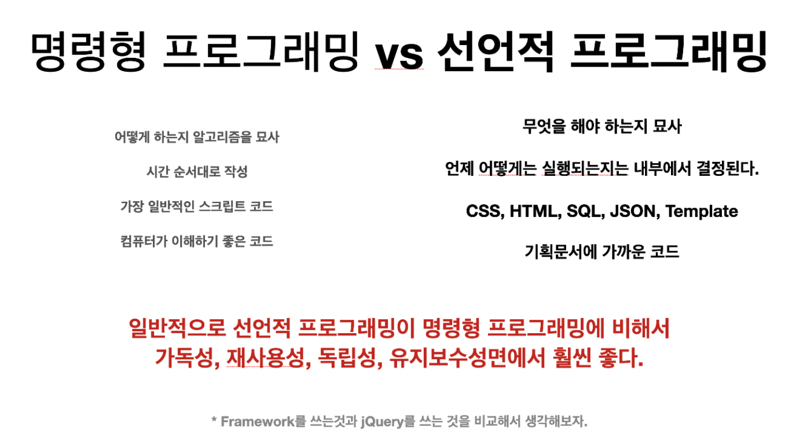
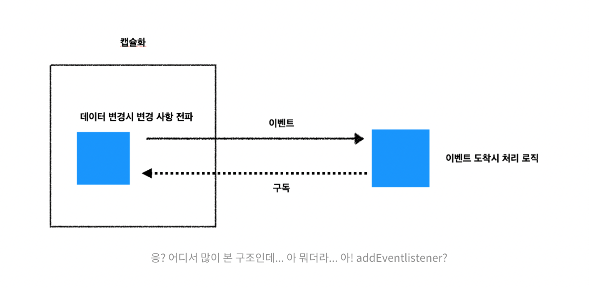

# 프로그래밍_패러다임과_반응형_프로그래밍_그리고_Rx

## 개요

- 프로그래밍 패러다임은 설계의 원칙이다.
- 개발 패러다임 중 반응형 프로그래밍을 중점적으로 다룬다.
- 패러다임의 전환

  - ```
        관점을 바꾼다는 것은 매우 어려운 일이다.
        ... 새로운 패러다임은 기존과는 다르게 생각하는 방법을 알려줄 것이다.
        그리고 아마도 예전 방식으로 절대 돌아가지 않을 것이다.
    ```

- 위키피디아, 반응형 프로그래밍
  
  - ```
        ...reactive programming is a declarative programming paradigm concerned with data streams and the propagation of change. 

        (해석) ...반응형 프로그래밍이란, 데이터의 흐름과 변경사항의 전파에 중점을 둔 선언적 프로그래밍 패러다임이다.
    ```

- 키워드 추출

  1. 패러다임
  2. 변경사항의 전파
  3. 데이터의 흐름

## 패러다임

- ```
      패러다임(영어: paradigm)은 어떤 한 시대 사람들의 견해나 사고를 근본적으로 규정하고 있는 테두리로서의 인식의 체계, 또는 사물에 대한 이론적인 틀이나 체계를 의미하는 개념이다. - 위키피디아
  ```

- 예시) 관점의 차이 뿐, 둘 다 충분히 우주의 움직임을 설명이 가능하다. 다만 지동성이 우세한 이유는 더 간결하고 단순하게 설명할 수 있는 관점이기 때문이다.
    1. 지구가 중심이라는 관점의 천동성
    2. 태양이 중심이라는 관점의 지동설

## 프로그래밍에서 패러다임이란?

- ```
    프로그래밍 패러다임은 프로그래머에게 프로그래밍의 관점을 갖게 해주고, 결정하는 역할을 한다.
    예를 들어 객체지향 프로그래밍은 프로그래머들이 프로그램을 상호작용하는 객체들의 집합으로 볼 수 있게 하는 반면에, 함수형 프로그래밍은 상태 값을 지니지 않는 함숫값들의 연속으로 생각할 수 있게 해준다.
  ```

- 어떠한 관점을 통해서 설계를 하느냐에 따라, 같은 목적을 이루고자 하더라도 전혀 다른 형태로 프로그래밍을 할 수 있도록 해준다.

- 견고한 패러다임은 보다 좋은 프로그래램을 만들 수 있는 방법과 시각을 제공

- ```
    ... 순수한 관점에서 이질적으로 보였던 패러다임 간의 공존이 갈수록 많이 등장하며, 상황과 맥락에 따라 패러다임 간 장점만을 취하려는 시도는 계쏙 되고 있다. - 위키피디아: 프로그래밍 패러다임
  ```

## 1. 반응형 프로그래밍 패러다임이란?

- 정의는, 데이터의 흐름과 변경사항의 전파에 중점을 둔 선언적 프로그래밍 패러다임이다.

- 일상속 예시, 엑셀)

  - C1 셀 = A1 + B1

  - A1 또는 B1 값을 변경 시, 변경 사항이 전파되어 C1의 값이 자동으로 변경된다.

  - 이를 확장한다면, 수 많은 연관 Cell에 변경 사항이 전파가 됨을 알 수 있다.

- 일상속 예시, 선 그리기)

  - 절차지향은 '어떻게'에 중점, 1) 붓 들기, 2) 표현할 색상에 따라 붓을 물에 넣어 물감 희석, 3) 붓을 표현할 색상에 따라 색상1, 색상2, ...색상 n과 조합, ...... n) 그림 그리기 완료.

  - 선언형은 '무엇'에 중점, 1) (1.3)에 굵기 1px, 선 모양은 Dash, 색상은 Red로 생성을 지시함.

- 언제부터 웹에서 반응형 프로그래밍의 중요성이 대두되었는가?

  - 예시, 본문과 간접적인 연관을 가진, 웹 프레임워크로의 전환)

    - 웹 개발에서 가장 큰 패러다임의 전환, JQuery -> 웹 프레임워크

      - 즉, DOM을 내가 쉽게 조작하게 도와준다. -> DOM을 알아서 렌더링 해준다.

  - 예시, 웹 프레임워크의 전환의 관점을 반응형 프로그래밍 패러다임의 관점으로 변환)

    - Web Framework의 본질 (MVVM 패턴)

      - Change Detection + Binding + Template + Auto Render = Reactive

        - 즉, 값이 변경되었을 때, 템플릿이 선언대로 자동으로 랜더링 해준다 = 반응형

        - 초기 Reactive Programming 패러다임은 이렇게 데이터의 변경을 감지하고 선언적으로 프로그래밍을 하는 방법을 통해 View를 업데이트하는 방식으로 발전을 하기 시작한다.

### 패러다임의 전환 #1 - 선언적 프로그래밍

- 선언적 프로그래밍이란, 무엇을 해야 할지 별도의 표현(약속)으로 만들어 기술하고, 언제 어떻게 동작하는지는 내부적으로 처리하는 방식의 프로그래밍 기법

- 
  - 웹 프레임워크의 핵심은, 내부적으로 선언적으로 처리함.
    - 예시) JS를 통해서 어떻게 DOM 조작이 아닌 JSX 또는 Template Binding을 통해서 무엇을 해야 할지 선언 시, 내부적으로 알아서 적절하게 렌더링하는 방식.
      - 장점은, 개발자의 관심사 분리, 역할 분리를 통해서 내부 메커니즘은 숨기면서 필요한 로직만 외부에서 선언을 할 수 있게 함으로써 알고리즘 구현 비용(에러 포함)을 최소화하고 시간과 변화에 구애받지 않는 (일반화 된) 개발을 할 수 있도록 해준다.

### 패러다임의 전환 #2 - 변경사항의 전파 (Pull -> Push)
  
- 

- 예시로, (JQuery, Rendering 시점에 모든 Data를 Pull 후 DOM 조작) 어떻게 화면에 그릴지를 중심으로 개발을 하다가, (React, State가 변경되는 시점에 Data Push로 DOM Rendering) 이렇게 무엇을 할지만 선언하는 방식으로 변경이 되면서 데이터를 대하는 패러다임도 변경이 된다.

### 반응형 프로그래밍 패러다임으로의 전환

- 웹 패러다임은 데이터를 가져와서 화면을 만드는 방향에서, 무엇을 할지 선언을 하고 변경된 데이터를 감지하고 전파하는 방향으로 패러다임이 변화됨.

- 초기 반응형 프로그래밍 패러다임을 뷰에 집중이 되었다면, 이후에는 비즈니스 로직을 포함한 모든 스크립트에서 사용할 수 있도록 개념이 확장된다.

  - 예시) Redux를 사용한 상태 관리로, 데이터의 변경을 감지하고 변경을 전파하고 선언적으로 값을 만들어냄.  
  
## 2. 비동기 프로그래밍과 반응형 프로그래밍

- 프론트엔드 개발자에게 반응형 프로그래밍이 중요한 이유는, 비동기 프로그래밍을 잘하기 위해서이다.

  - 비동기 프로그래밍은 상당히 어렵다.

  - 대부분 프론트엔드 로직은 비동기로 이루어져 있다.

  - UI는 사용자의 의도를 사전에 예측하기 어렵다. (개발자가 모두 고려하기 어렵다.)

  - 또한 서버의 응답이 언제 올지 예측할 수 없다.

  - 고급 프론트엔드 개발자는 비동기를 아주 잘 다룰 수 있어야 한다.

### 왜 비동기 프로그래밍이 어려울까요?

  1. 비동기 프로그래밍은 작성한 코드 순서대로 동작하지 않는다.
  2. 언제 실행이 될지 예측할 수 없다.
  3. 호출한 순서대로 동작한다는 보장도 없다.
  4. 그래서 호출 당시의 값과 실제 실행되었을 때의 값이 그대로일 거라는 보장이 없다.

### JavaScript의 비동기 프로그래밍 대응의 역사
  
  1. Callback (또는 Callback Hell)
  2. ES6 Promise
  3. ES7 async / await

- 문제는, 1 ~ 3 방식만으로는 실질적인 문제를 해결하기에 부족함이 크다.

### Real World Problem

- 
- 의문은, Promise, aysnc / await로 해결할 수 있을까?
- 기존 pull 기반의 비동기 순서를 맞추는 방식의 패러다임에서는 비동기가 복합적으로 존재하면 개발 난이도가 비약적으로 어려워지게 된다.
- 전통적인 백엔드는, 하나의 Request에서 비동기가 어려 개 존재하더라도, 순차적으로 하나씩 처리해서 Response를 만들어주면 되지만, 프론트엔드는 사용자의 동작과 서버의 동작의 비동기 동작이 혼재되어 있는 세상이다.

### 3. 반응형 프로그래밍 Deep Dive

- 

- 실제 예시로, DOM의 EventListen 또한 반응형 프로그래밍이다.

- **반응형 프로그래밍 패러다임 위에서 위 개념들이 도출된 것이 아니라, 패러다임은 이미 만들어진 현상을 해석해서 하나로 정리한 관점이자 체계라는 점이다.**

### 왜 Event 방식으로 개발을 하나요? - Reactive First

- 제어의 역전

- 
  - 2개의 모듈이 존재한다.
  - Foo 모듈에서는 네트워크 요청을 받으면 Bar 모듈의 값을 증가하는 로직이 있다고 가정한다.
  - 즉, Foo 모듈이 Bar 모듈에게 영향을 끼친다.
  - 코드로 표현 시
    - 
    - 상태를 변화하는 로직은 Bar에 존재하는데, 동작은 Foo가 하도록 하고 있다. 
      - **상태와 상태에 직접적인 변화를 주는 코드는 응집될 수록 유지보수에 좋다. 상태에 직접적인 변화를 주는 코드를 상태 관리라고 표현할 수 있다.**
    - Bar에서는 Foo의 존재를 알 수 없다.
      - Bar는 수동적인 모듈이 되고 Foo 모듈과는 강결합되어 Bar에서는 자체 상태 관리를 하지 못할 뿐더러, 수정이 필요한 모든 로직을 Foo에 공개하는 형식으로 만들어야 한다.

- 이러한 문제를 수정을 위해서는, 접근 방식의 대안으로 화살표의 방향을 반전시키지 않고 화살표의 소유권을 반전시키는 것이다.

  - 

- **모듈과 모듈 간의 결합 시 참조의 주체를 바꾸어 사용하는 방법을 제어의 역전(Inversion of Control)** 이라고 한다.
  - 이 접근 방식을 통해 모듈의 상태를 변화시키는 로직을 외부 모듈에 의존하지 않고 모듈 내부에서 처리함으로써, 보다 캡슐화와 느슨한 결합을 하기 용이하도록 할 수 있다.
    - 예시) React props로 비즈니스 로직 넘기기.

### 책임의 분리와 비동기 처리

- 반대로 Foo의 입장은, Foo 모듈에서도 로직을 수행하는 부분에 있어서 자유로워졌다. 이제 *누구에게 어떻게 데이터를 전달해야 할지 몰라도 된다.*
- 즉, *Foo는 그저 데이터가 만들어지는 시점에 전달만 하면 된다.*
- 예시는, 클릭 이벤트, Promise

- 반응형 프로그래밍은 변경을 감지하고 전파하고, 선언적으로 프로그래밍을 작성한다는 패러다임을 구현하기 위해서 아래와 같은 구조를 가진다.

- 

- 복잡한 비동기 프로그래밍 또한 반응형 프로그래밍을 이용한다면, 선언적으로 데이터의 흐름을 통해 간략하게 처리를 할 수 있게 된다.

### Reactive First

- 제어의 역전 예시, DOM의 Event, Observer 패턴, Pub / Sub 패턴

- 책임의 분리 예시, 미들웨어, 플러그인

- 반응형 프로그래밍은 이러한 관점을 일부가 아닌, 모든 스크립트에 적용해서 항상 Reactive를 먼저 고려하자는 패러다임이다.

- 이러한 방식은 여러 개의 모듈 간의 결합이 많아질수록 더 유효하다.

- 

  - 기존의 패러다임은 왼쪽 그림처럼, 하나의 모듈에서 여러 가지 비동기 코드를 호출하는 pull 방식의 개념을 통해서, 호출 순서와 실행 순서와 데이터 처리를 한 번에 하는 부분이 관리를 어렵게 만들었다.

  - 반응형 프로그래밍은 오른쪽 그림처럼, 같이 push 방식으로 하나의 모듈(함수)에서 하나의 화살표(예시, Event)만 처리하면 되는 단순한 형태로 생각을 할 수 있게 된다.  

## 4. ReactiveX - 스트림을 이용한 개발

- Rx 같은 반응형 프로그래밍 라이브러리를 이용해서 이러한 구조를 만들면, 단순한 관점으로 개발이 가능하다.

- 반응형 프로그래밍은 어떠한 라이브러리나 구현체가 아닌, **하나의 관점**일 뿐이다.

- Rx 학습을 추천하는 이유
  
  - Ajax가 보편화되고, Node가 생기면서 Callback만으로는 비동기 처리가 복잡해짐에 따라 ES 표준에 Promise가 추가되었다.
  
  - 더 복잡한 비동기 프로그래밍을 해결하기 위해서는 Observable이 필요로 하다. RxJS는 Observable을 활용한다.

### Rx가 무엇일까?

- ReactiveX

  - An API for asynchronous programming with observable streams

    - 관측가능한 스트림을 통해 비동기 프로그래밍을 하기 위한 API
  
  - 핵심 키워드

    1. 비동기(Asynchrouse)
    2. 옵저버블(Observable)
    3. 스트림(Stream)

  - Reactive Resoution

    - ReactiveX is more than an API, it's an idea and a breakthrough in programming. It has inspired several other APIs, frameworks, and even programming languages.

  - 비동기 프로그래밍은 실행 순서와 데이터를 제어하기가 어렵다. 하지만 프론트에느는 비동기 프로그래밍 덩어리이다. 그러므로 더욱 간결하고 쉬운 개발을 위한 관점과 체계가 필요로 하고, 이를 위한 패러다임이 반응형 프로그래밍이다.

  - 반응형 프로그래밍은 변경사항의 전파와 데이터 흐름을 중심으로 선언적으로 작성하여서 복잡한 문제를 해결한다.

  - 이를 위해서 Pull -> Push 패러다임 전환이 필요로 하고, 이를 구현하기 위해서는 Event와 같은 방식을 통해 제어의 역전을 만들어야 한다.

    - Event = 변경사항의 전파 + 데이터의 흐름
  
  - 반응형 프로그래밍을 다음과 같이 확장할 수 있다.

    - 반응형 프로그래밍 = Event + 선언형

    - 반응형 프로그래밍이란 이벤트를 선언적으로 작성하는 프로그래밍 패러다임

### Event를 넘어 Stream으로

- Rx는 이벤트 종류를 Next, Error, Complete의 3가지 Type으로 정의를 통해서, 보다 보편적인 상황을 처리할 수 있도록 정의한다. (Try, Catch, Finally와 같은 맥락으로 이해하면 좋다.)

- 

- 스트림 = 변경사항의 전파 + 데이터 흐름이 성립되고,

- 반응형 프로그래밍을 재정의하면,

- 반응형 프로그래밍 = 스트림 + 선언적

### 선언적으로 작성한다는 것

- 예시는, for와 Array Method의 차이

- for가 아닌, map, reduce, filter를 사용하게 되면 Array를 선언적으로 다룰 수 있다.

- Stream(Or Event) 또한 선언적으로 다룰 수 있지 않을까?

### 스트림을 선언적으로 작성한다는 것

- Stream (or Event)를 Array Method처럼 만들어서 사용해보자.

- 예시, 랜덤한 숫자 5개에서 짝수만 2개를 골라서 출력하기)

```
  Array.of(1,2,3,4,5)
    .map(x => parseInt(Math.randome() * 10))
    .filter(x => x % 2)
    .slice(0, 2)
    .forEach(x => console.log(x))
```

- 에시, Stream을 다루는 Observable로 작성)

```
  Observable.of(1,2,3,4,5)
    .map(x => parseInt(Math.random() * 10))
    .filter(x => x % 2)
    .slice(0, 2)
    .forEach(x => console.log(x))
```

- 예시, Observable을 Array가 아닌, 사용자 Click으로 변경

```
  Observable.fromEvent(window, "click")
    .map(x => parseInt(Math.random() * 10))
    .filter(x => x % 2)
    .take(2)
    .forEach(x => console.log(x))
```

- 예시, 1초마다 랜덤한 숫자를 받아서 짝수 2개를 출력

```
  Observable.timer(1000)
    .map(x => parseInt(Math.random() * 10))
    .take(2)
    .forEach(x => console.log(x))
```

- 이벤트를 하나의 값으로 생각하고, 이를 Array Method를 다루듯이 선언형으로 작성한다면 보다 직관적이고 간결하게 프로그래밍을 할 수 있다.

### 스트림을 여러 개 연결을 해보면 어떨까?

- 

- 일반적인 설계는, 화살표를 통해서 데이터가 전달되는 노드의 형태로 표현할 수 있다.

- 반응형 프로그래밍에서는 전체 프로그램의 복잡도를 고려하지 않고, 각 노드를 하나의 스트림으로 정의하고 선언적으로 개발을 할 수 있게 된다.

- 

- 반응형 프로그래밍의 키워드 중 `데이터의 흐름(Data-flow)`는 이러한 구조를 의미한다.

- 각자 변경사항을 전파를 하도록 설계를 하면, 복잡한 데이터의 흐름이 만들어지지만 내부를 들여다보면 단순한 형태의 프로그래밍을 할 수 있게 된다.

- `이벤트를 값으로 다룬다는 관점이 매우 중요하다.`

### 함수형 프로그래밍

- 반응형 프로그래밍에서는 이러한 Data-flow를 함수형 프로그래밍을 통해서 구현을 하고 있다.

- 함수형 프로그래밍이란 원본 값을 함수를 통해 전달하고 새로운 값을 만들어내는 조합이 다시 하나의 함수가 되는 형태의 구조를 의미한다.

- 

### Rx는 무엇인가요?

- Rx - 스트림을 생성하고 조작하는 라이브러리

- 반응형 프로그래밍 = 스트림을 선언적으로 작성하는 프로그래밍 패러다임

- 반응형 프로그래밍 최종 정리

  - Everything is a stream

  - 데이터의 흐름과 변경사항의 전파에 중점을 둔 선언적 프로그래밍 패러다임이다.
  
  - 즉, 모든 것을 스트림으로 간주하고 선언적으로 개발하는 것

    - Array, Iterator, Promise, Callback, Event ...

- 

### Rx 맛보기

- 당신은 아래와 같은 자동완성을 구현해 달라는 요청을 받았습니다. 어떻게 코딩할지 상상해 봅시다.
  1. 타이핑할 때마다 서버에서 데이터를 받아서 보내주세요.
  2. 너무 잦은 요청은 부하가 심하니 타이핑 간격이 좁으면 대기하다가 입력이 늦어지면 그 때 서버에 요청하세요.
  3. 같은 내용일 때는 요청하지 마세요.
  4. 일정 시간 동안 응답이 없으면 3회 재시도하고 그래도 응답이 없으면 에러 메시지를 출력해 주세요.
  5. 데이터는 캐시로 보관을 해서 먼저 보여주고 요청이 완료되면 새로 갱신된 데이터를 보내주세요.
  6. 엔터를 누르면 서버로 요청한 건 취소하고 검색 결과를 보여주세요.

- 

```
  let autoComplateRef

  const input$ = fromEvent(inputElement, "input")
  const enter$ = fromEvent(inputElement, "keydown").filter(event => event.key ==="Enter")

  const request = (data) = fromPromise(fetch("URL", ...))

  // 1) 타이핑을 입력할 때마다 타이핑 된 내용을 서버로 보낸다.
  input$.pipe(
    map(event => event.value),
     // 2) 내용이 같을 경우에는 서버에 요청을 하지 않는다.
    distinctUntilChanged(),
     // 3) 서버 부하를 줄이기 위해서 타이핑이 0.5초 내로 이루어지면 기다렸다가 입력이 없는 경우 서버로 요청한다.
    debounce(500),
    mergeMap(
      text => request(text).pipe(
        map(res -> res.result),
        tap(value => autoCompleteRef = res.value),
        // 4) 서버에서 7초 간 응답이 없을 경우 타임아웃 에러로 취급
        timeout(7000),
        // 5) 에러시 3회 재시도, 그래도 문제라면 에러 메시지 노출
        retry(3),
        catchError(e => console.error(e))
      ),
      // 6) 엔터를 눌러 검색을 하게 되면 이미 요청된 서버 내용을 무시한다.
      takeUntil(enter$)
    )
    .subscribe()


  )

```

## 결론

- 

- 객체지향 프로그래밍, 함수형 프로그래밍 등의 여러 패러다임이 프로그래밍 씬에 존재한다.

- 이러한 패러다임을 이해하면 프로그램을 작성할 때 일관성을 유지할 수 있는 관점을 통해서 좋은 설계와 결정을 도와준다.

- 반응형 프로그래밍은 스프레드 시트와 같이, 미리 선언된 방식에 데이터의 변경을 전파하여 프로그램이 동작하게 만드는 방식의 패러다임을 말한다.

- 이를 통해 비동기 프로그래밍을 조금 더 간결하게 바라볼 수 있는 관점을 제공한다.

- 특히 프론트엔드는 비동기 프로그래밍 덩어리이므로, 반응형 프로그래밍 패러다임은 특히 중요하다.

- 웹 프레임워크와 상태 관리 또한 그러하다.

- 패러다임이 먼저 생겨났고, 그 패러다임에 맞춰 라이브러리나 프레임워크가 나오는 것이 아니다.

- 오히려 반대로, 특별한 문제를 해결하기 위해 만들어진 것들의 공통점을 모아 하나의 관점으로 정리해서 바라보는 일종의 체계와 같은 것이 패러다임으로 자리잡게 된다.

- 반응형 프로그래밍의 관점으로 바라보면, React, React-Query, Redux, Recoil, Svelt 또한 얼마든지 데이터의 흐름 변경의 전파, 선언적 프로그그래밍이라는 관점에서 바라볼 수 있다.

- 또한 제어의 역전, 책임의 분리, 느슨한 결합, Data-Flow 프로그래밍, 함수형 프로그래밍, Event를 값으로 생각하기, Everything is stream과 같은 개념들은 Rx 뿐 아닌, 다른 프론트엔드 라이브러리를 이해하고 프로그램을 이해하고, 본인 프로젝트의 설계 방향을 결정하는 데 큰 도움이 된다.

- 다시 강조하지만, 반응형 프로그래밍이란 구현체나 라이브러리가 아닌 비동기를 잘 다루기 위한 프로그래밍 관점 및 체계일 뿐이다.

## 의문

- Observer의 Push 방식 또한 제어의 역전으로 볼 수 있는가?
  - 답) 생산자 Foo가 소비자 Bar에게 Push하는 방식 또한 제어 역전 중 하나로 판단된다.

- 선언형에 비해, 절차지향의 장점은?

- Pub / Sub 패턴?

- Observer 패턴?

## 원본

- (요즘 IT, 테오, 프로그래밍 패러다임과 반응형 프로그래밍 그리고 Rx) <https://yozm.wishket.com/magazine/detail/1334/>

## 참고

1. (CycleJS, Stream-Reactive-Programming) <https://cycle.js.org/streams.html#streams-reactive-programming>

2. (10분 테크톡, 그루밍의 상태관리와 반응형 프로그래밍) <https://www.youtube.com/watch?v=alsCMx6vpG4>
