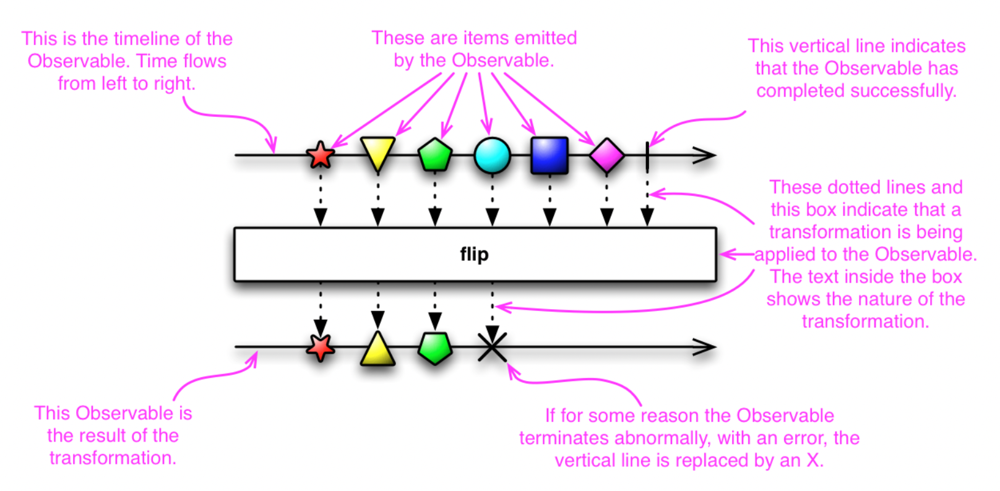

# Observable

## Observable 특징

- In ReactiveX an observer subscribes to an Observable
- observer reacts to whatever item or sequence of items the Observable emits
- 장점
  - 동시성 연산을 가능하게(또는 용이하게) 한다(facilitates).
    - 근거
      - it does not need to block while waiting for the Observable to emit objects, but instead it creates a sentry(보초병, 관찰에 가까운) in the form of an observer that stands ready to react appropriately at whatever future time the Observable does so.
        - 의문
          - Observer와 Observable 사이에 a senty를 만드는가? (해석을 잘 못해서 생기는 의문 같음.)
- 중점
  - reactive pattern에서 Observer와 Observable이 무엇인가?
  - how to observers subscribe to Observable.
  - how you use the variety(다양한) of Observable operators to link Observables together and change their behaviors(행위).
    - 참고
      - variety of Observable (<https://reactivex.io/documentation/operators.html>)
  - marble diagram
    - how marble diagrams represent Observables and transformations of Observables.
    - 
    - 의문
      - 보다 자세한 정보를 리서치한다.
      - 마블 다이어그램이 다른 곳에서도 쓰이는 개념인가?
- Seel Also
  - Single - a specialized version of an Observable taht emits only a single item
    - <https://reactivex.io/documentation/single.html>
  - Rx Workshop: Introduction
    - <https://learn.microsoft.com/ko-kr/shows/rx-workshop/introduction>
  - Introduction to Rx: IObservable
    - <http://introtorx.com/Content/v1.0.10621.0/02_KeyTypes.html#IObservable>
  - 2 minute introduction to Rx by Andre Staltz ("Think of an Observable as an asyncrhonous immutable array".)
    - <https://medium.com/@andrestaltz/2-minute-introduction-to-rx-24c8ca793877>
  - Observable object (RxJS) by Dennis Stoyanov
    - <http://xgrommx.github.io/rx-book/content/observable/index.html>
  - Turning a callback into an Rx Observable by @aftercho
    - <https://blog.afterecho.uk/turning-a-callback-into-an-rx-observable.html>

- Background
  - you more or less expect(다소 기대하다) that the instructions you write will execute and complete incrementally(점진적으로 증가하여), one-at-a-time(한 번에 한가지 씩), in order(순서대로) as you have written them.
  - But in ReactiveX, many instructions may execute in parallel(평행한, 병렬적?) and their results are later captured, in arbitrary(임의적인, 독단적인) order, by "observers". Rather than(보다는) calling a method, you define a mechanism for retrieving(검색) and transforming the data, in the form of an "Observable", and then subscribe an observer to it, at observer to it, at which point(어느 시점에서) the previously-defined(사전 정의된) mechanism fires into action with the observer standing sentry to capture and respond(답장을 보내다. reply와 같음.) to its emissions whenever they are ready (준비 될 때마다).
    - 의문
      - results are later captured?
        - operator 중 skip, delay등을 사용함으로 이해하면 될까?
      - retrieving (검색)?
        - operator 중 find, fluck 등을 사용함으로 이해하면 될까?
  - An advantage of this approach is that when you have a bunch of tasks(많은 일들) that are not dependent on each other, you can start them all at the same time rather than(보다는) waiting for each one(각각) to finish before starting the next one
  - that way, your entire(전체의, 온(=whole)) bundle of tasks only takes as long to complete( "as long to complate", 완성되기까지) as the longest task in the bundle.
    - 정확한 이해는 안됨.

## API rxjs/index Observable

- <https://rxjs.dev/api/index/class/Observable>

- 의문
    - lift는 언제 사용?
    - Observer handler?

## Observable 스트림 생성기 만들기

### 예제) 배열 to 스트림

```
    const {of, from ,range, generate} = rxjs

    const obs1$ = of(1,2,3,4,5)
    const obs2$ = from([6,7,8,9,10])
    const obs3$ = range(11,5)
    const obs4$ = generate(
        15, x => x <30, x => x+2
    )

    obs1$.subscribe(item => console.log(`of : ${item`}))
    // of : 1
    // of : 2
    // of : 3
    // of : 4
    // of : 5

    obs2$.subscribe(item => console.log(`from : ${item}`))
    // from : 6
    // from : 7
    // from : 8
    // from : 9
    // from : 10

    obs3$.subscribe(item => console.log(`range : ${item}`))
    // range : 11
    // range : 12
    // range : 13
    // range : 14
    // range : 15

    // generate는 for 문과 원리가 같다.
    // 시작: 15
    // 조건: x < 30
    // 증감: x + 2
    obs4$.subscribe(item => console.log(`generate : ${item}`))
    // generate : 15
    // generate : 17
    // generate : 19
    // generate : 21
    // generate : 23
    // generate : 25
    // generate : 27
    // generate : 29
```

### 예제) 시간 to 스트림

```
 const { interval, timer } = rxjs
 
 const obs1$ = interval(1000)
 const obs2$ = timer(3000)

 obs1$.subscribe(item => console.log(`interval : ${item}`))
 // interval : 0 
 // 1초 후
 // interval : 1
 // 1초 후
 // interval : 2
 // 1초 후
 // interval : 3
 // 1초 후 ... 계속 반복함.

 obs2$.subscribe(item => console.log(`timer : ${item}`))
 // 3초 후, timer : 0
```

### 예제) 이벤트 to 스트림

```
    <input id="myInput" type="text" />

    const {fromEvent} = rxjs

    const obs1$ = fromEvent(document, 'click')
    const obs2$ = fromEvent(document.getElementById('myInput), 'keypress')

    obs1$.subscribe(item => console.log(item))
    // 도큐먼트를 클릭 시, event 객체 출력
    obs2$.subscribe(item => console.log(item))
    // input에 키를 입력 시, event 객체 출력
```

### 예제) Ajax to 스트림

```
    const {ajax} = rxjs.ajax

    const obs$ = ajax('http://127.0.0.1:3000/people/1')
    obs$.subscribe(result => console.log(result.response))
    // response에 대한 json 객체를 출력함.
```

- 의문
  - 네트워크 요청은 1번만 실행되는 경우가 많다. 이 경우도 RxJS Ajax를 사용하는 게 장점이 있을까?
    - 답
      - 아마 예외처리 또는 유지보수, 확장성, 통일성 측면에서 단점은 없다고 판단 됨.

### 예제) 직접 만드는 스트림

    ```
        const {Observable} = rxjs

        const obs$ = new Observable(subscriber => {
            subscriber.next(1)
            subscriber.next(2)
            subscriber.next(3)
            subscriber.next(4)
            subscriber.complete()
        })

        obs$.subscriber(item => console.log(item))
        // 1
        // 2
        // 3
        // 4 (종료)
    ```

### Observable의 주요 특징은 lazy(게으르다)

- 특징
  - 누군가 구독을 해야만 발행을 시작함. (사전에 미리 발행하지 않음)
  - 각 구독자에게 독립적인 별도의 발행을 함.
- 예제)

    ```
        const {of, interval, fromEvent} = rxjs

        const obs1$ = of('a', 'b', 'c')
        const obs2$ = interval(1000)
        const obs3$ = fromEvent(document, 'click')

        setTimeout(_=> {
            console.log('구독 시작')
            obs1$.subscribe(item => console.log(item))
        }, 5000)

        setTimeout(_=> {
            console.log('interval 구독 시작')
            obs2$.subscribe(item => console.log(item))
        }, 10000)

        setTimeout(_=> {
            console.log('fromEvent 구독 시작)
            obs3$.subscribe(_=> console.log('click!))
        }, 150000)

        setTimeout(_=> {
            console.log('interval 구독 시작 2)
            obs4$.subscribe(item => console.log(item))
        }, 200000)
    ```

## 참고

- 얄코의 얄팍한 RxJS
- <https://reactivex.io/documentation/ko/observable.html>
