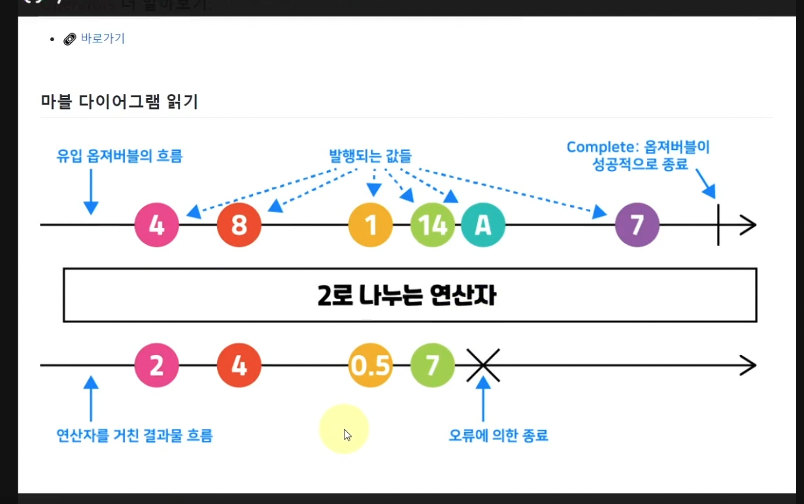

# operator

## 종류

1. Creation Operators
   - Observable을 생성함.
     - of, from, range, fromEvent, interval, ajax, ...
   - rxjs에서 로드

     - ```
         const {of, from, range, fromEvent, interval} = rxjs

         // ajax만 예외적으로
         const {ajax} = rxjs.ajax
       ```

2. Pipable Operators
   - Observable의 데이터를 가공하는 Pure function(Side effect를 발생시키지 않는 함수).
     - 예시

         - ```
            const {from} =' rxjs
            const {map} = rxjs.operators

            const array = [1,2,3,4,5]

            from(array).pipe(
               map(x => x *2)
            ).subscribe(console.log)
            // 2
            // 4
            // 6
            // 8
            // 10

            // 원본값은 바뀌지 않음을 확인
            console.log(array)
            // [1, 2, 3, 4, 5]

            ```

      - 기존 입력값인 array를 변화시키지 않음. (불변성)

   - Pipe에 하나 이상의 Operator를 조합해서 기능을 확장할 수 있음.
     - 1개의 Operator에 대한 예시

         ```
            const { range } = rxjs

            const {filter} = rxjs.operators
            cosnt observable$ = range(1, 10)

            const observer = {
               next : x => console.log(x + '발행'),
               error : err => console.log('발행 중 오류', err),
               complete : () => console.log('발행물 완결)
            }

            ovservable$
            .pipe(
               filter(x => x % 2 ===0),
               // 필요하다면, 여러 연산자 추가가 가능함.
            )
            .subscribe(observer)
            // 2 발행
            // 4 발행
            // 6 발행
            // 8 발행
            // 10 발행
            // 발행물 완결
         ```

     - 여러 개의 Operator에 대한 예시

         ```
            const { interval} = rxjs
            
            const {tap, filter, map} = rxjs.operators
            const observable$ = interval(1000)

            observable$.pipe(
               tab(console.log),
               filter(x => x % 2 === 0),
               map(x => x * x)
            )
            .subscribe(x => console.log(x, '발행'))
            // tab을 통해 1 부터 순차적으로 출력되나,
            // map이 적용된 발행은 filter를 통과 후 출력된다. 
         ```

   - Event에 대한 Stream을 다루는 예시

      ```
         const { fromEvent } = rxjs

         const {map} = rxjs.perators
         const observable$ = fromEvent(document, 'click')

         observable$
         .pipe(
            map(e => e.x + ' ' + e.y)
         )
         .subscribe(x => console.log(x, '발행'))
      ```

## 마블 다이어그램 (추가적인 내용 보충이 필요함.)

- 

- 목적
  - Operator를 설명 함.

## 참고

- <https://www.inflearn.com/course/%EC%96%84%EC%BD%94-%EC%9E%90%EB%B0%94%EC%8A%A4%ED%81%AC%EB%A6%BD%ED%8A%B8-reactivex/unit/76566>
