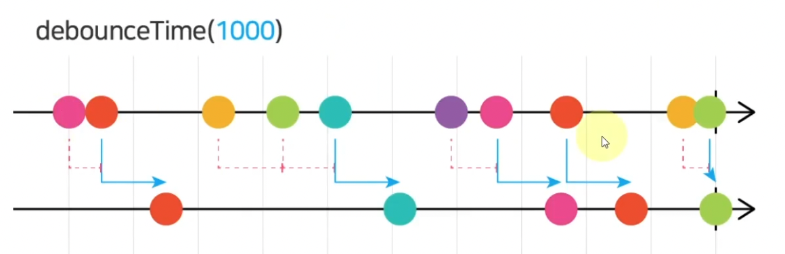
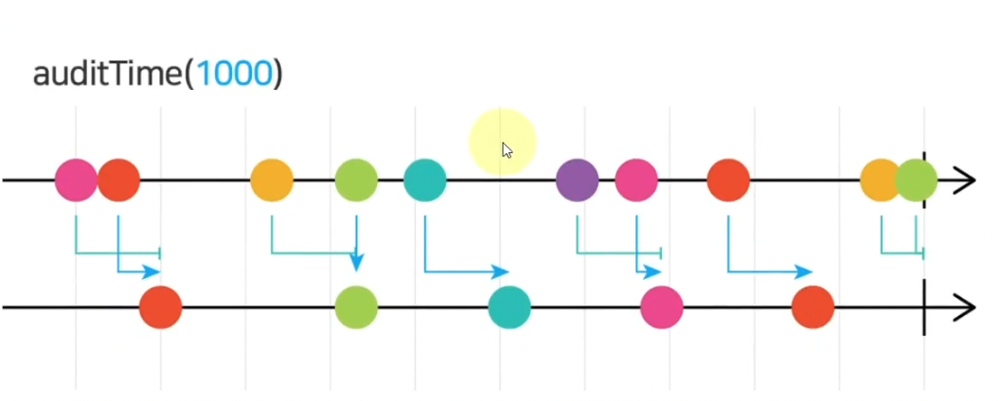
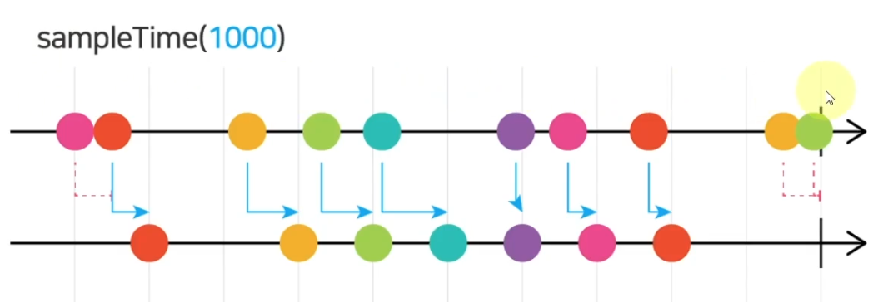
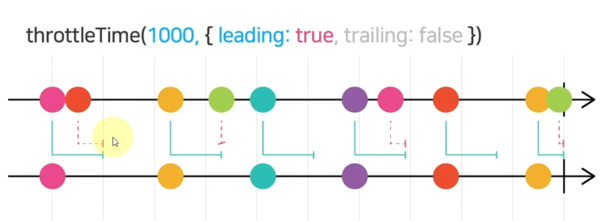
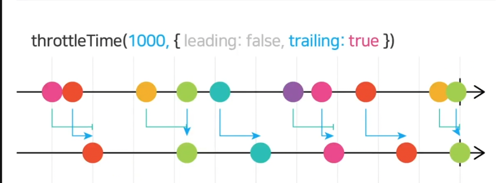
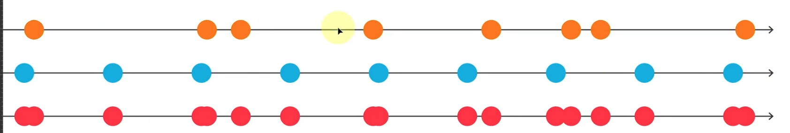
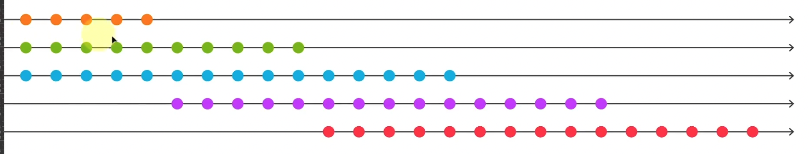
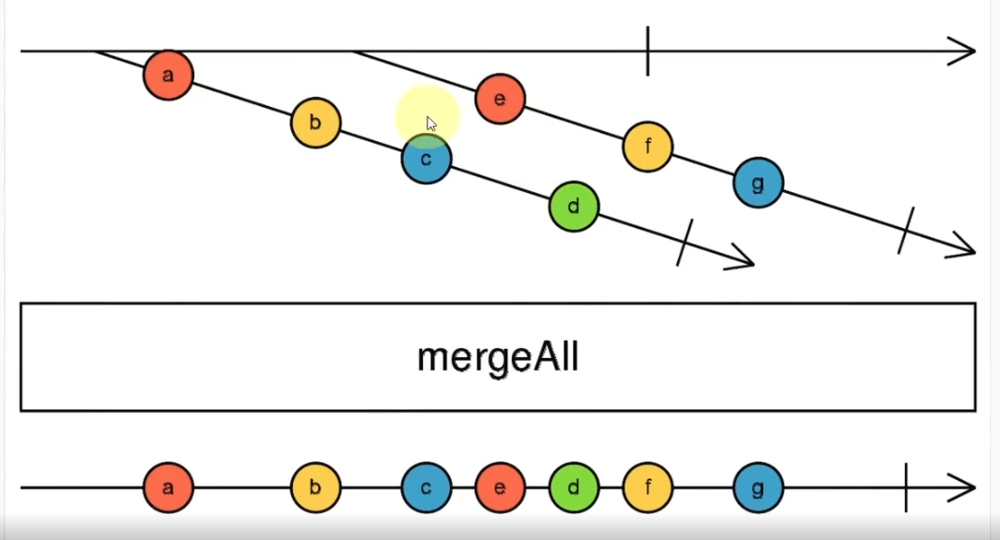
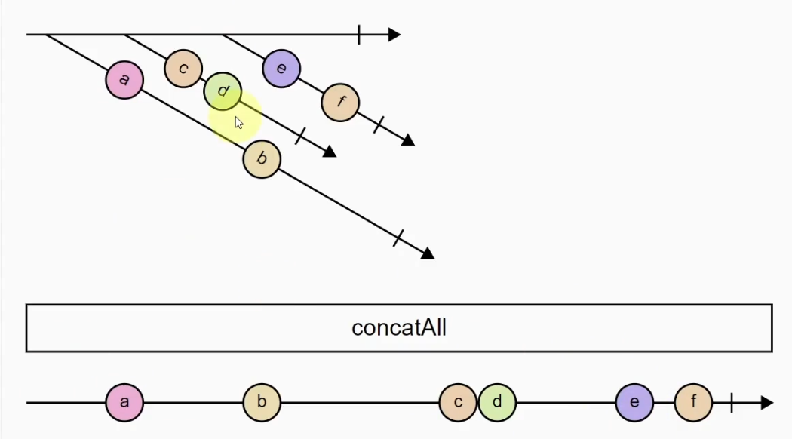
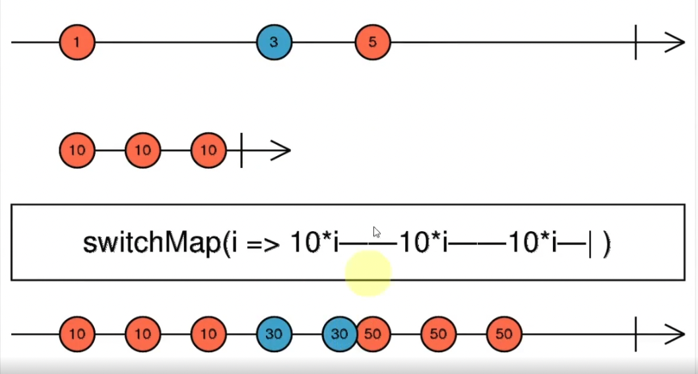

# operators

## 1. 기본적인 배열 연산자들

- 목록
  - count, max, min, reduce, first, last, elementAt, dictinct, filter, tap

- 표준 JS와 차이점
  - 표준 JS는 Pipe가 아직 반영 안됨(논의 중).
    - RxJS는 Pipe로 여러 Operator를 조합 가능.
  - 표준 JS는 배열 Method가 제한적임.

1. 예제1) 산수관련, count max, min, reduce

    ```
        const {of} = rxjs
        const {count, max, min, reduce} = rxjs.operators

        const obs$ = of(4,2,6,10,8)
        
        // count
        obs$.pipe(count()).subscribe(x => console.log('count'+ x))
        // count 5

        // max
        obs$.pipe(max()).subscribe(x => console.log('max'+ x))
        // max 10

        // min
        obs$.pipe(min()).subscribe( x=> console.log('min' + x))
        // min 2

        // reduce
        obs$.pipe(
            // reduce 함수에 의해서 배열의 Iterable한 연산 결과가 acc에 대입됨.
            // 초기값: 0
            // acc: 누적값
            reduce((acc, x)=> {return acc + x}, 0)
        ).subscribe(x => console.log('reduce' + x))

    ```

2. 예제2) 선택 관련, first, elementAt, distinct

    ```
        const {from} = rxjs
        const {first, last, elementAt, filter, distinct} = rxjs.operators

        const obs$ = from(
            [9,3,10,5,1,10,9,9,1,4,1,8,6,2,7,2,5,5,10,2]
        )

        // first
        obs$.pipe(first()).subscribe(x => console.log('first' + x))
        // first 9

        // last
        obs$.pipe(last()).subscribe(x => console.log('last' + x))
        // last 2

        // elementAt
        obs$.pipe(elementAt(5)).subscribe(x => console.log('elementAt' + x))
        // elementAt 10 
        // 참고로, index는 0 부터 진행됨.

        // distinct
        obs$.pipe(distinct()).subscribe(x=> console.log('distinct'+ x))
        // 중복 값 제거하고, 동일한 값의 요소를 1번씩 만 출력한다. 
        
        // distinct 9
        // distinct 3
        // distinct 10
        // distinct 5
        // distinct 1
        // distinct 4
        // ... 이하 생략

        // distinct + count
        obs$.pipe(distinct(), count()).subscribe(x=> console.log(x))
        // 10 출력

        // 짝수 중에서 가장 큰 값 출력하기
        obs$.pipe(
            filter(x => x % 2 ===0),
            max()
        ).subscribe(x => console.log(x))
        // 10 출력

        // 5보다 큰 3번째 짝수 출력하기
        obs$.pipe(
            filter(x => x > 5),
            filter(x => x % 2 ===0),
            elementAt(2)
        ).subscribe(x => console.log(x))
        // 8 출력

        // distinct된 값들 중, 홀수들의 총 개수를 출력하기
        obs$.pipe(
            distinct(),
            filter(x => x%2 ===1),
            count()
        ).subscribe(x => console.log(x))
        // 5 출력
    ```

## 2. tap Operator

- 통과되는 모든 값마다 개발자가 지정한 특정 작업을 수행한다.
  - Debuging 활용 시, console.log를 출력하는 용도로 사용됨.
  - Side Effect를 유발하는 요소는 지양해야 한다.
- 발행 결과에 대한 Side Effect는 없음.

- 예제)

    ```
        const {from} = rxjs
        const {tap, filter, distinct} = rxjs.operators

        from(
            [9,3,10,5,1,10,9,9,1,4,1,8,6,2,7,2,5,5,10,2]
        ).pipe(
            tab(x => console.log('-------first tab' + x)),
            filter(x=> x%2 ===0),
            tab(x => console.log('----after filter), x),
            distinct(),
            tab(x => console.log('--중복 값 제거', x))
        ).subscribe(x => console.log('발행물'+ x))
    ```

## 3. Transformation oeprators

- Pipeline에 통과되는 값을 원하는 값으로 변경함.

### map

- 예제)

    ```
        const {of} = rxjs
        const {map} = rxjs.operators

        of(1,2,3,4,5)
        .pipe(
            map(x => x * x)
        ).subscribe(console.log)
    ```

- 예제)

    ```
        const {from} = rxjs
        const {map} = rxjs.operators

        from(
            [
                {name:'apple', price: 1200},
                {name: 'carrot', price: 800},
                {name: 'meat', price: 5000},
                {name: 'milk', price: 2400}
            ]
        ).pipe(
            map(item => item.price) // 참고로, 용도상 fluck이 더 적합함.
        ).subscribe(console.log)
        // 1200
        // 800
        // 5000
        // 2400
    ```

### fluck

- 예제)

    ```
        const {from} = rxjs
        const {pluck} = rxjs.operators

        const obs$ = from(
            [
                {name:'apple', price:1200, info: {category: 'fruit'}},
                {name:'carrot', price:800, info: {category: 'vegetable'}},
                {name:'pork', price:5000, info: {category: 'meet'}},
                {name:'milk', price: 2400, info: {category: 'drink'}}
            ]
        )

        obs$.pipe(
            pluck('info').pluck('category') // 또는 pluck('info','category')
        ).subscribe(console.log)
        // fruit
        // vegatable
        // meet
        // drink
    ```

### toArray

- Stream의 모든 발행물을 하나의 배열로 묶어서 출력한다.
- 예제)

    ```
        const {range} = rxjs
        const {toArray, filter} = rxjs.operators

        range(1, 50).pipe(
            filter(x=> x%3 ===0),
            filter(x=> x%2 ===1),
            toArray()
        ).subscribe(console.log)
        // 하나의 배열이 출력됨. 
    ```

### scan

- reduce 와 비교 시
  - reduce : 연산 최종 결과 1개만을 발행한다.
  - scan : 연산 과정과 결과를 모두 순차적으로 발행한다.
- 예제)

    ```
        const {of} =rxjs
        const {reduce, scan} = rxjs.operators

        const obs$ = of(1,2,3,4,5)
        
        obs$.pipe(
            reduce((acc, x) => {return acc + x}, 0)
        ).subscribe(x => console.log('reduce' + x))
        // reduce 15

        obs$.pipe(
            scan((acc, x)=> { return acc + x}, 0)
        ).subscribe(x => console.log('scan'+x))
        // scan 1
        // scan 3
        // scan 6
        // scan 10
        // scan 15
    ```

### zip

- 풀려 있는 zipper를 올릴 때, 분리된 양쪽이 결합됨을 상상한다.
- 2개 이상의 옵저버블 또한 결합이 가능하다.
- 각 배열 별 길이가 다른 경우, 길이가 짧은 배열을 기준으로, 결과물 또한 길이가 짧은 배열의 길이로 생성됨.
- 의문
  - concat과 차이점은?
    - 답: 예제1, 2를 보면 확인이 가능하다.
- 예제 1) Array 결합

    ```
        const {from, interval, fromEvent, zip} = rxjs
        const {pluck} = rxjs.operators

        const obs1$ = from([1,2,3,4,5])
        const obs2$ = from(['a','b','c','d','e'])

        zip(obs1$, obs2$).subscribe(console.log)
        // [1, 'a']
        // [2, 'b']
        // [3, 'c']
        // [4, 'd']
        // [5, 'e']
    ```

- 예제 2) Observable 결합
- 참고로, Obervable에 pipe가 호출 된 결과물 또한 Observable이다.

   ```
    const {from, interval, fromEvent, zip} = rxjs
    const {pluck} = rxjs.operators

    const obs4$ = interval(1000)
    const obs5$ = fromEvent(document, 'click').pipe(pluck('x'))

    zip(obs4$, obs5$).subscribe(console.log)
    // interval 당 click 1개가 묶인다. (해당 예제는 Event 타이밍 조절을 목표로 함)
    // 주의 할 점은, 10초 간 click 안하면 interval이 10개 쌓이고, 마우스 click을 10연타 시 10개가 바로 출력이 됨.
    // 단 1초 안에 여러 번 click 시, 오직 1개의 click 만 출력됨. 그 후 시간의 흐름에 따라 이전의 click 결과가 순차적으로 출력됨.
    // 결론으로, 두 이벤트의 발행물을 묶어서 하나로 출력함.
   ```

## take와 skip 관련 연산자들

### take

- 배열 인덱스상, 앞에서 N 개만 선택함.
- Stream의 한계를 정함. 즉 완료 후 Complete 처리됨.

- 예제)

    ```
        const {range, interval, fromEvent} = rxjs
        const {take, filter, pluck} = rxjs.operators

        range(1, 20).pipe(
            take(5)
        ).subscribe(console.log)
        // 1 출력
        // 2 출력
        // 3 출력
        // 4 출력
        // 5 출력
    ```

- 예제2)

    ```
        const {range, interval, fromEvent} = rxjs
        const {take, filter, pluck} = rxjs.operators

        interval(1000).pipe(
            take(5)
        ).subscribe(
            console.log,
            err => console.error(err),
            _=> console.log('COPLETE')
        )
        // 0 출력
        // 1 출력
        // 2 출력
        // 3 출력
        // 4 출력
        // COMPLETE 출력
        // 이후 발행 없음
    ```

- 예제3)

    ```
        const {range, interval, fromEvent} =rxjs
        const {take, filter, pluck} = rxjs.operators

        fromEvent(document, 'click').pipe(
            take(5),
            pluck('x')
        ).subscribe(
            console.log,
            err => console.err(err),
            _=> console.log('COMPLETE')
        )
        // x 값 출력
        // x 값 출력
        // x 값 출력
        // x 값 출력
        // x 값 출력
        // COMPLETE 출력
        // 이후 발행 없음
    ```

## takeLast

- 뒤에서부터 N 개 값 선택한다.
- 예제)

    ```
        const {range, interval, fromEvent} = rxjs
        const {takeLast, take, pluck} = rxjs.operators

        range(1, 20).pipe(
            takeLast(5)
        ).subscribe(console.log)
        // 16 출력
        // 17 출력
        // 18 출력
        // 19 출력
        // 20 출력
    ```

- 예제2) takeLast가 동작되지 않음.
  - interval은 지속적으로 값을 발행함.
  - 지속적은 끝이 없음을 의미하므로, 끝을 명확히 파악할 수 없어서 마지막 5개만 선택한다는 것은 성립되지 않음.

    ```
        const {range, interval, fromEvent} = rxjs
        const {takeLast, take, pluck} = rxjs.operators

        interval(1000).pipe(
            takeLast(5)
        ).subscribe(
            console.log,
            err => console.log(err),
            _=>console.log('COMPLETE')
        ) 
    ```

- 예제3) 예제2의 문제점을 보완
  - take를 통해 complete 됨을 사전에 먼저 명시한다면, takeLast가 정상적으로 동작한다.

    ```
        const {range, interval, fromEvent} = rxjs
        const {takeLast, take, pluck} = rxjs.operators

        interval(1000)pipe(
            take(10),
            takeLast(5)
        ).subscribe(
            console.log,
            err =>console.log(err),
            _=>console.log('COMPLETE')
        )
        // 10 초 간 대기.
        // 5 출력
        // 6 출력
        // 7 출력
        // 8 출력
        // 9 출력
        // 10 출력
    ```

## takeWhile

- 조건이 성립되면, Complete 된다. (filter와 차이점)
- 조건이 성립되지 않으면 발행물을 출력한다.
- 예제)

    ```
        const {range, interval, fromEvent} =rxjs
        const {takeWhile, takeLast, filter, pluck} = rxjs.operators

        range(1,20).pipe(
            takeWhile(x => x <= 10)
        ).subscribe(console.log)
        // 1 출력
        // 2 출력
        // 3 출력
        // 4 출력
        // 5 출력
        // 6 출력
        // 7 출력
        // 8 출력
        // 9 출력
        // 10 출력
        // 이후 추가적인 출력을 안함.
    ```

- 예제2)

  ```
    const {range, interval, fromEvent} = rxjs
    const {takeWhile, takeLast, filter, pluck} = rxjs.operators

    fromEvent(document, 'click').pipe(
        pluck('x'),
        takeWhile(x => x< 200)
    ).subscribe(
        console.log,
        err => console.error(err),
        _=> console.log('COMPLETE')
    )
    // x좌표가 200보다 작은 경우만 정상적으로 값을 발행한다.
    // x좌표가 200을 넘기는 경우에 complete 처리 됨.
  ```
  
## takeUntil

- 예제 1) 기준 Stream이 첫 번째 값을 발행하기 전에 대기

  ```
    const {interval, timer, fromEvent} = rxjs
    const {ajax} = rxjs.ajax
    const {takeUntil, pluck, tap} = rxjs.operators

    obs1$ = interval(1000)
    obs2$ = fromEvent(document, 'click')

    obs1$.pipe(
        takeUntil(obs2$)
    ).subscribe(
        console.log,
        err => console.error(err),
        _=> console.log('COMPLETE')
    )
    // 1 출력
    // 2 출력
    // 3 출력
    // 4 출력
    // 마우스 클릭 이벤트 발생!
    // COMPLETE 처리 됨.
    // ... 더이상 obs1$은 값을 발행하지 않음
  ``
    - obs2$가 첫 발행물을 만들기 전까지만 obs1$은 발행

- 예제 2) 예제1 반대

    ```
        const {interval, timer, fromEvent} =rxjs
        const {ajax} = rxjs.ajax
        const {takeUntil, pluck, tap} = rxjs.operators

        obs1$ = fromEvent(document, 'click')
        obs2$ = timer(5000)

        obs1$.pipe(
            pluck('x'),
            takeUntil(obs2$)
        ).subscribe(
            console.log,
            err => console.err(err),
            _=> console.log('COMPLETE')
        )
        // 5초 간 click 발행물 받음
        // 5초 후
        // COMPLETE 출력
        // 이후 click 발행물 불가
    ```

- 예제 3) Ajax가 값을 반환하기 전까지 대기

    ```
        const {interval, timer, fromEvent} = rxjs
        const {ajax} = rxjs.ajax
        const {takeUntil, pluck, tap} = rxjs.operators

        interval(50).pipe(
            takeUntil(
                ajax('http://127.0.0.1:3000/people/name/randome')
                .pipe(
                    pluck('response'),
                    tap(console.log)
                )
            )
        ).subscribe(console.log)
        // 1 출력
        // ...
        // 20 출력
        // ajax 요청 완료 후 ajax 발행물 출력한다.
        // COMPLETE 처리됨. (더이상 interval 작동 안함)
    ```

- 활용 예시로, Ajax 요청 중에 애니메이션 구현

## skip

- 앞에서 N개 건너뛰기.
- 예제 1) skip

    ```
        const {range, interval, fromEvent} = rxjs
        const {skip, filter, pluck} = rxjs.operators

        range(1, 20).pipe(
            skip(5)
        ).subscribe(console.log)
        // 6~20을 출력한다.
    ```

- 예제 2) skip interval

    ```
        const {range, interval, fromEvent} =rxjs
        const {skip, filter, pluck} = rxjs.operators

        interval(1000).pipe(
            skip(5)
        ).subscribe(
            console.log,
            err => console.error(err),
            _=> console.log('COMPLETE')
        )
        // 5초 동안 대기 (콘솔에 출력을 안함)
        // 5
        // 6
        // 7
        // ...
    ```

- 예제 3) skip event

    ```
        const {range, interval, fromEvent} = rxjs
        const {skip, filter, pluck} = rxjs.operators

        fromEvent(document, 'click').pipe(
            skip(5),
            pluck('x')
        ).subscribe(
            console.log,
            err=> console.err(err),
            _=> console.log('COMPLETE')
        )
        // 5번 동안 발생한 click 이벤트에 대해서는 발행물을 출력 안함.
        // click 이벤트가 5번 발생한 이후부터 콘솔 로그에 "x"가 출력됨.
        // x
        // x
        // x
        // ...
    ```

## skipLast

- 뒤에서부터 N개 건너뛰기.
- takeLast와 동작 방식이 확연히 다름을 주의한다. (자세한 상황은 takeLast 섹션 참고)
- 예제 1)

    ```
        const {range, interval, fromEvent} = rxjs
        const {skipLast, pluck} = rxjs.operators

        interval(1000).pipe(
            skipLast(5)
        ).subscribe(
            console.log,
            err=>console.error(err),
            _=>console.log('COMPLETE')
        )
        // 1 ~ 15 출력
    ```

  - 처음 5개의 발행물은 Skip됨. (5초 간 아무런 출력을 안함.)
    - 즉 1, 2, 3, 4, 5이라는 5개의 요소가 생기기 전까지는 skip 처리 중임.
  - 6번째 발행물부터, 이전에 Skip된 요소들이 순차적으로 발행됨.
  - 결론으로 6번째 요소부터 순차적으로 -5 인덱스 이전의 요소를 출력해나감.

- 예제 2)

    ```
        const {range, interval, fromEvent} = rxjs
        cosnt {skipLast, pluck} = rxjs.operators

        fromEvent(document, 'click').pipe(
            skipLast(5),
            pluck('x')
        ).subscribe(
            console.log,
            err=>console.error(err),
            _=>console.log('COMPLETE')
        )
        // 5번 이전에 발행 된 click 이벤트에 대해서는 별도의 반응이 없음.
        // 5번 이후 발생한 이벤트 부터, 이전에 Skip된 1번 째 이벤트부터 순차적으로 출력한다.
    ```

## skipWhile

- ~하는 동안 건너뛰기.

    ```
        const {range, interval, fromEvent} = rxjs
        const {skipWhile, filter, pluck} = rxjs.operators
        range(1, 20).pipe(
            skipWhile(x => x<= 10)
        ).subscribe(console.log)
        // 11
        // 12
        // .. 순차적 증가
        // 20
    ```

## skipUntil

- 기준이 되는 요소부터 발행을 시작한다.
- 예제1)

    ```
        const { interval, timer, fromEvent} =rxjs
        const {skipUntil, pluck} = rxjs.operators

        const obs1$ = interval(1000)
        const obs2$ = fromEvent(document, 'click')

        obs1$.pipe(
            skipUntil(obs2$)
        ).subscribe(
            console.log,
            err => console.error(err),
            _=>console.log('COMPLETE')
        )
        // click 이벤트가 발생하기 이전까지, obs1$은 발행하지 않음.
        // click 이벤트가 발생한 이후부터, obs1$이 발행을 시작한다.
        // 6 (6초에 click 이벤트가 발생함을 가정 시)
        // 7
        // 8
    ```

- 예제2)

    ```
        const {interval, timer, fromEvent} = rxjs
        const {skipUntil, pluck} = rxjs.operators

        const obs1$ = fromEvent(documetn, 'click')
        const obs2$ = timer(5000)

        obs1$.pipe(
            pluck('x'),
            skipUntil(obs2$)
        ).subscribe(
            console.log,
            err=>console.error(err),
            _=>console.log("COMPLETE")
        )
        // 5초 이후부터, obs1$이 발행을 시작함.
    ```

## 시간을 다루는 연산자들1

### delay

- 각각의 값들의 발행 시간을 늦춘다(delay).
- 예제)

  ```
    const {interval, fromEvent} = rxjs
    const {delay, tap, take} = rxjs.operators

    interval(1000).pipe(
        take(5),
        tap(x => console.log(x + '발행시작')),
        delay(1500)
    ).subscribe( x => console.log( x + '발행 완료'))
  ```

- 예제2)

    ```
        const {interval, fromEvent} = rxjs
        const {delay, tap, take} =rxjs.operators

        fromEvent(document, 'click').pipe(
            tap(e => console.log(e.x + '발행시작')),
            delay(1500)
        ).subscribe(e=> console.log(e.x + '발행 완료'))
    ```

### timestamp

- timestampe 값(정수)을 추가함.
- 예제)

    ```
        const {fromEvent} = rxjs
        const {timestamp, pluck, map} =rxjs.operators

        fromEvent(document, 'click').pipe(
            pluck('x'),
            timestamp()
        ).subscribe(console.log)
        /*
            { 
                timestampe :1234566,
                x : 3
            }
        */
    ```

### timeinterval

- 이전 발행물과의 시간차(ms)를 추가함
- 예제 1)

    ```
        const {fromEvent, interval} = rxjs
        const {timeinterval, pluck} =rxjs.operators

        fromEvent(document, 'click').pipe(
            pluck('x'),
            timeInterval()
        ).subscribe(console.log)
        /*
        click  1번
        {
            interval: 4492,
            value:124
        }

        2초 후 click 1번
        {
            interval: 2000,
            value:124
        }
        */
    ```

- 예제 2) interval 오퍼레이터의 정확도 측정하기

      ```
        const {fromEvent, interval} = rxjs
        const {timeInterval, pluck} = rxjs.operators

        interval(1000).pipe(
            timeInterval()
        ).subscribe(console.log)
        /*
        {
            interval: 1006,
            value:1
        }

        {
            interval: 990,
            value:2
        }

        {
            interval: 1006,
            value:3
        }
        */
      ```
  - interval 오차는 약 +-10

### timeout

- 주어진 시간 내, 다음 값 미발행 시 오류 발생
- 예제 1)

    ```
        const {fromEvent} = rxjs
        const {ajax} = rxjs.ajax
        const {timeout, pluck} =rxjs.operators

        fromEvent(document, 'click').pipe(
            timeout(3000)
        ).subscribe(
            _=> console.log('OK'),
            err => console.error(err)
        )
        // 3초 안에 click 이벤트가 발생하지 않으면, error 발생!
    ```

- 예제 2) Ajax 요청 시, 특정 시간 내 응답이 없는 경우 error 처리 한다

    ```
        const {fromEvent} =rxjs
        const {ajax} =rxjs.ajax
        const {timeout, pluck} =rxjs.operators

        ajax('http://127.0.0.1:3000/people/name/random).pipe(
            pluck('response'),
            timeout(500)
        ).subscribe(console.log, console.error)
    ```

### timeoutWith

- 주어진 시간 내 Stream 내 값이 미발행 시, 다른 Observable로 대체
- 예제 1)

     ```
        const {fromEvent, interval, of} =rxjs
        const {ajax} =rxjs.ajax
        const {timeoutWith, pluck, scan}= rxjs.operators

        fromEvent(document, 'click').pipe(
            timeoutWith(3000, interval(1000)),
            scan((acc, x)=> {return acc + 1}, 0)
        ).subscribe(console.log)
        // 3초 동안 click이 없는 경우, Observable이 interval로 변경 됨.
        // interval은 1부터 시작됨.
        // 이후, click 이벤트가 유효하지 않고, interval만 작동함.
     ```

- 예제 2) Ajax 미응답시, 대체값 처리

      ```
        ajax('http://127.0.0.1:3000/people/name/random').pipe(
            pluck('resonse'),
            timeoutWith(500, of({
                id: 0,
                first_name : 'Hong',
                last_name: 'Gildong',
                role: 'substitute'
            }))
        ).subscribe(console.log, console.error)
        // 0.5초 지나도 아무 리스폰스 없으면 of의 설정된 임시 값을 내보낸다
      ```

## 시간을 다루는 연산자들 2 (고급)

### 기본 예제) 이전 click의 이벤트 차이를 출력

    ```
        const {fromEvent} = rxjs
        const {timeInterval, pluck, scan, tap} =rxjs.operators

        const clicks$ = fromEvent(document, 'click').pipe(
            timeInterval(),
            pluck('interval'),
            scan((acc, i)=> acc + i , 0),
            tap(x => console.log('CLICKED: ' + x))
        )

        clicks$.subscribe()
    ```

### debounceTime

- 
  - 마지막 발행 이후, 특정 간격 내 다음 요소가 없는 경우, 마지막 요소만 발행.
- 활용
  - 검색창에서 입력 값에 대해서, 특정 시간 동안 입력이 없으면 Ajax처리
- 예제)

    ```
        const {fromEvent} = rxjs
        const {timeInterval, pluck, scan, tap} =rxjs.operators

        const clicks$ = fromEvent(document, 'click').pipe(
            timeInterval(),
            pluck('interval'),
            scan((acc, i)=> acc + i , 0),
            tap(x => console.log('CLICKED: ' + x))
        )

        const {debounceTime} = rxjs.operators

        clicks$.subscribe(
            debounceTime(1000)
        ).subscribe( x=> console.log('OUTPUT ------:' + x))
        // 계속 click 시, CLICKED 출력 됨
        // CLICKED : 12611
        // ...
        // CLICKED : 14078
        // click 이벤트가 1초 이상 멈추면
        // OUTPUT -------: 14078 // 1초 간격 사이에서, 마지막 CLICKED 값 출력
        // 이전 과정을 계속 반복함.
    ```

### auditTime

- 
- 트리거 요소 발행 후부터, 특정 간격 내 마지막 요소만 발행
- complete 시, 마지막 간격은 작동 안함.
- 예제)

     ```
        const {fromEvent} = rxjs
        const {timeInterval, pluck, scan, tap} =rxjs.operators

        const clicks$ = fromEvent(document, 'click').pipe(
            timeInterval(),
            pluck('interval'),
            scan((acc, i)=> acc + i , 0),
            tap(x => console.log('CLICKED: ' + x))
        )

        const {auditTime} = rxjs.operators

        clicks$.subscribe(
           auditTime(1000)
        ).subscribe( x=> console.log('OUTPUT ------:' + x))
        // 1초 안에 많이 클릭 시
        // CLICKED :1437
        // CLICKED :1751
        // CLICKED :1940
        // CLICKED :2122
        // CLICKED :2294
        // 1초 후
        // OUTPUT:2294

        // ...반복
     ```

### sampleTime

- 

- 특정 간격 내, 마지막 요소 만 출력
- complete 시, 마지막 간격은 작동 안함.
- 예제)

     ```
        const {fromEvent} = rxjs
        const {timeInterval, pluck, scan, tap} =rxjs.operators

        const clicks$ = fromEvent(document, 'click').pipe(
            timeInterval(),
            pluck('interval'),
            scan((acc, i)=> acc + i , 0),
            tap(x => console.log('CLICKED: ' + x))
        )

        const {sampleTime} = rxjs.operators

        clicks$.subscribe(
           sampleTime(1000)
        ).subscribe( x=> console.log('OUTPUT ------:' + x))
        // 1초 안에 많이 클릭 시
        // CLICKED :1437
        // CLICKED :1751
        // CLICKED :1940
        // CLICKED :2122
        // CLICKED :2294
        // 1초 후
        // OUTPUT:2294

        // ...반복
     ```

### throttleTime(1000, undefined, {leading: true, trailing: false})

- 
- leading true 시, 특정 간격 내 처음 요소만 바로 발행하고 나머지 요소는 발행하지 않음.
- 예제)

     ```
        const {fromEvent} = rxjs
        const {timeInterval, pluck, scan, tap} =rxjs.operators

        const clicks$ = fromEvent(document, 'click').pipe(
            timeInterval(),
            pluck('interval'),
            scan((acc, i)=> acc + i , 0),
            tap(x => console.log('CLICKED: ' + x))
        )

        const {throttleTime} = rxjs.operators

        clicks$.subscribe(
           throttleTime(1000, undefined, {
               leading: true, trailing: false
           })
        ).subscribe(x=> console.log('OUTPUT ------:' + x))

     ```

### throttleTime(1000, undefined, {leading: false, trailing: true})

- 
- trailing true 시, 특정 간격 내 가장 마지막 요소만을, 간격 끝지점에서 발행함.
- auditTime과 차이점
  - throttleTime은 종료 시, complete 시점에도 마지막 요소가 출력됨.
  - auditTime은 complete 시 무효화됨.
- 예제)

     ```
        const {fromEvent} = rxjs
        const {timeInterval, pluck, scan, tap} =rxjs.operators

        const clicks$ = fromEvent(document, 'click').pipe(
            timeInterval(),
            pluck('interval'),
            scan((acc, i)=> acc + i , 0),
            tap(x => console.log('CLICKED: ' + x))
        )

        const {throttleTime} = rxjs.operators

        clicks$.subscribe(
           throttleTime(1000, undefined, {
               leading: true, trailing: false
           })
        ).subscribe(x=> console.log('OUTPUT ------:' + x))

     ```

### throttleTime(1000, {leading: true, undefined,trailing: true})

- leading & trailing 적용
- 예제)

     ```
        const {fromEvent} = rxjs
        const {timeInterval, pluck, scan, tap} =rxjs.operators

        const clicks$ = fromEvent(document, 'click').pipe(
            timeInterval(),
            pluck('interval'),
            scan((acc, i)=> acc + i , 0),
            tap(x => console.log('CLICKED: ' + x))
        )

        const {throttleTime} = rxjs.operators

        clicks$.subscribe(
           throttleTime(1000, undefined, {
               leading: true, trailing: false
           })
        ).subscribe(x=> console.log('OUTPUT ------:' + x))

     ```

## time이 붙지 않는 debounce, audit, sample, throttle

### debounce

- 예제) Time을 유동적으로 선언하기

    ```
        const {fromEvent, interval} = rxjs
        const {debounce, audit, pluck} = rxjs.operators

        fromEvent(document, 'click').pipe(
            pluck('y'),
            debounce(y => interval(y * 10)) // time 연산자 또한 가능함.
        ).subscribe(console.log)
        // y좌표가 상단 클릭 시, 가까울 수록 빠르게 console.log 출력
        // y좌표가 하단 클릭 시, 멀수록 느리게 console.log 출력 
        // 이벤트 발생 직후 해당 interval 후 발행 값 출력 (1회만)
    ```

### audit

- 예제)

      ```
          const {fromEvent, interval} = rxjs
          const {debounce, audit, pluck} = rxjs.operators

          fromEvent(document, 'click').pipe(
              pluck('y'),
              audit( y=> interval(y*10))
          ).subscribe(console.log)
      ```

### BehaviorSubject + debounce

- behaviorSubject는 getValue를 통해서, 마지막으로 발행한 값을 얻을 수 있다.
- 예제) behaviorSubject를 상태값으로 사용해서 debounce 처리하기

      ```
          const {BehaviorSubject, fromEvent, interval} = rxjs
          const {debounce, tap} = rxjs.operators

          const bs = new BehaviorSubject(1000) // 변수 대신 활용

          fromEvent(document, 'click').pipe(
              tap(_ => console.log(bs.getValue())),
              debounce( e => interval(bs.getValue())),
              tab(_ => bs.next(bs.getValue() + 500)) //  다음 bs의 값을 넣음
          ).subscribe(_=>console.log('CLICK'))

          // 연속 click
          // 1000 출력
          // 1000 출력
          // 1000 출력
          // ...
          // 클릭 중지 1초 후, CLICKED 출력
          // 연속 click
          // 1500 출력
          // 1500 출력
          // 1500 출력
          // 클릭 중 1.5초 후, CLICKED 출력
          // 반복
      ```

### sample

     ```
        const {fromEvent,interval} = rxjs
        const {sample} = rxjs.operators

        interval(1000).pipe(
            sample(fromEvent(document, 'click'))
        ).subscribe(console.log)
        // 인터발 중 마지막 click 값을 출력함.
     ```

- 참고
  - (RxJS Docs, sample) <https://rxjs.dev/api/operators/sample>

### throttle

- throttle time 원형
  - default {leading : true, trailing : false}
- 예제)

    ```
       const {fromEvent, interval} =rxjs
       const {throttle, timeInterval, pluck} =rxjs.operators

       fromEvent(document, 'click').pipe(
           throttle(e => interval(1000)),
           timeInterval(),
           pluck('interval')
       ).subscribe(console.log)
    ```

## Stream을 결합하는 연산자들

### merge : 두 스트림을 순서관계 없이 한 스트림에 병합

- 

- 예제 1)

     ```
      const {merge,interval,fromEvent} = rxjs
      const {map} = rxjs.operators

      const interval$ = interval(1000).pipe(map(_=>'interval'))
      const click$ = fromEvent(document, 'click').pipe(_=>'click'))

      merge(interval$, click$).subscribe(console.log)
      // interval은 지속적으로 1초에 1번 씩 interval 출력
      // click 이벤트 발생 시 click 출력
     ```

- 예제 2) mapTo 적용

     ```
        const {merge, interval, fromEvent}=rxjs
        const {map, mapTo} = rxjs.operators

        const interval$ = interval(1000).pipe(map(_=>'interval))
        const click$ = fromEvent(document, 'click').pipe(map(_=>'click'))

        merge(interval$, click$).pipe(
            mapTo('merged')
        ).subscribe(console.log)
        // 1초에 1번 merged 출력
        // click 마다 merged 출력
     ```

  - 예제 3)

      ```
        const {merge, interval}=rxjs
        const {map,take} =rxjs.operators

        const intv1$ = interval(1000).pipe(
            map(_=> 'INTERVAL 1'),
            take(3)
        )

        const intv2$ = interval(1000).pipe(
            map(_=> 'INTERVAL 2'),
            take(6)
        )

        const intv3$ = interval(1000).pipe(
            map(_=> 'INTERVAL 3'),
            take(9)
        )

        const intv4$ = interval(1000).pipe(
            map(_=> 'INTERVAL 4'),
            take(9)
        )

        const intv5$ = interval(1000).pipe(
            map(_=> 'INTERVAL 5'),
            take(9)
        )

        merge(intv1$, intv2$, intv3$, intv4$, intv5$, 3).subcribe(console.log)
        // INTERVAL 1
        // INTERVAL 2
        // INTERVAL 3
        // 3번 반복 후 
        // INTERVAL 2
        // INTERVAL 3
        // INTERVAL 4
        // 3번 반복 후
        // INTERVAL 3
        // INTERVAL 4
        // INTERVAL 5
        // 3번 반복 후
        // INTERVAL 4
        // INTERVAL 5
        // 3번 반복 후
        // INTERVAL 5
        // 3번 반복 후
      ```

    - 
    - merge 마지막 상수는 최대 merge 갯수
    - merge 마지막 상수가 1인 경우, 이어붙이는 의미가 되서 concat 연산자가 됨.

### concat

- Stream을 순서대로 이어붙임.
- 즉 인자 순서대로, 순차적으로 Stream을 complete 후 다음 Stream 구독함.
- 예제 1)

    ```
        const {concat, interval} = rxjs
        const {map, take} =rxjs.operators

        const intv1$ = interval(1000).pipe(
            map(_=> 'INTERVAL 1').take(3)
        )

        const intv2$ = interval(1000).pipe(
            map(_=> 'INTERVAL 2').take(3)
        )

        const intv3$ = interval(1000).pipe(
            map(_=> 'INTERVAL 3').take(3)
        )

        concat(intv1$, intv2$, intv3$).subscribe(console.log
        // INTERVAL 1
        // INTERVAL 1
        // INTERVAL 1
        // INTERVAl 2
        // INTERVAL 2
        // INTERVAL 2
        // INTERVAL 3
        // INTERVAL 3
        // INTERVAL 3
    ```

- 예제 2) 모든 interval이 출력된 후, click Stream이 활성화 된다.

    ```
        const {concat, interval, fromEvent} = rxjs
        const {map, take} = rxjs.operators

        const interval$ = interval(1000).pipe(
            map(_=> 'interval').take(5)
        ) 

        const click$ = fromEvent(document, 'click').pipe(map(_=> 'click'))

        concat(interval$, click$).subscribe(console.log) 
        // 모든 interval이 출력된 후, click Stream이 활성화 됨.
    ```

### mergeAll

- 

- ```
    import {fromEvent, interval} from 'rxjs';
    import { map, mergeAll } from 'rxjs/operators';

    const clicks = fromEvent(document. 'click');
    const higherOrder = clicks.pipe(map(ev) => interval(1000));
    const firstOrder = higherOrder.pipe(mergeAll());
    firstOrder.subscribe(x => console.log(x))

  ```

      - click 시마다, interval Stream을 생성하고,
      - (상위 Stream에 의해서, 하위 Stream이 생성 되고)
      - 이를 하나의 Stream으로 병합한다.

### mergeMap

- mergeAll을 단순화
  - 예제)

        ```
            const {interval, fromEvent} =rxjs
            const {mergeMap, map, take} =rxjs.operators

            fromEvent(document, 'click').pipe(
                mergeMap(e=> interval(1000).pipe(
                    map(i => e.x + ' : ' + e.y),
                    take(5)
                ))
            ).subscribe(console.log)
        ```
  - 예제2)

        ```
            const {of} = rxjs
            const {ajax} = rxjs.ajax
            const {mergeMap, pluck} = rxjs.operators

            of(3,15,4,9,1,7).pipe(
                mergeMap(keyword => ajax(
                    `http://127.0.0.1:3000/people/${keyword}`
                )).pipe(
                    pluck('response', 'first_name')
                )
            ).subscribe(console.log)
            // 먼저 response 된 순서로 발행값 출력
        ```

### concatAll

- 
- 순서대로 stream을 이어붙임  

### concatMap

- concatAll을 단순화
- 예제)

     ```
        const {interval, fromEvent} = rxjs
        const {concatMap, map, take} = rxjs.operators

        fromEvent(document, 'click').pipe(
            concatMap(e=> interval(1000).pipe(
                map(i => e.x + ' : ' + i),
                take(5)
            ))
        ).subscribe(console.log)
     ```

### switchMap (기준 스트림이 새 값을 발행하면, 기존에 진행 중인 스트림을 멈춤.)

- 
- 예제 1)

    ```
        const {interval, fromEvent} =rxjs
        const {switchMap, map, take} = rxjs.operators

        fromEvent(document, 'click').pipe(
            switchMap( e=> interval(1000).pipe(
                map(i => e.x + ' : ' + i),
                take(5) 
            ))
        )).subscribe(console.log)
    ```

### mapTo: 값은 두번째 Stream에서만 발행

### MergeMapTo

   예제)

   ```
     const {interval, fromEvent} = rxjs
     const {mergeMapTo, take} = rxjs.operators

     fromEvent(document, 'click').pipe(
         mergeMapTo(interval(1000).pipe(take(5))
         )
     ).subscribe(console.log)
     // interval로 부터만 받은 값만을 출력함.
     // 1 * 5번 출력
     // 2 * 5번 출력
     // ... 반복
   ```
