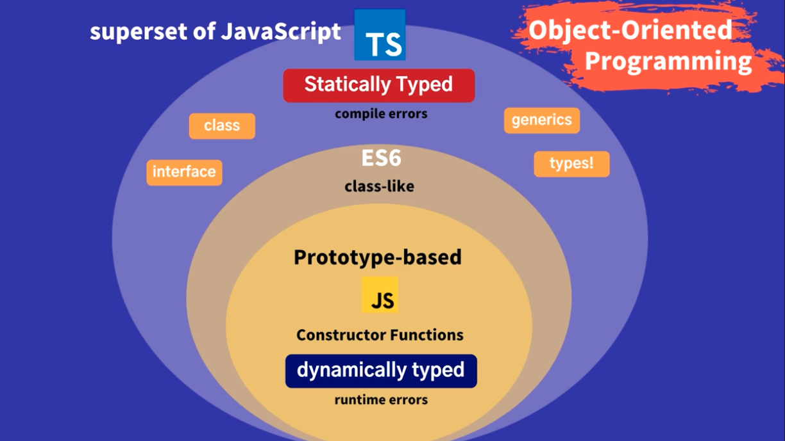

# Intro

## 타입스크립트 코딩 시 지양 사항

- 절차지향
  - 데이터와 프로시저 공유 형식
- 자바스크립트에 type만 첨가한 형식
  - var 남발
  - 인터페이스만 이용해서 타입을 정의

## 타입스크립트란?

- 주요 특징
  - 오픈소스 프로젝트
  - Any browser, Any OS, Anywhere(Server side, Client side 포함) JavaScript run
  - Statically typed (Compile errors)
  - TS를 compiler(TS 또는 BABEL)의 transcompiles를 통해 JS 코드로 변환
  - 자바스크립트 슈퍼셋
    - 
    - 자바스크립트 주요 특징
      - Prototype-based, Constructor Functions
        - 단점
          - 강력한 객체지향 프로그래밍은 어려움.
          - 의문
            - Custructor Functions?
      - class-like (since ES6)
        - 단점
          - 근본은 Prototype-based
          - 여전히 강력한 객체지향 프로그램은 어려움.
      - Dynamically typed
        - 단점
          - Runtime errors

## 타입스크립트가 뜨는 이유

 1. TYPED
    - JS는 Dynaminamically typed
        - Runtime 시 타입이 결정되고 확인
        - Easy, Flexible, Fast
            - 진입 장벽이 상대적으로 낮음.
            - Bad Readability
                - 코드를 통해서 해당 변수가 어떤 데이터를 담고 있는지 파악이 어려움
            - 위험한 언어
                - 사용자에게 프로덕트가 전달되어 운영 중 에러가 발생할 확률이 높음
    - TS는 Statically typed로 즉각적으로 TYPE 에러 감지 가능
        - compiler에 의해 compile time 시 타입을 결정되고 확인
        - 예제

            - ```
                let age:number = 10;
                age = 'hello'; // type of variable is known at compile time 
              ```

 2. OOP (Object-Oriented Programming)
     - one of modern programming paradigm
     - 특징
       - modularity (모듈화)
       - resuablility (재사용성)
       - extensible (확장성)
       - maintainablitity (유지보수성)
    - 효과
       - Productivity
       - higher quality
       - Faster (협업 개념 포함)

## 타입스크립트 공부 방법

- JS에 대한 기본적인 이해(문법 포함)는 필수
- Type 대한 이해
  - 기존 타입 언어(c, c++, kotlin, java 등)에 비해 더 강력한 타입 시스템
  - 어떤 타입을 '언제', '어떻게', '왜' 사용하는지가 중요하다.
- OOP에 대한 전반적인 이해

## 환경 설정

- 항상 엄격하게 Null 체크
  - VS code/Settings/stict null 검색/Typescript 메뉴/JS/TS Implict Project config:Strict Null Checks 를 체크한다.
- node.js
  - Javascript runtime envrionment (framework) that excutes JavaScript code outside a web browser "Javascript everywhere(server-side rendering, command line tools)"
- NPM
- Globally installing TypeScript
  - `npm install -g typescript`
- `tsc -v` : 타입스크립트 버전 확인

## 북마크 사이트

- 타입스크립트 공식 사이트 (<https://www.typescriptlang.org>)
  - 홈화면
  - Get Started
    - TS for the New Programmer
    - TypeScript for JS Programmers
    - TS for Functional Programmers
    - TypeScript Tooling in 5 minutes
  - Handbook
    - *타입스크립트는 업데이트가 굉장히 빈번하므로* Handbook이 업데이트를 쫒아가지 못하고 있다.
  - Whats New
    - 새 버전에 대한 버전 상세에 대한 지속적인 확인 필요
  - Community
  - Playground
  - Tools

## 홈화면 :: 타입스크립트 공식 사이트

- Typed JavaScript at Any Scale (어떤 규모든 가능)
  - JS를 쓸 때보다 에러 잡는 시간 절약
  - 코드 동작 전에 에러 감지 및 에러 수정 가능 (일부에 대해서)
  - IDE를 통해 코드 자동 완성
  - 인터페이스나 타입을 통해 오브젝트, 함수에 대한 묘사가 가능해지므로 가독성 증가
    - JSX 포함
- JavaScript and More
  - describe the shape of an object providing better documentation
  - allowing TypeScript to validate that your code is working correctly
  - Writing types can be opional in TypeScript Because type inference(추론) allows you to get a lot of power without writing additional code
    - 의문
      - type inference이 구체적으로 어떤?
- A Result You Can Trust
  - All valid JavaScript code is also TypeScript code.
  - While you can go for stricter behavior, that means you're still in control
- Gradual Adoption (점진적인 채택)
  - Adopting TypeScript is not a binary choise
  - you can start by annotating exiting JavaScrit with JSDoc, then switch a few files to be checked by TypeScript and over time prepare your codebase to convert completely
  - TypeScript's type inference means that you don't have to annotate your code until you want more safety
- Types On Every Desk
  - Definitely Typed 프로젝트 참고
- Consistently Good Tooling
  - 여러 IDE 지원
- Evolving with Standard
  - The Typescript team contributes to the TC39 conmmitters ...
    - 예시로, Optional chaining, Nullish, coalecing Operator, Throw Expressions and RegExp Match indices

## Playground 사용해보기

- TS Config
  - Target이 최신에 가까울 수록 변환 코드가 간단해지고(source map시 불리), 사이즈가 작다. 그리고 브라우저에 따라 성능 이슈가 존재한다.
  - 즉 번들링 시 JS 코드양은 중요한 요소 중 하나이므로 ES3까지 호환 시키는 것은 무조건적으로 옳은 선택은 아니다.
- Examples
  - 여러 코드 변환을 확인 가능

## 타입스크립트 컴파일러 툴 소개

- tsc main.ts -w
  - 코드 업데이트 내역 바로 반영 가능

## 강의 양식 참고: 노션으로 강의 계획 짜기

- 참고
  - <https://www.notion.so/TypeScript-Template-afddf4f9874c4a9c9d7bcce331aba915>

## 참고

- <https://academy.dream-coding.com/courses/take/typescript/lessons/20065130-0-1>
