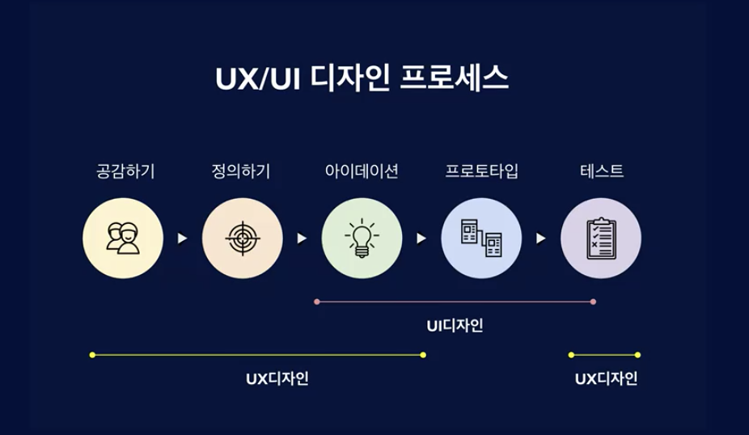

# onboarding
## eric 강사 
- 업무
    - 유저 리서치
    - 사용자 피드백 수집
    - UX 디자인
      - 정보 구조 설계, 와이어 프레임
    - UI 디자인
    - 디자인 시스템 제작, 실제 사용자에게 사용 하는 최종 디자인 산출물 제작
    
## UX/UI 디자인 프로세스
 
  1. 공감하기
  2. 정의하기
  3. 아이데이션
  4. 프로토타입
  5. 테스트
  
## UI 디자인 장벽에 대한 오해
   1. 시각적인 감각과 능력
      - 선천적인 재능 부재
   2. 디자인 툴 다루기

## UI 디자인 능력을 갖출 수 있었던 비결?
   1. 시각적인 감각과 능력
       - 디자인 목적
         -  사용자에게 가치 초점
       - 결론
         - 사용자에게 가치가 초점으로 디자인 방법론 습득 필요  
       - 디자인 방법론
         -  휴리스틱 평가
         -  UIUX 디자인 원칙 및 원리
   2. 좋은(?) 레퍼런스 디자인 클론 디자인
       - 좋은 레퍼런스에서 배울 수 있는 점
           - 성공한 서비스 또는 앱은 상대적으로 좋은 원리 및 원칙 적용
           - 많은 사용자 테스트가 진행됨
           - 사용자에 대한 이해도가 높음
           - 도메인에 대한 이해도가 높음
           - 다양한 시각적 표현법 습득 가능
   3. UI디자인 평준화
        - 디자인에 대한 러닝 커브 및 진입 장벽 낮아짐
            - 오픈소스 디자인 시스템의 양질 향상
            - Simple이 대세인 디자인 트렌드
        - 예시
            - 디자인 트랜드 변경
                - 애플
                     - iOS 6 (Skeuomorphic UI)
                         - 현실적이고 상세한 디자인
                     - iOS 7 (Flat UI)
                         - Simple 트랜드
                - 구글
                    - 머테리얼 UI           
   4. 디자인 툴 다루기
        - 2010년 대
            - 포토샵
              - 대세
              - 진입 장벽이 높음
              - 만능 도구
        - Sketch 툴 등장
            - 관심사 분리 (UX, UI 분리)
            - 상대적으로 낮은 진입 장벽 및 러닝 커브 및 사용성 향상
        - Figma 
            - Sketch 대비 더 강력(어느 부분이?) 

## 산출물 앱의 과정은 무엇이?
 - 많은 과정과 각 과정 별 높은 비용
 - 지속적인 개선
 - 디자인 싱킹 프레임워크
     - 과정
          1. 공감하기
             - 사용자에게 배우고
             - 사용자를 이해
          2. 정의하기
             - 사용자의 어려움
             - 사용자의 문제점 정의
             - 페르소나 활용
          3. 아이데이션
             - 솔루션 탐색
             - 브레인 스토밍 등 활용
          4. 프로토타입
             - 아이디어 시각화
          5. 테스트
             - 피드백 또는 바로 출시하여 검증
          6. 출시
      - 참고
          - 트레이드 오프에 따라 유연하게 운영 필요

## UI 디자인 프로세스 이해 및 밞아보기
 - 과정
     1. 스케치
           - 로우파이 프로토타입
           - 핸드 스케치
           - 주어진 문제를 해결 아이디어를 러프하게 그림
           - 장점
             -  적은 비용으로 수정 가능  
     2. 와이어 프레임
           - 미드파이 프로토타입
           - 스케치로 나온 아이디어 고도화
           - 화면에 대한 상세 정의
           - 기능에 대한 상세 정기
           - 화면 간 연결
           - UI 디자인의 뼈대
           - 분업 시 기획자 담당
           - PO 체계 시 UI 디자이너 담당 확률 높음
     3. UI 디자인
           - 하이파이 프로토타입
           - 사용자 사용성을 고려한 시각적인 완성도 높음
     4. 프로토 타이핑
           - 화면에 인터랙션 삽입
           - 목적
                1. 함께 일하는 여러 직군 간 디자인에 대한 원활한 커뮤니 케이션 진행
                2. 사용자 테스트 시 사용자에게 제공 후 피드백 수집
     5. 디자인 시스템
           - 사용자에게 일관된 사용자 경험과 인터페이스 제공
           - 디자이너 및 개발자는 컴포넌트 정의 .. 등을 통해 생산성 향상 도모
     6. 핸드오프 
           - 실제 개발이 될 수 있는 세부적인 요소
             - 예시 px, color 등
 - 주석
     1. 과정의 세분화 이유
           - 팀원 간 효율적인 커뮤니케이션
           - 사용자 중심의 서비스 개발 가능
     2. 단 문맥에 따라 트레이드 오프에 대한 선택권은 항상 존재 
     3. 단 포괄적인 프로세스 지향

## 왜 Figma?
 - Sketch 앱 사용 시
    1. 스케치
        - 종이, 펜
    2. 와이어 프레임
        - 스케치 앱
    3. UI디자인
        - 스케치 앱
    4. 프로토-타이핑
        - 인비전
    5. 디자인 시스템
        - 스케치 앱
    6. 핸드오프
        - 제플린
 - Figma 앱 사용 시 (All-in-one)
    1. 스케치
    2. 와이어 프레임
    3. UI 디자인
    4. 프로토-타이핑
    5. 디자인 시스템
    6. 핸드오프
         - figma or 제플린 
    - 주석
        - 콘텍스트 스위칭 비용 감소
 - 장점
   1. 온라인 기반 서비스
   2. 실시간 협업 가능
        - 동시 접속
        - 동시 디자인
        - 동시 댓글 및 피드백
   3. 스케치 앱을 알 경우 쉽게 figma 전환 가능
        - 두 툴 모두 UI 전용 툴
        - 비슷 비슷함
   - 주석
       - 포토샵을 UI 디자인으로 사용하지 않는 현재 트렌드 
       - 스케치 앱과 Figma 앱을 비교
       - 과정 중 스케치는 핸드 스케치를 의미

## 수업 타겟층
 1. 프로덕트 디자이너, UX/UI 디자이너를 꿈꾸는 입문자
 2. 대세 툴 피그마를 활용해서 UI 디자인을 마스터 하고 싶은 분
 3. UI디자인의 기본기를 탄탄하게 하고 싶은 분

## UXUI 디자인의 마인드셋
 - 정보 수집, 검증, 피드백을 통한 개선이 필요함
 - 실패는 배움의 관점에서 성장의 동력
 - (어느 분야나 통용)

## 강의 질문
 - 카카오 1:1 오픈 채팅
   - 아이디 무엇?
 - 이메일 ericworld121@gmail.com
 - 질문 게시판

## 참고
 - https://www.inflearn.com/course/%ED%94%BC%EA%B7%B8%EB%A7%88-ui%EB%94%94%EC%9E%90%EC%9D%B8/lecture/57591?tab=curriculum&volume=0.27&quality=auto 인프런 - 피그마(Figma)를 활용한 UI디자인 입문부터 실전까지 A to Z