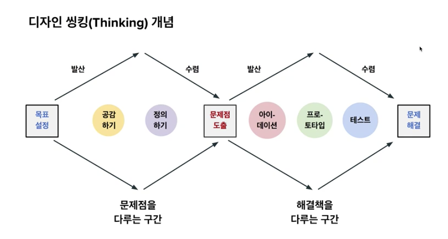
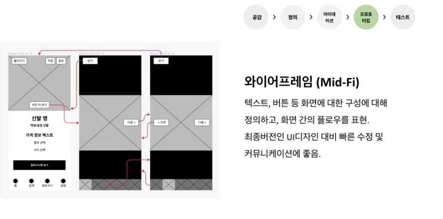
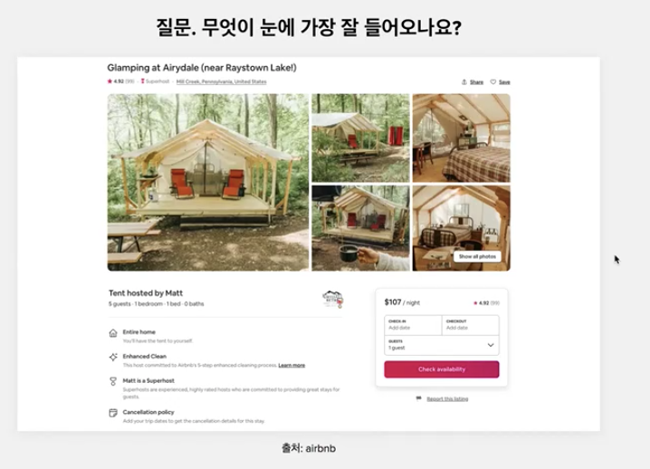
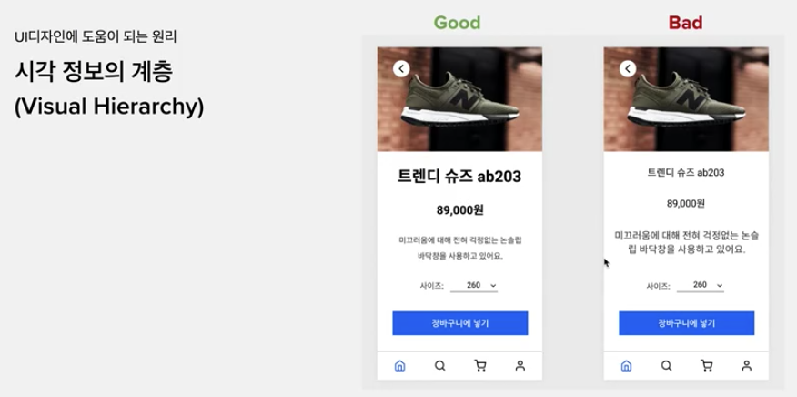
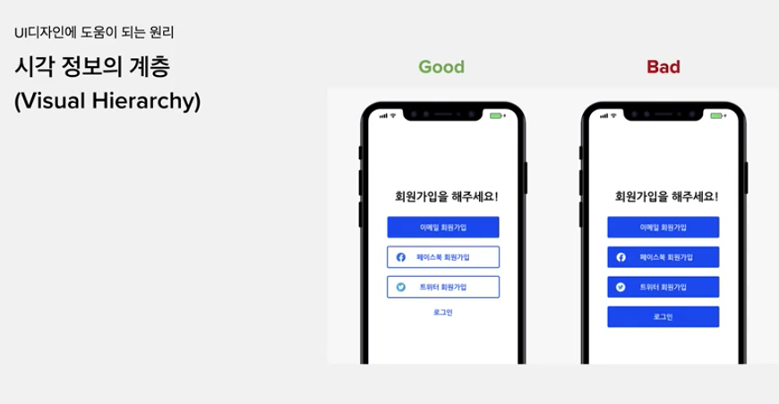

# 디자인 씽킹과 프로토타입
 - 주석
    - figma는 프로토타입 도구
      - 도구 그 이상 이하도 아니다. 
    - 중점은 왜 프로토타입 산출물을 만드는지에 대한 근본적인 이해
      - 이를 통해 figma 도구 활용 가능
    - 디자인 싱킹을 통해 프로토타입의 역할

## 디자인 씽킹(Thinking) 개념
 
 - 과정
   1. 목표 설정
        - 예시
          - 화면 전환율 높이기
          - 구매율 높이기
          - 회원 가입율 높이기
   2. 공감하기
        - 최대한 사용자에 대한 학습.
        - 사용자
            - 무슨 액션을 하는지
            - 어떤 니즈가 있는지
            - 어떤 문제를 가진지
        - 예시
            - 남성 신발 온라인 쇼핑몰 프로덕트
                - 신발과 관련된 사용자의 검색, 구매의 어려움 파악
   3. 정의하기
        - 공감 단계의 수집한 데이터를 통해 문제를 정의
        - 많은 문제 중 집중 할 문제에 대한 우선순위 정의
        - 한번에 모든 문제를 해결 할 수 없음
   4. 문제점 도출
   5. 아이-데이션
        - 정의된 문제를 해결 할수 있는 해결책 도출
        - 방식
          - 브레인스토밍, 아이디어 회의, ...etc
   6. 프로토-타입
        - 여러 아이디어를 다 출시까지 가져갈 수 없음
        - 리소스에 따라 아이데이션을 좁히고 사용자에게 테스트하기 위해 만드는 툴 (시제품)
        - 가설을 검증하기 위해 만듬
            - 사용자가 겪는 문제를 해결하는 지 테스트하기 위한 솔루션
   7. 테스트
       - 사용자 피드백 수집 후 반영 후 출시
       - 지속적인 사용자 피드백 수집 후 반영
   8. 문제해결
   
## 프로토타입 종류
 1. Lo-Fi (Low Fidelity)
 2. Mid-Fi (Mid Fidelity)
 3. Hi-Fi (High Fidelity)  
 - 주석
   - Lo-Fi에 가까울 수록, 수정 및 업데이트가 쉽고 적은 시간 소요

## 로우파이 프로토타입
 - (핸드) 스케치
   - 시각적 퀄리티가 높지 않아도 됨
 - 장점
   - 빠른 실행과 반복
   - 커뮤니케이션
     - (타직군) 동료 및 이해관계자 간
     - (아이디어 시각화를 통한) 상호 간 비대칭 정보 격차 해소
 - 팁
   -  (취업 용도의) 포트폴리오에 로우 파이 삽입 (어떻게 활용헀는지 증명)

## 미드파이 프로토타입
 
  - 와이어프레임
    - 설명
      - 텍스트, 버튼 등의 컴포넌트의 배치에 의한 면 구상 정의
      - 화면 간 플로우 표현
    - 장점
      - 최종 버전인 UI 디자인 대비 빠른 수정 및 빠른 커뮤니케이션에 효율적
      - UI와 관심사 분리 및 UX 그자체에 집중 가능
      - 만일 UI를 먼저 진행 시 UX에 대한 수정사항이 많아질 수 밖에 없음
        - 기능적인 수정이 많은 경우 많은 부분에 수정이 필요함
        - 최근 IT 테크회사는 빠른 개선은 중요한 포인트
    - 주석
      - 이미지의 빨간 선 : 워크 플로우  

## 하이파이 프로토타입
  - UI 디자인
  - 설명
      - 사용자가 실제로 사용하게 될 높은 퀄리티의 디자인 산출물
      - 색, 폰트 및 폰트 사이즈, 아이콘 등 세부 사항이 적용됨 
      - 사용자 테스트를 위해서 활용 또는 시각적인 완성도가 높은 경우 사용자 테스트 생략하고 출시 가능
  - 예시
    - 프로토 타이핑 (Prototyping)
        - 실제 개발 이전에 사용자 테스트 단계에서 사용자 피드백을 얻거나 내부 커뮤니케이션을 위해 제작
        - 시제품
        - 시뮬레이션 또는 샘플
        - 종류
            1. 스케치(로우 파이)
            2. 와이어프레임 (미드 파이)
            3. UI 디자인 (하이 파이)
            4. 프로토타이핑
                - 반드시 UI 디자인을 바탕으로하지 않는다.
                - 하이 파이가 아닌 와이어프레임, 스케치만으로도 피드백은 가능하다. 
            - 주석
              - 스케치에 가까울수록, 수정 및 업데이트에 대한 비용이 적고 시간 소요가 적음

## 핸드오프 (Hand-off)
 - 최종 디자인 산출물
 - 설명
     - UI디자인 완료 후, 실제품 개발을 위해 개발자(또는 이해관계자)에게 전달되는 디자인 산출물
     - 아이콘, 폰트를 포함하는 디자인 에셋, 컴포넌트, 좌표 등 (명확한 요구사항)

## 시각 계층
   
  - 질문 : 무엇이 눈에 가장 잘 들어오나요
  - 설계하고 디자인 하는 하는 작업자의 주요 관심사는 어떤 요소가 대한 가독성 및 중요도를 고려하고 디자인함
      - 참고
          - (쉬운 스캔성, 사용자 가이드 - 사용자가 정보 스캔 시 빠르게 정보 스캔 가능 및 기능의 중요도 표현)
  - UI 디자인
      - 시각 정보의 룰을 만들어주는 것
      - 더 중요한 정보와 덜 중요한 정보를 분류하여 디자인
  - 시각 정보 계층 (Visual Hierarchy)
      - === 우선순위 또는 중요도
          - 대상
              - 텍스트
              - 컬러
      - 핵심
          - 정보를 더 잘 드러나게 한다 
      - 예시 
          - 텍스트에 대한 h*, b, span, strong 등 존재
               
              - 크기 및 굵기, line-height 등
        - 포인트 컬러, 포인트 컬러가 아닌 여부에 따라 가이드
            
            - 팁
                - 포인트 컬러가 아닌 컬러는 포인트 컬러 대비 덜 드러나는 색을 활용
                - (시각 계층 1번째 예시 이미지는) 분홍색 외 회색 사용 중 
