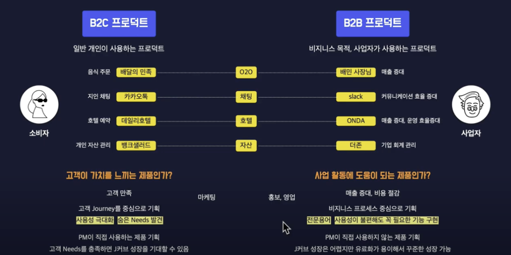

# B2C 프로덕트 기획 & B2B 프로덕트 기획

## 목적
 - B2B 프로덕트와 B2C 프로덕트에 대해서 
   - 특징
   - 차이점
   - 기획 시 주의사항

## 용어 정리
 - O2O 
    - Online To Online
 - PMF
    - Product Market Fit

## 주의사항
  - 서비스에 따라 B2B와 B2C를 혼합하는 방식도 존재
    - 예) 배민
        - B2C - 배달의 민족
        - B2B - 배민 사장님

## B2C 프로덕트	
  - 일반 소비자가 주로 사용하는 프로덕트
  - 고객이 가치를 느끼는 제품인가? 
    - PMF 충족
        - 프로덕트와 고객의 Needs가 일치 시 시장에서 생존 가능
  - 고객 만족이 가장 중요
  - 고객 여정을 중심으로 기획
    - 예) 배민
        - 고객이 사이트 방문 -> 상품 탐색 -> 구매 -> 이용 완료의 과정을 분할해서 고객 경험 최적화 및 숨은 Needs 발견
    - 고객 친숙한 용어
  - 리스크
    - 사용성이 안 좋은 경우 고객이 이탈하는 것에 대한 두려움
  - 고객 니즈를 파악 및 적절한 타이밍에 적절한 기능 제공
    - 어려운 점
        - 고객이 워낙 다양하고 고객의 목소리를 취합하는 게 어렵다
    - 해결법
        - 가설을 세우고 또 적용을 해본 다음 A/B 테스트 등으로 분석을 통해 피드백
  - PM이 직접 사용하는 제품 기획
    - 기획자 입장에서 흥미가 높다
  - 고객 Needs를 충족하면 J커브 성장을 기대 할 수 있다.
    - 시장이 워낙 크다.

## B2B 프로덕트
  - 비즈니스 목적으로 사업자가 주로 사용하는 프로덕트
  - 사업 활동에 도움이 되는 제품인가
    - 매출 증대, 비용 절감을 위해 비용을 지출하는 데 크게 망설이지 않는다. 
    - 비용 지출의 총합이 낮아지는 게 중요
  - 비즈니스 프로세스 중심으로 기획
    - 클라이언트가 이미 사업 활동을 하면서 비즈니스에 녹여진 프로세스가 존재
    - 새로운 것을 제공 시 혼란 가능성
    - 기획자는 비즈니스에 대한 이해가 기본
    - 전문 용어 사용
  - 사용성이 불편해도 꼭 필요한 기능 구현
    - 기능이 되는 여부가 더 중요
    - 사용성보다 기능의 우선순위가 높다.
    - 클라이언트는 비용을 직접 지불하는 기능이 필요한 사람이다.
 - 사업자의 의견이 중요
    - 기능 도입에 대한 고민은 사업자의 의견이 중요
 - PM이 직접 사용하지 않는 제품 기획
    - 흥미도가 B2C보다 떨어질 수 있다
 - 시장은 상대적으로 작다
    - J커브가 상대적으로 어렵다
    - 유료화 용이하기 때문에 지속적으로 성장 가능

## 참고
 - https://www.youtube.com/watch?v=KTGHPAe26CI&list=PLVaJwjxYqkULPliflQc2zkupv7XxQwfPw&index=26
