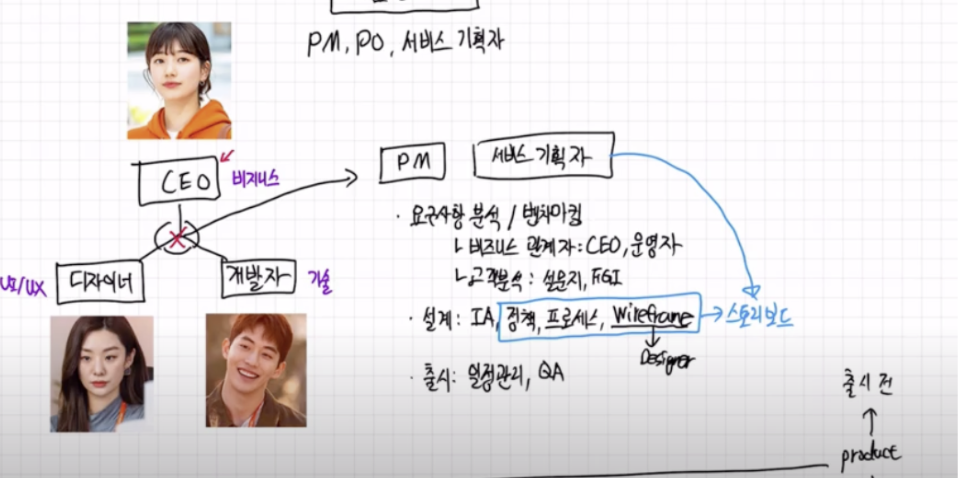
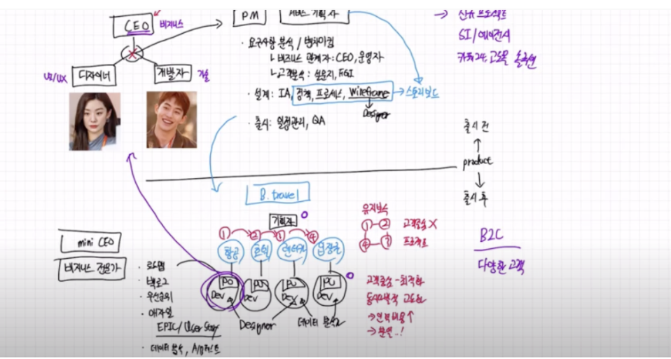

# IT 제품 관리자의 직무 구문 (프로덕트 오너, 프로덕트 매니저, 기획자)

## 제품 관리자 종류
 - PM, PO, 서비스 기획자

## (일반적인 IT) 초기스타트업
 1. 최소 필수 직군
    1. CEO
      - 비즈니스 의사결정
    2. 디자이너
      - UI/UX
    3. 개발자
      - 기술
 2. 여러 직군 사이에서 의사소통이 안되는 경우
    - PM, 서비스 기획자 필요!

## Product 출시 전 기획자 업무
  
 1. 요구사항 분석
    - 비즈니스 관계자, 운영자
 2. 고객분석
    1. 설문지
    2. FGI
 3. 벤치마킹
 4. 설계
    1. IA
    2. 정책
    3. 프로세스
    4. 와이어프레임
 5. 출시
    1. 일정관리
    2. QA

## Product 출시 후 기획자 업무
> 예시 : B.travel 사이트 런칭 가정
 
 1. 기능    
    - 항공, 호텔, 렌터카, 입장권
 2. 전통적인 기획 업무
    - 역활
        1. 모든 기능을 순환적으로 지속적인 유지보수
        2. 프로젝트 기반
        3. 설계 업무
    - 단점
        1. 고객중심 X
        2. 프로젝트 중심
    - 적합한 경우
        1. 신규 프로젝트
        2. B2B
        3. SI/에이전시
        4. 카페 24, 고도몰 솔루션
 3. 프로덕트 오너 제도
    1. 기능 별 팀 구성
        1. PO
            1. 제품 로드맵, 백로그 관리
            2. 우선순위
            3. 애자일 프로세스
                > EPIC과 User Story
            4. 데이터 분석
            5. A/B 테스트
            6.  프로덕트 기반 의사 결정
        2. 개발자
        3. 디자이너
            - 팀 소속 또는 객원 멤버
        4. 데이터 분석가
            - 팀소속 또는 객원 멤버
    2. 장점
        1. 고객 중심 사고 및 최적화
        2. 고객만족도 높음
        3. 동시다발적 고도화
    3. 단점
        1. 인력 비용이 높다
        2. 팀 화합이 안되는 경우 분열
    4. 적합한 경우
        1. B2C
        2. 다양한 고객
            - 예) 여행: 항공, 호텔, 렌터카
            - 예) 금융: 외환, 뱅킹, 대출

## 참고
 - https://www.youtube.com/watch?v=yHNbFSXc2nc&list=PLVaJwjxYqkUIaS0UeNF1DRuLJ9sIREMLl&index=21 시청 후 요약 정리