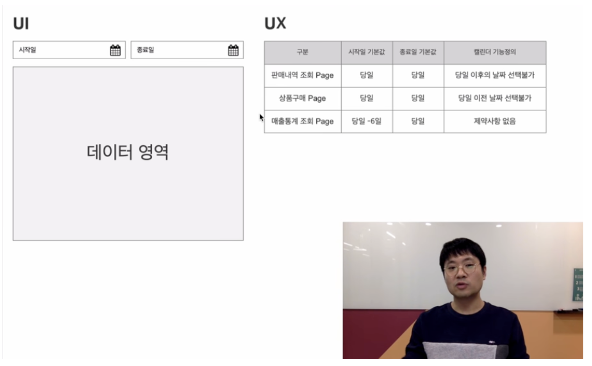

# UI는 같아도 UX는 다르다

## 목적
 - 눈에 보이는 UI는 같지만 실제 사용하는 UX는 다를 수 있다.
 - UX 사용성을 염두하고 기획의 이점

## 예시
 - 

## 참고
 - https://www.youtube.com/watch?v=_-vLFC6lWSM&list=PLVaJwjxYqkUIaS0UeNF1DRuLJ9sIREMLl 유투브 시청 후 작성