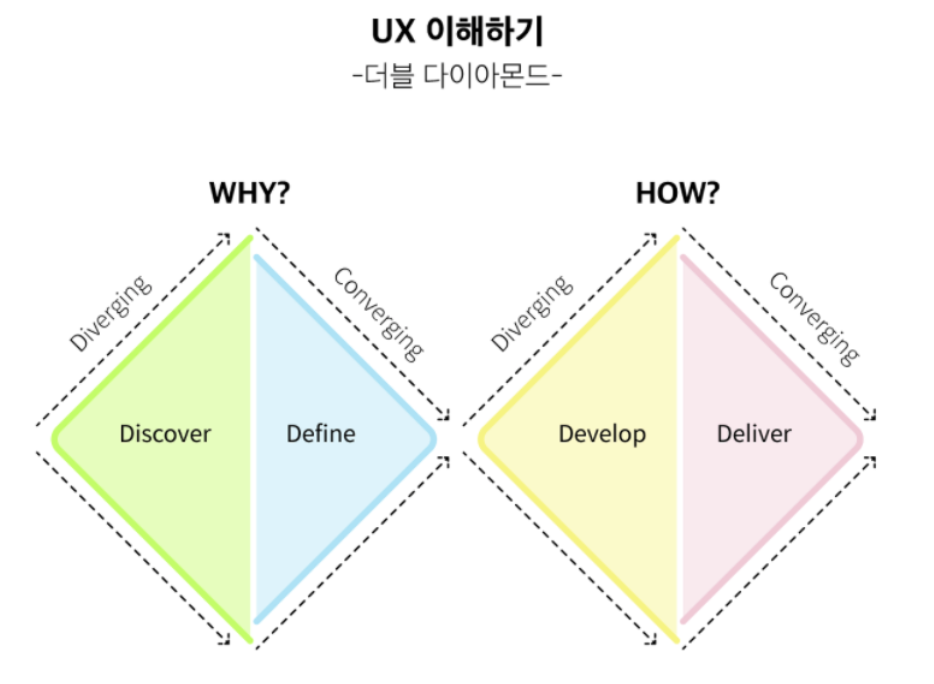
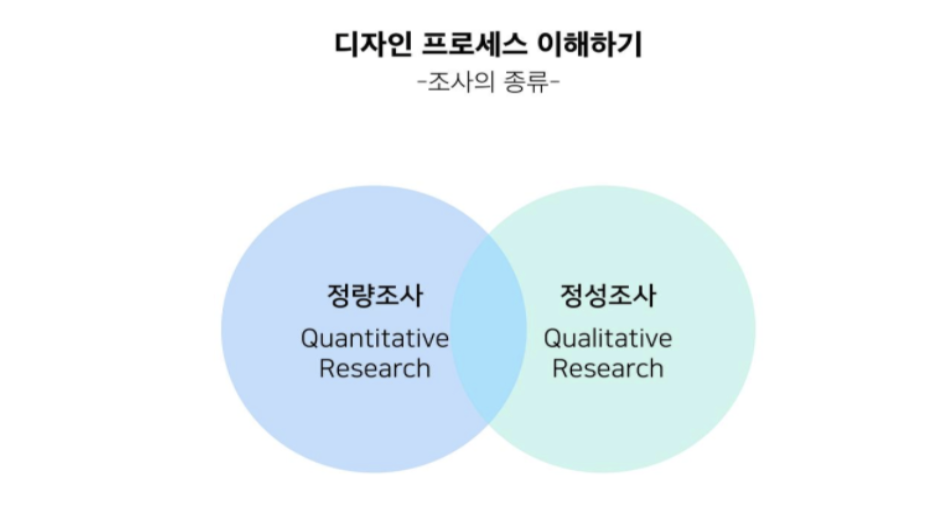

# UX 디자인 방법론

## 목적
 1. UX 디자인 프로세스에 대한 사고의 전반적인 흐름 정리
 2. 디자인 방법론을 상세히 다루는 것이 아닌 큰 흐름에 포함되어 있는 방법론들에 대한 간략한 설명과 순서를 중점

## 더블 다이아몬드
 
 1. 정의
    1. 대표적인 Design Thinking 모델
    2. 사고의 폭을 최대한 넓힌 뒤 거기에서 끌어낸 아이디어들을 하나로 좁혀나가는 것을 정리한 모델
 2. 상세 설명
    1. 문제를 정의하고 해결책을 만드는 두 과정이 하나의 점으로 시작해서 넓혀지고 좁혀지는 모습을 다이아몬드 두 개라고 해서 더블 다이아몬드
       > 아이디어를 내고 좁혀가는 발산 과정과 수렴 과정의 사고 흐름
 3. 왼쪽 다이아몬드
    1. 사용자의 문제를 찾고, 디자인으로 해결하는 문제를 정의하는 과정
    2. 문제를 탐색하고 정의하는 것에 집중하는 과정(Define 과정)이 포함
 4. 오른쪽 다이아몬드
    1. 이전에 찾은 문제를 해결할 솔루션을 탐색하고 솔루션을 만들어가는 과정
    2. 솔루션에 관한 아이디어를 만드는 Develop 과정
    3. Develop 과정을 정제하는 Deliver 과정
 5. 적용
    1. 이터레이터 반복
    2. 다음 이터레이터 시 이전 이터레이터의 피드백 반영

## 디자인 프로세스 과정
 - 문제의 정의 - 솔루션 정하기 - 솔루션 검증하기

## 문제의 정의
 1. 마주하는 문제
    1. 사용자가 서비스 혹은 제품을 어떻게 생각하는지
    2. 어떻게 사용하는지
    3. 무엇이 불편한지
    4. 어떠한 요구가 있는지
    5. 사용자들의 연령대는 어느 정도인지
    6. 어디에 사는지
    7. 그들이 사용하는 기계가 무엇인지
    8. …등등 
 2. 문제의 출처는 전체적인 사용자가 어떤 사람인지 파악해야 한다. 
    > 웹인 경우 웹 접근성과 같은 맥락
 3. 중요성
    - 사용자를 공감하고, 이해하고, 어떤 문제를 겪고 있는지 파악해야 더 좋은 서비스 혹은 제품을 만들 수 있다.
 4. 문제 정의법
     
    1. 사용자 리서치
        1. 종류 
            1. 정량 조사
                1. 목적
                    1. 수치로 표현되는 데이터를 뽑아내어 사용
                    2. 양적인 것을 조사
                 1. 방법
                     1. 대표적으로 설문조사
                 2. 장점
                     1. 양적인 데이터는 사고의 전반적인 흐름을 파악하고 사용자의 일반적인 의견을 확인한 뒤 이를 토대로 방향을 설정하는 것에 사용
                         - 의문
                             - 어떤 전반적인 흐름? 
                               - 답
                                 - 대세 파악(?)은 가능하다.
                 3. 단점
                     1. 사용자 개개인의 생각을 파악하는 것이 어렵다.
                     2. 구체적으로 사용자 개인이 어떠한 문제를 겪는지 파악하기 어렵다.
                     3. 다양한 이야기를 정리하는 데 시간이 오래 걸린다.
                     4. 의견이 실제 사용자 그룹 전체를 대변하는 이야기인지 파악이 어렵다.
                 4. 보완
                     1. 정성조사 병행
         1. 정성조사
            1. 목적
                1. 사용자 개개인 의견을 파악하는 데 용이한 방법
            2. 방법
                1. 보통 1:1 또는 1:다수 사용자와 대화하는 방식
                    - 종류
                        1. 사용자 인터뷰
                        2. 관찰조사
            3. 사용자 인터뷰
                - 준비
                    1. 어떤 사용자에게 인터뷰
                    2. 인터뷰 질문 사전 작성
            4. 관찰조사
                - 정의
                    1. 제품 또는 서비스를 사용하는 사용자의 행동을 관찰
                    2. 인터뷰어가 관찰하면서 진행하거나, 사용자가 기록하는 방식으로 진행
 5. 도구
    1. Define
        1. 더블 다이어몬드의 과정 중 하나
        2. 리서치가 끝난 후 뽑아낸 데이터를 정리하고 좁혀나가는 과정
    2. Clustering
        1. 비슷한 데이터끼리 묶고 이름을 붙이고, 중요도에 따라 정리하고 좁히는 과정의 반복
        2. Journey map 사용자 여정
        3. Persona
            1. 사용자를 대변할 수 있는 가상의 인물
            2. 사용자 여정을 수행하는 행위자 
    3. 도구 활용
        1. 가상의 인물이 제품 혹은 서비스를 사용하는 과정을 그려보는 사용자 여정 지도
        2. 사용자 여정 중 불편하거나 많은 노력을 필요로 하는 지점을 확인하고 그려내는 사용자 시나리오 작성
    4. 결과
        1. 사용자가 어떻게 느끼는지 파악
        2. 사용자가 어떻게 제품 혹은 서비스를 사용하고 있는지 파악
        3. 해결해야 하는 사용자의 문제가 무엇인지 파악

## 솔루션 만들기
 1. Sketch
    - 단계별 처리방법
        1. 종이에 직접 그리기 
        2. 포토샵, 일러스트, XD, 스케치와 같은 툴 사용
 2. 프로토 타이핑
    1. 목적
        1. 실제 완성된 제품 혹은 서비스가 어떤 식으로 보이는지 파악
        2. 사용자에게 주는 전체적인 느낌이 어떠한지 빠르게 구현하는 UX 디자인의 검증 방법 중 효과적인 방법
    2. 주의사항
        1. 솔루션을 다루는 프로세스는 실제 디자인 툴을 다루는 방법도 알아야 한다. 즉 프로세스 검증의 방법들을 아는 것만으로 결과물을 만들 순 없다.

## 솔루션 검증하기
 1. 방법
    - 사용자 테스트 User Test
 2. 목적
    1. 디자인하고 정의한 솔루션이 앞에서 정리하고 확인한 사용자 문제를 직접, 간접적으로 해결하는지를 확인을 통해서 우리가 올바른 문제를 정의했는지 확인하는 과정
    2. 여러 가지 디자인 중 어떠한 디자인이 좋은지 판단을 위한 데이터 산출
 3. 설명
    1. 테스트에서 빠르게 유저 피드백을 받으며 사용자 의견을 반영하여 사용자 문제를 해결하는 것이 핵심
    2. 제품 혹은 서비스 형태와 현재 디자인하고 있는 솔루션의 디자인 형태에 따라 다르게 진행
    3. 보통 검증하고 싶은 기능이 구현된 프로토타이핑을 사용하여 사용자가 직접 사용
 4. 종류
    1. Think Aloud
        1. 목적
            - 스마트폰 화면이나, 사용자가 서비스 혹은 제품을 사용하는 장면 등을 녹화하고, 사용자에게 어떤 생각을 하는지 밖으로 표출하도록 요구를 파악
        2. 방식
            - 스마트폰 화면, 사용자가 서비스 혹은 제품을 사용하는 장면 등을 녹화
        3. 참고
            - https://www.plant-corp.com/job-intro 소비자 시선추적조사
    2. A/B Test
        1. 목적
            - 두 가지의 프로토타입을 만든 후 사용자가 모두 사용한 이후 어느 것이 우리가 정한 목표를 달성하는데 도움이 되는지 확인

## 참고
 - https://brunch.co.kr/@rladudrl305/8 내용 정리
