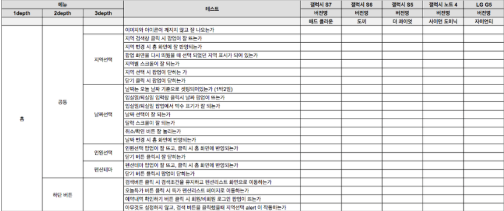

# 서비스 검수 시나리오 (테스트 시나리오)

## 정의
 - 검수 항목을 사전에 계획하여 시나리오 형태로 만든 것
 - 서비스를 보다 정확하게 검수하기 위해 작성한 문서
## 상세 
  
  - 작성자
    - 전문 QC팀 (존재 시)
    - 기획자(유력) 또는 개발자
  - 좋은 검수 시나리오
    - 검수 시나리오는 정교함과 세밀함이 서비스 품질에 즉각 영향을 미친다.
    - 기획자는 서비스 설계 과정에서 메뉴 구조, 화면 UI, 플로차트 등의 작성을 통해 서비스에 대한 모든 케이스를 이해하고 있기 때문에, 기획자가 전반적인 시나리오를 작성한다
    - 개발자가 요구하는 기능적인 시나리오를 덧붙이면 보다 완벽한 검수 시나리오를 만들 수 있다.
    - 기타
        - 지원하는 웹 브라우저 당 지원이 필요한 브라우저 버전 별 별도 검수 항목으로 추가 필요
## 기타
  - 일부 기업은 검수 시나리오 없이 무작위 테스트 진행
    - 장점
        - 다양한 케이스에 대한 검수
        - 코너 케이스 검출 가능성 존재
    - 단점
        - 주요 테스트를 놓칠 가능성 존재
        - 검수자가 불성실한 경우 검사 정확도가 감소
    - 해결
        - 테스트 이전에 검수 시나리오 작성 권장

## 의문
  - 브라우저 자동화 테스트 방식을 통해서 브라우저 호환성 검사는 가능한걸까?
  - 엑셀보다 웹으로 구현된 테스팅 프로덕트가 더 효율적이지 않을까? 
    - 답
      - 보통 비주얼 베이직을 excel에 녹여서 잘 사용 함
      - 단 10명 이상부터는 웹으로 구현된 테스팅 프로덕트가 더 효율적
            - doors requirements 참고

# 참고
 - https://yslab.kr/103?category=180159 시청 후 작성