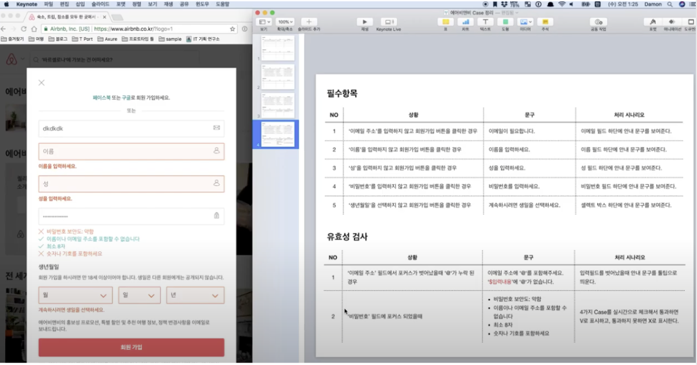

# 유효성 검사 (validation) 정책 정하기

## 목적
  - 유효성 검사 정책을 문서로 정리하는 노하우 정리
## worst case
  - 개발자에게 “”알아서 해주세요"로 위임하는 경우
     - 아쉽게도 나쁜 결과가 발생한 경우
        - 친절하지 않은 안내 문구 
        - 필수정보 누락
        - 원하는 포맷 대로 정보를 출력하지 않음
## 예시
  - airBnb 회원가입
    

    - 추가 설명
        - 유효성 문장은 목적당 1개가 적당
        - 디자인 시스템의 컴포넌트를 처리 시나리오에 기입하면 더 좋다.
        - ‘$입력내용' 을 통해 정규식(?)화 

 
## 참고
 - https://www.youtube.com/watch?v=MyZ1OR0hBjc&list=PLVaJwjxYqkUIaS0UeNF1DRuLJ9sIREMLl&index=2 유투브 시청 후 작성

## 같이보면 좋은 자료
 - 도서 - 처음부터 다시배우는 웹 기획
https://book.naver.com/bookdb/book_detail.nhn?bid=10794700

 - 페이스북 - 웹/모바일 기획자 그룹
https://www.facebook.com/groups/WMPGS

 - 블로그 - IT 기획연구소
http://yslab.kr
