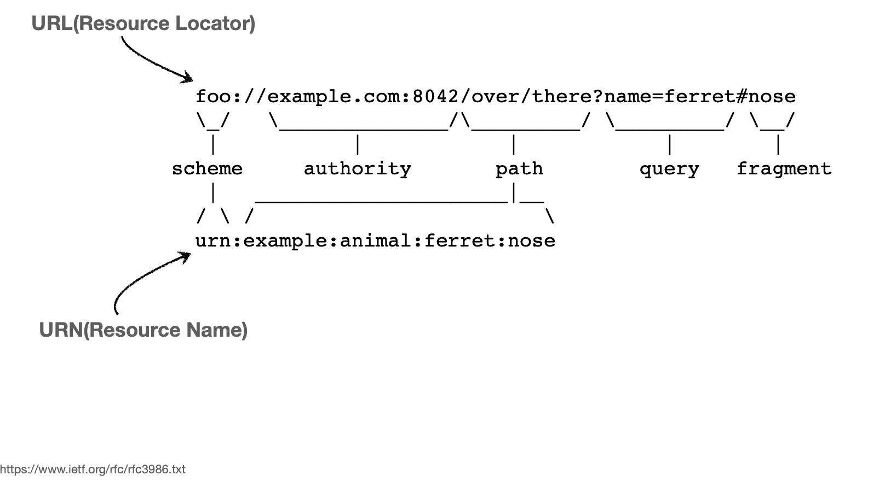

# URI
 - 단어 뜻
    1. Uniform
         - 리소스 식별하는 통일된 방식
    2. Resource
         - 자원, URI로 식별할 수 있는 모든 것(제한 없음)
         - 예시
           1. HTML 파일
           2. png 파일
    3. Identifier
         - 다른 항목과 구분하는 데 필요한 정보
   - 분류
    1. URL
         - Uniform Resource Locator
         - 리소스의 위치
    2. URN
         - Resource Name
         - 리소스에 이름을 부여
         - 이름은 불변
         - 예시
           -  urn:isbn:8960777331 (어떤 책의 isbn URN)
   - 예시
    
     - URN
       - 고정 (유연한 활용 불가능)
       - 거의 안 쓰임
     - URL
       - 실제로 많이 쓰임
   - 참고
    - https://www.ietf.org/rfc/rfc3986.txt
      - 1.1.3 URI, URL, and URN

## URL 전체 문법
 1. 포맷
    - `sheme://[userinfo@]host[:port][/path][?query][#fragment]`
    - 예시
      - https://www.google.com:443/search?q=hello&hl=ko 
 2. 상세 정보
     1. scheme
       - 주로 프로토콜에 사용
     2. userInfo
       - URL에 상요자정보를 포함해서 인증
     3. host 
          - 호스트명
          - 도메인명 또는 IP 주소를 직접 입력
     4. port 
       - 접속 포트
     5. path
       - 리소스가 있는 경로
       - 계층적 구조
           - 의문
             - 장점?
             - 단점?
             - 필수?
       - 예시
           - /home/file1.jpg
           - /members
           - /members/100
           - /items/iphone12
      1. query
        1. alias
          - query parameter
          - query string
         2. 용도
             - 웹서버에 제공하는 파라미터 
         3. 규칙
             - key=value 형태
             - ?로 시작, &로 추가 가능
               - 에시
                 - ?keyA=valueA&keyB=valueB
             - 문자열 형태
     6. fragment
        1. 예시
            - https://docs.spring.io/sptring-boot/docs/current/refrerence/html/getting-started.html#getting-started-introducing-spring-boot
        2. 용도
            - html 내부 북마크 등에 쓰임
            - 서버에 전송하는 정보가 아님
 
 ## 프로토콜
 1. 정의
      - 자원 접근 방식의 규약
 2. 예시
     1. http
         - 특징
           - 80 포트
           - 포트 생략 가능
     2. https
           - 443 포트
              - 포트 생략 가능
           - http에 보안 추가 (HTTP Sequre)
     3. ftp
     4. ...etc

## 웹 브라우저 요청 흐름
 - 경로 예시:  https://www.google.com/search?q=hello&hl=ko
 - 과정
    1. DNS 조회
        - www.google.com:443의 IP 주소 조회 (200.200.200.2로 가정) 
    2. HTTP 요청 메시지 생성
        - 포멧
             ``` 
               GET /search?q=hello&hl=ko HTTP/1.1 Host:www.google.com
             ```
    3. http 메시지 전송 (애플리케이션 To 네트워크 인터페이스)
         - 과정
             1. 웹 브라우저에서 HTTP 메시지 생성
             2. SOCKET 라이브러리를 통해 OS에게 전달
                   - A: TCP/IP 연결(IP, PORT)
                       - 3 way handshake 과정
                   - B: 데이터 전달
             3. TCP/IP 패킷 생성
                   - HTTP 요청 메시지 포함
    4. Client To Server
    5. 요청 패킷 도착(To 서버)
    6. 서버에서 요청 수신
    7. HTTP 응답 메시지 생성
        - 포멧 (높은 추상화 레벨 예시)
          ```
            HTTP/1.1 200 OK
            Content-Type:text/html;charset=UTF-8
            Content-Length:3423

            <html>
              <body> ... </body>
            </html>
          ```
            - 200 OK: 응답 메시지, 정상 
            - Content-Type : content 형식
            - Content-Length : content 길이
    8. HTTP 응답 메시지를 Client에게 전달
    9. Client에서 응답 수신
    10. HTML 랜더링

## 참고 
 - https://www.inflearn.com/course/http-%EC%9B%B9-%EB%84%A4%ED%8A%B8%EC%9B%8C%ED%81%AC/lecture/61357?tab=curriculum&volume=0.12&quality=auto
  

## 추가 책
 - 성공과 실패를 결정하는 1% 네트워크 원리