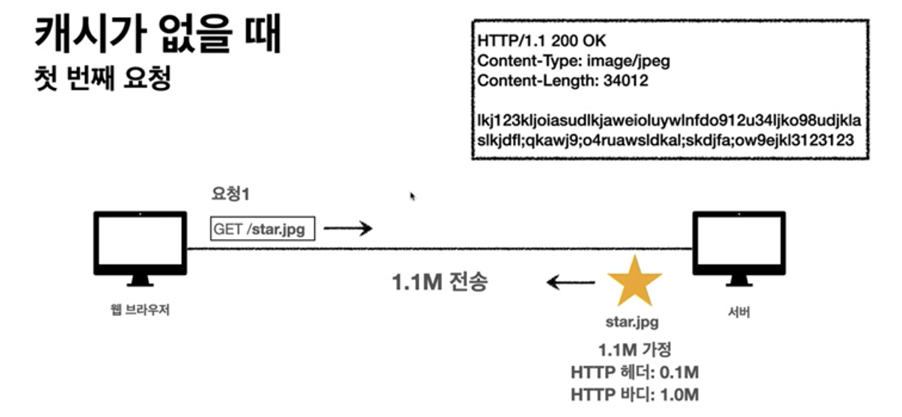
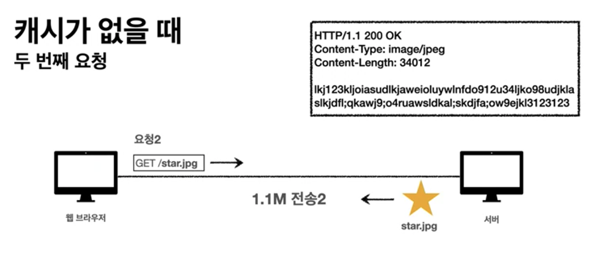
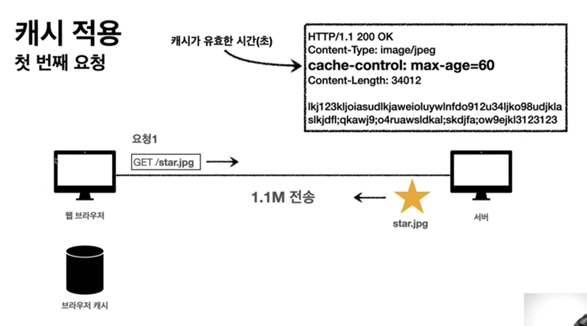
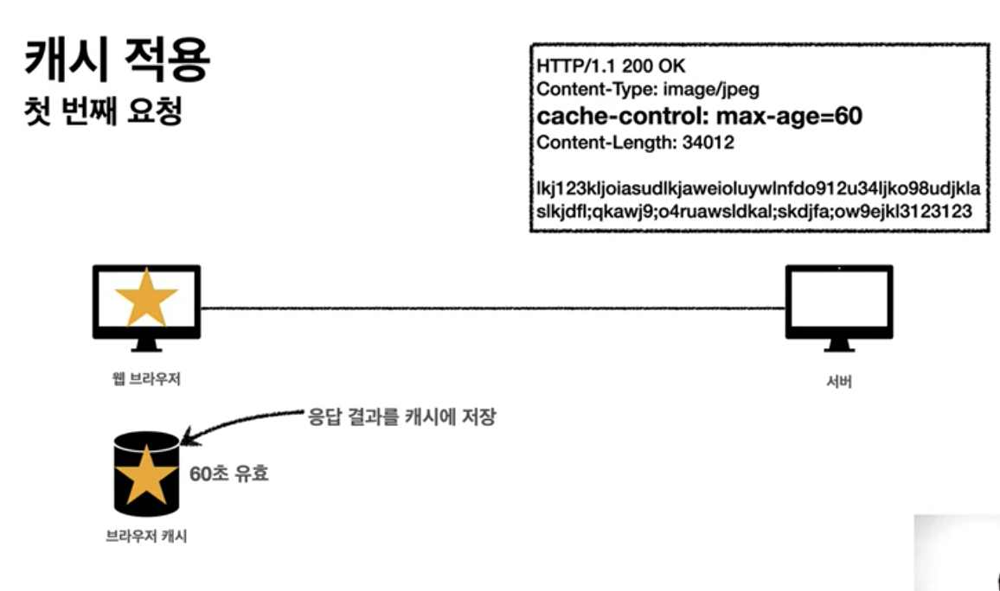
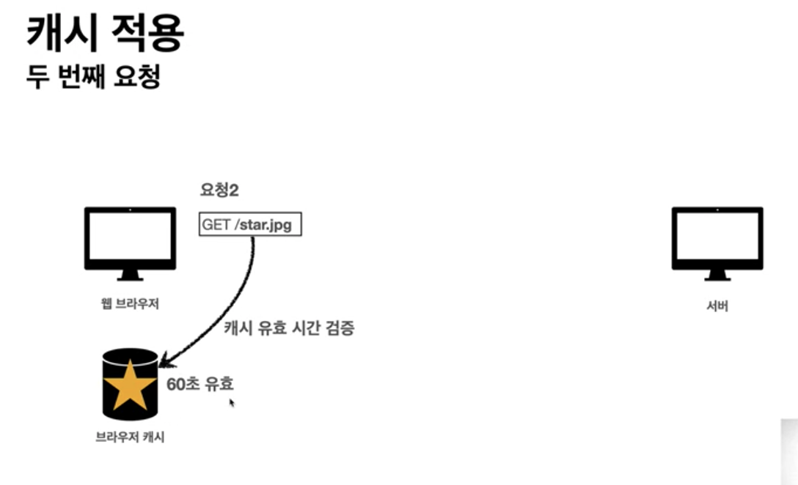
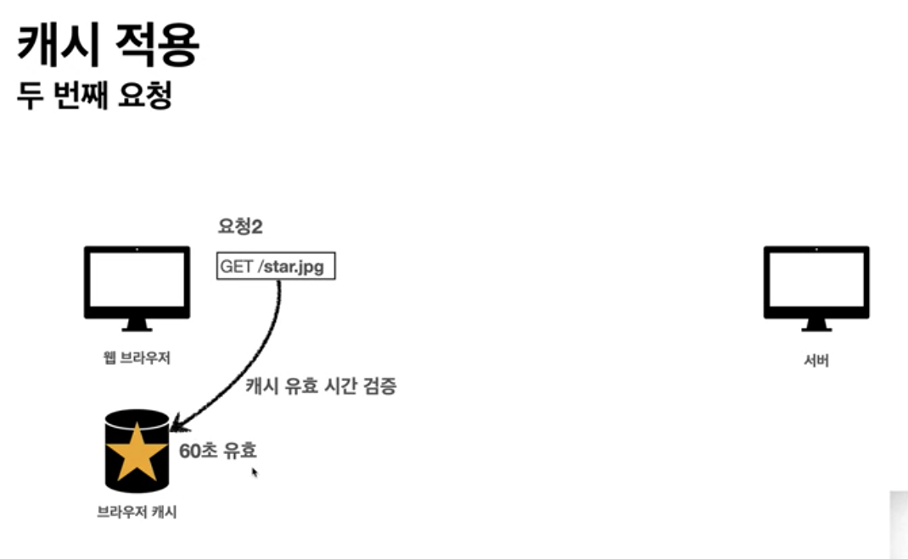
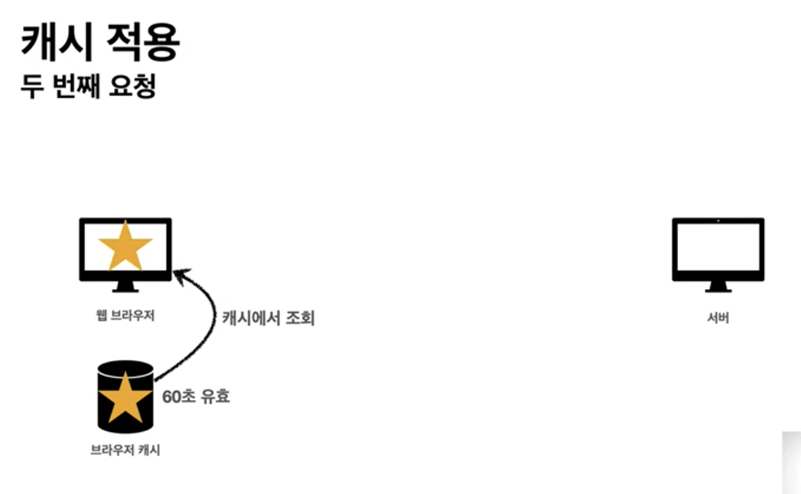
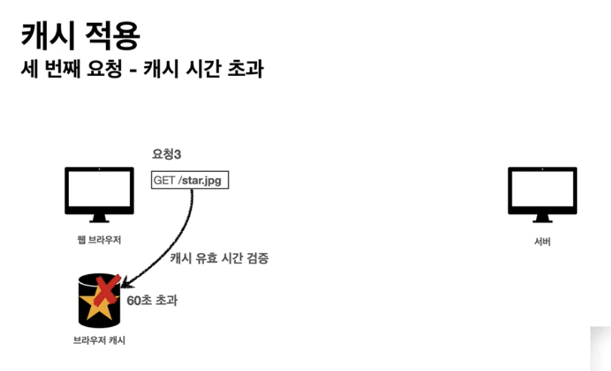
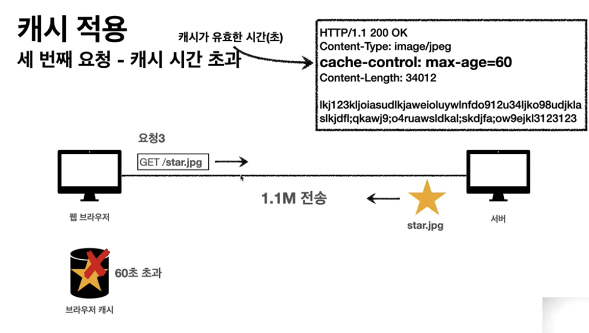
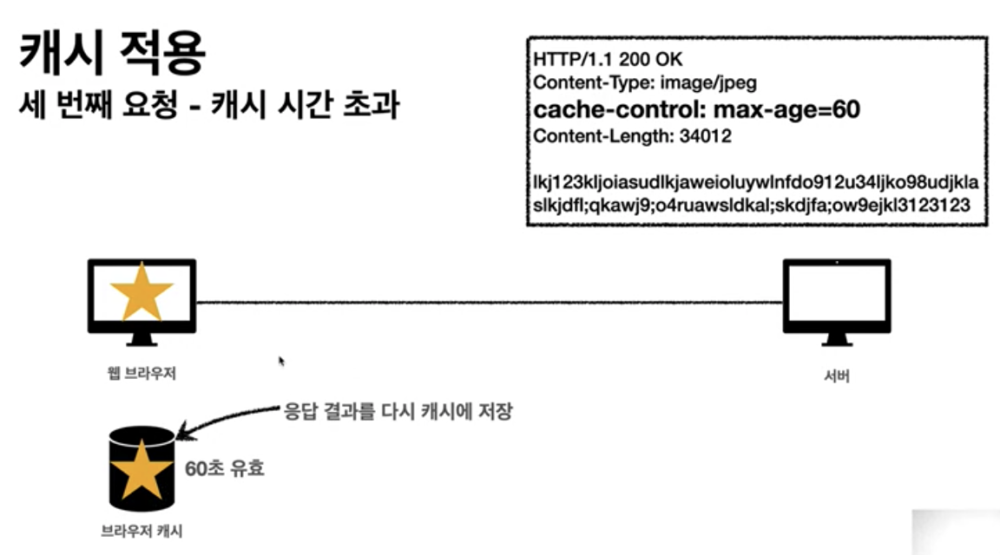

# HTTP cache header
 - 캐시와 조건부 요청

## 캐시가 없을 때 
 -  
 - 
 - 문제점
    1. 데이터가 변경되지 않아도 계속 네트워크를 통해서 데이터를 다운로드 받아야 함
    2. 인터넷 네트워크는 하드디스크에 비해서 상대적으로 매우 느리고 비용이 높음
    3. 브라우저 로딩 속도가 느려짐
    4. 느린 사용자 경험

## 캐시 적용
 - 
   - 의문
     - cache-control: max-age=60 에서 초단위 말고 만료일 기입 가능?
 - 
 - 
 - 
 - 
 - 효과
    1. 캐시에 의해서 캐시 가능 시간 동안 네트워크 자원 및 서버 자원을 사용하지 않음
    2. 하드 디스크에 비해 상대적으로 느리고 비싼 네트워크 사용량을 줄일 수 있음
    3. 브라우저 로딩 속도가 빨라짐
    4. 빠른 사용자 경험

## 캐시 적용 - 캐시 시간 초과
 - 
 - 
 - 
 - 동작
    1. 캐시 유효 시간이 초과 시, 서버를 통해 데이터를 다시 조회하고, 캐시를 갱신한다. (네트워크 다운로드 발생을 통한 갱신)
 - 의문
    - 유료 콘텐츠의 경우에, 플랫폼 회사에서 유료 콘텐츠에 대해서 캐시를 적용할까? chrome 개발자 도구를 통해 확인해보자
    - 캐시 시간 초과 후 다시 다운로드 받는 데이터가 이전 캐시와 동일한 데이터인 경우에 꼭 다시 다운받아야 할까?

## 참고
 - https://www.inflearn.com/course/http-%EC%9B%B9-%EB%84%A4%ED%8A%B8%EC%9B%8C%ED%81%AC/lecture/61383?tab=curriculum&volume=0.07