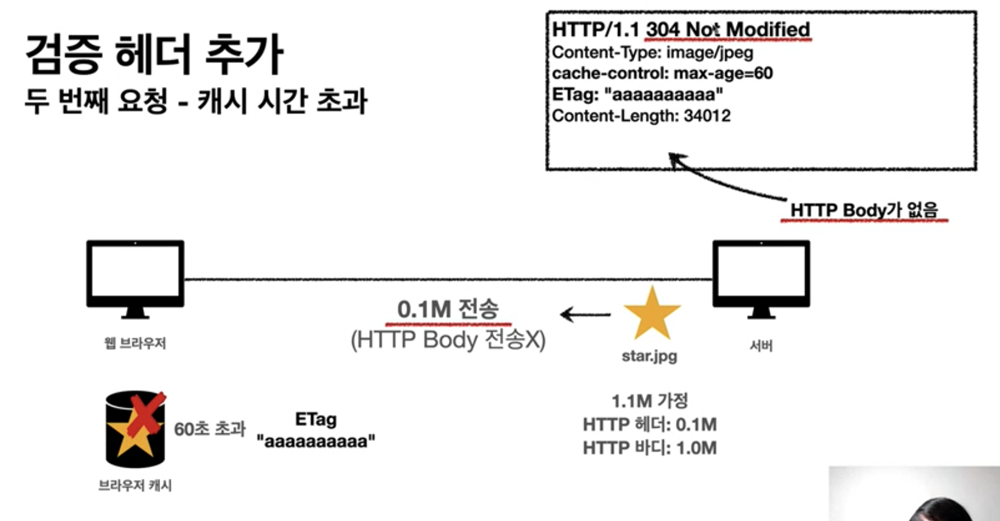

# HTTP cache header
 - 캐시와 조건부 요청

## 캐시가 없을 때 
 -  
 - 
 - 문제점
    1. 데이터가 변경되지 않아도 계속 네트워크를 통해서 데이터를 다운로드 받아야 함
    2. 인터넷 네트워크는 하드디스크에 비해서 상대적으로 매우 느리고 비용이 높음
    3. 브라우저 로딩 속도가 느려짐
    4. 느린 사용자 경험

## 캐시 적용
 - 
   - 의문
     - cache-control: max-age=60 에서 초단위 말고 만료일 기입 가능?
 - 
 - 
 - 
 - 
 - 효과
    1. 캐시에 의해서 캐시 가능 시간 동안 네트워크 자원 및 서버 자원을 사용하지 않음
    2. 하드 디스크에 비해 상대적으로 느리고 비싼 네트워크 사용량을 줄일 수 있음
    3. 브라우저 로딩 속도가 빨라짐
    4. 빠른 사용자 경험

## 캐시 적용 - 캐시 시간 초과
 - 
 - 
 - 
 - 동작
    1. 캐시 유효 시간이 초과 시, 서버를 통해 데이터를 다시 조회하고, 캐시를 갱신한다. (네트워크 다운로드 발생을 통한 갱신)
 - 의문
    - 유료 콘텐츠의 경우에, 플랫폼 회사에서 유료 콘텐츠에 대해서 캐시를 적용할까? chrome 개발자 도구를 통해 확인해보자
    - 캐시 시간 초과 후 다시 다운로드 받는 데이터가 이전 캐시와 동일한 데이터인 경우에 꼭 다시 다운받아야 할까?
      - 답: 아래 검증 헤더와 조건부 요청 섹션 참고

## 캐시 시간 초과
 - 캐시 유효 시간이 초과 시, 서버에 다시 요청하면 다음 두 가지 상황이 존재   
    1. 서버에서 기존 데이터를 변경한 경우
    2. 서버에서 기존 데이터를 변경하지 않은 경우
       - 캐시 만료 후에도 서버에서 데이터를 변경하지 않음
       - 데이터를 전송하는 대신에 저장된 캐시를 재사용할 수 있다.
       - 단, 클라이언트의 데이터와 서버의 데이터가 같다는 사실 확인이 필요 
         - 검증 헤더를 통해 해결

## 검증 헤더
 - 캐시 데이터와 서버 데이터가 같은지 검증하는 데이터
 - Last-Modified, ETag

## 조건부 요청 헤더
 - 검증 헤더로 조건에 따른 분기
 - If-Modified-Since: Last-Modified 사용
 - If-None-Match: ETag 사용
 - 조건이 만족하면 200 OK
 - 조건이 만족하식 않는 경우 304 NOT Modified

## Last-Modified와 Last-Modified를 사용한 조건부 요청 헤더
 - 
     - 의문
         - cache-control과 Last-Modified는 클라이언트 요청 헤더에서만 사용이 가능? 또는 서버 응답에서도 사용 가능?
 -  
 - 
 - 
 - 
    - 데이터 최종 수정을 통해서 서버가 데이터가 아직 수정되지 않음을 파악 가능
- 
    - 서버에서 클라이언트에서 요청한 캐시 만료 데이터가 서버에서도 아직 데이터가 수정되지 않음을 알림
    - HTTP Body가 없음 (HTTP 헤더만 전송)
- 
    - 클라이언트는 cache가 유효함을 확인 후 다시 cache-control 재설정
- 
- 주석
  - 브라우저가 cache-control에 의해 유효하지 않은 데이터도 바로 삭제하지 않고 계속 보관함 
 - 요약
    - If-Modified-Since: 이후에 데이터가 수정되었다면?
        1. 데이터 미변경 예시
            - 캐시: 2020년 11월 10일 10:00:00 vs 서버 2020년 11월 10일 10:00:00
            - *304 Not Modified*, 헤더 데이터만 전송(Body 미포함)
              - 3xx은 Redirection 처리, 너의 cache로 redirection 
            - 전송 용량 감소 효과
        2. 데이터 변경 예시
            - 캐시: 2020년 11월 10일 10:00:00 vs 서버 2020년 11월 10일 11:00:00
            - *200 OK*, 모든 데이터 전송(Body 포함)
            - 클라이언트 요청에 대한 서버에서 200 응답 (HTTP data 전송)

## Last-Modified, If-Modified-Since 단점
 1. 1초 미만(0.x초) 단위로 캐시 조정이 불가능
    - 의문
        - 1초 미만으로 캐시 하는 실제 예시는?
 2. 날짜 기반 로직 사용
   - 데이터를 여러 번 수정 시 수정 시마다 날짜가 다르지만, 만약 10번 수정했다고 가정한다면, 처음 수정과 마지막 수정의 결과가 같아진다고 해도 10번의 Last-Modifed 사용됨.
   - 의문
     - 날짜 방식 말고 update count 방식으로 cache 처리 불가능? => ETag, If-None-Match 적용
 3. 서버에서 별도의 캐시 로직을 관리하고 싶은 경우
  - 예) 스페이스나, 주석처럼 크게 영향이 없는 변경에서 캐시를 유지하고 싶은 경우
  - 해결법
    - 서버에서 cache 매커니즘 관리하면 됨 => ETag, If-None-Match 적용

## ETag, If-None-match
 - 
 - 
 - 
 - 
 - 
 - 
 - 
 - ETag (Entity Tag)
 - 서버에서 캐시용 데이터에 임의의 고유한 버전 이름을 부착 (**캐시 제어 로직을 서버에서 완전히 관리**)
 - 클라이언트는 단순히 이 값을 서버에 제공(클라이언트는 캐시 제어 로직에 대해서 알 수 없음. 클라이언트 입장에서 블랙박스)
 - 데이터가 변경되면 서버에서 태그 명을 바꾸어서 변경함 (data를 source로 하는 Hash 값 재생성)
   - 예) ETag: 'aaaaaa' => ETag: 'bbbbbb'
 - ETag 포맷 예시 
    -  "v1.0"
    -  "abbbbb1"
 - 예시
  1. 서버는 베타 오픈 기간인 3일 동안 파일이 변경되어도 ETag를 동일하게 유지 (억지 예시)
  2. 애플리케이션 배포 주기에 맞추어 ETag 모두 갱신 (충분히 가능한 예시)
         
## 캐시 제어 헤더
 - Cache-Control : 캐시 제어
 - Pragma: 캐시 제어(하위 호환)
 - Expires: 캐시 유효 기간(하위 호환)

## Cache-Control
 - 캐시 지시어(directives)
 - Pragma 및 Expires 상위 호환(굳이 Pragma, Expires 사용할 필요가 없음)
 - Cache-Control: max-age
     - 캐시 유효 시간, 초 단위
 - Cache-Control: no-cache
     - 데이터는 캐시해도 되지만, 항상 원(Origin, cache 또는 프록시 등 경유 서버가 아닌) 서버에 검증하고 사용
          - If-Modified-Since, If-Not-Match을 통한 조건부 요청을 클라이언트가 서버에게 검증 요청 해야만 한다.
 - Cache-Control: no-store
   - 데이터에 민감한 정보가 있으므로 저장하면 안됨 (하드 디스크에서 저장 하지 않고, 메모리에서만 사용하고 최대한 빨리 삭제)
 - Cache-Control: public
   - 응답이 public 캐시에 저장되어도 됨
   - 의문
     - public에 데이터 캐시 처리하는 과정은? 서버에서 프록시 서버로 캐시 대상 데이터를 밀어 넣은 후 redirect 응답을 통해 프록시 서버의 캐시 데이터를 재 다운로드 처리를 할까? 근데 데이터를 밀어넣는 시간이 오래 걸리면 클라이언트 요청에 대한 응답이 느려질 수도 있다.
 - Cache-Control: private
   - 응답이 해당 사용자만을 위함. private 캐시에 저장해야 함(기본 값)
 - Cache-Control: s-maxage
   - 프록시 캐시에만 적용되는 max-age
   - 의문
     - 프록시 캐시 서버의 cache된 데이터가 여러 유저에 대한 값인경우 한 클라이언트의 max-age에 대해서 어떻게 처리할까? (프록시 서버에 대한 개념이 아직 제대로 안 잡힌듯) 
 - Age: 60 (HTTP 헤더)
   - 오리진 서버에서 응답 후 프록시 캐시 내에 머문 시간(초) 

## 

## Pragma
 - 캐시 제어(하위 호환)
 - Pragma: no-cache
 - HTTP 1.0 하위 호환

## Expires
 - 캐시 만료일 지정(하위 호환)
 - expires: Mon, Jan 1990 00:00:00 GMT
 - 캐시 만료일을 정확한 날짜로 지정
 - HTTP 1.0 부터 사용
 - 지금은 더 유연한 Cache-Control: max 권장
 - Cache-Control: max와 함께 사용 시, Expires는 무시됨
 - 의문
   - 직접 expires로 만료일 명시하는 게 좋지 않은가? 왜 굳이 cache-control을 초단위로 할까?
     - 답: cache-control이 더 쉬운 사용성

## 검증 헤더 (Validator)
 - 종류
    1. ETag
    2. Last-Modified

 - 조건부 요청 헤더
    1. If-Match, If-None-Match: Etag 값 사용
    2. If-Modified, If-Unmodified-Since : Last-Modified 값 사용

## 프록시 캐시 
 - 
 - 주석
     - 빛도 1초에 지구를 7바퀴 정도 왕복함
 - 
   - 참고
     - cloud front
     - CDN 서비스
 - 
   - 최초의 유저는 cache가 없어서 느릴 수 있다.
   - 또는 원 서버에서 프록시 캐시에 데이터를 cache 처리하는 경우도 있다.
 - 의문
   - 어떻게 원 서버 주소를 통해 데이터 요청 시 프록시 서버를 먼저 거치는 과정을 만들 수 있을까? 
## 참고
 - https://www.inflearn.com/course/http-%EC%9B%B9-%EB%84%A4%ED%8A%B8%EC%9B%8C%ED%81%AC/lecture/61383?tab=curriculum&volume=0.07