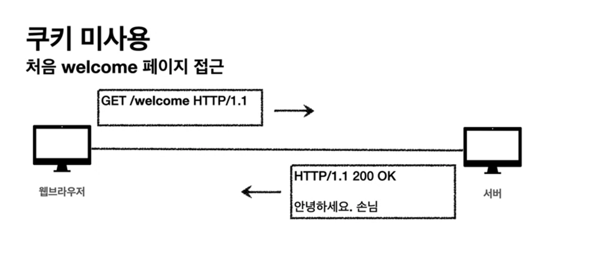
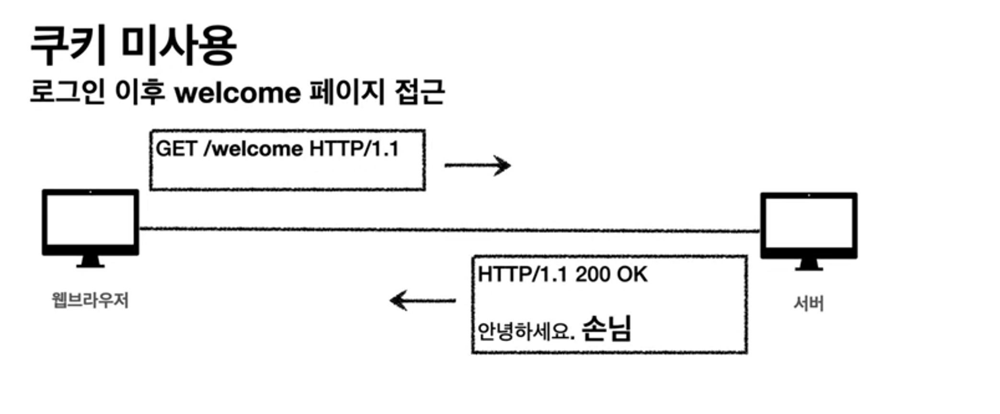
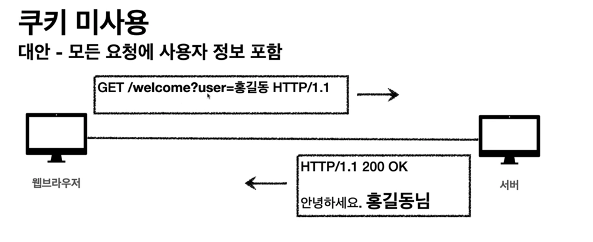
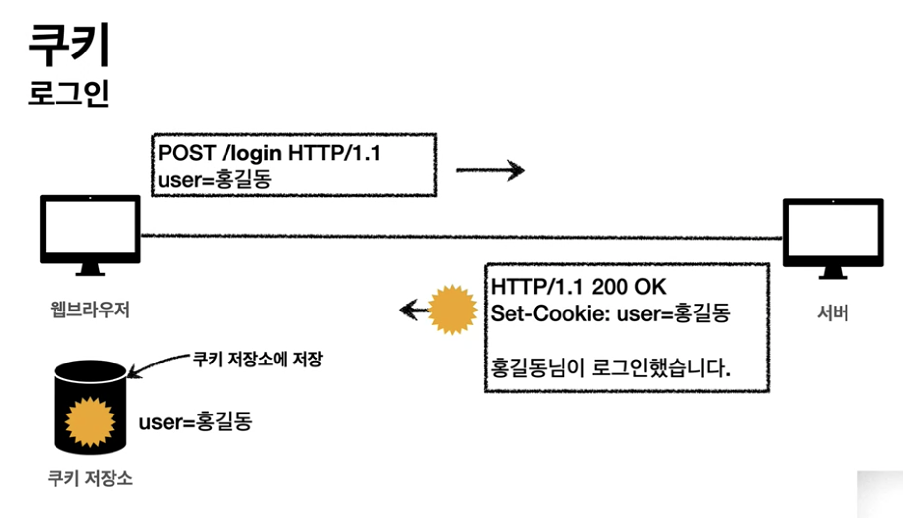
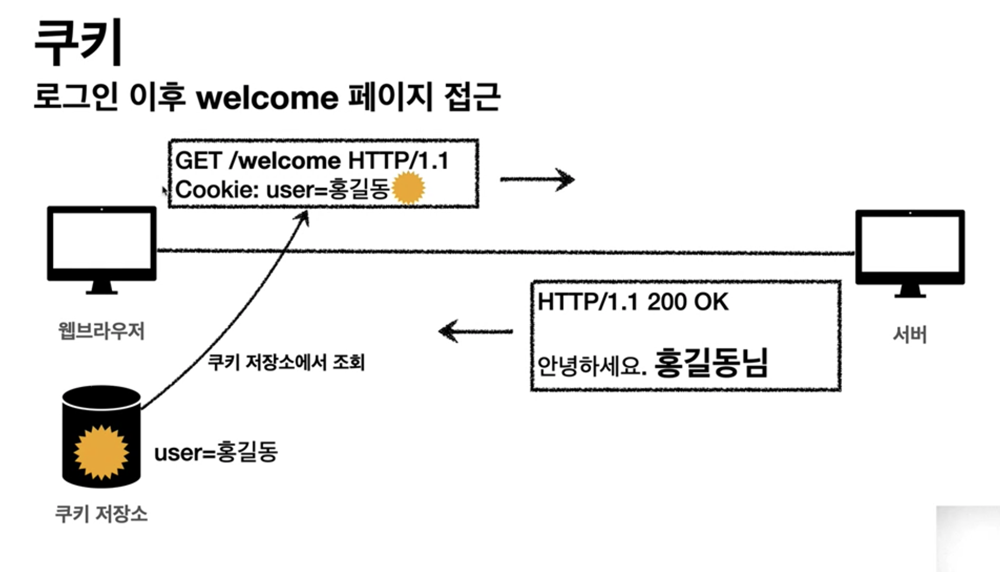
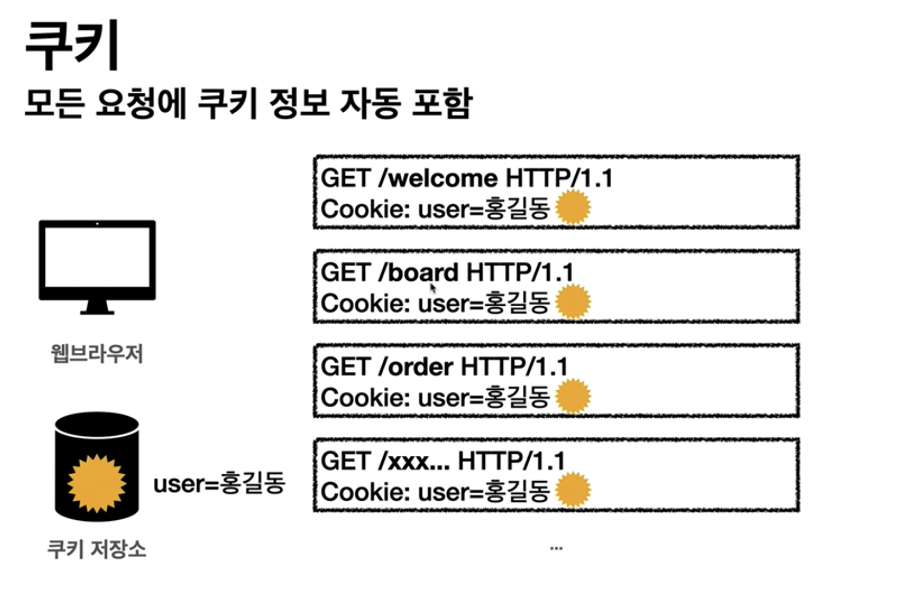

# HTTP 쿠키

## 쿠키 종류
 1. Set-Cookie : 서버에서 클라이언트로 쿠키 전달(응답)
 2. Cookie: 클라이언트가 서버에서 받은 쿠키를 저장하고, HTTP 요청시 서버로 전달

## 쿠키 미사용
 -  
 - 
 - 주석
   -  HTTP Stateless
      1. HTTP는 무상태 프로토콜
      2. 클라이언트와 서버가 요청과 응답을 주고 받으면 연결이 끊어진다.
      3. 클라이언트가 다시 요청하면 서버는 이전 요청을 기억하지 못한다.
      4. 클라이언트와 서버는 서로 상태를 유지하지 않는다.
 - 
   - 모든 요청에 정보를 넘기는 문제
     - 모든 요청에 사용자 정보가 포함되도록 개발 해야 함 (개발 비용 상승)
     - 브라우저를 완전히 종료하고 다시 열면?
   - 주석
     - 비밀번호도 같이 보낼수도 있다.
## 쿠키
 - 예) set-cookie: sessionId=abcde1234; expires=Sat, 26-Dec-2020 00:00:00 GMT; path=/; domain=.google.com; Secure
 - 사용처
   - 사용자 로그인 세션 관리
   - 광고 정보 트래킹
     - 의문
       - 서버에서 제공한 쿠키만 서버에서 접근 가능하지 않을까 추측하는데, 타 서버에서 제공한 쿠키도 접근이 가능할까?
   - 쇼핑몰 장바구니
       - 쿠팡의 로그인 이전, 로그인 이후 장바구니 연동 기능
 - 쿠키 정보는 항상 서버에 전송됨
   - 추가적인 네트워크 트래픽 유발(쿠키 용량만큼)
   - 최소한의 정보만 쿠키에 보관 할 것
     - 예시 
       1. 세션 id
       2. 인증 토큰
   - 만약 서버에 전송하지 않고, 웹 브라우저 내부에 데이터를 저장하고 싶은 데이터는 웹 스토리지 (localStorage, sessionStorage) 참고
   - 쿠키는 용량 제한 존재
 - 주의
   - 보안에 민감한 데이터는 보관하면 안됨
   - 예
     1. 주민번호
     2. 신용카드 번호
     3. ...등  
 - 과정
   - 
   - 
   -  

## 쿠키 - 생명주기 (Expires, max-age)
 - Set-Cookie: expires=Sat, 26-Dec-2020 04:39:21 **GMT**
   - 만료일에 쿠키 삭제 처리됨
 - Set-Cookie: max-age=3600 (3600초)
   - 0 또는 음수를 지정하면 쿠키 삭제
   - 유효 기간 지나도 쿠키 삭제
 - 세션 쿠키 : 만료 날짜를 생략하면 브라우저 종료시 까지만 유지
 - 영속 쿠키 : 만료 날짜를 입력하면 해당 날짜까지 유지

## 쿠키 - 도메인 (Domain)
 - 예) domain=example.org
 - 도메인 명시를 통한 쿠키 생성
   - 접근 가능 도메인
     1. 명시한 문서 기준 도메인
     2. 서브 도메인 포함
   - 예시) domain=example.org 지정한 쿠키 생성
     - example.org는 해당 쿠키 접근 가능
     - dev.example.org 또한 쿠키 접근 가능
 - 도메인 생략을 통한 쿠키 생성
   - 접근 가능 도메인
     - 현재 문서 기준 도메인만 적용
   - example.org 에서 쿠키를 생성하고 domain 지정을 생략
     - example.org 에서만 쿠키 접근
     - dev.example.org는 쿠키 미접근

## 쿠키 - 경로 (path)
 - 이 경로를 포함한 하위 경로 페이지만 쿠키 접근
 - 일반적으로 path=/ 루트로 지정 (모두 접근하고 싶은 니즈 존재)
 - 예) path=/home
   - /home -> 접근 가능
   - /home/level1 -> 접근 가능
   - /home/level1/level2 -> 접근 가능
   - /hello -> 불가능

## HTTP - 보안 (Secure, HttpOnly, SameSite)
 - Secure
   1. 기본적으로 http, https를 구분하지 않고 쿠키 전송
   2. Secure 적용시 https인 경우에만 쿠키 전송
 - HttpOnly
   1. XSS 공격 방지
     - 의문 
        - XSS 공격?
          - 자바스크립트에서 쿠키 접근 불가능하게 함. 전송시만 사용하게 함
        - XSS 쿠키는 무슨 원리로 자바스크립트에서 접근 불가능하게 할까? 브라우저에서 보안을 통해서 브라우저 외부에서 쿠키값 변경을 못하게 할까?
   2. 자바스크립트에서 접근 불가 (document.cookie)
   3. HTTP 전송에만 사용
 - SameSite
   1. XSRF 공격 방지
       - 의문
         -  XSRF 공격이란?
   2. 요청 도메인과 쿠키에 설정된 도메인이 같은 경우만 쿠키 전송

## 참고
 - https://www.inflearn.com/course/http-%EC%9B%B9-%EB%84%A4%ED%8A%B8%EC%9B%8C%ED%81%AC/lecture/61382?tab=note&volume=0.10 인프런 - 모든 개발자를 위한 HTTP 웹 기본 지식